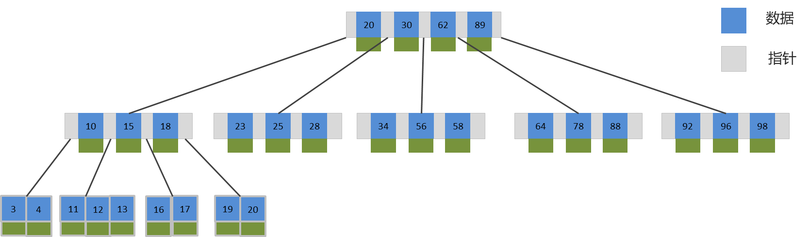
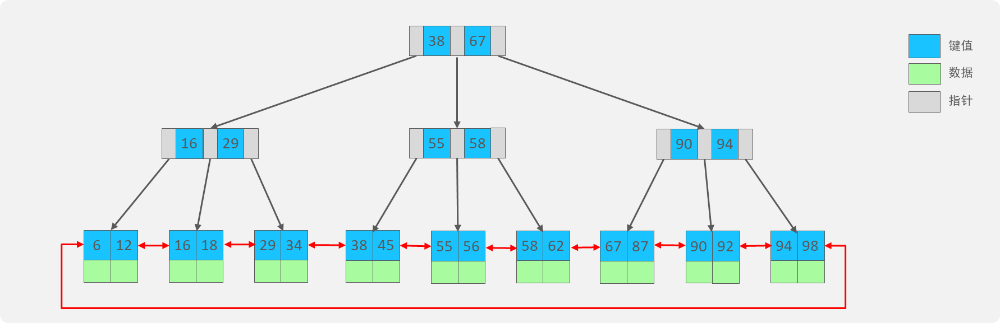
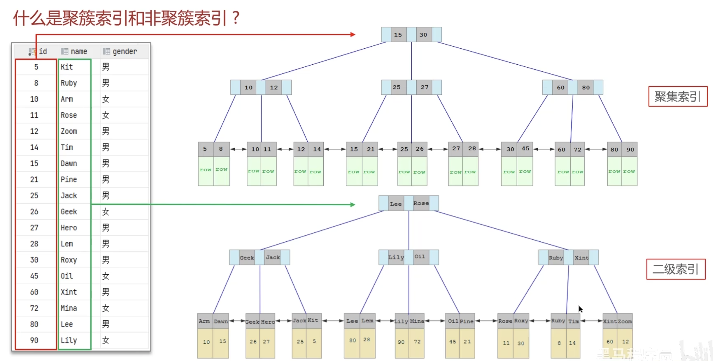
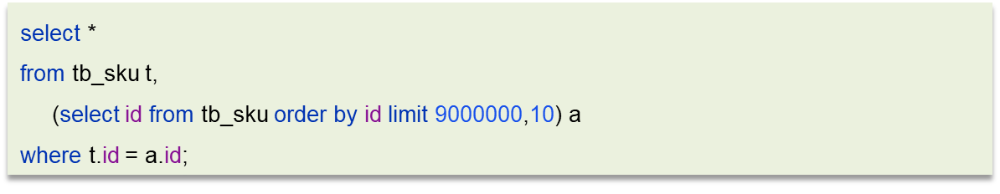

# 二. 索引

# A. 存储引擎

存储引擎就是存储数据、建立索引、更新/查询数据等技术的实现方式 。存储引擎是基于表的，而不是基于库的，所以存储引擎也可被称为表类型。  &#x20;

| 特性  / 存储引擎 | MyISAM\&#x20; | InnoDB   \&#x20; | MEMORY \&#x20; |
| ---------- | ------------- | ---------------- | -------------- |
| 事务安全       | 不支持           | 支持               | 不支持            |
| 锁机制        | 表锁            | 表锁/行锁            | 表锁             |
| 外键         | 不支持\&#x20;    | 支持               | 不支持            |

## InnoDB

1. 支持事务：提供了完整的事务支持，包括 ACID（原子性、一致性、隔离性、持久性）特性，确保数据的完整性和可靠性。
   - 例如，在银行转账的场景中，从一个账户扣款并向另一个账户加款，这个操作要么全部成功，要么全部失败，保证了资金的准确转移。
2. 行级锁：在操作数据时，InnoDB 通常使用行级锁，而不是表级锁，提高了并发性能，允许多个事务同时访问不同的行。
   - 比如在一个电商系统中，多个用户可以同时对不同商品的库存进行修改，而不会相互阻塞。
3. 外键支持：能够定义外键约束，保证数据的参照完整性。
   - 例如在订单表和用户表中，通过外键确保订单关联的用户是存在于用户表中的有效用户。
4. 缓存管理：拥有自己的缓冲池（Buffer Pool），用于缓存数据和索引，提高数据访问效率。
   - 经常访问的数据会被缓存在内存中，减少了磁盘 I/O 操作。
5. 崩溃恢复：具备较强的崩溃恢复能力，在数据库发生故障时能够恢复到一致的状态。
   - 即使系统突然断电或出现故障，重新启动后能保证数据不丢失或损坏。
6. 数据存储：以聚簇索引（Clustered Index）的方式存储数据，将数据和对应的主键索引存储在一起，提高数据的访问速度。
7. 自适应哈希索引：InnoDB 会自动根据经常访问的数据建立自适应的哈希索引，进一步提高查询性能。

# B. 底层数据结构

&#x20;索引（index）是帮助MySQL高效获取数据的数据结构(有序)。在数据之外，数据库系统还维护着满足特定查找算法的数据结构（B+树），这些数据结构以某种方式引用（指向）数据， 这样就可以在这些数据结构上实现高级查找算法，这种数据结构就是索引。&#x20;

## B-Tree

B-Tree，B树是一种多叉路平衡查找树，相对于二叉树，B树每个节点可以有多个分支，即多叉。以一颗最大度数（max-degree）为5(5阶)的b-tree为例，那这个B树每个节点最多存储4个key . &#x20;

## B+Tree

B+Tree是在BTree基础上的一种优化，使其更适合实现外存储索引结构，InnoDB存储引擎就是用B+Tree实现其索引结构. &#x20;

### B树与B+树对比:

1. 结构
   - B-Tree：每个节点可以存储多个关键字和对应的记录指针，并且节点内的关键字是有序排列的。
   - B+Tree：与 B-Tree 类似，但所有的数据记录都存放在叶子节点，非叶子节点只存储关键字和子节点的指针。
2. 范围查询
   - B-Tree：进行范围查询时，可能需要从根节点多次遍历到多个子树，效率相对较低。
   - B+Tree：由于所有的数据都在叶子节点且通过链表相连，范围查询只需要在叶子节点上遍历链表即可，效率更高。
3. 磁盘 I/O 次数
   - B-Tree：由于内部节点也存储数据，相同数据量下树的高度可能更高，导致磁盘 I/O 次数相对较多。
   - B+Tree：因为非叶子节点不存储数据，树的高度相对更低，磁盘 I/O 次数更少，更适合大量数据的存储和查询。
4. 指针数量
   - B-Tree：节点中的指针数量通常为关键字数量加 1。
   - B+Tree：非叶子节点的指针数量通常为关键字数量加 2。

# C. 聚簇与非聚簇索引

聚簇索引和非聚簇索引是数据库中索引的两种类型，它们有以下主要区别：

1. 数据存储方式
   - 聚簇索引：表的数据行按照索引的顺序存储。也就是说，索引的叶子节点包含了实际的数据行。
   - 非聚簇索引：索引的叶子节点包含的是指向数据行的指针。
2. 唯一性
   - 聚簇索引：一张表只能有一个聚簇索引，因为数据的存储顺序只能有一种。
   - 非聚簇索引：可以有多个，根据不同的列创建。
3. 数据访问速度
   - 聚簇索引：对于主键的查询，以及基于主键的范围查询，速度通常更快，因为数据就在索引的叶子节点上。
   - 非聚簇索引：需要先通过索引找到指针，然后再根据指针去访问数据，多了一次磁盘 I/O 操作，速度相对较慢。
4. 插入和更新性能
   - 聚簇索引：由于数据行的物理顺序与索引顺序相同，插入和更新可能导致数据的移动，影响性能。
   - 非聚簇索引：相对来说，对插入和更新的性能影响较小。

## 聚簇(聚集)索引

聚集索引选取规则:

- 如果存在主键，主键索引就是聚集索引。
- 如果不存在主键，将使用第一个唯一（UNIQUE）索引作为聚集索引。
- 如果表没有主键，或没有合适的唯一索引，则InnoDB会自动生成一个rowid作为隐藏的聚集索引。

## 非聚簇(二级)索引

除聚簇索引外的都是非聚簇索引

## 回表查询

通过二级索引找到对应的主键值, 再根据主键从聚集索引中找到整行数据.

# D. 覆盖索引

覆盖索引是一种能够提高数据库查询性能的索引策略。

当一个索引包含了查询中所需要的所有列的数据时，就被称为覆盖索引。 &#x20;
覆盖索引的优点主要包括：

1. 减少磁盘 I/O ：由于查询所需的列都在索引中，无需根据索引回表查询获取完整的行数据，从而减少了磁盘 I/O 操作，提高查询效率。
2. 提高查询性能：避免了回表查询带来的额外开销，特别是在大表和高并发的情况下，性能提升较为明显。
3. 优化存储引擎工作：减少了数据的读取和处理，对存储引擎的工作负担有所减轻。

然而，覆盖索引也并非没有缺点：

1. 索引维护成本：创建和维护索引会增加一定的开销，特别是当数据频繁插入、更新和删除时，需要维护索引的结构。
2. 存储空间增加：额外的索引会占用更多的存储空间

## Mysql超大分页

优化思路: 一般分页查询时，通过创建 覆盖索引 能够比较好地提高性能，可以通过覆盖索引加子查询形式进行优化 .

# E. 创建原则

1\). 针对于数据量较大，且查询比较频繁的表建立索引。

2\). 针对于常作为查询条件（where）、排序（order by）、分组（group by）操作的字段建立索引。

3\). 尽量选择区分度高的列作为索引，尽量建立唯一索引，区分度越高，使用索引的效率越高。

4\). 如果是字符串类型的字段，字段的长度较长，可以针对于字段的特点，建立前缀索引。

5\). 尽量使用联合索引，减少单列索引，查询时，联合索引很多时候可以覆盖索引，节省存储空间，避免回表，提高查询效率。

6\). 要控制索引的数量，索引并不是多多益善，索引越多，维护索引结构的代价也就越大，会影响增删改的效率。 &#x20;

7\). 如果索引列不能存储NULL值，请在创建表时使用NOT NULL约束它。当优化器知道每列是否包含NULL值时，它可以更好地确定哪个索引最有效地用于查询。

# F. 失效场景

- 违反最左前缀法则
- 范围查询右边列索引失效
- 索引上进行运算操作, 索引失效
- 尾部模糊匹配

[1. 存储引擎](<1. 存储引擎/1. 存储引擎.md> "1. 存储引擎")

[2.  底层数据结构](<2.  底层数据结构/2.  底层数据结构.md> "2.  底层数据结构")

[3. 聚簇与非聚簇](<3. 聚簇与非聚簇/3. 聚簇与非聚簇.md> "3. 聚簇与非聚簇")

[4. 覆盖索引](<4. 覆盖索引/4. 覆盖索引.md> "4. 覆盖索引")

[5. 创建与实施原则](<5. 创建与实施原则/5. 创建与实施原则.md> "5. 创建与实施原则")

[6. 失效场景](<6. 失效场景/6. 失效场景.md> "6. 失效场景")
