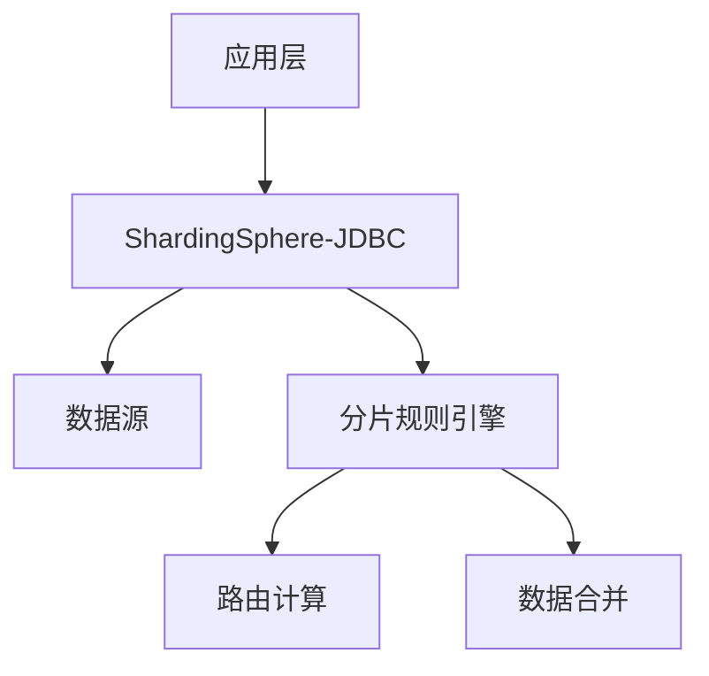

# 五. 分库分表

# Java面试八股：MySQL分库分表（ShardingSphere）详解

***

## 1. 概述与定义

### 1.1 分库分表的定义 &#x20;

分库分表是将单个数据库或表拆分为多个数据库或表的技术，用于解决单库单表的性能瓶颈、数据量过大等问题。 &#x20;

- **分库**：将数据分散到不同的物理数据库中。 &#x20;
- **分表**：将单个表的数据分散到多个物理表中。 &#x20;

**应用场景**： &#x20;

- 数据量超过单库承载能力（如TB级数据）。 &#x20;
- 高并发场景下，单表的读写性能不足。 &#x20;
- 水平扩展数据库资源，提升吞吐量。 &#x20;

**核心目标**： &#x20;

- **水平扩展**：通过增加节点提升系统能力。 &#x20;
- **负载均衡**：分散读写压力。 &#x20;
- **数据隔离**：避免单点故障影响全局。 &#x20;

***

## 2. 原理剖析 &#x20;

### 2.1 分库分表的核心原理 &#x20;

#### 2.1.1 数据分片（Sharding） &#x20;

通过分片键（Sharding Key）将数据分散到不同节点。 &#x20;

- **分片键选择**：需满足业务查询模式，如用户ID、订单ID等。 &#x20;
- **分片算法**： &#x20;
  - **哈希分片**：`hash(分片键) % 分片数`，均匀分布但扩容困难。 &#x20;
  - **范围分片**：按时间、ID范围划分，适合范围查询但存在热点。 &#x20;
  - **复合分片**：多字段联合分片，如`hash(user_id) + 按时间范围`。 &#x20;

**示例**： &#x20;

```java 
// 哈希分片示例
public int hashSharding(Long userId, int totalShards) {
    return (userId.hashCode() % totalShards + totalShards) % totalShards;
}
```


#### 2.1.2 分片透明性 &#x20;

通过中间件（如ShardingSphere）实现对应用层的透明，开发者无需感知底层分片逻辑。 &#x20;

#### 2.1.3 数据路由 &#x20;

根据SQL中的分片键，动态计算数据所在的物理节点。 &#x20;

- **查询路由**：将`SELECT * FROM orders WHERE user_id = 1001`路由到对应分片。 &#x20;
- **写入路由**：根据分片键将数据写入指定分片。 &#x20;

***

## 3. 应用目标 &#x20;

### 3.1 解决的核心问题 &#x20;

| 问题类型   | 解决方案          |
| ------ | ------------- |
| 单库性能瓶颈 | 水平拆分，分散负载     |
| 数据量过大  | 分表降低单表数据量     |
| 跨库事务   | 分布式事务（如Seata） |
| 查询效率   | 索引优化与分片键选择    |

### 3.2 核心目标 &#x20;

- **提升性能**：通过并行查询加速大数据量处理。 &#x20;
- **高可用性**：主从复制+分片冗余。 &#x20;
- **可扩展性**：动态增加分片节点。 &#x20;

***

## 4. 主要特点 &#x20;

### 4.1 核心特点 &#x20;

| 特点        | 描述                                  |
| --------- | ----------------------------------- |
| **水平拆分**​ | 按行拆分数据，保留表结构一致性                     |
| **透明性**​  | 中间件（如ShardingSphere）对应用层透明，无需修改代码逻辑 |
| **动态扩展**​ | 支持在线扩容分片，无需停机维护                     |
| **一致性**​  | 通过分片键保证数据分布的确定性                     |

### 4.2 与垂直拆分的区别 &#x20;

| 维度         | 分库分表（水平拆分） | 垂直拆分        |
| ---------- | ---------- | ----------- |
| **拆分方式**​  | 按行拆分，保留表结构 | 按字段或表拆分     |
| **适用场景**​  | 数据量大、高并发   | 表字段多、冷热数据分离 |
| **查询复杂度**​ | 需路由计算      | 直接访问目标库     |

***

## 5. 主要内容及其组成部分 &#x20;

### 5.1 分库分表的核心组件 &#x20;

#### 5.1.1 分片键（Sharding Key） &#x20;

- **选择原则**： &#x20;
  - 频繁查询的字段（如用户ID）。 &#x20;
  - 数据分布均匀，避免热点（如订单时间字段可能倾斜）。 &#x20;
- **示例**： &#x20;
  ```sql 
  -- 用户表按user_id分片
  CREATE TABLE users (
      user_id BIGINT PRIMARY KEY,
      name VARCHAR(255),
      ... 
  ) SHARDING KEY(user_id);
  ```


#### 5.1.2 分片算法 &#x20;

#### **哈希分片**： &#x20;

- **优点**：数据均匀分布。 &#x20;
- **缺点**：扩容时需重新哈希所有数据。 &#x20;
- **示例**： &#x20;
  ```java 
  public class HashShardingAlgorithm implements ShardingAlgorithm<Long> {
      @Override
      public String doSharding(Collection<String> availableTargetNames, ShardingValue<Long> shardingValue) {
          long hash = Math.abs(shardingValue.getValue().hashCode());
          return availableTargetNames.get((int) (hash % availableTargetNames.size()));
      }
  }
  ```


#### **范围分片**： &#x20;

- **示例**：按年份分表 &#x20;
  ```sql 
  -- orders_2023, orders_2024, ...
  CREATE TABLE orders_2023 (
      order_id BIGINT PRIMARY KEY,
      create_time DATETIME,
      ... 
  );
  ```


#### 5.1.3 分片策略 &#x20;

- **单分片键策略**：基于单一字段分片。 &#x20;
- **复合分片策略**：多字段联合分片，如`hash(user_id) + 按时间范围`。 &#x20;

***

## 6. 应用与拓展 &#x20;

### 6.1 ShardingSphere的实现 &#x20;

#### 6.1.1 ShardingSphere架构 &#x20;




#### 6.1.2 ShardingSphere配置示例 &#x20;

**YAML配置**： &#x20;

```yaml 
shardingRule:
  tables:
    t_order:
      actualDataNodes: ds_${0..1}.t_order_${0..2}
      tableStrategy:
        standard:
          shardingColumn: user_id
          shardingAlgorithmName: databaseAlgorithm
      databaseStrategy:
        standard:
          shardingColumn: user_id
          shardingAlgorithmName: databaseAlgorithm
  shardingAlgorithms:
    databaseAlgorithm:
      type: INLINE
      props:
        algorithm-expression: ds_${user_id % 2}
```


#### 6.1.3 分布式事务 &#x20;

通过ShardingSphere与Seata集成，实现基于AT模式的分布式事务： &#x20;

```java 
@Transactional
public void placeOrder(Long userId, List<OrderItem> items) {
    // 1. 插入订单到分片表
    orderService.insertOrder(userId, items);
    
    // 2. 扣减库存（跨库操作）
    stockService.reduceStock(items);
}
```


***

## 7. 面试问答 &#x20;

### 7.1 问题1：分库分表的优缺点是什么？ &#x20;

**回答**： &#x20;

分库分表的优点包括： &#x20;

- **性能提升**：分散单库压力，提升查询和写入速度。 &#x20;
- **扩展性**：通过增加分片节点实现水平扩展。 &#x20;
- **数据隔离**：降低单库故障的影响范围。 &#x20;

缺点包括： &#x20;

- **复杂性**：需要处理分片键选择、数据一致性、分布式事务等问题。 &#x20;
- **查询限制**：跨分片的JOIN操作可能无法执行，需通过应用层聚合。 &#x20;
- **维护成本**：分片规则变更可能需要数据迁移。 &#x20;

***

### 7.2 问题2：分库分表后如何保证数据一致性？ &#x20;

**回答**： &#x20;

通过以下方式保证一致性： &#x20;

1. **分片键选择**：确保分片键能覆盖核心查询场景。 &#x20;
2. **分布式事务**：使用Seata等工具实现跨分片事务。 &#x20;
3. **数据冗余**：关键关联表（如用户表）可全局复制到所有分片。 &#x20;
4. **最终一致性**：通过消息队列异步同步（如订单状态变更广播）。 &#x20;

***

### 7.3 问题3：如何选择分片键？ &#x20;

**回答**： &#x20;

分片键的选择需遵循以下原则： &#x20;

- **业务查询模式**：选择高频查询的字段（如用户ID）。 &#x20;
- **数据均匀分布**：避免使用可能倾斜的字段（如订单时间）。 &#x20;
- **业务逻辑隔离**：确保同一业务的数据落在同一分片（如用户的所有订单）。 &#x20;

**示例**： &#x20;

- 用户系统按`user_id`分片。 &#x20;
- 订单系统按`user_id`分片，保证用户的所有订单在同一个分片。 &#x20;

***

### 7.4 问题4：分库分表后如何处理跨分片查询？ &#x20;

**回答**： &#x20;

跨分片查询的挑战及解决方案： &#x20;

- **问题**：跨分片的JOIN操作无法直接执行。 &#x20;
- **解决方案**： &#x20;
  1. **应用层聚合**：分别查询各分片数据后合并结果。 &#x20;
  2. **广播表**：将小表（如商品分类表）复制到所有分片。 &#x20;
  3. **分库分表中间件**：如ShardingSphere自动路由并合并结果。 &#x20;

***

### 7.5 问题5：分库分表后如何扩容？ &#x20;

**回答**： &#x20;

扩容步骤： &#x20;

1. **新增分片节点**：如增加数据库实例或分表。 &#x20;
2. **更新分片规则**：调整分片算法（如哈希分片需重新计算路由）。 &#x20;
3. **数据迁移**： &#x20;
   - **在线迁移**：通过工具（如Canal）逐步迁移数据。 &#x20;
   - **离线迁移**：停机维护，将数据批量迁移。 &#x20;
4. **负载均衡**：动态分配新分片的流量。 &#x20;

***

## 总结 &#x20;

分库分表是解决高并发、大数据场景的核心技术，但需权衡性能与复杂性。掌握分片键选择、分片算法、分布式事务等知识点，并结合ShardingSphere等中间件的实际应用，是应对面试和实际开发的关键。通过合理设计和工具支持，可显著提升系统的扩展性和可靠性！ &#x20;
