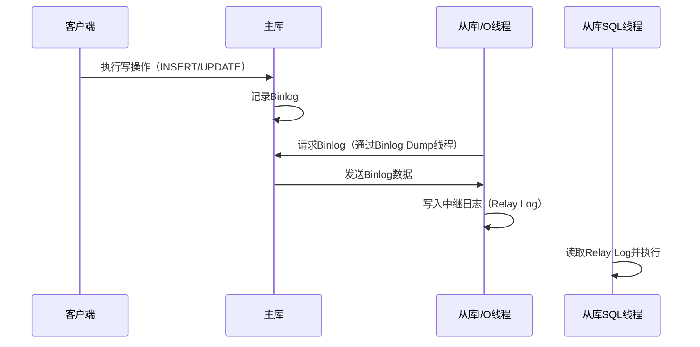
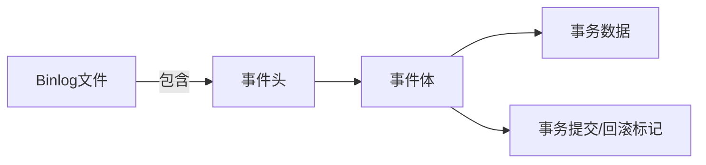

# 四. 主从同步

***

# **Java面试八股文：MySQL主从同步详解** &#x20;

***

## **1. 概述与定义** &#x20;

**MySQL主从同步**（Master-Slave Replication）是通过复制主库（Master）的**二进制日志（Binlog）到从库（Slave），实现数据在多个数据库实例间同步的技术。其核心目标是**数据备份、负载均衡、高可用性。 &#x20;

### **核心概念** &#x20;

| **术语**​          | **描述**​                               | **作用**​      |
| ---------------- | ------------------------------------- | ------------ |
| **Binlog**​      | 主库记录所有写操作的日志文件。                       | 从库同步数据的来源。   |
| **I/O线程**​       | 从库线程，负责从主库读取Binlog并写入中继日志（Relay Log）。 | 传输数据的核心通道。   |
| **SQL线程**​       | 从库线程，负责执行中继日志中的SQL语句。                 | 确保从库数据与主库一致。 |
| **Replication**​ | 复制过程的总称，包含数据同步、线程协作等机制。               | 实现主从数据一致性。   |

***

## **2. 原理剖析** &#x20;

### **2.1 同步流程** &#x20;

#### **关键步骤** &#x20;




#### **详细流程** &#x20;

1. **主库写操作**：客户端提交写操作，主库记录到Binlog。 &#x20;
2. **从库I/O线程**： &#x20;
   - 连接主库，请求Binlog的最新位置。 &#x20;
   - 接收Binlog并写入本地中继日志。 &#x20;
3. **从库SQL线程**： &#x20;
   - 读取中继日志中的SQL语句。 &#x20;
   - 逐条执行，更新本地数据。 &#x20;

***

### **2.2 复制模式对比** &#x20;

| **模式**​    | **同步机制**​             | **优缺点**​                     | **适用场景**​                |
| ---------- | --------------------- | ---------------------------- | ------------------------ |
| **异步复制**​  | 主库提交事务后立即返回，无需等待从库。   | 高性能但可能丢失数据（主库宕机时未同步的Binlog）。 | 读写分离、对数据一致性要求不高的场景。      |
| **半同步复制**​ | 主库等待至少一个从库确认Binlog接收。 | 数据丢失风险低，但增加延迟（需TCP往返时间）。     | 需要一定数据可靠性，且能接受轻微性能损耗的场景。 |
| **全同步复制**​ | 主库等待所有从库确认事务执行完成。     | 数据零丢失，但性能最低（所有从库需同步完成）。      | 高金融等对数据一致性要求极高的场景。       |

***

## **3. 应用目标** &#x20;

### **3.1 核心目标** &#x20;

- **数据备份**：从库作为热备，主库故障时可快速切换。 &#x20;
- **负载均衡**：主库处理写操作，从库分担读请求（读写分离）。 &#x20;
- **高可用性**：通过故障切换（Failover）确保服务连续性。 &#x20;

### **3.2 典型场景** &#x20;

- **电商秒杀**：主库处理订单提交，从库提供查询。 &#x20;
- **数据仓库**：从库用于复杂分析，避免影响主库性能。 &#x20;

***

## **4. 主要特点** &#x20;

| **特性**​       | **说明**​                        | **示例**​                                  |
| ------------- | ------------------------------ | ---------------------------------------- |
| **异步性**​      | 默认异步复制，主库无需等待从库。               | 主库写入后立即返回，从库异步同步。                        |
| **延迟**​       | 从库数据滞后于主库（取决于网络和负载）。           | 主库插入数据后，从库可能需要数秒同步。                      |
| **单向性**​      | 数据仅从主流向从，从库默认不接受写操作。           | 从库需配置\`read\_only=ON\`。                  |
| **依赖Binlog**​ | 必须开启Binlog，且格式影响同步效果（推荐ROW格式）。 | \`log\_bin=ON\`, \`binlog\_format=ROW\`。 |

***

## **5. 主要内容及其组成部分** &#x20;

### **5.1 Binlog（二进制日志）** &#x20;

#### **5.1.1 格式类型** &#x20;

| **格式**​        | **描述**​                            | **适用场景**​                          |
| -------------- | ---------------------------------- | ---------------------------------- |
| **STATEMENT**​ | 记录SQL语句。                           | 简单复制，但可能因非确定性操作（如\`RAND()\`）导致不一致。 |
| **ROW**​       | 记录行级变更（INSERT/UPDATE/DELETE的前/后值）。 | 精确复制，推荐用于主从同步和GTID（全局事务标识符）。       |
| **MIXED**​     | 自动选择STATEMENT或ROW格式。               | 平衡性能与一致性，但需谨慎使用。                   |

#### **5.1.2 Binlog结构** &#x20;




***

### **5.2 复制线程** &#x20;

#### **5.2.1 主库线程** &#x20;

- **Binlog Dump线程**：响应从库请求，推送Binlog数据。 &#x20;

#### **5.2.2 从库线程** &#x20;

| **线程类型**​  | **职责**​                  | **关键参数**​                          |
| ---------- | ------------------------ | ---------------------------------- |
| **I/O线程**​ | 从主库获取Binlog并写入Relay Log。 | \`relay\_log\`（中继日志文件名）            |
| **SQL线程**​ | 执行Relay Log中的SQL语句。      | \`slave\_parallel\_workers\`（并行执行） |

***

### **5.3 配置步骤** &#x20;

#### **5.3.1 主库配置** &#x20;

```ini 
[mysqld]
server-id=1               # 唯一ID
log-bin=mysql-bin         # 开启Binlog
binlog_format=ROW         # 推荐ROW格式
```


#### **5.3.2 从库配置** &#x20;

```ini 
[mysqld]
server-id=2               # 不同于主库
relay-log=relay-bin       # 中继日志文件名
read_only=ON              # 禁止写操作
```


#### **5.3.3 启动复制** &#x20;

```sql 
-- 从库执行
CHANGE MASTER TO 
MASTER_HOST='主库IP', 
MASTER_USER='repl', 
MASTER_PASSWORD='password', 
MASTER_LOG_FILE='mysql-bin.000001', 
MASTER_LOG_POS=154;
START SLAVE;
```


***

### **5.4 复制冲突与解决** &#x20;

- **冲突场景**：主库和从库的表结构不一致。 &#x20;
- **解决方法**： &#x20;
  ```sql 
  -- 从库同步前确保表结构一致
  SHOW SLAVE STATUS\G  -- 检查IO和SQL线程状态
  STOP SLAVE;          -- 停止复制
  -- 手动修复表结构差异
  START SLAVE;         -- 重新启动
  ```


***

## **6. 应用与拓展** &#x20;

### **6.1 性能优化策略** &#x20;

| **问题**​       | **解决方案**​                             | **配置示例**​                          |
| ------------- | ------------------------------------- | ---------------------------------- |
| **网络延迟**​     | 主从部署在同一机房，使用高速网络。                     | \\--                               |
| **Binlog过大**​ | 定期清理旧Binlog，增大\`expire\_logs\_days\`。 | \`expire\_logs\_days=7\`           |
| **SQL线程阻塞**​  | 提升从库性能（如增加CPU/内存）或并行复制。               | \`slave\_parallel\_type=DATABASE\` |

***

### **6.2 延迟从库（Delayed Slave）** &#x20;

- **作用**：防止误操作数据丢失（如误删表后，可从延迟从库恢复）。 &#x20;
- **配置示例**： &#x20;
  ```sql 
  -- 从库配置延迟时间为1小时
  CHANGE MASTER TO MASTER_DELAY=3600;
  ```


***

### **6.3 多级复制（级联复制）** &#x20;

- **架构**：从库作为其他从库的主库，减少主库压力。 &#x20;
- **流程图**： &#x20;
  ```mermaid 
  graph TD
      A[主库] --> B[从库1]
      B --> C[从库2]
      C --> D[从库3]
  ```


***

## **7. 面试问答** &#x20;

### **问题1：主从同步的核心原理是什么？** &#x20;

**回答**： &#x20;

- **核心机制**： &#x20;
  1. **主库记录Binlog**：所有写操作写入Binlog。 &#x20;
  2. **从库I/O线程获取Binlog**：通过网络传输到中继日志。 &#x20;
  3. **从库SQL线程执行Binlog**：更新本地数据，保持一致性。 &#x20;
- **示例流程**： &#x20;
  ```sql 
  -- 主库执行写入
  INSERT INTO orders (user_id, amount) VALUES (1, 100);
  -- Binlog记录该操作
  -- 从库读取并执行，最终数据同步
  ```


***

### **问题2：异步、半同步、全同步复制的区别？** &#x20;

**回答**： &#x20;

- **异步复制**： &#x20;
  - 主库提交事务后立即返回，不等待从库。 &#x20;
  - **优点**：高性能，延迟低。 &#x20;
  - **缺点**：主库宕机可能丢失未同步的数据。 &#x20;
- **半同步复制**： &#x20;
  - 主库等待至少一个从库接收Binlog后才返回。 &#x20;
  - **优点**：数据丢失风险低，延迟略高。 &#x20;
  - **缺点**：TCP往返时间影响性能。 &#x20;
- **全同步复制**： &#x20;
  - 主库等待所有从库确认事务完成。 &#x20;
  - **优点**：数据零丢失。 &#x20;
  - **缺点**：性能最低，仅适用于对一致性要求极高的场景。 &#x20;

***

### **问题3：如何配置主从同步？** &#x20;

**回答**： &#x20;

1. **主库配置**： &#x20;
   ```ini 
   [mysqld]
   log-bin=mysql-bin
   server-id=1
   binlog_format=ROW
   ```

2. **从库配置**： &#x20;
   ```ini 
   [mysqld]
   server-id=2
   relay-log=relay-bin
   ```

3. **创建复制用户**： &#x20;
   ```sql 
   CREATE USER 'repl'@'%' IDENTIFIED BY 'password';
   GRANT REPLICATION SLAVE ON *.* TO 'repl'@'%';
   ```

4. **从库启动复制**： &#x20;
   ```sql 
   CHANGE MASTER TO 
   MASTER_HOST='主库IP', 
   MASTER_USER='repl', 
   MASTER_PASSWORD='password', 
   MASTER_LOG_FILE='mysql-bin.000001', 
   MASTER_LOG_POS=4;
   START SLAVE;
   ```


***

### **问题4：主从同步可能出现哪些问题？如何排查？** &#x20;

**回答**： &#x20;

- **常见问题**： &#x20;
  - **数据不一致**：Binlog格式错误（如STATEMENT导致不一致）。 &#x20;
  - **复制中断**：网络故障或主库Binlog已删除。 &#x20;
- **排查步骤**： &#x20;
  1. **检查从库状态**： &#x20;
     ```sql 
     SHOW SLAVE STATUS\G
     -- 查看Last_SQL_Error和Last_IO_Error
     ```

  2. **修复主从位置**： &#x20;
     ```sql 
     STOP SLAVE;
     SET GTID_NEXT='AUTOMATIC';
     START SLAVE;
     ```

  3. **同步表结构**： &#x20;
     ```sql 
     -- 在从库执行主库的DDL语句
     ```


***

### **问题5：为什么从库需要设置read\_only=ON？** &#x20;

**回答**： &#x20;

- **原因**： &#x20;
  - 主从同步是单向的，从库默认仅用于读操作。 &#x20;
  - 防止误操作直接写入从库，导致数据不一致。 &#x20;
- **例外情况**： &#x20;
  - 可通过`SET SESSION sql_log_bin=OFF;`临时绕过，但需谨慎使用。 &#x20;

***

## **总结** &#x20;

- **核心考点**：Binlog格式、复制线程协作、三种复制模式的优缺点。 &#x20;
- **高频场景**：读写分离配置、故障切换流程、数据一致性保障。 &#x20;
- **面试技巧**：结合配置示例和流程图，体现对底层机制的理解。 &#x20;

通过掌握主从同步原理与实践，面试中可深入分析高可用架构设计、性能瓶颈及容灾策略。
