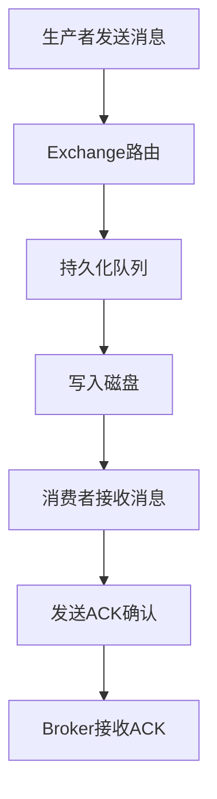

# 1. 消息不丢失

# 1. 概述与定义

RabbitMQ是目前应用最广泛的开源消息中间件之一，其基于AMQP协议，能够为分布式系统提供高效、可靠的消息传递服务。作为Java面试八股中的重要知识点，“消息不丢失”机制是企业级应用中保障业务数据一致性与系统高可靠性的关键环节。在RabbitMQ中，确保消息不丢失主要依靠以下几方面的措施：

- **持久化机制**：在消息发送时，通过将消息写入磁盘（Persistent Message）并将队列声明为持久化（Durable Queue），确保即使Broker发生故障也不会丢失消息。
- **消息确认机制**：消费者在消费消息后发送确认（ACK），若未收到确认，RabbitMQ会重新投递消息，防止因消费者异常导致的消息丢失。
- **发布者确认（Publisher Confirms）**：生产者在发送消息后等待Broker返回确认，确保消息已被成功持久化。
- **镜像队列（Mirrored Queues）**：在集群部署中，通过对队列进行镜像备份，实现高可用性，防止单点故障引发数据丢失。

这一系列机制共同构成了RabbitMQ消息不丢失的整体解决方案。在面试中，面试官常会关注如何通过合理配置和使用上述机制来保证系统的稳定性和数据一致性。📦🔒

# 2. 主要特点

RabbitMQ在保障消息不丢失方面具有以下几个主要特点：

1. **消息持久化** &#x20;
   - 消息和队列都可以声明为持久化（durable），确保消息存储在磁盘上，即使服务器重启或异常崩溃，也可恢复数据。 &#x20;
   - 通过将消息存储在CommitLog中，实现顺序写入，降低磁盘I/O压力。
2. **消息确认机制** &#x20;
   - 消费者在消费完消息后必须发送ACK确认，如果消费失败，消息会重新入队，确保消息不会丢失。 &#x20;
   - 支持自动确认与手动确认两种模式，根据实际业务需求进行配置。
3. **发布者确认（Publisher Confirms）** &#x20;
   - 生产者在发送消息后，可以启用发布者确认机制（Confirm Mode），当Broker确认消息写入磁盘后，才返回成功状态。 &#x20;
   - 能够及时发现消息丢失或写入异常情况，并进行相应的补偿操作。
4. **镜像队列（HA Queue）** &#x20;
   - 通过在RabbitMQ集群中配置镜像队列，将消息复制到多个Broker节点，实现高可用性，防止单点故障。 &#x20;
   - 在主节点故障时，备用节点能够迅速接管消息传递任务，确保消息不会丢失。

下表对上述特点进行归纳说明：

| 特性名称   | 主要作用                | 详细说明                                    |
| ------ | ------------------- | --------------------------------------- |
| 持久化机制  | 消息和队列存储在磁盘中         | 声明队列为durable，消息属性设置为persistent，确保数据可靠存储 |
| 消息确认机制 | 消费者消费后反馈确认，失败时进行重投  | 自动确认与手动确认模式灵活适应业务场景，保证消息最终被成功处理         |
| 发布者确认  | 生产者端确认消息已成功写入Broker | 开启confirm模式后，生产者可收到Broker的ACK，防止消息发送遗漏  |
| 镜像队列   | 实现多节点备份，避免单点故障      | 将队列镜像到多个节点，在主节点失效时备用节点迅速顶上，确保高可用性       |

此外，RabbitMQ的这些机制在实际业务场景中能够根据需要进行灵活组合，以达到最佳的消息可靠性效果。💪✅

# 3. 应用目标

在实际生产环境中，确保消息不丢失是构建高可靠分布式系统的重要目标，主要包括以下几个方面：

- **业务数据一致性** &#x20;

  对于订单处理、支付系统等关键业务，消息丢失可能导致数据不一致甚至严重的经济损失。利用持久化机制与消息确认策略，能够确保各个系统之间的数据状态一致。
- **系统容错与恢复** &#x20;

  在系统出现故障、网络波动或者节点宕机时，消息的不丢失能够保证系统在恢复后继续正确地处理业务。镜像队列和发布者确认机制提供了强有力的容错能力。
- **高并发与流量削峰** &#x20;

  在高并发场景下，消息队列不仅需要保证高吞吐量，还必须保证消息的可靠性，防止流量高峰期间因消息丢失而引起的服务不稳定。
- **异步处理与解耦** &#x20;

  利用消息队列实现服务间解耦时，消息不丢失可以确保异步任务最终被正确处理，从而保障整体业务流程的稳定运行。
- **日志与监控** &#x20;

  在系统日志、监控数据传输等场景中，保证消息不丢失可以确保数据采集的完整性，便于后续分析与问题排查。

综上所述，RabbitMQ消息不丢失的目标不仅仅是技术细节的保障，更是整个分布式系统稳定性和数据安全性的基石。🎯

# 4. 主要内容及其组成部分

RabbitMQ在实现消息不丢失方面涉及多个模块和配置，以下对各个组成部分进行详细说明：

## 4.1 持久化配置

**持久化队列（Durable Queue）：** &#x20;

在声明队列时，将durable属性设为true，可以保证队列在Broker重启后依然存在。例如：

```java 
// 声明持久化队列示例
Channel channel = connection.createChannel();
boolean durable = true;
channel.queueDeclare("durableQueue", durable, false, false, null);
```


**持久化消息（Persistent Message）：** &#x20;

在发送消息时，通过设置消息属性为PERSISTENT，可以确保消息被写入磁盘。例如：

```java 
// 发送持久化消息示例
String message = "Hello, RabbitMQ!";
channel.basicPublish("", "durableQueue", MessageProperties.PERSISTENT_TEXT_PLAIN, message.getBytes());
```


持久化机制要求生产者和队列均配置为持久化，否则即使一方设置了持久化，也可能无法保障消息不丢失。

## 4.2 消息确认机制

**消费者确认（ACK机制）：** &#x20;

消费者在接收到消息后，需要调用basicAck方法进行确认。如果消息处理失败，消费者可以调用basicNack或不发送ACK，使得消息重新入队。示例如下：

```java 
// 消费者手动确认示例
channel.basicConsume("durableQueue", false, new DefaultConsumer(channel) {
    @Override
    public void handleDelivery(String consumerTag, Envelope envelope, AMQP.BasicProperties properties, byte[] body) throws IOException {
        String message = new String(body, "UTF-8");
        System.out.println("接收到消息：" + message);
        // 消费完成后发送ACK
        channel.basicAck(envelope.getDeliveryTag(), false);
    }
});
```


**发布者确认（Publisher Confirms）：** &#x20;

生产者可以启用confirm模式，在发送消息后等待Broker返回确认消息。这样即使Broker出现异常，生产者也能及时捕获并重发消息。

```java 
// 启用发布者确认模式示例
channel.confirmSelect();
channel.basicPublish("", "durableQueue", MessageProperties.PERSISTENT_TEXT_PLAIN, message.getBytes());
if (channel.waitForConfirms()) {
    System.out.println("消息发送成功并持久化！");
} else {
    System.out.println("消息发送失败，需要重试！");
}
```


## 4.3 镜像队列配置

在RabbitMQ集群部署中，为了防止单点故障，可将队列配置为镜像队列。通过设置队列策略，将队列的所有消息复制到多个节点上。如下示例为声明镜像队列的配置参数：

```bash 
# 定义镜像队列策略的示例（通过rabbitmqctl或管理控制台配置）
rabbitmqctl set_policy HA ".*" '{"ha-mode":"all"}'
```


这种配置保证了在任一节点故障时，其他节点的队列副本能够继续提供服务，确保消息不会丢失。

下表总结了持久化、确认机制和镜像队列的关键组成部分：

| 组成部分    | 关键配置                                       | 作用                                |
| ------- | ------------------------------------------ | --------------------------------- |
| 持久化队列   | durable = true                             | 保证队列重启后依然存在                       |
| 持久化消息   | MessageProperties.PERSISTENT\_TEXT\_ PLAIN | 确保消息写入磁盘，防止Broker崩溃时数据丢失          |
| 消费者确认机制 | basicAck/basicNack                         | 通过ACK确认消息消费情况，未确认时可重投，确保消息最终被处理   |
| 发布者确认   | confirmSelect与waitForConfirms              | 生产者在发送消息后获得Broker的确认，及时捕获消息发送失败信息 |
| 镜像队列    | 策略设置 ha-mode                               | 多节点复制队列内容，在节点故障时保证消息服务不中断         |

通过对这些组件和配置的合理应用，可以在系统中构建一个消息“绝不丢失”的高可靠消息传递架构。

# 5. 原理剖析

在深入理解RabbitMQ消息不丢失机制时，我们需要从数据存储、传递、确认、故障恢复等多个角度进行剖析。

## 5.1 消息持久化原理

消息持久化是保障消息不丢失的首要手段。持久化主要依赖于两个方面： &#x20;

- **队列持久化**：在声明队列时，将durable属性设置为true。这样，在Broker重启时，队列定义及其绑定关系会被保留。 &#x20;
- **消息持久化**：生产者发送消息时，通过设置消息属性为persistent，将消息内容写入磁盘。RabbitMQ使用顺序写入方式将消息追加到磁盘文件（类似CommitLog），这种方式可以显著降低写入延迟和磁盘碎片问题。 &#x20;

需要注意的是，只有队列和消息同时持久化，才能确保消息在异常情况下不会丢失。否则，即使消息持久化，若队列未持久化，Broker重启后消息也可能丢失。

## 5.2 消息确认与重投机制

为了防止消费者在消费过程中发生异常而导致消息丢失，RabbitMQ引入了消息确认机制。具体过程如下：

1. 生产者发送消息到队列，消息被写入磁盘（如果配置为持久化）。
2. 消费者接收到消息后，处理业务逻辑并发送ACK确认。
3. 如果消费者处理失败，或者在一定时间内未发送确认，RabbitMQ会重新将消息投递给其他消费者或同一消费者进行重试。

这种机制保证了即使消费端发生异常，消息也能被重新处理，确保消息最终被正确消费。

## 5.3 发布者确认原理

发布者确认机制解决了生产者与Broker之间的可靠传输问题。启用该机制后，生产者发送消息后，Broker会返回一个确认响应（ACK），告知生产者消息已被成功写入持久化存储。如果Broker返回NACK或超时未响应，则生产者可以根据业务逻辑选择重发消息。 &#x20;

这种双向确认机制降低了消息在传输过程中因网络波动或Broker故障导致的丢失风险。

## 5.4 镜像队列与高可用性

在分布式系统中，单点故障是导致消息丢失的重要原因。RabbitMQ通过镜像队列（HA Queue）来解决这一问题。原理如下：

- 当队列被配置为镜像队列后，其所有消息会复制到集群中其他节点上。 &#x20;
- 当主节点发生故障时，集群中其他节点能够迅速接管服务，确保队列数据完整性。 &#x20;
- 镜像机制依赖于集群内节点间的通信与数据同步，虽然会带来一定的性能开销，但在关键业务场景下可以极大提升系统容错能力。

下面借助Mermaid图表展示消息从发送到持久化，再到消费者确认的流程图：




图中展示了生产者通过Exchange将消息路由到持久化队列中，队列内消息通过写入磁盘保存，再由消费者取出并确认消费的全过程。每一步都为保证消息不丢失提供了技术保障。🔄

## 5.5 整体架构安全性

整体来看，RabbitMQ通过持久化、确认、重投以及镜像等多重机制构成了一整套防止消息丢失的保障体系。这些机制在不同层面（生产、传输、消费、故障恢复）相互配合，从而大大降低了消息丢失的概率。对于面试官来说，能够从原理上清晰描述这一过程，展示了对系统稳定性和可靠性的深刻理解，是面试中的重要考察点。

# 6. 应用与拓展

在实际应用中，RabbitMQ的消息不丢失机制被广泛应用于各种关键场景中，下面介绍几种典型应用及其拓展方向：

## 6.1 典型应用场景

1. **金融交易系统** &#x20;

   金融系统要求数据高度一致且实时性强。利用RabbitMQ的持久化和确认机制，可以确保每一笔交易消息都不丢失，极大降低系统风险。 &#x20;

   例如：支付系统中，每一笔订单支付请求在发送后都必须经过发布者确认和消费者ACK，确保交易数据完整。
2. **电商订单处理** &#x20;

   在订单处理环节，任何消息丢失都可能导致库存、物流等后续流程中断。通过持久化和镜像队列机制，可以在系统高并发情况下确保订单消息的完整性。 &#x20;

   例如：订单创建后，将订单详情发送至消息队列，后续库存系统、物流系统均从该队列中获取消息，并通过ACK确认消费。
3. **日志与监控数据传输** &#x20;

   日志收集和实时监控依赖于消息传递的稳定性。持久化存储保证即使在高并发场景下也不会因网络故障或节点异常而丢失关键数据，为系统故障排查提供完整日志记录。

## 6.2 与Spring Boot集成的拓展

在Spring Boot项目中，利用Spring AMQP可以快速集成RabbitMQ。配置持久化队列、启用发布者确认以及设置消费者ACK都可以通过注解或配置文件完成。例如：

```java 
// Spring Boot下RabbitMQ生产者示例
@Autowired
private RabbitTemplate rabbitTemplate;

public void sendMessage(String exchange, String routingKey, String message) {
    rabbitTemplate.convertAndSend(exchange, routingKey, message);
}
```


在配置文件中，可以设置队列持久化参数和镜像策略，确保系统在生产环境中达到消息不丢失的要求。

## 6.3 高级扩展功能

- **死信队列（Dead Letter Exchange, DLX）** &#x20;

  当消息经过多次重投后依然无法成功消费时，可以将其转发到死信队列中，便于后续分析与补偿处理。 &#x20;
- **消息TTL（Time To Live）** &#x20;

  通过设置消息的有效期，防止长期堆积导致队列阻塞，同时与重试机制结合，提升系统整体稳定性。 &#x20;
- **动态路由与分区** &#x20;

  结合业务场景，利用Exchange类型（如Direct、Topic、Fanout）实现消息的精准路由，确保消息流向符合业务要求，从而降低消息丢失风险。 &#x20;
- **监控与报警机制** &#x20;

  借助RabbitMQ自带的管理控制台以及第三方监控工具，对消息队列的状态、ACK响应情况等进行实时监控，一旦发现异常立即进行告警和自动恢复操作。

这些扩展功能不仅提升了RabbitMQ系统的整体可靠性，同时也为业务系统提供了更为灵活和可控的消息传递能力。

# 7. 面试问答

以下从面试者角度出发，整理了五个常见的面试问题及详细回答，帮助大家在面试中从容应对有关RabbitMQ消息不丢失机制的提问。

## 问题1：请介绍RabbitMQ中如何通过持久化机制来保障消息不丢失？

答： &#x20;

在RabbitMQ中，要保证消息不丢失，必须同时设置队列和消息的持久化。首先，在声明队列时，通过设置durable属性为true，使得队列定义能够在Broker重启后依然存在；其次，生产者在发送消息时，需要将消息属性设置为PERSISTENT，例如使用MessageProperties.PERSISTENT\_TEXT\_PLAIN，这样消息就会被写入磁盘。只有队列和消息都持久化后，即使Broker发生故障，系统重启后也能恢复所有数据，从而避免消息丢失。

## 问题2：请描述一下RabbitMQ的消息确认机制是如何实现消息不丢失的？

答： &#x20;

RabbitMQ采用消费者ACK确认机制来保证消息被成功消费。消费者在消费消息后，必须调用basicAck方法来通知Broker消息已被处理；如果消费者处理过程中出现异常，或长时间未发送ACK，Broker会通过重投机制将消息重新入队，待其他消费者重新消费。这种机制确保了即使消费者端发生故障，消息依然不会丢失，直到被成功消费。对生产者而言，发布者确认（Publisher Confirms）则确保消息发送到Broker后得到确认，从而在生产端也能监控消息状态，避免发送过程中丢失数据。

## 问题3：如何使用发布者确认机制来提高消息可靠性？请举例说明。

答： &#x20;

发布者确认机制要求生产者在发送消息后等待Broker返回ACK确认，这样可以确保消息已经成功写入到持久化存储中。例如，在Java客户端中，我们可以通过调用confirmSelect()方法启用该模式，并在发送消息后调用waitForConfirms()等待Broker确认。如果确认失败，则进行重发操作。这样即使在网络或Broker异常情况下，也能及时发现问题并补救，从而提高消息传输的可靠性。实际代码示例如下：

```java 
channel.confirmSelect();
channel.basicPublish("", "durableQueue", MessageProperties.PERSISTENT_TEXT_PLAIN, message.getBytes());
if (channel.waitForConfirms()) {
    System.out.println("消息发送成功并已持久化");
} else {
    System.out.println("发送失败，进行重试");
}
```


## 问题4：在高并发环境下，如何利用RabbitMQ的镜像队列来避免消息丢失？

答： &#x20;

在高并发或关键业务场景中，单个Broker节点可能成为系统的薄弱环节。为此，RabbitMQ提供了镜像队列（HA Queue）机制，通过将队列内容复制到集群中多个节点上，当主节点出现故障时，备用节点可以迅速接管消息服务，确保队列中的消息不丢失。配置镜像队列通常需要在策略中设置ha-mode为“all”或指定备份节点数，从而达到高可用的目的。这种方式虽然增加了一定的系统开销，但在关键场景下是确保数据安全的必要手段。

## 问题5：在实际项目中，如何综合运用持久化、确认、发布者确认和镜像队列来构建一个消息不丢失的高可靠系统？

答： &#x20;

在实际项目中，为了构建一个消息不丢失的高可靠系统，我会综合使用以下策略： &#x20;

1. **队列与消息持久化**：在声明队列时设置durable=true，同时生产者发送消息时启用消息持久化，这样即使Broker重启，消息依然存在。 &#x20;
2. **消费者ACK确认**：在消费者端采用手动确认模式，确保每条消息在处理完成后发送ACK，对于处理失败的消息，通过basicNack进行重投。 &#x20;
3. **发布者确认机制**：生产者启用confirm模式，通过等待Broker的ACK，及时捕获消息写入异常，保证消息在发送环节不丢失。 &#x20;
4. **镜像队列部署**：在集群环境中，将队列配置为镜像队列，确保在单点故障时消息能够在其他节点上保留，从而提供高可用保障。 &#x20;

通过以上策略的综合运用，不仅可以保障每个环节的数据安全，还能在高并发和故障情况下迅速恢复，确保系统整体稳定运行。

***

总结而言，RabbitMQ通过持久化机制、消息确认、发布者确认以及镜像队列等多重技术手段，构建了一个高可靠的消息传递系统，确保在各种异常情况下消息都不会丢失。在实际应用中，这些机制的合理配置与组合是确保系统数据一致性与高可用性的关键所在。希望以上详尽的解析能够帮助各位在面试中从容回答有关消息不丢失的问题，并在实际项目中充分发挥RabbitMQ的优势。🚀

这篇文章力求全面、深入地解析了RabbitMQ消息不丢失的各个关键知识点，从基本概念到核心机制，再到高级应用与面试问答，各个环节均进行了详细讲解，并辅以代码示例、表格总结及流程图展示，助力面试者构建系统的知识框架，全面应对面试考查。
