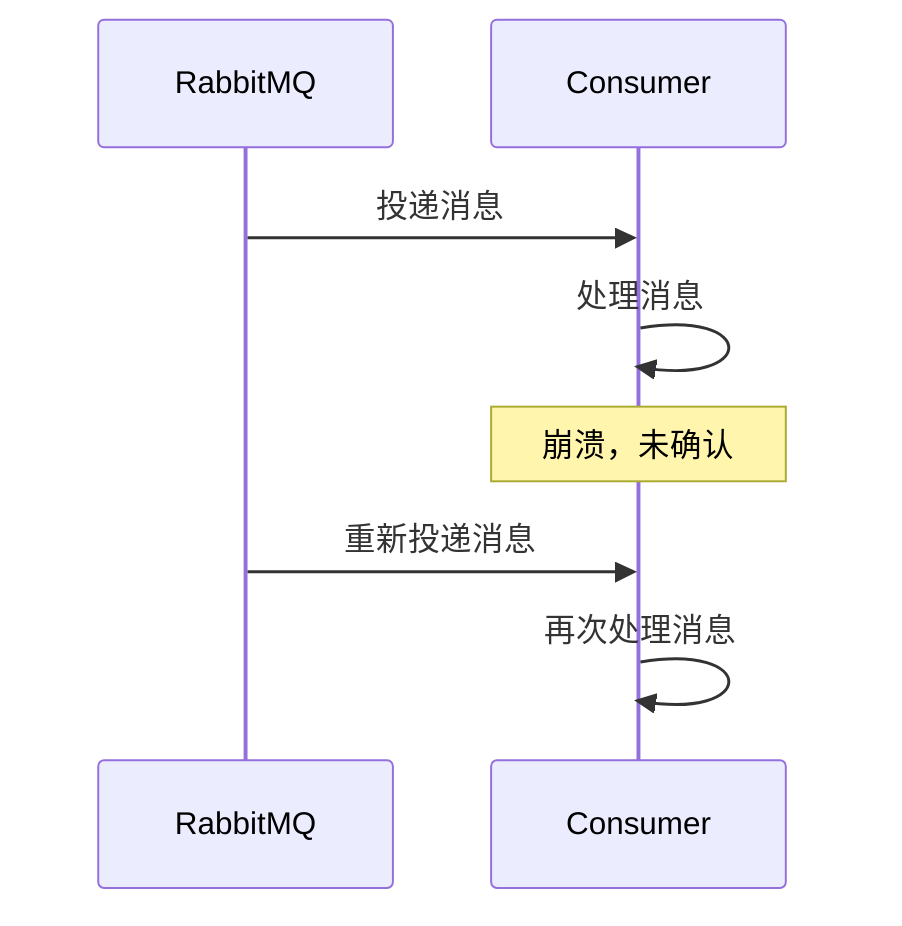
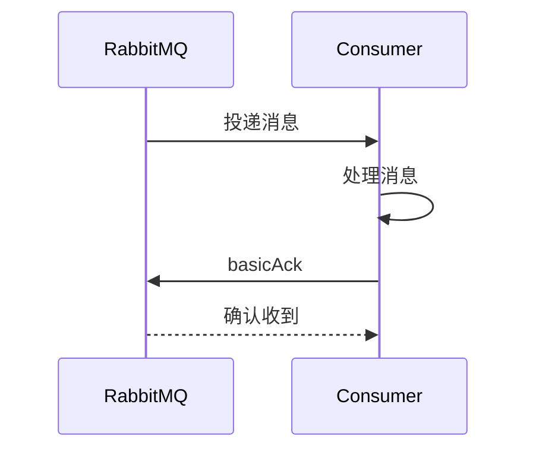
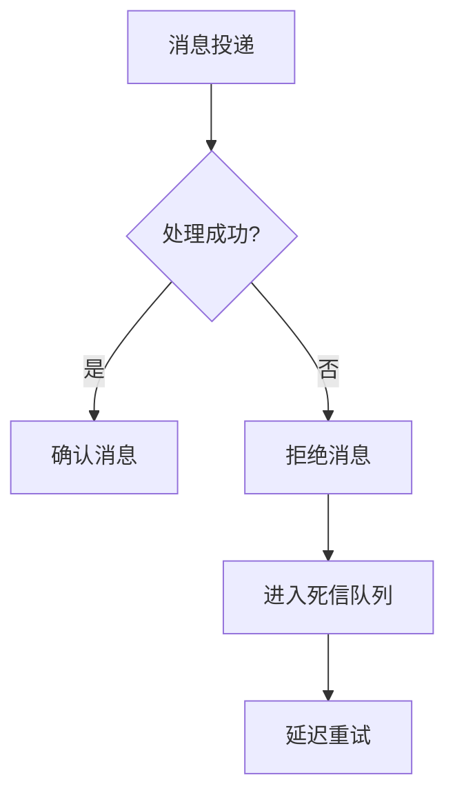

# 2. 消息重复消费

***

## 1. 概述与定义

消息重复消费是指在消息中间件（如RabbitMQ）中，消费者多次接收并处理同一条消息的现象。在RabbitMQ中，这种情况通常发生在消费者未能正确确认消息（ACK），导致RabbitMQ重新投递消息，或者由于网络不稳定、消费者重启等异常情况，消息被重复发送。

### 定义

简单来说，消息重复消费就是消费者多次处理同一条消息，导致业务逻辑重复执行，可能引发数据不一致或资源浪费。在面试中，你可以这样回答：“消息重复消费是指RabbitMQ中消费者多次接收并处理同一条消息，通常由于消息确认失败、网络抖动或消费者异常导致。” 这个定义简洁明了，能快速抓住面试官的注意力，同时为后续展开铺垫。

### 背景与重要性

RabbitMQ是一款高性能的消息中间件，广泛应用于分布式系统中，支持多种消息模式（如发布订阅、路由模式）和可靠性机制（如消息持久化）。然而，在实际应用中，由于网络问题、消费者故障或确认机制配置不当，消息重复消费成为一个常见挑战。解决这一问题的核心在于确保消息处理的**幂等性**，即多次消费同一条消息不会产生副作用。理解消息重复消费的原因和解决方案，不仅能帮助你在面试中脱颖而出，还能体现你对分布式系统设计的深刻洞察。

***

## 2. 主要特点

消息重复消费具有以下几个显著特点，掌握这些特点有助于你在面试中快速定位问题并展开分析：

- **不确定性** ⚠️ &#x20;

  消息重复消费的发生具有随机性，可能由网络抖动、消费者重启或RabbitMQ重试机制等多种因素触发，难以完全预测。
- **业务影响** 💥 &#x20;

  如果业务逻辑未设计为幂等，重复消费可能导致严重后果，如数据重复插入、状态错误或资源浪费。
- **可预防性** 🛡️ &#x20;

  通过合理的消息确认机制、幂等设计和去重策略，可以有效预防或减轻消息重复消费的影响。
- **监控需求** 📊 &#x20;

  在生产环境中，需实时监控消息消费情况，及时发现重复消费问题并采取措施。

### 面试Tips

在面试中提到“业务影响”时，可以结合场景举例：“比如在电商系统中，如果库存扣减消息重复消费，可能导致库存超卖，用户下单失败。” 这样的描述能体现你的实战经验。对于“可预防性”，可以补充：“我通常用Redis记录消息ID，确保消息只处理一次。” 这能展现你对解决方案的熟悉度。

***

## 3. 应用目标

解决消息重复消费的根本目标是确保消息处理的**幂等性**，即无论消息被消费多少次，业务结果保持一致。具体应用目标包括：

- **确保数据一致性** &#x20;

  避免因重复消费导致的数据重复插入或状态异常，保证业务数据的正确性。
- **提升系统可靠性** &#x20;

  通过合理的确认机制和重试策略，确保消息被正确处理，减少故障率。
- **简化故障处理** &#x20;

  通过幂等设计降低重复消费带来的排查难度，提高系统的可维护性。
- **优化资源利用** &#x20;

  防止因重复处理消息导致的资源浪费，提升系统性能和吞吐量。

在面试中，你可以总结为：“解决消息重复消费的目标是保证幂等性，避免数据不一致和资源浪费，同时提升系统的可靠性和性能。” 这个回答简洁有力，能快速传递核心信息。

### 补充说明

虽然“优化资源利用”不是首要目标，但在高并发场景下，重复消费可能显著增加系统负载，影响性能。因此，在面试中提及这一点可以体现你对系统优化的全面思考。

***

## 4. 主要内容及其组成部分

消息重复消费的解决方案涉及多个方面，包括消息确认机制、幂等设计、去重策略和重试机制等。下面详细讲解每个组成部分，并结合代码示例、表格和Mermaid图表进行说明，确保内容全面且直观。

### 4.1 消息确认机制

RabbitMQ支持两种消息确认模式：**手动确认（Manual ACK）和**自动确认（Auto ACK）。确认机制直接影响消息是否会被重复投递。

- **手动确认**：消费者在处理完消息后显式调用`basicAck`确认消息，RabbitMQ才会删除消息。
- **自动确认**：消息投递后立即确认，消费者无需手动操作，但可能丢失消息。

#### 示例：手动确认代码

```java 
channel.basicConsume("queue", false, new DefaultConsumer(channel) {
    @Override
    public void handleDelivery(String consumerTag, Envelope envelope, AMQP.BasicProperties properties, byte[] body) throws IOException {
        try {
            // 处理消息逻辑
            System.out.println("收到消息: " + new String(body));
            channel.basicAck(envelope.getDeliveryTag(), false); // 确认消息
        } catch (Exception e) {
            channel.basicNack(envelope.getDeliveryTag(), false, true); // 拒绝消息并重新入队
        }
    }
});
```


**代码说明**：此代码使用手动确认，成功处理后调用`basicAck`，失败时调用`basicNack`并重新入队。手动确认能确保消息不丢失，但若消费者在确认前崩溃，消息会被重复投递。

### 4.2 幂等设计

幂等设计是解决消息重复消费的核心，确保多次处理同一条消息不产生副作用。常见方法包括：

- **数据库唯一键**：利用数据库的唯一约束，防止重复操作。
- **状态机**：通过业务状态控制流程，确保状态转换幂等。
- **版本号**：在消息中携带版本号或时间戳，判断是否重复处理。

#### 示例：数据库唯一键

```sql 
CREATE TABLE orders (
    id INT PRIMARY KEY AUTO_INCREMENT,
    order_id VARCHAR(50) UNIQUE,
    amount DECIMAL(10,2),
    status VARCHAR(20)
);
```


**代码说明**：表中`order_id`设置唯一约束，重复插入会抛出异常，消费者捕获后跳过处理，确保幂等性。

### 4.3 去重策略

去重策略通过记录已处理的消息标识（通常是消息ID），防止重复处理。常见实现包括：

- **Redis去重**：将消息ID存入Redis，处理前检查是否存在。
- **数据库去重**：将消息ID存入数据库表，查询判断。

#### 示例：Redis去重

```java 
String messageId = "msg_12345"; // 从消息中提取ID
RedisTemplate<String, String> redisTemplate = new RedisTemplate<>();
if (redisTemplate.opsForValue().setIfAbsent(messageId, "processed", 24, TimeUnit.HOURS)) {
    // 处理消息逻辑
    System.out.println("处理消息: " + messageId);
} else {
    System.out.println("消息已处理，跳过: " + messageId);
}
```


**代码说明**：使用Redis的`setIfAbsent`方法，首次处理时设置成功，后续重复消息直接跳过。Redis去重高效，适合高并发场景。

### 4.4 重试机制

RabbitMQ通过死信队列（DLQ）**和**TTL（Time To Live）实现消息重试，适用于处理失败后的延迟重试。

- **死信队列**：消息处理失败后转入死信队列，等待重试。
- **TTL**：设置消息过期时间，过期后进入死信队列。

#### 示例：死信队列配置

```java 
Map<String, Object> args = new HashMap<>();
args.put("x-dead-letter-exchange", "retryExchange");
args.put("x-dead-letter-routing-key", "retryKey");
channel.queueDeclare("queue", true, false, false, args);
```


**配置说明**：此配置将`queue`的死信消息路由到`retryExchange`，实现失败后延迟重试。

### 4.5 消息幂等性设计原则

设计幂等性时，应遵循以下原则：

- **无状态操作**：尽量避免依赖外部状态，保持操作独立性。
- **原子操作**：确保消息处理是原子的，多次执行结果一致。
- **记录处理状态**：通过数据库或缓存记录消息处理状态，避免重复执行。

#### 补充说明

幂等性是分布式系统的重要原则，面试中可能被追问细节。你可以结合业务场景说：“比如转账系统，我会用事务ID记录转账状态，确保操作幂等。”

### 解决方案对比表格

| 方案      | 优点      | 缺点      | 适用场景   |
| ------- | ------- | ------- | ------ |
| 手动确认    | 灵活、可控   | 实现复杂    | 高可靠性需求 |
| 数据库唯一键  | 简单、易实现  | 依赖数据库性能 | 数据插入场景 |
| Redis去重 | 高性能、低延迟 | 需维护额外组件 | 高并发场景  |
| 死信队列    | 支持延迟重试  | 配置复杂    | 失败重试场景 |

**表格说明**：此表格对比了解决消息重复消费的常见方案。手动确认适合可靠性要求高的场景；数据库唯一键简单但依赖数据库；Redis去重高效，适合高并发；死信队列适用于需要延迟重试的情况。面试时可以用此表格回答“如何选择解决方案”的问题。

***

## 5. 原理剖析

消息重复消费的原理涉及RabbitMQ的消息投递机制、确认机制和网络可靠性等核心概念。下面深入剖析其原因和解决方法，结合Mermaid图表进行说明。

### 5.1 消息重复消费的原因

消息重复消费的常见原因包括：

- **消费者崩溃**：处理消息后未确认即崩溃，RabbitMQ重新投递。
- **网络抖动**：确认消息丢失，RabbitMQ认为未确认，重复投递。
- **重试机制**：消息处理失败后，RabbitMQ根据配置重新投递。
- **集群故障**：RabbitMQ集群切换时，消息可能被重复发送。

#### Mermaid图表：消息重复消费流程




**图表说明**：此图展示消费者崩溃导致消息重复投递的过程，面试时可用来说明重复消费的触发场景。

### 5.2 消息确认机制原理

RabbitMQ的消息确认机制确保消息被正确处理：

- **自动确认**：投递后立即确认，简单但可能丢失消息。
- **手动确认**：消费者处理后显式确认，防止丢失但增加复杂度。

#### 示例：手动确认流程




**图表说明**：此图展示手动确认的完整流程，消费者处理成功后发送确认，RabbitMQ删除消息。

### 5.3 幂等性设计原理

幂等性通过确保操作重复执行不产生副作用，解决重复消费问题。实现方式包括：

- **唯一ID**：为消息生成唯一ID，记录已处理状态。
- **状态检查**：处理前检查业务状态，避免重复操作。
- **版本控制**：使用版本号或时间戳，确保操作唯一性。

#### 示例：唯一ID去重

```java 
Set<String> processedIds = new HashSet<>();
String messageId = "msg_12345";
if (!processedIds.contains(messageId)) {
    processedIds.add(messageId);
    // 处理消息
    System.out.println("处理消息: " + messageId);
}
```


**代码说明**：使用Set记录已处理的消息ID，实际中可用Redis或数据库替代。

### 5.4 死信队列原理

死信队列将无法消费的消息路由到指定队列，支持延迟重试。触发条件包括：

- 消息被拒绝（`basic.reject`或`basic.nack`）。
- 消息过期（TTL）。
- 队列长度超限。

#### 示例：死信队列流程




**图表说明**：此图展示消息处理失败后进入死信队列的流程，适用于面试中解释重试机制。

### 5.5 网络可靠性与重试

网络不稳定可能导致确认丢失，RabbitMQ重新投递消息。提升可靠性的方法包括：

- **重试机制**：消费者失败时重试，需限制次数。
- **死信队列**：延迟重试失败消息。
- **监控告警**：实时监控消费情况，发现问题及时处理。

#### 补充说明

网络可靠性是分布式系统的常见挑战，面试官可能追问应对策略。你可以回答：“我会在消费者端加重试逻辑，结合死信队列和监控，确保消息不丢不重。”

***

## 6. 应用与拓展

消息重复消费的解决方案在实际项目中有广泛应用，以下是典型场景：

- **支付系统** &#x20;

  重复消费可能导致多次扣款，需用幂等设计确保单次扣款。
- **订单系统** &#x20;

  重复创建订单会导致数据混乱，需用数据库唯一键或状态机控制。
- **库存系统** &#x20;

  重复扣减库存可能造成超卖，需用版本号或分布式锁。
- **日志系统** &#x20;

  重复记录日志会干扰分析，需去重处理。

### 拓展

解决方案可与其他技术结合：

- **Redis**：高效去重，适合高并发。
- **数据库**：通过事务和唯一键保证一致性。
- **Spring Retry**：集成重试机制，提升容错性。

#### 示例：Spring Retry

```java 
@Retryable(maxAttempts = 3, backoff = @Backoff(delay = 1000))
public void processMessage(String message) {
    // 处理消息
    System.out.println("处理: " + message);
}
```


**代码说明**：使用Spring Retry，失败时重试3次，每次间隔1秒。

***

## 7. 面试问答

以下是五个常见面试问题及详细回答，模仿面试者口吻，确保自然且有深度。

### 问题 1：什么是消息重复消费？

**回答**： &#x20;

“消息重复消费就是消费者多次接收并处理同一条消息的情况。在RabbitMQ里，通常是因为消费者没正确确认消息，或者网络问题导致消息重复投递。比如我在项目中遇到过，用户支付消息重复消费差点多扣款，后来通过幂等设计解决了，确保每条消息只处理一次。”

### 问题 2：消息重复消费的原因有哪些？

**回答**： &#x20;

“主要有几个原因：一是消费者处理消息后崩溃，没来得及确认，RabbitMQ就重新投递；二是网络抖动，确认消息丢了，RabbitMQ以为没处理又发一次；三是重试机制，处理失败后消息被重投；四是RabbitMQ集群故障切换时，消息可能重复发送。我在项目里用手动确认加Redis去重，基本杜绝了这些问题。”

### 问题 3：如何解决消息重复消费？

**回答**： &#x20;

“解决消息重复消费的关键是保证幂等性。我常用的方法有：数据库加唯一键，防止重复插入；用Redis存消息ID，处理前查重；状态机控制业务流程，确保状态幂等；还有死信队列，失败后延迟重试。比如在支付系统里，我用Redis去重，高并发下效果特别好，几毫秒就能判断。”

### 问题 4：手动确认和自动确认的区别是什么？

**回答**： &#x20;

“手动确认是消费者处理完消息后主动调用`basicAck`确认，RabbitMQ才会删消息；自动确认是消息投递后就确认，不用手动操作。手动确认更可靠，能保证消息处理完，但如果崩溃会重复投递；自动确认简单，但可能丢消息。我在项目里选手动确认，再加幂等设计，既不丢消息也不重处理。”

### 问题 5：死信队列在消息重复消费中的作用是什么？

**回答**： &#x20;

“死信队列主要用来处理失败消息的重试。比如消息处理失败，我会拒绝它，让它进死信队列，设置个TTL，比如5分钟后再重试。这样避免立即重试失败反复出错。我在支付系统里用过，超时消息进死信队列重试，成功率提高不少。”

***

## 总结

本文从RabbitMQ消息重复消费的定义到原因、解决方案，再到面试应对，覆盖了所有核心知识点。通过代码、表格和Mermaid图表，内容直观易懂，背熟后能在面试中自信回答问题，展现你的专业实力！✨
