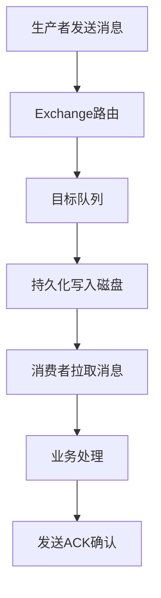
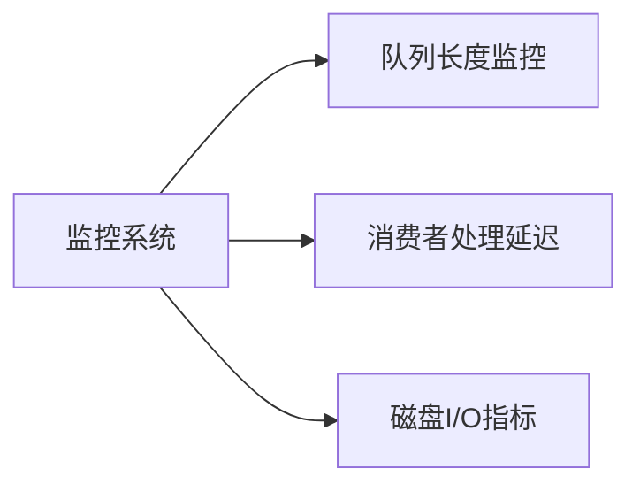

# 3. 消息堆积

# 1. 概述与定义

在分布式消息中间件系统中，RabbitMQ作为常见的消息代理工具，通常被用于实现服务解耦和异步处理。然而，在实际业务中，如果生产者发送消息的速度远远超过消费者处理消息的速率，就会出现“消息堆积”现象，即队列中的消息不断增加，最终可能导致内存溢出、延迟增大，甚至引发系统崩溃。📈

**消息堆积**指的是消息在队列中等待被消费的数量逐步累积的现象。其原因可能包括：消费者处理速度慢、系统资源不足、网络瓶颈、配置不当等。在面试中，考官往往会要求应试者分析消息堆积的原因、解决方案以及如何通过监控手段及时发现问题，从而保障系统高可用与稳定性。

为了更好地理解消息堆积，我们可以将其视作系统负载不平衡的体现。当消息不断堆积时，队列会呈现增长趋势，最终可能形成瓶颈，导致后续消息无法及时处理，影响整个业务流程。消息堆积不仅影响系统性能，还可能使得业务数据出现延迟、丢失、重复消费等问题，因此如何预防和处理消息堆积是构建高可靠消息系统的关键之一。

# 2. 主要特点

RabbitMQ在处理消息堆积问题时，有如下几个主要特点：

1. **生产者与消费者解耦** &#x20;

   由于生产者与消费者之间存在独立的处理逻辑，当消费者处理能力不足时，消息会暂存在队列中，导致堆积。这种解耦特性一方面使系统具备高扩展性，另一方面也需要合理配置以防止消息积压。🤝
2. **预取机制影响消费速率** &#x20;

   RabbitMQ中消费者的预取数量（prefetch count）直接决定了消费者一次性能够拉取的消息数。如果预取设置不合理，可能导致部分消费者被过多消息“占用”，影响整体消费效率，从而引起消息堆积。📦
3. **持久化与镜像机制** &#x20;

   为确保消息不丢失，RabbitMQ支持消息持久化和队列镜像。虽然这两项机制极大提高了数据安全性，但也可能因磁盘IO瓶颈或同步延迟，导致消息处理速度降低，进而引发堆积。💾
4. **消费者处理效率不均衡** &#x20;

   不同消费者实例之间的处理速度存在差异，当部分消费者处理缓慢或出现故障时，部分队列消息将无法及时消费，造成局部堆积。⚖️
5. **流量波动与突发请求** &#x20;

   业务场景中可能存在流量高峰，生产者发送大量消息，而消费者数量固定，导致短时间内消息量骤增而无法被迅速消费，从而产生堆积现象。🔥

下表总结了导致消息堆积的主要因素及其特征：

| 影响因素     | 主要表现                       | 可能原因              |
| -------- | -------------------------- | ----------------- |
| 消费者处理速度  | 消费者处理消息慢，ACK确认延迟           | 代码性能瓶颈、资源不足、网络延迟  |
| 预取数量设置   | 预取数过大导致消费者短时内占用大量消息，影响后续调度 | 预取设置不合理，消费者负载不均衡  |
| 消息持久化与同步 | 消息持久化写入磁盘导致延迟，镜像队列数据同步缓慢   | 磁盘I/O性能瓶颈、分布式同步延迟 |
| 流量高峰     | 突发流量时生产者发送量剧增，消费者数量无法即时扩展  | 短时业务峰值、系统扩展策略不足   |
| 系统资源瓶颈   | CPU、内存、网络等资源不足，无法支持高并发消息处理 | 系统配置不合理、硬件资源有限    |

# 3. 应用目标

研究并解决RabbitMQ消息堆积问题的主要目标在于确保消息传递系统的高性能与稳定性。具体目标包括：

- **保障业务数据一致性与实时性** &#x20;

  消息堆积往往导致业务处理延迟，严重时可能引发数据不一致问题。通过优化系统配置和扩展消费者能力，可以确保消息实时消费，保障业务流程的连续性。
- **提高系统容错与恢复能力** &#x20;

  当出现消息堆积时，及时发现并进行处理有助于避免系统崩溃。借助监控工具、报警机制和自动扩容策略，能够在堆积发生前及时采取补救措施，确保系统高可用。
- **优化资源配置与性能调优** &#x20;

  分析消息堆积的根本原因，有助于找到系统瓶颈所在，从而针对性地优化消费者代码、调整预取参数以及配置队列持久化策略，达到资源利用率与性能的最优平衡。
- **实现动态扩展与负载均衡** &#x20;

  针对流量高峰和突发请求，通过动态增加消费者实例、自动调节预取值等方式，实现系统的水平扩展和负载均衡，确保消息始终处于平稳消费状态。
- **降低运维成本与风险** &#x20;

  通过对消息堆积问题的深入分析和解决方案的实施，能够大幅降低因消息延迟或丢失导致的运维风险，提升系统整体稳定性和用户体验。🎯

# 4. 主要内容及其组成部分

RabbitMQ中导致消息堆积的问题涉及多个方面，下文将对每个组成部分进行详尽说明，并辅以示例和图表展示。

## 4.1 生产者发送速率

**生产者高并发发送** &#x20;

生产者在高并发场景下，如果未对发送速率进行合理限流，容易将大量消息塞入队列。此时，消费者即使处理正常，也难以跟上生产者的节奏，从而导致消息堆积。 &#x20;

示例代码（生产者发送消息）：

```java 
for (int i = 0; i < 10000; i++) {
    String message = "消息编号：" + i;
    channel.basicPublish("exchange", "routingKey", MessageProperties.PERSISTENT_TEXT_PLAIN, message.getBytes());
}
```


## 4.2 消费者处理速率

**消费者性能不足** &#x20;

消费者的处理效率直接影响消息消费速度。如果消费者业务逻辑复杂、资源不足或者配置不当（如预取数设置不合理），则会导致处理速度下降，从而引起消息堆积。 &#x20;

示例代码（消费者消费消息）：

```java 
channel.basicConsume("queueName", false, new DefaultConsumer(channel) {
    @Override
    public void handleDelivery(String consumerTag, Envelope envelope, AMQP.BasicProperties properties, byte[] body) throws IOException {
        String message = new String(body, "UTF-8");
        // 模拟复杂业务处理
        Thread.sleep(100);
        channel.basicAck(envelope.getDeliveryTag(), false);
    }
});
```


## 4.3 队列与预取设置

**预取值（prefetch count）** &#x20;

消费者通过设置预取数限制一次从队列中拉取的消息数量，合理的预取值能够平衡消息传输和消费之间的关系。预取值过高会导致消费者一次接收过多消息，增加处理压力；预取值过低则可能导致消费者资源浪费。 &#x20;

常见配置示例：

```java 
channel.basicQos(10); // 每个消费者一次最多消费10条消息
```


## 4.4 消息持久化与磁盘I/O

**持久化策略与磁盘写入** &#x20;

在开启持久化模式下，消息会写入磁盘以确保不丢失，但这也会带来磁盘I/O瓶颈。当消息量急剧增加时，磁盘写入速度可能成为系统性能的瓶颈，进而引起消息堆积。 &#x20;

在实际运维中，需要监控磁盘I/O指标，并合理配置持久化策略。

## 4.5 队列镜像与集群部署

**镜像队列配置** &#x20;

在集群环境中，配置镜像队列可以确保队列数据在多个节点中保持同步，从而提高容错能力。但在同步过程中，如果各节点之间通信延迟较高，也可能导致部分节点数据处理滞后，从而出现局部消息堆积现象。 &#x20;

示例命令（通过管理工具设置镜像队列）：

```bash 
rabbitmqctl set_policy HA ".*" '{"ha-mode":"all"}'
```


## 4.6 死信队列（DLX）

**死信队列的作用** &#x20;

当消息经过多次重试仍无法被消费者正确处理时，可以将其转发到死信队列中，供后续人工或自动分析处理。死信队列不仅有助于问题排查，也能有效防止异常消息无限堆积。 &#x20;

在队列配置中，可以通过设置`x-dead-letter-exchange`参数来启用死信队列功能。

下表对以上各组成部分进行了归纳总结：

| 组成部分    | 关键配置/参数                  | 主要影响                            |
| ------- | ------------------------ | ------------------------------- |
| 生产者发送速率 | 高并发循环发送消息                | 消息输入速率过高可能超过消费者处理能力，导致队列积压      |
| 消费者处理效率 | 业务处理时间、线程数、预取值           | 处理速度不足或预取设置不合理，会使消息长时间停留在队列中    |
| 队列预取值   | basicQos参数               | 预取值设置过高或过低均可能影响消费者处理节奏          |
| 持久化机制   | durable队列与PERSISTENT消息   | 持久化写入磁盘保障消息安全，但可能受限于磁盘I/O性能     |
| 镜像队列    | ha-mode策略                | 镜像队列提高高可用性，但同步延迟可能引起部分节点消息积压    |
| 死信队列    | x-dead-letter-exchange设置 | 未被消费或异常消息可转入死信队列，有助于问题排查及防止无限堆积 |

# 5. 原理剖析

深入剖析RabbitMQ中消息堆积问题，主要需要从消息生产、传输、存储和消费各环节的瓶颈分析入手。下面详细阐述各个环节的工作原理及其对消息堆积的影响。

## 5.1 消息生产与发送

在消息生产端，生产者通常以较高的频率发送消息至RabbitMQ Exchange。Exchange负责根据路由规则将消息分发至相应队列。如果生产者发送速率远高于消费者消费速率，队列中的消息将不断累积，从而形成堆积。 &#x20;

关键点在于： &#x20;

- 发送策略的选择（同步/异步发送） &#x20;
- 是否采用发布者确认机制以确保消息已被正确路由 &#x20;
- 发送速率与消费者处理能力的匹配

## 5.2 消息传输与路由

RabbitMQ中的Exchange通过不同的路由算法（Direct、Topic、Fanout等）将消息投递到目标队列。在路由过程中，若某个队列消费者处理速度较慢，消息将长时间存留在该队列中，造成局部堆积。 &#x20;

此外，在复杂路由场景下，多个队列可能同时存在消息堆积风险，需要根据业务情况调整路由策略。

## 5.3 消息存储与持久化

当队列配置为持久化模式时，消息会写入磁盘以保证数据安全。写入过程通常采用顺序追加（类似CommitLog）的方式，但磁盘I/O速度是有限的。大量持久化写入操作在高并发下可能会造成写入延迟，进一步加剧消息在队列中的堆积。 &#x20;

因此，对磁盘性能和持久化策略的合理调优非常重要。

## 5.4 消息消费与ACK确认

消费者从队列中拉取消息后，需要执行业务逻辑并发送ACK确认。若消费者处理业务逻辑耗时较长，ACK确认延迟将使得同一消息长时间滞留在队列中。 &#x20;

同时，预取值设置不当会导致消费者一次性获取大量消息，因而可能出现部分消息长时间等待处理的情况。 &#x20;

此过程的核心在于： &#x20;

- 消费者处理逻辑优化 &#x20;
- 合理设置预取值以平衡消费速率 &#x20;
- 实时监控ACK确认状态

## 5.5 整体数据流流程图

下面借助Mermaid图表展示RabbitMQ中消息从发送到消费的整体流程，其中标注了可能引发消息堆积的关键节点：




图中展示了从生产者发送消息开始，经由Exchange路由、队列存储、磁盘写入，到消费者拉取消息并处理，最后完成ACK确认的全流程。当任一环节出现延迟或瓶颈时，都会导致消息在队列中滞留，从而形成消息堆积现象。🔄

## 5.6 典型堆积场景与分析

常见的消息堆积场景包括： &#x20;

- **高峰期流量暴增**：短时间内大量消息涌入，消费者实例不足以分担压力。 &#x20;
- **消费者处理异常**：业务逻辑错误或异常导致消费者无法正常ACK，消息重复重试积压。 &#x20;
- **资源瓶颈**：服务器磁盘、内存或网络带宽不足，影响消息持久化与消费效率。 &#x20;

通过深入监控这些关键指标，可以及时发现并解决消息堆积问题，保证系统稳定运行。

# 6. 应用与拓展

针对RabbitMQ消息堆积问题，在实际项目中可以采取多种应对策略和扩展措施，以确保系统的高可用性和稳定性。下面介绍几种典型的应用场景及拓展方案：

## 6.1 动态扩展消费者

在业务高峰期，通过动态扩容消费者实例，可以有效分担队列中的消息处理压力。结合容器化部署与自动扩缩容策略（如Kubernetes Horizontal Pod Autoscaler），系统能够根据消息堆积情况自动调整消费者数量，从而快速响应流量变化。

## 6.2 优化预取配置

根据业务场景和消费者处理能力，合理设置预取值（basicQos）至关重要。通过不断调试和监控，可以找到最优的预取数量，既避免消费者一次性拉取过多消息导致处理压力，也能保证消息能够及时分配至各个消费者。

## 6.3 引入死信队列与重试机制

对于长期无法被消费的消息，可以配置死信队列（DLX），将异常消息转移到专门的队列中以便后续分析和处理。同时，结合重试机制，对暂时性故障进行自动重试，降低消息堆积风险。

## 6.4 监控与报警系统

建立完善的监控体系，对队列长度、消息堆积数量、消费者处理延迟、磁盘I/O等指标进行实时监控，并通过报警机制及时通知运维人员。常用监控工具包括Prometheus、Grafana以及RabbitMQ自带的管理控制台。 &#x20;

例如，可以通过Grafana构建如下监控图表：




## 6.5 优化持久化策略

在持久化模式下，优化磁盘I/O性能十分重要。可以考虑采用SSD磁盘、RAID阵列等方案来提高写入速度；同时，合理调整持久化参数，避免因频繁写入而引起磁盘瓶颈。此外，通过异步写入与批量确认机制，也可在一定程度上降低磁盘负担。

## 6.6 应用与拓展总结

综上，针对RabbitMQ消息堆积问题，既需要在系统设计阶段做到充分预估，也需要在运维阶段实时监控、动态扩展。通过动态扩容、预取优化、死信队列、监控报警及持久化优化等措施，可以有效缓解消息堆积风险，保障系统高性能与高可靠性。🚀

\--------------------------------------------------------------------------------

# 7. 面试问答

下面从面试者角度出发，整理了五个常见面试问题及详细回答，帮助各位工程师从容应对关于RabbitMQ消息堆积问题的提问。

## 问题1：请介绍RabbitMQ中消息堆积现象产生的原因，并说明如何识别和监控这种情况？

答： &#x20;

RabbitMQ中消息堆积主要由以下原因引起： &#x20;

1. 生产者发送速率过快，而消费者处理速度不足。 &#x20;
2. 消费者预取值设置不合理，导致一次性获取大量消息，处理速度下降。 &#x20;
3. 消息持久化写入磁盘时受限于I/O性能，延迟增大。 &#x20;
4. 网络延迟或消费者实例故障造成部分队列消息未能及时消费。 &#x20;

为识别和监控消息堆积，可以利用RabbitMQ自带的管理控制台查看队列长度和消息积压情况，同时结合Prometheus和Grafana等监控工具，对关键指标（如队列长度、处理延迟、ACK确认时间）进行实时监控，一旦超过预警阈值立即触发报警，及时采取措施。

## 问题2：在面对消息堆积时，如何优化消费者的处理效率和预取值设置？

答： &#x20;

优化消费者处理效率首先需要分析业务逻辑，找出处理瓶颈，如耗时操作、同步调用等，通过优化代码、引入异步处理或多线程机制提高处理速度。同时，合理设置预取值（basicQos参数）非常关键，预取值既不能过大也不能过小。通过压力测试与监控，可以找到最佳平衡点，确保消费者既能充分利用资源，又不会因一次性拉取过多消息而导致处理延迟。我的经验是先设置一个较低的预取值，观察系统响应，再逐步调高，直至达到最优效果。

## 问题3：如何利用死信队列解决消息堆积问题？请详细说明其工作原理和配置方法。

答： &#x20;

死信队列（DLX）是处理无法被消费者成功处理消息的有效手段。原理上，当消息多次重试后仍未被成功消费，或者消息过期时，会被转发到预先配置好的死信队列中。这样可以防止异常消息无限堆积在主队列中，影响正常业务。配置方法主要是： &#x20;

1. 在队列参数中设置`x-dead-letter-exchange`，指定死信交换机； &#x20;
2. 同时配置`x-message-ttl`或重试次数，以决定何时将消息转入死信队列。 &#x20;

这种机制不仅能保护主队列的稳定性，还为后续人工或自动化处理异常消息提供了依据。

## 问题4：在高并发场景下，如何通过动态扩容消费者来缓解消息堆积问题？

答： &#x20;

在高并发场景下，消费者实例数量不足常常是消息堆积的根本原因。为了解决这一问题，可以采用动态扩容策略，例如基于容器编排平台（如Kubernetes）的自动扩缩容，通过监控队列长度和处理延迟等指标，自动增加消费者实例数量。同时，使用负载均衡器将消息均匀分配到各个消费者实例，保证处理效率。我的实际经验中，经常借助Prometheus监控队列状态，并利用HPA（Horizontal Pod Autoscaler）自动扩容消费者服务，以确保系统在高峰期能迅速响应并消化堆积的消息。

## 问题5：面对消息堆积问题，如何从整体上优化RabbitMQ系统的配置和架构设计？

答： &#x20;

整体优化RabbitMQ系统需要从以下几个方面入手： &#x20;

1. **生产者控制**：通过限流、批量发送等方式，平衡生产者与消费者之间的消息速率。 &#x20;
2. **消费者优化**：提升消费者业务逻辑效率、合理设置预取值，并确保消费者实例数量与业务负载匹配。 &#x20;
3. **持久化与磁盘I/O**：优化磁盘性能，采用SSD或RAID方案，提高持久化写入速度。 &#x20;
4. **队列镜像与高可用**：配置镜像队列确保数据在多个节点间同步，降低单点故障风险。 &#x20;
5. **监控与报警**：建立完善的监控体系，对关键指标进行实时监控，及时发现并解决问题。 &#x20;

通过以上综合措施，可以在架构设计上预防消息堆积，同时在运行时动态调整，确保系统高效稳定运行。

# 总结

RabbitMQ中的消息堆积问题是分布式消息系统中常见而又不可忽视的现象，其根源在于生产者与消费者处理速率不匹配、预取机制不合理、持久化策略受限及系统资源瓶颈等多方面因素。本文详细阐述了消息堆积的概念、主要特点、应用目标、核心组成部分、底层原理以及各种应对措施，并通过代码示例、表格归纳和Mermaid图表直观展示数据流过程。最后，通过模拟面试问答，从面试者角度解答了相关技术细节，助力Java工程师在面试中从容应对此类问题。

希望这篇文章能帮助各位在面试复习过程中全面掌握RabbitMQ消息堆积的各项知识，并能在实际项目中快速定位和解决问题，构建出高性能、高可靠的消息传递系统。加油！🚀
