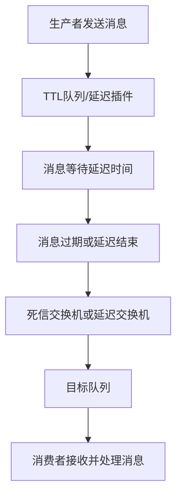

# 4. 延迟队列

## 1. 概述与定义

RabbitMQ作为一款广泛使用的开源消息中间件，除了常见的即时消息传递外，还支持延迟队列（Delay Queue）这一重要功能。延迟队列是指在消息发送后，并不立即将消息投递给消费者，而是在预设的延迟时间到达后再进行投递，从而实现定时任务、延时提醒、订单超时等业务场景的需求。📅

在RabbitMQ中，延迟队列常常通过以下两种方式实现：

1. **TTL（Time-To-Live）+ 死信队列（DLX）机制** &#x20;

   利用队列中消息的过期时间（TTL），在消息到期后通过死信交换机（Dead Letter Exchange）重新路由到目标队列。 &#x20;
2. **RabbitMQ延迟插件** &#x20;

   通过官方提供的插件，使得RabbitMQ能够原生支持延迟消息，配置更加灵活。

延迟队列不仅能满足业务定时任务的要求，还能降低系统的耦合度和复杂度，是微服务架构中非常实用的功能模块。在面试中，考官通常会关注延迟队列的实现原理、优缺点以及在实际项目中的应用案例。

## 2. 主要特点

RabbitMQ延迟队列的特点主要体现在以下几个方面：

1. **定时任务调度** &#x20;

   通过延迟队列，可以实现消息的定时投递，常用于订单超时处理、定时发送提醒邮件等业务场景。⏰
2. **解耦与异步处理** &#x20;

   延迟队列使得生产者无需关心消息何时被消费，消费者则按预定时间消费消息，实现了系统解耦和异步化处理。🤝
3. **灵活的延迟策略** &#x20;

   利用TTL+死信队列方式，可以灵活地设置消息的延迟时间；而通过延迟插件，则可动态调整延迟级别，满足不同业务场景需求。🔧
4. **可靠性保障** &#x20;

   在延迟队列中，消息通常经过持久化存储和严格的路由控制，确保即使系统故障也不会导致消息丢失。🔒
5. **易于监控与管理** &#x20;

   RabbitMQ自带的管理控制台以及第三方监控工具可以实时监控延迟队列的状态，包括队列长度、延迟时间、死信消息数量等指标，方便及时预警和调整。📊

下表总结了延迟队列的主要特点与其对应的应用场景：

| 特点      | 说明                         | 应用场景             |
| ------- | -------------------------- | ---------------- |
| 定时任务调度  | 消息在设定的延迟时间后才投递给消费者         | 订单超时、定时提醒、延时任务调度 |
| 解耦与异步处理 | 生产者和消费者解耦，消息异步消费           | 异步处理、消息重试、流量削峰   |
| 灵活的延迟策略 | 可通过TTL和死信队列或延迟插件实现灵活配置延迟时间 | 不同业务需求下的延迟时间调节   |
| 可靠性保障   | 消息持久化存储，确保延迟过程中消息不丢失       | 关键业务流程、数据一致性保障   |
| 监控与管理   | 实时监控延迟队列状态，便于发现异常及时处理      | 系统稳定性保障、预警机制建设   |

## 3. 应用目标

研究并实现RabbitMQ延迟队列的主要目标在于满足以下业务需求：

1. **实现定时任务调度** &#x20;

   通过延迟队列，可以在消息达到指定延迟后自动触发后续处理流程，如订单自动取消、短信/邮件定时发送等，从而降低人工干预和系统复杂度。
2. **优化系统解耦与异步处理** &#x20;

   利用延迟队列，生产者只负责将消息送入队列，而无需等待消费者处理完成，从而实现异步解耦，提高系统响应速度和可扩展性。
3. **平衡流量与削峰填谷** &#x20;

   在高并发场景下，延迟队列能够将突发流量分散至不同时间点进行消费，有助于平衡系统负载，防止瞬时流量激增引起的性能瓶颈。
4. **提升系统稳定性与容错性** &#x20;

   通过消息持久化、死信队列和自动重试机制，可以在系统异常情况下保证延迟消息不丢失，从而提高系统整体的稳定性与容错能力。
5. **降低运维成本与风险** &#x20;

   实现延迟队列可以减少对定时任务的外部依赖，减少系统耦合，从而降低运维难度及潜在的错误风险，为企业构建更稳定的业务流程提供支持。

## 4. 主要内容及其组成部分

RabbitMQ延迟队列主要包含以下几个组成部分，每个部分在实现延迟功能中都扮演着不可或缺的角色：

### 4.1 消息生产与发送

在延迟队列中，生产者负责将需要延迟处理的消息发送到RabbitMQ。消息发送时，需要附带延迟信息或将消息发送到专门配置TTL的队列中。示例代码如下：

```java 
// 通过TTL+死信队列实现延迟消息
AMQP.BasicProperties properties = new AMQP.BasicProperties.Builder()
    .expiration("60000") // 设置消息有效期为60秒，单位为毫秒
    .deliveryMode(2)     // 持久化模式
    .build();
channel.basicPublish("normalExchange", "routingKey", properties, "延迟消息测试".getBytes());
```


在此示例中，通过设置消息的expiration属性，指定消息在队列中的存活时间。消息在过期后会自动进入配置好的死信交换机。

### 4.2 TTL队列与死信队列

由于RabbitMQ本身不直接支持延迟队列，因此常采用TTL队列（设置消息生存时间）配合死信队列实现延迟效果。其工作流程为： &#x20;

1. 生产者将消息发送到TTL队列； &#x20;
2. 当消息在TTL队列中超过设定时间后自动失效； &#x20;
3. 失效的消息被路由到死信交换机，从而进入目标队列进行消费。

配置示例（队列声明）：

```java 
Map<String, Object> args = new HashMap<>();
args.put("x-dead-letter-exchange", "delayExchange"); // 设置死信交换机
args.put("x-message-ttl", 60000); // 设置TTL为60秒
channel.queueDeclare("ttlQueue", true, false, false, args);
```


上述代码中，"ttlQueue"队列中的消息在60秒后会转发到"delayExchange"交换机，从而实现延迟投递。

### 4.3 延迟插件（RabbitMQ Delayed Message Plugin）

另一种实现方式是使用RabbitMQ延迟插件，该插件原生支持延迟消息，不需要通过TTL和死信队列进行绕道处理。使用插件时，可以直接在消息属性中设置延迟时间。例如：

```java 
Map<String, Object> headers = new HashMap<>();
headers.put("x-delay", 60000); // 延迟60秒
AMQP.BasicProperties properties = new AMQP.BasicProperties.Builder()
    .headers(headers)
    .deliveryMode(2)
    .build();
channel.basicPublish("delayedExchange", "routingKey", properties, "延迟插件消息测试".getBytes());
```


这种方式配置简单且延迟时间可动态调整，适用于需要精准控制延迟时间的业务场景。

### 4.4 消费者处理

消费者从目标队列中接收延迟后的消息并执行业务逻辑。由于延迟队列的实现依赖于TTL和死信队列或插件，消费者的处理逻辑与普通消息无异，只需专注于业务实现。示例代码如下：

```java 
channel.basicConsume("targetQueue", false, new DefaultConsumer(channel) {
    @Override
    public void handleDelivery(String consumerTag, Envelope envelope, AMQP.BasicProperties properties, byte[] body) throws IOException {
        String message = new String(body, "UTF-8");
        System.out.println("收到延迟消息：" + message);
        channel.basicAck(envelope.getDeliveryTag(), false);
    }
});
```


消费者接收到消息后进行业务处理，并通过ACK确认消息已被成功消费。

下表对RabbitMQ延迟队列的各组成部分进行归纳说明：

| 组成部分  | 关键配置/参数                              | 主要功能及说明                            |
| ----- | ------------------------------------ | ---------------------------------- |
| 消息生产  | expiration、x-delay                   | 设置消息延迟时间，决定消息何时过期或被投递到目标队列         |
| TTL队列 | x-message-ttl、x-dead-letter-exchange | 消息在队列中存活时间到期后自动失效，并转发到死信交换机，实现延迟功能 |
| 死信队列  | 死信交换机的绑定与路由                          | 接收TTL队列中过期的消息，并将其路由到目标队列供消费者消费     |
| 延迟插件  | x-delay头属性                           | 通过插件直接设置延迟时间，实现原生延迟消息投递            |
| 消费者处理 | 普通消息消费逻辑                             | 从目标队列中获取延迟消息，完成后续业务逻辑处理并确认消费       |

## 5. 原理剖析

RabbitMQ延迟队列的实现原理主要包括以下几个关键点：

### 5.1 TTL与死信机制

RabbitMQ不直接支持延迟队列，因此常用TTL（Time-To-Live）与死信队列组合实现延迟消息。其核心原理如下：

- **TTL设置** &#x20;

  消息在TTL队列中具有固定的存活时间，超过该时间后消息自动过期。
- **死信队列转发** &#x20;

  过期的消息不会被直接删除，而是根据队列参数中的`x-dead-letter-exchange`转发到指定的死信交换机，然后通过路由键进入目标队列。

这种机制虽然不是原生延迟队列，但能够实现“延时投递”的效果，并且具备灵活性，允许开发者通过调整TTL时间实现不同延迟级别。

### 5.2 延迟插件原理

RabbitMQ延迟插件（Delayed Message Plugin）是一种较为优雅的实现方式，其原理是扩展了RabbitMQ的交换机功能，使得消息在发送时可以附带一个延迟时间。插件内部会缓存消息，待延迟时间到达后再将消息投递到目标队列，从而实现精确的延时效果。相比TTL+死信机制，该方式避免了队列转发的额外开销，适合需要高精度延迟控制的业务场景。

### 5.3 数据流整体流程

下面借助Mermaid图表展示RabbitMQ延迟队列的整体数据流流程，帮助直观理解消息的传递路径：




图中展示了消息从生产者发送开始，经由TTL队列或延迟插件等待指定延迟时间，再通过死信交换机或延迟交换机路由到目标队列，最终由消费者消费的全过程。每个环节都在确保延迟投递的同时保证消息的可靠性。

### 5.4 延迟队列与普通队列的差异

延迟队列与普通队列的主要区别在于消息投递的时间控制。普通队列中，消息一经进入队列便可立即被消费者消费；而延迟队列则通过TTL或延迟插件控制消息在队列中的停留时间，从而实现定时投递。该差异使得延迟队列在处理定时任务、自动取消订单等场景中具有独特优势，但也需要开发者关注延迟期间的消息存储和监控问题。

## 6. 应用与拓展

在实际项目中，RabbitMQ延迟队列被广泛应用于各类定时任务及延时处理场景，下面列举几种典型应用及其拓展方案：

### 6.1 订单超时取消

在电商系统中，订单支付超时是常见场景。通过延迟队列，可以在订单创建后发送一条延迟消息，若在规定时间内未收到支付成功的通知，则自动触发订单取消逻辑。此方案既解耦了订单创建与支付监控，也避免了大量定时任务调度带来的系统负担。

### 6.2 定时提醒与通知

在用户消息提醒、定时短信/邮件发送等业务中，延迟队列可用于实现定时推送。比如用户预约提醒、活动通知等，通过设置延迟时间，系统可在预定时间自动将消息推送给用户，提高用户体验和业务响应速度。

### 6.3 任务调度与重试机制

延迟队列不仅可以用于定时任务，还可作为任务重试机制的一部分。当消费者处理某个任务失败时，可将任务重新投递至延迟队列，经过一定延迟后重试消费，从而降低系统瞬时负载，避免任务频繁重试带来的性能问题。

### 6.4 与Spring Boot等框架集成

在实际项目中，RabbitMQ延迟队列常与Spring Boot、Spring Cloud等框架结合使用。利用Spring AMQP和RabbitMQ延迟插件，开发者可以通过简单配置实现延迟消息的发送和接收，从而快速构建定时任务调度系统。例如，通过配置Spring Boot的application.yml文件指定延迟交换机和队列参数，就可以实现业务级别的延时处理。

### 6.5 拓展思路

- **多级延迟**：对于复杂业务场景，可以构建多级延迟队列，每一级队列对应不同延迟时间，满足更加精细的延时需求。 &#x20;
- **动态延迟**：通过在消息头中动态设置延迟参数，实现根据业务状态动态调整延迟时间的功能。 &#x20;
- **与其他中间件对比**：了解RabbitMQ延迟队列与其他消息中间件（如Kafka、RocketMQ）的延时处理机制，掌握各自优缺点，有助于在面试中进行深入对比分析。 &#x20;

## 7. 面试问答

下面以面试者角度，从实际经验出发，整理了五个常见面试问题及详细回答，供各位面试者参考。

### 问题1：什么是RabbitMQ延迟队列？它在业务中有什么作用？

答： &#x20;

RabbitMQ延迟队列是指在消息发送后不立即投递给消费者，而是经过预设的延迟时间后再进行消费的队列机制。其主要作用在于实现定时任务调度、订单超时处理、定时提醒等场景。利用延迟队列，可以将定时任务与业务逻辑解耦，既提高系统响应速度，又减少定时任务的复杂度。

### 问题2：请详细描述利用TTL和死信队列实现延迟队列的原理及配置方法。

答： &#x20;

由于RabbitMQ本身不直接支持延迟队列，常采用TTL与死信队列组合实现。具体步骤如下： &#x20;

1. 声明一个TTL队列，并在队列参数中设置`x-message-ttl`属性（例如60000毫秒），同时设置`x-dead-letter-exchange`属性，将过期消息转发到指定的死信交换机； &#x20;
2. 当生产者发送消息到该队列后，消息在TTL时间内不会被消费者消费； &#x20;
3. 一旦消息超过TTL时间，RabbitMQ将其视为“死信”，并根据死信交换机配置将消息路由到目标队列，消费者再从目标队列中消费。 &#x20;

这种方式实现了消息的延迟投递，配置上既可以在队列声明时设置，也可以在消息发送时动态指定TTL。

### 问题3：RabbitMQ延迟插件的工作原理是什么？与TTL+死信机制相比有什么优势？

答： &#x20;

RabbitMQ延迟插件扩展了RabbitMQ的交换机功能，使其能够原生支持延迟消息。生产者在发送消息时，可以在消息头中设置`x-delay`属性，指定延迟时间。插件内部会根据延迟时间缓存消息，待延迟时间到期后再将消息路由到目标队列。 &#x20;

与TTL+死信机制相比，延迟插件的优势在于： &#x20;

- 配置更简单，无需额外声明TTL队列和死信队列； &#x20;
- 延迟精度更高，延迟时间可动态调整； &#x20;
- 避免了死信路由带来的额外开销，更适合高精度延时业务。

### 问题4：在实际项目中，如何监控和处理延迟队列中的异常情况？

答： &#x20;

针对延迟队列的异常监控，我会采取如下措施： &#x20;

1. 利用RabbitMQ管理控制台和Prometheus、Grafana等监控工具，实时监控队列长度、消息延迟情况以及死信队列中的消息数量； &#x20;
2. 设定合理的预警阈值，一旦发现延迟队列中消息异常积压或消费延迟超标，立即通知运维人员进行排查； &#x20;
3. 配置自动重试机制，对于消费失败的消息，可将其重新投递到延迟队列，并记录日志，便于后续问题分析。

### 问题5：请说明延迟队列在订单系统中的应用场景，并介绍你的实际优化经验。

答： &#x20;

在订单系统中，延迟队列常用于实现订单超时自动取消。当用户下单后，如果在规定时间内未完成支付，系统会通过延迟队列触发订单取消逻辑，从而避免长时间占用库存或引起后续业务异常。我在项目中采用TTL+死信机制实现延迟队列，并结合自动扩容消费者、调整预取值等手段优化消费速度。通过监控队列指标，及时发现订单积压问题，并对消费者处理逻辑进行性能调优，确保系统稳定高效运行。

## 总结

RabbitMQ延迟队列作为消息中间件的重要应用场景，为定时任务调度、订单超时处理、定时提醒等业务提供了强有力的支持。本文从概述、主要特点、应用目标、核心组成、原理剖析、应用拓展以及面试问答等七个部分，详细阐述了延迟队列的实现机制和应用实践。 &#x20;

通过TTL与死信队列的组合以及延迟插件的使用，开发者可以灵活、可靠地实现消息的延迟投递；同时，合理的监控和调优策略也能有效降低系统风险。希望这篇文章能够帮助各位Java工程师全面掌握RabbitMQ延迟队列的各项知识，在面试中从容应对相关问题，并在实际项目中构建高性能、高可用的消息系统。加油！🚀
