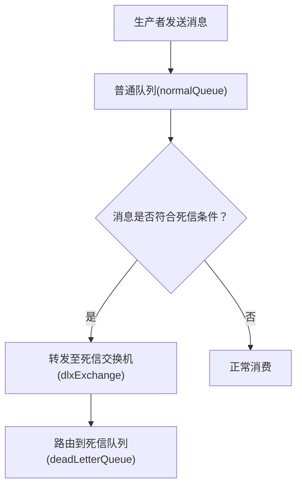
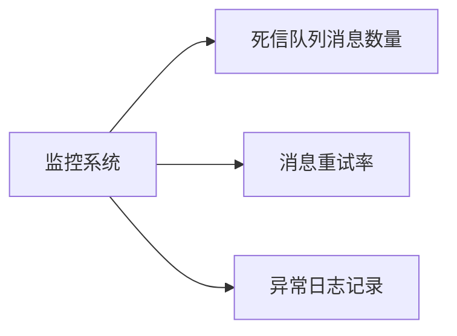

# 5. 死信队列

## 1. 概述与定义

RabbitMQ作为一款成熟的消息中间件，在实际生产环境中广泛应用于系统解耦、异步处理和高并发场景。其中，死信队列（Dead Letter Queue，DLQ）是一种非常重要的消息处理机制，用于捕获那些无法被正常消费或处理失败的消息。当消息因各种原因（如消息过期、被消费者拒绝或队列容量溢出）无法进入正常的业务流程时，它们会被转移到专门配置的死信队列中，从而避免阻塞正常队列，方便后续人工排查、日志记录以及重试处理。📌

在RabbitMQ中，要实现死信队列功能，通常需要在普通队列的声明时配置两个关键参数： &#x20;

- `x-dead-letter-exchange`：指定当消息成为死信时要转发到的交换机。 &#x20;
- `x-dead-letter-routing-key`：指定转发到死信交换机时所使用的路由键（可选，默认与原队列相同）。

死信队列的存在不仅可以提高系统的健壮性和容错能力，还可以帮助开发人员及时发现和定位系统中的异常情况，是构建高可靠消息系统不可或缺的一部分。

## 2. 主要特点

RabbitMQ死信队列具有以下几个主要特点：

1. **异常消息隔离** &#x20;

   死信队列可以将因各种原因（如TTL超时、消费者拒绝等）未能成功处理的消息隔离出来，使得主队列不会因这些异常消息而影响整体业务流转。🔒
2. **灵活的配置方式** &#x20;

   通过在队列声明时配置`x-dead-letter-exchange`和`x-dead-letter-routing-key`参数，可以灵活定义死信消息的转发规则，满足不同场景下的业务需求。🔧
3. **支持消息重试与补偿机制** &#x20;

   死信队列不仅可以用于存储异常消息，还能结合重试机制、手动干预或自动补偿，重新将消息投递至业务队列，从而实现消息重处理。🔄
4. **监控与日志记录** &#x20;

   借助RabbitMQ管理控制台和第三方监控工具，可以实时监控死信队列中的消息数量和状态，帮助运维人员及时发现问题、分析故障原因，并根据情况调整业务策略。📊
5. **解耦异常处理逻辑** &#x20;

   死信队列将异常处理与正常业务逻辑解耦，使得系统在高并发或异常情况下依然保持高可用性，降低系统耦合度。🤝

下面的表格对死信队列的主要特点和适用场景进行了归纳说明：

| 特点      | 说明                       | 应用场景             |
| ------- | ------------------------ | ---------------- |
| 异常消息隔离  | 将处理失败、过期或被拒绝的消息转移到专用队列中  | 消息消费异常、业务数据不一致场景 |
| 灵活配置    | 可通过参数设置转发交换机和路由键，自定义转发规则 | 多业务系统、复杂消息路由需求   |
| 重试与补偿机制 | 支持将死信消息重新投递或进行手动/自动补偿处理  | 订单重试、任务失败重跑      |
| 监控与日志   | 借助管理控制台实时监控死信队列状态，便于及时预警 | 系统故障排查、性能监控      |
| 异常处理解耦  | 将异常消息与正常消息分离，降低系统耦合度     | 高并发、分布式系统        |

## 3. 应用目标

构建RabbitMQ死信队列的主要目标在于提高系统的健壮性、容错能力以及业务的连续性，具体目标如下：

- **保障系统稳定性** &#x20;

  通过将异常消息隔离至死信队列，防止因部分消息处理失败导致整个消息队列阻塞，从而保持系统高效运行。
- **提高消息可靠性** &#x20;

  在消费过程中，可能会出现消息因超时、拒绝或其他原因无法被正常处理，通过死信队列机制确保这些消息不会丢失，后续可以进行人工排查或自动重试，确保数据完整性。
- **支持业务补偿与重试** &#x20;

  在某些关键业务场景中，消息失败可能导致数据不一致或交易异常。通过死信队列，可以将异常消息集中管理，并结合重试机制实现自动补偿，降低风险。
- **降低运维复杂度** &#x20;

  利用死信队列可以快速定位系统中存在的异常情况，通过监控和日志记录帮助运维人员及时响应和处理故障，降低运维压力。
- **解耦业务逻辑与异常处理** &#x20;

  将异常处理与正常消息处理分离，使得业务系统在高并发或异常情况下依然能够保持稳定，减少因异常处理导致的系统耦合。

这些目标最终帮助企业构建出一个高可用、健壮且易于维护的消息传递系统，从而提高业务响应速度和用户体验。🎯

## 4. 主要内容及其组成部分

RabbitMQ死信队列涉及多个组成部分，下面对各个部分进行详细说明，并辅以示例代码、配置说明以及图表解释。

### 4.1 死信交换机（Dead Letter Exchange）

死信交换机用于接收转发过来的死信消息。配置死信队列时，通常需要先创建一个专用的交换机，然后将其绑定到对应的死信队列。 &#x20;

示例代码（Java）：

```java 
// 声明死信交换机
channel.exchangeDeclare("dlxExchange", "direct", true);
```


### 4.2 死信队列（Dead Letter Queue）

死信队列是存放无法被正常消费的消息的专用队列。通过绑定到死信交换机，可以将符合条件的消息路由到此队列。 &#x20;

示例代码（Java）：

```java 
// 声明死信队列
channel.queueDeclare("deadLetterQueue", true, false, false, null);
// 绑定死信队列到死信交换机，使用指定的路由键
channel.queueBind("deadLetterQueue", "dlxExchange", "dlxRoutingKey");
```


### 4.3 普通队列与死信参数配置

在声明普通队列时，需要配置两个关键参数： &#x20;

- `x-dead-letter-exchange`：指定当消息成为死信时要转发到的交换机。 &#x20;
- `x-dead-letter-routing-key`：指定转发时使用的路由键（可选）。

示例代码（Java）：

```java 
Map<String, Object> args = new HashMap<>();
args.put("x-dead-letter-exchange", "dlxExchange");
args.put("x-dead-letter-routing-key", "dlxRoutingKey");
// 声明普通队列，配置死信参数
channel.queueDeclare("normalQueue", true, false, false, args);
```


### 4.4 消息产生死信的原因

消息成为死信通常有以下几种情况： &#x20;

1. **消息过期**：消息在队列中的存活时间超过TTL设置。 &#x20;
2. **消费者拒绝**：消费者明确拒绝消息（使用basic.reject或basic.nack）且设置不重入队列。 &#x20;
3. **队列长度限制**：当队列中消息数量超过预设的最大值，多余的消息会直接被丢弃或转移到死信队列。

这些原因确保了系统中存在无法处理或异常的消息时，能够及时将其隔离，以便后续处理。

下表对死信消息产生的原因进行了归纳：

| 原因     | 说明                  | 处理方式      |
| ------ | ------------------- | --------- |
| 消息过期   | 消息在队列中超过TTL时间后自动失效  | 转发到死信队列   |
| 消费者拒绝  | 消息被消费者拒绝且不重新入队      | 直接路由至死信队列 |
| 队列长度限制 | 队列消息数量超出限制，后续消息无法入队 | 被转移至死信队列  |

### 4.5 业务处理与再消费

在死信队列中存储的消息，可以通过专门的消费者进行监控、日志记录以及再消费处理。再消费策略可以是自动重试，也可以是人工干预后重新入队，确保重要消息最终被正确处理。 &#x20;

示例代码（再消费）：

```java 
channel.basicConsume("deadLetterQueue", false, new DefaultConsumer(channel) {
    @Override
    public void handleDelivery(String consumerTag, Envelope envelope, AMQP.BasicProperties properties, byte[] body) throws IOException {
        String deadMessage = new String(body, "UTF-8");
        System.out.println("处理死信消息：" + deadMessage);
        // 此处可加入重试逻辑或报警处理，确认后发送ACK
        channel.basicAck(envelope.getDeliveryTag(), false);
    }
});
```


## 5. 原理剖析

RabbitMQ死信队列的实现原理主要依赖于消息转发机制和队列配置。下面对其工作原理进行深入剖析：

### 5.1 消息生命周期与死信产生

当生产者发送消息到普通队列后，消息在队列中等待被消费者消费。在此过程中，如果出现以下情况，消息将被视为“死信”： &#x20;

- 消息在队列中等待时间超过了TTL设定。 &#x20;
- 消费者收到消息后，通过basic.reject或basic.nack拒绝该消息，且设置不重新入队。 &#x20;
- 队列的长度超过预设上限，无法继续存储更多消息。

一旦满足以上任一条件，RabbitMQ会自动将该消息从普通队列中移除，并根据队列配置中的`x-dead-letter-exchange`参数，将消息转发到指定的死信交换机，再由死信交换机根据路由键转发到绑定的死信队列。

### 5.2 死信转发机制

死信转发机制是RabbitMQ内部处理异常消息的重要环节，其工作过程如下：

1. 普通队列中消息达到过期、被拒绝或超出队列容量时，被标记为死信。 &#x20;
2. RabbitMQ根据队列声明时配置的`x-dead-letter-exchange`参数，将死信消息转发到指定的交换机。 &#x20;
3. 死信交换机根据绑定关系及`x-dead-letter-routing-key`将消息路由到对应的死信队列。 &#x20;
4. 系统管理员或专门的消费者对死信队列中的消息进行监控和处理，必要时进行重试或报警。

下面借助Mermaid图表展示消息从正常队列进入死信队列的整体流程：




图中展示了在普通队列中，消息如果满足过期、被拒或队列溢出等条件，则进入死信转发流程，从而被隔离至死信队列中，便于后续处理。

### 5.3 死信队列的再处理机制

在死信队列中存储的消息往往代表了需要额外关注的异常情况。系统可以对这些消息进行以下处理： &#x20;

- 自动重试：结合业务逻辑，通过设置延迟重试机制，将死信消息重新投递到原队列。 &#x20;
- 人工干预：运维人员通过监控系统查看死信队列中的异常消息，进行手动排查和补偿处理。 &#x20;
- 日志记录：详细记录死信消息的产生原因，方便事后分析系统瓶颈和业务逻辑问题。

通过这些机制，死信队列不仅作为异常消息的“黑匣子”，还能帮助系统实现自动化修复和容错处理，提高整个消息系统的健壮性。

## 6. 应用与拓展

在实际业务中，RabbitMQ死信队列具有广泛的应用场景，并可与多种策略结合进行拓展优化：

### 6.1 业务场景应用

- **订单系统异常处理** &#x20;

  在电商订单系统中，订单消息如果因超时、支付失败等原因未能被正常处理，可通过死信队列进行隔离，后续通过人工确认或自动重试机制触发订单取消或补偿处理。
- **任务失败重试** &#x20;

  对于异步任务，如果消费者处理失败，可将消息转发到死信队列，然后通过定时任务进行重试，确保关键任务最终被正确执行。
- **数据一致性校验** &#x20;

  在分布式系统中，通过死信队列收集因数据不匹配或处理异常导致的消息，便于系统对比、校验数据一致性，及时修复问题。

### 6.2 与监控系统集成

通过RabbitMQ管理控制台、Prometheus、Grafana等监控工具，可以实时监控死信队列的消息数量、流入速率和异常原因。运维人员可以配置报警规则，及时获取异常预警，从而快速定位并解决系统问题。利用图表监控如下：




### 6.3 动态调整与自动化处理

- **自动重试机制** &#x20;

  配合延时队列和自动重试机制，可以实现对死信消息的自动再处理，降低系统人工干预成本。例如，设置重试次数和重试延时，当超过一定次数后，将消息标记为不可恢复并进行人工干预。
- **多级死信队列** &#x20;

  在复杂业务场景中，可以构建多级死信队列，对不同级别的异常消息进行分类处理，分别配置不同的重试策略和报警机制，提高系统的细粒度管理能力。
- **与微服务解耦** &#x20;

  死信队列能够将异常处理逻辑与主业务逻辑解耦，支持不同微服务之间对异常消息的统一管理，方便后续数据整合和问题分析。

## 7. 面试问答

下面以面试者角度整理了五个常见问题及详细回答，帮助考生在面试中从容应对RabbitMQ死信队列相关问题。

### 问题1：什么是RabbitMQ死信队列？它在系统中起什么作用？

答： &#x20;

RabbitMQ死信队列是专门用于存储那些因TTL过期、消费者拒绝或队列溢出等原因而无法被正常消费的消息。它的主要作用是隔离异常消息，防止这些消息阻塞正常队列，同时为后续的重试、日志记录和人工干预提供依据。通过死信队列，系统可以提高容错能力和健壮性，确保关键业务消息不会因为异常而丢失。

### 问题2：请详细说明如何在RabbitMQ中配置死信队列？

答： &#x20;

在RabbitMQ中配置死信队列主要包括以下步骤： &#x20;

1. 创建一个专用的死信交换机（例如，使用direct类型）。 &#x20;
2. 声明一个死信队列，并将其绑定到死信交换机上，配置合适的路由键。 &#x20;
3. 在声明普通队列时，通过设置`x-dead-letter-exchange`和`x-dead-letter-routing-key`参数，将符合条件的消息转发到死信交换机。 &#x20;

示例代码如下：

```java 
// 声明死信交换机
channel.exchangeDeclare("dlxExchange", "direct", true);
// 声明死信队列并绑定
channel.queueDeclare("deadLetterQueue", true, false, false, null);
channel.queueBind("deadLetterQueue", "dlxExchange", "dlxRoutingKey");
// 声明普通队列，配置死信参数
Map<String, Object> args = new HashMap<>();
args.put("x-dead-letter-exchange", "dlxExchange");
args.put("x-dead-letter-routing-key", "dlxRoutingKey");
channel.queueDeclare("normalQueue", true, false, false, args);
```


### 问题3：RabbitMQ中哪些情况会导致消息进入死信队列？

答： &#x20;

通常有三种情况会导致消息进入死信队列： &#x20;

1. 消息在队列中的存活时间超过了TTL设置； &#x20;
2. 消费者在接收消息后通过basic.reject或basic.nack拒绝该消息且不重新入队； &#x20;
3. 队列中消息数量超过预设上限，导致新消息无法入队。 &#x20;

这些机制确保了系统能够及时将异常或无法处理的消息隔离开来，从而避免影响正常业务流程。

### 问题4：在实际业务中，死信队列有哪些应用场景？请结合实例说明。

答： &#x20;

在实际业务中，死信队列主要用于以下场景： &#x20;

- 订单系统中，处理支付超时或库存不足时，将异常订单消息转入死信队列，以便后续人工审核或自动重试。 &#x20;
- 异步任务处理场景中，当某个任务处理失败时，将任务消息移入死信队列，然后由专门的补偿逻辑重新处理或报警。 &#x20;
- 数据一致性校验中，收集因数据错误或异常而无法正常消费的消息，方便后续排查和补救。 &#x20;

例如，在电商订单系统中，如果订单在规定时间内未能支付，系统会将该订单消息转入死信队列，随后定时任务会检查死信队列中的消息，自动取消未支付订单并发送通知。

### 问题5：如何对死信队列中的消息进行监控与再处理？

答： &#x20;

对死信队列的监控通常需要结合RabbitMQ管理控制台以及Prometheus、Grafana等监控工具。我们可以设置报警规则，实时监控死信队列中的消息数量、流入速率和消费情况。一旦发现异常积压，运维人员可以通过日志分析找出问题原因。此外，针对死信队列中的消息，可以设计自动重试机制或人工干预流程，例如将消息重新投递到原队列进行重试，或者通过补偿逻辑进行处理，从而确保重要消息最终得到正确处理。

## 总结

RabbitMQ死信队列作为消息中间件中重要的异常处理机制，主要用于隔离那些因TTL超时、消费者拒绝或队列溢出等原因而无法正常消费的消息。本文从概述与定义、主要特点、应用目标、主要内容及组成部分、原理剖析、应用与拓展以及面试问答七个部分，全面详细地介绍了死信队列的各个方面。通过示例代码、配置说明、表格归纳以及Mermaid图表展示，帮助读者从理论到实践全面掌握RabbitMQ死信队列的实现机制和应用场景。希望这篇文章能够为各位Java工程师在面试和实际项目中提供有力的支持，构建出高可用、高容错的消息系统，并在面试中从容回答相关问题。加油！🚀
