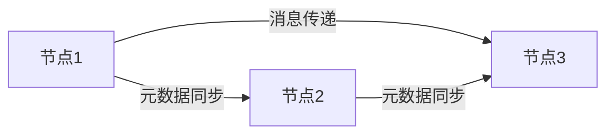
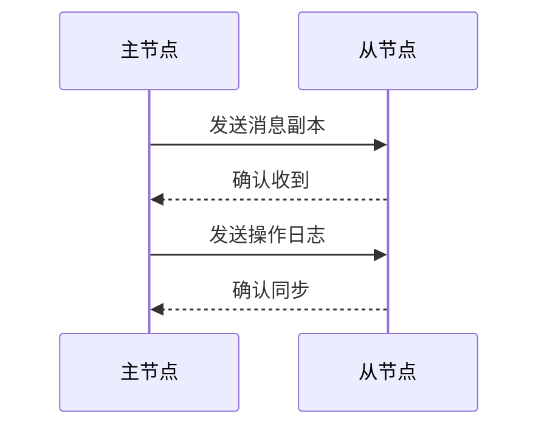
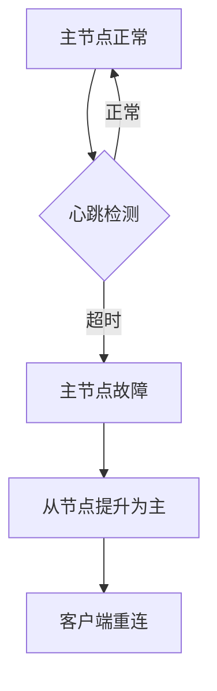

# 6. 高可用机制

***

## 1. 概述与定义

RabbitMQ的高可用机制是通过集群部署、镜像队列、负载均衡和故障转移等技术手段，确保系统在面对硬件故障、网络问题或节点宕机时，仍然能够持续提供消息传递服务，并保障消息的可靠性和系统的稳定性。

### 定义

简而言之，RabbitMQ高可用机制利用集群和镜像队列等技术，实现消息服务的容错和负载均衡，确保异常情况下系统正常运行。在面试中，你可以这样回答：“RabbitMQ的高可用机制主要通过集群部署和镜像队列实现，确保节点故障时消息不丢失，服务不中断。” 这个回答简洁有力，能快速抓住重点，同时为后续展开铺垫。

### 背景与重要性

RabbitMQ是一款高性能的消息中间件，广泛应用于分布式系统，支持多种消息模式和可靠性机制。但在生产环境中，单节点RabbitMQ存在单点故障风险，一旦宕机，消息服务将中断，影响业务连续性。因此，RabbitMQ提供集群和镜像队列等高可用方案，确保消息服务的稳定性和可靠性。掌握这一知识点不仅能让你在面试中脱颖而出，还能体现你对分布式系统设计的理解。

***

## 2. 主要特点

RabbitMQ高可用机制有以下几个显著特点，熟悉这些特点能帮助你在面试中快速定位问题并展开分析：

- **集群部署** 🌐 &#x20;

  支持多节点协同工作，通过网络连接实现负载均衡和故障转移。
- **镜像队列** 🔄 &#x20;

  队列数据在多个节点上镜像同步，主节点故障时备节点接管服务。
- **负载均衡** ⚖️ &#x20;

  通过集群和交换机分担消息处理压力，提升系统吞吐量。
- **故障转移** 🚀 &#x20;

  主节点故障时自动切换到备节点，确保服务连续性。
- **数据同步** 🔄 &#x20;

  镜像队列通过同步机制保障消息在集群中的一致性。

### 面试Tips

提到“镜像队列”时，可以结合场景说：“在电商系统中，订单消息用镜像队列，即使节点宕机，消息也不会丢失，服务无缝切换。” 对于“负载均衡”，可以补充：“集群中的交换机能将消息分发到不同节点，提升并发能力。” 这些描述能展现你的实战经验和深度理解。

***

## 3. 应用目标

RabbitMQ高可用机制旨在确保消息服务的持续可用性和数据可靠性，其具体目标包括：

- **提升系统可靠性** &#x20;

  通过集群和镜像队列避免单点故障，确保服务不中断。
- **保障消息不丢失** &#x20;

  镜像队列在多节点同步消息，节点故障时消息仍可访问。
- **实现负载均衡** &#x20;

  集群节点分担消息处理负载，提升性能和吞吐量。
- **简化运维管理** &#x20;

  自动故障转移和数据同步降低运维难度。
- **支持高并发场景** &#x20;

  集群架构适应高并发消息处理需求，保障稳定性。

在面试中，你可以总结：“RabbitMQ高可用机制的目标是通过集群和镜像队列，提升消息服务的可靠性和性能，确保故障时消息不丢、服务不断。” 这个回答简洁清晰，能快速传递核心信息。虽然“简化运维管理”不是首要目标，但在实际应用中能减少运维负担，适当提及能体现全面思考。

***

## 4. 主要内容及其组成部分

RabbitMQ高可用机制主要由**集群部署**和**镜像队列**组成，辅以负载均衡和故障转移等技术。以下详细讲解每个部分，结合代码、表格和图表，确保内容全面且直观。

### 4.1 集群部署

RabbitMQ支持多节点集群部署，节点通过网络连接协同工作，具有以下特点：

- **节点类型**：分为**内存节点**（性能高）和**磁盘节点**（数据持久化）。
- **元数据共享**：集群节点共享交换机、队列和绑定关系等元数据。
- **消息分发**：消息存储在队列所在节点，消费者从该节点获取。

#### 示例：集群配置

```bash 
# 节点1启动RabbitMQ
rabbitmq-server -detached
# 节点2加入集群
rabbitmqctl stop_app
rabbitmqctl join_cluster rabbit@node1
rabbitmqctl start_app
```


**代码说明**：此命令在节点2加入节点1的集群，构建RabbitMQ集群。面试时可以说：“集群部署很简单，用`join_cluster`命令就能快速搭建。”

### 4.2 镜像队列

镜像队列是高可用的核心，通过在多节点镜像队列数据，确保可靠性和容错性。

- **主从架构**：一个主节点（Master）处理读写，多个从节点（Slave）同步数据。
- **故障转移**：主节点故障时，从节点自动提升为主节点。
- **数据同步**：消息在主从节点间同步，保障一致性。

#### 示例：镜像队列配置

```bash 
rabbitmqctl set_policy ha-all "^queue." '{"ha-mode":"all","ha-sync-mode":"automatic"}'
```


**配置说明**：此命令设置`ha-all`策略，将以`queue.`开头的队列镜像到所有节点，自动同步数据。面试时可以说：“镜像队列通过策略配置实现，操作简单。”

### 4.3 负载均衡

RabbitMQ通过以下方式实现负载均衡：

- **生产者负载均衡**：通过负载均衡器（如HAProxy）均衡发送消息。
- **消费者负载均衡**：多个消费者从队列获取消息，实现消费端均衡。
- **交换机负载均衡**：交换机将消息分发到不同节点队列。

#### 示例：HAProxy配置

```.properties 
frontend rabbitmq
    bind *:5672
    default_backend rabbitmq_nodes

backend rabbitmq_nodes
    balance roundrobin
    server node1 192.168.1.101:5672 check
    server node2 192.168.1.102:5672 check
```


**配置说明**：此配置用HAProxy将生产者连接均衡到集群节点。面试时可以说：“HAProxy是常用负载均衡工具，配置简单高效。”

### 4.4 故障转移

RabbitMQ集群支持自动故障转移：

- **节点故障**：检测到节点宕机后，集群剔除故障节点。
- **队列故障转移**：镜像队列主节点故障时，从节点接管。
- **客户端重连**：客户端（如Spring AMQP）自动重连到可用节点。

#### 示例：Spring AMQP重连配置

```java 
@Bean
public CachingConnectionFactory connectionFactory() {
    CachingConnectionFactory factory = new CachingConnectionFactory();
    factory.setAddresses("node1:5672,node2:5672");
    factory.setUsername("guest");
    factory.setPassword("guest");
    factory.setPublisherConfirms(true);
    return factory;
}
```


**代码说明**：此配置指定多个节点地址，客户端断连后自动重连。面试时可以说：“Spring AMQP支持故障转移，设置addresses就能实现。”

### 4.5 队列类型

RabbitMQ支持多种队列类型，影响高可用性：

- **普通队列**：仅存于单节点，节点故障时不可用。
- **镜像队列**：多节点镜像，故障时自动切换。
- **Quorum队列**：RabbitMQ 3.8+引入，基于Raft协议，提供强一致性。

**补充说明**：Quorum队列是新特性，适用于一致性要求高的场景。面试中可以说：“Quorum队列比镜像队列更可靠，适合金融场景。”

### 组件对比表格

| 组件       | 功能            | 优点       | 缺点           |
| -------- | ------------- | -------- | ------------ |
| 集群部署     | 多节点协同工作       | 负载均衡、容错  | 配置稍复杂        |
| 镜像队列     | 队列数据镜像同步      | 高可用、数据冗余 | 性能开销较大       |
| Quorum队列 | 基于Raft的强一致性队列 | 强一致性、高可用 | 仅3.8+支持，复杂性高 |

**表格说明**：此表格对比了高可用机制的组成部分。集群部署实现负载均衡，镜像队列提供冗余，Quorum队列强调一致性。面试时可用此表格回答优缺点问题。

***

## 5. 原理剖析

RabbitMQ高可用机制涉及集群通信、数据同步、故障检测等核心技术。以下深入解析其原理，结合Mermaid图表说明。

### 5.1 集群通信原理

RabbitMQ集群通过Erlang的分布式通信机制（Erlang OTP）实现节点间通信和元数据共享。

- **节点发现**：通过配置文件或DNS发现其他节点。
- **元数据同步**：交换机、队列和绑定关系等元数据在集群共享。
- **消息存储**：消息存储在队列所在节点，消费者从该节点获取。

#### Mermaid图表：集群通信




**图表说明**：此图展示节点间元数据同步和消息传递，面试时可用来说明集群原理。

### 5.2 镜像队列原理

镜像队列通过主从复制实现数据同步：

- **主节点**：处理消息读写。
- **从节点**：同步主节点数据，故障时提升为主节点。
- **同步机制**：主节点发送消息和操作日志到从节点，从节点回放日志保持一致。

#### 示例：镜像队列同步




**图表说明**：此图展示镜像队列同步流程，面试时可用来说明其可靠性。

### 5.3 故障检测与恢复

RabbitMQ通过心跳机制检测故障：

- **心跳检测**：节点间定期发送心跳，超时未收到则判定故障。
- **故障恢复**：剔除故障节点，镜像队列从节点提升为主节点。
- **客户端重连**：客户端检测断连后重连到可用节点。

#### 示例：故障转移流程




**图表说明**：此图展示故障检测和恢复流程，面试时可用来说明容错能力。

### 5.4 Quorum队列原理

Quorum队列基于Raft共识算法实现强一致性：

- **领导者选举**：集群选举领导者处理写操作。
- **日志复制**：领导者将日志复制到多数节点。
- **提交确认**：多数节点确认后操作提交。

**补充说明**：Quorum队列可靠性更高，但性能开销大，面试时可以说：“Quorum队列适合一致性要求高的场景，如金融系统。”

### 5.5 网络分区处理

RabbitMQ在网络分区时暂停少数派节点，确保数据一致性，网络恢复后节点自动重加入。

**注意事项**：网络分区是分布式系统常见问题，RabbitMQ通过暂停少数派避免脑裂，面试时可补充：“网络分区时暂停少数派，确保数据不冲突。”

***

## 6. 应用与拓展

RabbitMQ高可用机制在实际项目中应用广泛，以下是典型场景：

- **金融系统** &#x20;

  交易消息需高可靠性，镜像队列或Quorum队列确保不丢失。
- **电商系统** &#x20;

  订单、支付消息通过集群和负载均衡应对高并发。
- **日志系统** &#x20;

  日志收集用集群实现高吞吐量和容错。
- **微服务架构** &#x20;

  服务间通信用RabbitMQ集群，确保解耦和高可用。

### 拓展

高可用机制可与其他技术结合：

- **Kubernetes**：在K8s部署RabbitMQ集群，实现自动伸缩。
- **Prometheus**：监控集群状态，及时发现故障。
- **Spring Cloud**：集成RabbitMQ实现微服务通信。

#### 示例：K8s部署RabbitMQ

```yaml 
apiVersion: apps/v1
kind: StatefulSet
metadata:
  name: rabbitmq
spec:
  serviceName: "rabbitmq"
  replicas: 3
  template:
    spec:
      containers:
      - name: rabbitmq
        image: rabbitmq:3.8-management
        ports:
        - containerPort: 5672
```


**代码说明**：此YAML在K8s部署3节点RabbitMQ集群，StatefulSet确保节点有序启动。

***

## 7. 面试问答

以下是五个常见问题及详细回答，模仿面试者口吻，确保自然且有深度。

### 问题 1：RabbitMQ的高可用机制是什么？

**回答**： &#x20;

“RabbitMQ的高可用机制主要是通过集群部署和镜像队列实现的。集群部署让多个节点协同工作，支持负载均衡和故障转移；镜像队列在多节点同步队列数据，即使某个节点宕机，消息也不会丢，服务自动切换。我在项目里用过镜像队列，订单消息特别重要，镜像到3个节点，稳定性很不错。”

### 问题 2：镜像队列和普通队列有什么区别？

**回答**： &#x20;

“普通队列只存在单个节点，节点故障时就不可用；镜像队列在多个节点上镜像，故障时从节点自动接管。镜像队列通过主从复制同步数据，确保高可用。我在金融项目里用镜像队列，交易消息不能丢，镜像队列保证了可靠性。”

### 问题 3：RabbitMQ集群如何实现负载均衡？

**回答**： &#x20;

“RabbitMQ集群的负载均衡在生产者和消费者两端实现。生产者可以用HAProxy连接集群，均衡发送消息；消费者端多个消费者从队列取消息，自动负载均衡。交换机也能把消息分发到不同节点队列。我在项目里用HAProxy做生产者负载，效果挺好。”

### 问题 4：Quorum队列和镜像队列有什么区别？

**回答**： &#x20;

“Quorum队列是RabbitMQ 3.8+的新特性，用Raft协议实现强一致性，适合一致性要求高的场景；镜像队列是主从复制，最终一致性。Quorum队列写操作需要多数节点确认，性能稍低但可靠性更高。我在支付系统里用Quorum队列，确保交易数据一致。”

### 问题 5：如何处理RabbitMQ集群中的网络分区？

**回答**： &#x20;

“RabbitMQ在网络分区时会暂停少数派节点，确保数据一致性，避免脑裂。网络恢复后，节点自动重加入集群。我在项目里遇到网络抖动，RabbitMQ自动暂停了部分节点，数据没问题，挺智能的。”

***

## 总结

本文从RabbitMQ高可用机制的定义到原理、应用场景及面试应对，覆盖所有核心知识点。通过代码、表格和Mermaid图表，内容直观易懂，背熟后能在面试中自信回答问题，展现你的专业实力！✨
