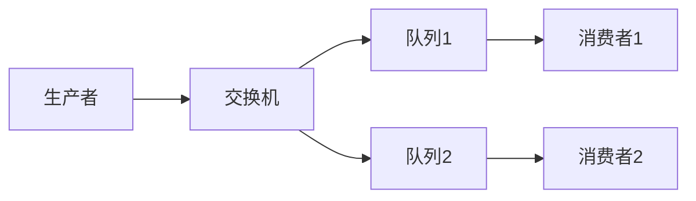
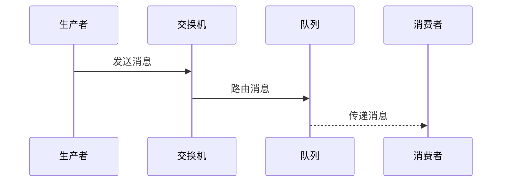

# 一. RabbitMQ

***

## 1. 概述与定义

RabbitMQ是一个开源的消息中间件，实现了AMQP协议，支持多种编程语言和平台，广泛应用于微服务架构、异步通信、任务队列等场景。它通过消息队列解耦生产者和消费者，确保消息的可靠传递和处理。RabbitMQ的核心在于交换机（Exchange）和队列（Queue），通过路由键（Routing Key）将消息从生产者路由到消费者。

### 定义

简单来说，RabbitMQ是一个基于AMQP协议的消息中间件，用于在分布式系统中传递消息，实现异步通信和系统解耦。在面试中，你可以这样回答：“RabbitMQ是一个高性能的消息中间件，支持多种消息模式，如发布/订阅、路由等，通过交换机和队列管理消息，确保消息的可靠传递。” 这个定义简洁明了，突出核心功能，能快速抓住面试官的注意力。

### 背景与定位

RabbitMQ起源于金融行业，后被VMware收购并开源，凭借其高可靠性、灵活性和易用性，成为消息中间件领域的佼佼者。它支持多种交换机类型（如Direct、Topic、Fanout、Headers），适应不同业务场景。与其他消息中间件如Kafka相比，RabbitMQ更注重消息的可靠传递和灵活路由，而Kafka更侧重于高吞吐量和数据流处理。了解这些背景有助于你在面试中展现对技术的全面认知。

***

## 2. 主要特点

RabbitMQ的核心价值体现在其特性上，以下是其主要特点，面试时可以逐一展开并结合场景说明：

- **高可靠性** 🔒 &#x20;

  支持消息持久化、发送方确认、消费者确认，确保消息不丢失。
- **灵活路由** 🌐 &#x20;

  通过交换机和路由键实现灵活的消息路由，支持多种交换机类型。
- **集群支持** 🚀 &#x20;

  支持集群部署，实现高可用性和负载均衡。
- **多种消息模式** 🛠️ &#x20;

  支持发布/订阅、路由、RPC等多种消息模式，适应不同业务需求。
- **易用性** ✨ &#x20;

  提供管理界面和API，方便监控和运维。
- **跨平台** 📦 &#x20;

  支持多种编程语言和平台，易于集成。

### 面试Tips

提到“高可靠性”时，可以举例：“在电商系统中，订单消息必须可靠传递，RabbitMQ通过持久化队列和确认机制，确保消息不丢失。” 这样的场景化描述能体现实战经验。对于“灵活路由”，可以补充：“比如在日志系统中，可以用Topic交换机根据日志级别路由到不同队列。” 展现你对技术的深入理解。其他特性如集群支持和跨平台虽不常深入追问，但提及它们能体现你的知识广度。

***

## 3. 应用目标

RabbitMQ的设计目标是提供一个高性能、可靠的消息传递平台，其主要应用目标包括：

- **解耦系统** &#x20;

  通过消息队列解耦生产者和消费者，降低系统耦合度。
- **异步通信** &#x20;

  实现异步处理，提升系统响应速度和吞吐量。
- **负载均衡** &#x20;

  通过多个消费者分担消息处理，实现负载均衡。
- **消息广播** &#x20;

  通过Fanout交换机实现消息广播，通知多个消费者。
- **任务调度** &#x20;

  通过队列实现任务调度和排队处理。

在面试中，可以总结为：“RabbitMQ的目标是为分布式系统提供一个高性能、可靠的消息传递平台，支持系统解耦、异步通信和负载均衡，适应多种业务场景。” 这个回答简洁全面，能快速传递核心信息。

### 补充说明

虽然“任务调度”不是RabbitMQ的首要目标，但在实际应用中，它常用于任务队列和延迟任务，值得在面试中提及，以体现你对框架的全面理解。面试官可能追问具体场景，你可以说：“比如在定时发送邮件的场景中，我用RabbitMQ队列排队处理任务。”

***

## 4. 主要内容及其组成部分

RabbitMQ是一个功能丰富的消息中间件，由多个核心组件和功能模块组成，下面详细解释其内容，并结合代码示例、表格和Mermaid图表进行说明。

### 4.1 核心组件

RabbitMQ的核心组件包括：

- **生产者（Producer）** &#x20;

  发送消息到交换机。
- **交换机（Exchange）** &#x20;

  接收消息并根据路由键将消息路由到队列。
- **队列（Queue）** &#x20;

  存储消息，等待消费者处理。
- **消费者（Consumer）** &#x20;

  从队列中获取并处理消息。

#### Mermaid图表：RabbitMQ架构




**图表说明**：此图展示了RabbitMQ的基本架构，生产者发送消息到交换机，交换机根据路由键将消息路由到队列，消费者从队列获取消息。面试时可以用这个图直观解释RabbitMQ的工作流程。

### 4.2 交换机类型

RabbitMQ支持四种交换机类型，下面逐一详解。

#### 4.2.1 Direct交换机

Direct交换机根据消息的路由键精确匹配队列的绑定键，将消息路由到匹配的队列。

#### 示例：Direct交换机

```java 
channel.exchangeDeclare("directExchange", "direct");
channel.queueDeclare("queue1", true, false, false, null);
channel.queueBind("queue1", "directExchange", "key1");
channel.basicPublish("directExchange", "key1", null, "Hello, Direct!".getBytes());
```


**代码说明**：此代码定义了一个Direct交换机，并将队列`queue1`绑定到路由键`key1`，消息将路由到该队列。面试时可以说：“Direct交换机适合点对点通信，比如订单处理。”

#### 4.2.2 Topic交换机

Topic交换机根据路由键的模式匹配（支持通配符`*`和`#`）将消息路由到队列。

#### 示例：Topic交换机

```java 
channel.exchangeDeclare("topicExchange", "topic");
channel.queueDeclare("queue2", true, false, false, null);
channel.queueBind("queue2", "topicExchange", "log.*");
channel.basicPublish("topicExchange", "log.info", null, "Info log".getBytes());
```


**代码说明**：此代码定义了一个Topic交换机，队列`queue2`绑定到`log.*`，消息路由键为`log.info`将匹配并路由到该队列。`*`表示单个词，`#`表示零个或多个词，面试中可以补充这一点。

#### 4.2.3 Fanout交换机

Fanout交换机将消息广播到所有绑定的队列，忽略路由键。

#### 示例：Fanout交换机

```java 
channel.exchangeDeclare("fanoutExchange", "fanout");
channel.queueDeclare("queue3", true, false, false, null);
channel.queueBind("queue3", "fanoutExchange", "");
channel.basicPublish("fanoutExchange", "", null, "Broadcast message".getBytes());
```


**代码说明**：此代码定义了一个Fanout交换机，消息将广播到所有绑定的队列。面试时可以说：“Fanout适合广播场景，比如通知所有服务更新配置。”

#### 4.2.4 Headers交换机

Headers交换机根据消息头（headers）匹配队列的绑定条件，适合复杂路由规则。

#### 示例：Headers交换机

```java 
channel.exchangeDeclare("headersExchange", "headers");
channel.queueDeclare("queue4", true, false, false, null);
Map<String, Object> headers = new HashMap<>();
headers.put("type", "report");
channel.queueBind("queue4", "headersExchange", "", headers);
AMQP.BasicProperties props = new AMQP.BasicProperties.Builder().headers(headers).build();
channel.basicPublish("headersExchange", "", props, "Report message".getBytes());
```


**代码说明**：此代码定义了一个Headers交换机，根据消息头`type=report`路由消息。Headers交换机使用较少，但面试中提及能体现知识全面性。

### 4.3 消息确认机制

RabbitMQ通过发送方确认和消费者确认确保消息的可靠传递。

- **发送方确认**：生产者发送消息后，等待RabbitMQ的确认。
- **消费者确认**：消费者处理消息后，发送确认给RabbitMQ。

#### 示例：发送方确认

```java 
channel.confirmSelect();
channel.basicPublish("", "queue", null, "message".getBytes());
if (channel.waitForConfirms()) {
    System.out.println("消息发送成功");
}
```


**代码说明**：此代码启用了发送方确认，`waitForConfirms`等待RabbitMQ的确认。面试时可以说：“发送方确认确保消息到达RabbitMQ。”

#### 示例：消费者确认

```java 
channel.basicConsume("queue", false, new DefaultConsumer(channel) {
    @Override
    public void handleDelivery(String consumerTag, Envelope envelope, AMQP.BasicProperties properties, byte[] body) throws IOException {
        // 处理消息
        channel.basicAck(envelope.getDeliveryTag(), false);
    }
});
```


**代码说明**：消费者在处理消息后调用`basicAck`确认消息。设置为`false`表示手动确认，面试中可以补充：“手动确认能避免消息未处理就被删除。”

### 4.4 死信队列

死信队列用于存储无法被消费的消息，如消息过期、队列满等。

#### 示例：死信队列配置

```java 
Map<String, Object> args = new HashMap<>();
args.put("x-dead-letter-exchange", "dlxExchange");
channel.queueDeclare("queue", true, false, false, args);
```


**配置说明**：此配置将`queue`的死信消息路由到`dlxExchange`。面试时可以说：“死信队列适合处理异常消息，比如超时订单。”

### 4.5 优先级队列

RabbitMQ支持优先级队列，消息可以设置优先级（0-255），高优先级消息先被消费。

#### 示例：优先级队列

```java 
Map<String, Object> args = new HashMap<>();
args.put("x-max-priority", 10);
channel.queueDeclare("priorityQueue", true, false, false, args);
channel.basicPublish("", "priorityQueue", new AMQP.BasicProperties.Builder().priority(5).build(), "message".getBytes());
```


**代码说明**：此代码定义了一个最大优先级为10的队列，消息优先级为5。面试中可以补充：“优先级队列适合紧急任务优先处理。”

### 4.6 TTL（消息存活时间）

RabbitMQ支持为消息或队列设置TTL（Time To Live），过期消息变为死信。

#### 示例：设置TTL

```java 
Map<String, Object> args = new HashMap<>();
args.put("x-message-ttl", 60000); // 60秒
channel.queueDeclare("ttlQueue", true, false, false, args);
```


**代码说明**：此代码为队列设置TTL为60秒，过期消息进入死信队列。也可以为单条消息设置TTL。

### 组件对比表格

| 组件       | 功能描述         | 优点        | 缺点         |
| -------- | ------------ | --------- | ---------- |
| RabbitMQ | 基于AMQP的消息中间件 | 可靠性高、灵活路由 | 吞吐量低于Kafka |
| Kafka    | 高吞吐量消息中间件    | 高性能、数据流处理 | 可靠性稍弱      |
| ActiveMQ | 老牌消息中间件      | 成熟稳定      | 性能和功能有限    |

**表格说明**：此表格对比了主流消息中间件的特性，RabbitMQ可靠性高、路由灵活，Kafka吞吐量高，ActiveMQ成熟但功能有限。面试时可用此表格回答“RabbitMQ与其他消息中间件的区别”。

***

## 5. 原理剖析

RabbitMQ的实现原理涉及消息传递、持久化、确认机制等，下面深入解析其核心机制。

### 5.1 消息传递原理

RabbitMQ的消息传递基于AMQP协议，生产者发送消息到交换机，交换机根据路由键将消息路由到队列，消费者从队列获取消息。

#### Mermaid图表：消息传递流程




**图表说明**：此图展示了RabbitMQ的消息传递流程，面试时可以用它解释RabbitMQ的工作原理。

### 5.2 持久化机制

RabbitMQ支持消息和队列的持久化，确保在服务器重启后消息不丢失。

- **队列持久化**：创建队列时设置`durable=true`。
- **消息持久化**：发送消息时设置`deliveryMode=2`。

#### 示例：持久化配置

```java 
channel.queueDeclare("durableQueue", true, false, false, null);
channel.basicPublish("", "durableQueue", MessageProperties.PERSISTENT_TEXT_PLAIN, "persistent message".getBytes());
```


**代码说明**：此代码定义了一个持久化队列并发送持久化消息。面试时可以说：“持久化确保RabbitMQ宕机后消息不丢。”

### 5.3 确认机制

RabbitMQ通过发送方确认和消费者确认确保消息的可靠传递。

- **发送方确认**：生产者等待RabbitMQ的确认，确认消息已接收。
- **消费者确认**：消费者处理消息后发送确认，RabbitMQ删除消息。

#### 补充说明

确认机制是RabbitMQ可靠性的基石，面试官可能追问细节，比如：“如果确认失败怎么办？” 你可以回答：“发送方确认失败可以重试，消费者确认失败可以用死信队列处理。”

### 5.4 死信队列原理

死信队列用于处理无法消费的消息，消息成为死信的条件包括：

- 消息被拒绝（`basic.reject`或`basic.nack`）且不再重新投递。
- 消息过期（TTL）。
- 队列达到最大长度。

死信消息被路由到死信交换机，再路由到死信队列。

### 5.5 优先级队列原理

RabbitMQ的优先级队列根据消息的优先级（0-255）排序，高优先级消息先被消费。优先级队列需预先设置最大优先级。

#### 注意事项

优先级队列在高负载时可能导致低优先级消息饥饿，面试时可以补充：“需要合理设置优先级范围，避免低优先级消息长期未处理。”

### 5.6 队列镜像与高可用

RabbitMQ支持队列镜像（Mirrored Queue），在集群中同步队列数据，实现高可用。镜像队列通过主从同步确保即使某个节点宕机，消息仍可访问。

#### 配置说明

镜像队列通过策略（Policy）配置，如`ha-mode=all`表示所有节点同步。面试中可以提及：“镜像队列提升了RabbitMQ的高可用性。”

***

## 6. 应用与拓展

RabbitMQ在实际项目中应用广泛，以下是一些典型场景：

- **异步处理** &#x20;

  如订单处理、邮件发送等，通过消息队列实现异步，提升系统响应速度。
- **负载均衡** &#x20;

  通过多个消费者分担消息处理，实现负载均衡。
- **消息广播** &#x20;

  如配置更新、通知等，通过Fanout交换机广播消息。
- **任务队列** &#x20;

  如后台任务、定时任务，通过队列排队处理。
- **RPC** &#x20;

  通过RabbitMQ实现远程过程调用，支持请求-响应模式。

### 拓展

RabbitMQ可与其他技术结合：

- **Spring Boot**：通过`spring-boot-starter-amqp`集成RabbitMQ。
- **Docker**：容器化部署RabbitMQ，实现高可用。
- **Kubernetes**：在K8s中部署RabbitMQ集群。

#### 示例：Spring Boot集成

```java 
@RabbitListener(queues = "queue")
public void processMessage(String message) {
    System.out.println("Received: " + message);
}
```


**代码说明**：此代码使用Spring AMQP监听队列，简化RabbitMQ开发。

***

## 7. 面试问答

以下是五个常见面试问题及详细回答，模仿面试者口吻，确保自然且详实。

### 问题 1：RabbitMQ是什么？

**回答**： &#x20;

“RabbitMQ是一个基于AMQP协议的消息中间件，用于在分布式系统中传递消息，实现异步通信和系统解耦。它通过交换机和队列管理消息，支持多种消息模式，比如发布/订阅、路由等。我在项目里用RabbitMQ处理订单消息，确保消息可靠传递。比如电商系统下单后，订单消息通过RabbitMQ异步处理，提升用户体验。”

### 问题 2：RabbitMQ的交换机有哪些类型？

**回答**： &#x20;

“RabbitMQ有四种交换机类型：Direct、Topic、Fanout和Headers。Direct交换机根据路由键精确匹配，适合点对点通信；Topic支持通配符匹配，比如`log.*`，适合日志系统；Fanout广播消息到所有队列，适合通知场景；Headers根据消息头匹配，适合复杂路由。我在项目里常用Direct和Topic，Direct用来发订单消息，Topic用来分发日志。”

### 问题 3：RabbitMQ如何保证消息不丢失？

**回答**： &#x20;

“RabbitMQ通过持久化、发送方确认和消费者确认保证消息不丢失。队列设为持久化（`durable=true`），消息设为持久化（`deliveryMode=2`），服务器重启后消息还在；发送方确认让生产者知道消息送达RabbitMQ，消费者确认确保消息被处理后才删除。我在项目里配置了持久化队列和手动确认，订单消息从发送到消费都很可靠。”

### 问题 4：什么是死信队列？

**回答**： &#x20;

“死信队列是用来存放无法被消费的消息的队列，比如消息过期、队列满或者被拒绝且不重投。消息成为死信后，会路由到死信交换机，再到死信队列。我在项目里用死信队列处理超时订单，比如订单60秒未支付就自动取消，超时消息进入死信队列后触发取消逻辑，很实用。”

### 问题 5：RabbitMQ和Kafka有什么区别？

**回答**： &#x20;

“RabbitMQ和Kafka都是消息中间件，但侧重点不同。RabbitMQ基于AMQP，注重消息的可靠传递和灵活路由，适合业务消息，比如订单处理；Kafka注重高吞吐量和数据流处理，适合日志收集、流式数据。我在项目里用RabbitMQ处理业务消息，确保不丢消息，用Kafka收集日志，因为吞吐量要求高。”

***

## 总结

这篇八股文从RabbitMQ的定义到原理、应用场景，再到面试问答，覆盖了所有核心知识点。通过代码示例、表格和Mermaid图表，内容直观易懂，背熟后能在面试中自信应对各种问题，展现你的专业能力！✨

[1. 消息不丢失](<1. 消息不丢失/1. 消息不丢失.md> "1. 消息不丢失")

[2. 消息重复消费](<2. 消息重复消费/2. 消息重复消费.md> "2. 消息重复消费")

[3. 消息堆积](<3. 消息堆积/3. 消息堆积.md> "3. 消息堆积")

[4. 延迟队列](<4. 延迟队列/4. 延迟队列.md> "4. 延迟队列")

[5. 死信队列](<5. 死信队列/5. 死信队列.md> "5. 死信队列")

[6. 高可用机制](<6. 高可用机制/6. 高可用机制.md> "6. 高可用机制")
