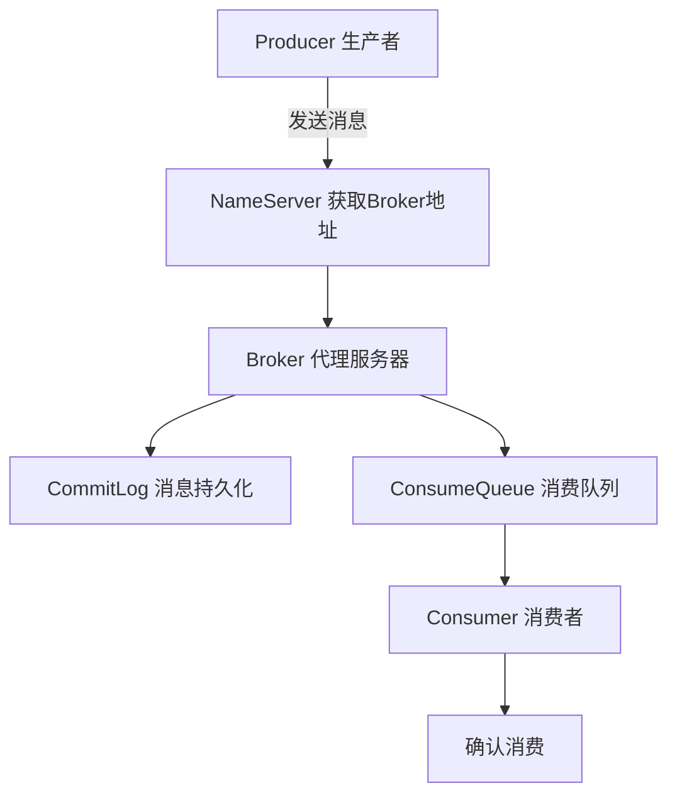

# 二. RocketMQ

# 1. 概述与定义

RocketMQ作为目前分布式消息中间件中的佼佼者，是阿里巴巴开源的一款高性能、高可靠性、高扩展性的消息队列系统。它基于发布/订阅（Pub/Sub）模式，为分布式系统提供异步通信和解耦服务的能力，能够有效地解决高并发、大流量数据传输问题。 &#x20;

在Java面试中，面试官往往会关注以下几个方面： &#x20;

- 消息中间件的基本概念与定位 &#x20;
- RocketMQ的体系结构与组件分布 &#x20;
- 如何通过RocketMQ实现服务解耦和异步处理 &#x20;
- 消息顺序、消息可靠性及事务消息的实现原理 &#x20;

RocketMQ不仅适用于电商、金融等高并发场景，同时也为微服务架构中的异步通信、日志收集、流量削峰等提供了强有力的支撑。它的底层设计考虑了海量消息的高效传递以及消息一致性问题，是现代分布式系统中不可或缺的重要组件。📨

# 2. 主要特点

RocketMQ具有以下主要特点，正是这些特点使其在分布式消息传递场景中独树一帜：

- **高性能与低延迟** ⚡ &#x20;

  RocketMQ采用零拷贝技术和高效的存储机制，能够保证消息传输的高吞吐量和低延迟，适合海量数据场景。
- **高可靠性** 🔒 &#x20;

  通过分布式存储与备份机制，RocketMQ支持消息持久化，并采用多副本同步、重试机制，确保消息不丢失。
- **良好的扩展性** 📈 &#x20;

  系统支持水平扩展，通过增加Broker节点和NameServer实例可以轻松应对业务增长，具备灵活的伸缩能力。
- **丰富的消息特性** &#x20;

  支持定时消息、延迟消息、事务消息、顺序消息等多种消息模型，能够满足不同业务场景的需求。
- **开放的生态与标准接口** &#x20;

  RocketMQ不仅支持Java API，同时也提供多种语言的客户端支持，并与Spring Boot、Dubbo等框架无缝集成。
- **分布式事务支持** &#x20;

  具备事务消息功能，能够实现分布式事务管理，在金融、订单处理等关键业务中得到应用。

# 3. 应用目标

RocketMQ的设计目标主要在于解决分布式系统中异步通信、解耦以及流量削峰等问题，具体应用目标包括：

- **服务解耦** &#x20;

  通过引入消息中间件，将生产者与消费者进行解耦，使各个业务模块可以独立升级和维护，降低系统耦合度。
- **异步处理** &#x20;

  将需要耗时的业务逻辑（如发送邮件、日志处理等）异步化处理，提高系统响应速度，优化用户体验。
- **流量削峰** &#x20;

  在高并发场景下，通过消息缓冲和排队机制对突发流量进行削峰填谷，防止系统瞬时过载。
- **日志采集与监控** &#x20;

  用于分布式日志收集、监控数据传输等场景，提升系统稳定性和故障排查效率。
- **分布式事务与一致性** &#x20;

  通过事务消息机制，实现分布式系统中数据的一致性和完整性，尤其适用于跨服务、跨数据库的业务场景。

为直观展示异步与同步处理的差异，下面给出一个简单的对比表格：

| 模式 | 特点        | 应用场景          |
| -- | --------- | ------------- |
| 同步 | 请求-响应模式   | 实时性要求高的业务     |
| 异步 | 消息队列解耦、缓冲 | 高并发、流量削峰、日志采集 |

# 4. 主要内容及其组成部分

RocketMQ作为消息中间件，其内部组件与模块划分明确。下面对各个组成部分进行详细说明，并辅以示例和表格说明。

## 4.1 核心组件

1. **Producer（生产者）** &#x20;

   负责向Broker发送消息。生产者在发送消息时可以选择同步、异步或单向发送方式，从而适应不同业务场景的性能需求。 &#x20;

   示例代码如下：
   ```java 
   DefaultMQProducer producer = new DefaultMQProducer("ProducerGroup");
   producer.setNamesrvAddr("127.0.0.1:9876");
   producer.start();
   Message msg = new Message("TopicTest", "TagA", "OrderID001", "Hello RocketMQ".getBytes(RemotingHelper.DEFAULT_CHARSET));
   SendResult sendResult = producer.send(msg);
   System.out.printf("发送结果：%s%n", sendResult);
   producer.shutdown();
   ```

2. **Consumer（消费者）** &#x20;

   负责从Broker拉取或接收消息，并进行业务逻辑处理。消费者可以采用集群消费或广播消费模式。 &#x20;

   示例代码如下：
   ```java 
   DefaultMQPushConsumer consumer = new DefaultMQPushConsumer("ConsumerGroup");
   consumer.setNamesrvAddr("127.0.0.1:9876");
   consumer.subscribe("TopicTest", "*");
   consumer.registerMessageListener(new MessageListenerConcurrently() {
       @Override
       public ConsumeConcurrentlyStatus consumeMessage(List<MessageExt> msgs, ConsumeConcurrentlyContext context) {
           for (MessageExt msg : msgs) {
               System.out.printf("接收消息：%s%n", new String(msg.getBody(), StandardCharsets.UTF_8));
           }
           return ConsumeConcurrentlyStatus.CONSUME_SUCCESS;
       }
   });
   consumer.start();
   System.out.printf("消费者启动%n");
   ```

3. **Broker（代理服务器）** &#x20;

   Broker作为消息存储和转发的核心节点，负责接收生产者发送的消息、存储消息、转发消息给消费者以及处理消息的持久化操作。 &#x20;

   Broker内部维护消息队列，并采用CommitLog机制确保高效存储和快速恢复。
4. **NameServer（名称服务）** &#x20;

   NameServer类似于DNS服务器，负责提供Broker的地址信息，实现生产者与消费者的自动发现与负载均衡。通常集群部署多个NameServer以保证高可用性。
5. **Message（消息）** &#x20;

   消息是RocketMQ传递数据的最小单元，包含消息体、标签、键等元数据。消息可以被分为普通消息、定时/延迟消息、事务消息等不同类型。
6. **Topic与Queue** &#x20;

   Topic代表消息主题，是消息分类的基本单位；而Queue是Topic下的消息队列，一个Topic可以包含多个Queue，便于实现并行消费和负载均衡。

下面的表格对上述各组件进行了总结说明：

| 组件          | 作用      | 详细说明                                   |
| ----------- | ------- | -------------------------------------- |
| Producer    | 发送消息    | 负责将业务数据打包成消息发送至Broker                  |
| Consumer    | 消费消息    | 从Broker拉取或接收消息并执行相应业务逻辑                |
| Broker      | 消息存储与转发 | 负责消息的接收、存储、转发和持久化，保证消息的可靠性             |
| NameServer  | 服务注册与发现 | 提供Broker地址信息，便于Producer和Consumer实现自动发现 |
| Message     | 消息数据载体  | 包含消息体、标签、键等元数据，可支持多种消息类型               |
| Topic/Queue | 消息分类与分区 | Topic用于划分消息类型，Queue用于实现并行消费和流量分发       |

## 4.2 附加模块

除了上述核心组件，RocketMQ还提供了一些附加模块以支持更高级的功能：

- **事务消息** &#x20;

  支持分布式事务，确保在业务操作和消息发送之间的一致性。通过半消息机制和事务回查，实现可靠的事务提交或回滚。
- **延迟/定时消息** &#x20;

  允许设置消息的延迟发送或定时触发，适用于定时任务、消息重试等场景。
- **消息过滤与标签机制** &#x20;

  通过设置消息标签或SQL92表达式过滤，消费者可以根据需要选择性地消费消息，提高业务处理效率。
- **监控与管理** &#x20;

  提供了控制台、监控指标和日志系统，帮助运维人员实时掌握系统运行状态，快速定位问题。

# 5. 原理剖析

在深入探讨RocketMQ的原理时，我们需要关注其消息存储、传递、可靠性保障以及高可用机制。以下从几个关键点进行解析：

## 5.1 消息存储原理

RocketMQ采用了高效的存储结构——CommitLog。CommitLog是一个顺序写入的文件，所有消息在进入Broker时都会首先写入CommitLog，从而实现快速持久化。Broker会将CommitLog中的消息按照主题和队列进行索引，建立消费队列（ConsumeQueue）来辅助消费者快速定位消息。 &#x20;

这种设计有以下优点： &#x20;

- 顺序写入降低了磁盘IO的压力 &#x20;
- 能够高效地实现消息恢复与重试机制 &#x20;
- 通过索引机制实现随机读取，保证消费者的高效消费

## 5.2 消息传递流程

消息传递流程可以分为以下几个步骤：

1. **生产者发送消息** &#x20;

   生产者构造消息后，通过NameServer获取Broker地址，然后将消息发送至Broker。 &#x20;
2. **Broker接收并存储消息** &#x20;

   Broker将消息写入CommitLog，同时更新ConsumeQueue索引信息。 &#x20;
3. **消费者拉取消息** &#x20;

   消费者从Broker指定的Queue中拉取消息，并进行消费处理。 &#x20;
4. **消息确认与重试** &#x20;

   消费者消费成功后，向Broker发送确认消息；若消费失败，Broker会重试投递，确保消息最终被成功处理。 &#x20;

下面借助Mermaid图示展示整个消息传递流程：




上述图示说明了RocketMQ从消息生成、持久化存储到消息消费的整个流程，其中Broker承担了核心的中转与存储任务，确保了数据的可靠性和高效传递。

## 5.3 消息可靠性保障

RocketMQ通过以下机制确保消息传递的可靠性：

- **多副本同步**：Broker之间可以采用同步或异步复制策略，保证消息在集群中的多份存储，即使部分节点失效也不会导致消息丢失。
- **重试机制**：消费者在消费失败后会通知Broker进行重试投递，直至消息被成功消费。
- **事务消息**：通过事务消息机制，确保业务操作与消息发送在分布式系统中保持一致性，避免数据不一致问题。

## 5.4 高可用与扩展性

RocketMQ的高可用性依靠分布式架构设计实现：

- **NameServer集群**：支持多个NameServer实例，避免单点故障。
- **Broker集群**：Broker可以分为Master和Slave，主从备份机制保障消息可靠传递。
- **水平扩展**：新增Broker节点和Consumer组即可实现系统扩容，满足高并发需求。

# 6. 应用与拓展

RocketMQ在实际项目中具有广泛的应用场景，以下是几个典型应用案例及扩展方向：

## 6.1 典型应用场景

1. **订单处理与支付系统** &#x20;

   在电商平台中，订单创建、支付等环节可以通过RocketMQ实现异步处理，降低系统耦合，提高响应速度。 &#x20;

   示例：订单生成后，生产者发送一条消息通知库存系统、支付系统与物流系统进行后续处理。
2. **日志收集与监控** &#x20;

   系统日志、用户行为数据等通过消息队列传输到大数据平台，实现实时监控与日志分析，从而辅助决策和故障排查。
3. **异步任务调度** &#x20;

   通过延迟消息或定时消息功能，实现定时任务调度、消息重试机制等，适用于任务分发和调度系统。
4. **分布式事务管理** &#x20;

   在跨服务、跨数据库场景下，利用事务消息确保各个子系统之间的数据一致性，保证业务流程的完整性。

## 6.2 与Spring Boot等框架的集成

RocketMQ提供了与Spring Boot、Spring Cloud等流行框架的良好集成支持，开发者可以利用Spring Boot Starter快速搭建消息中间件环境。例如，下面展示一个基于Spring Boot集成RocketMQ的示例代码：

```java 
@SpringBootApplication
@EnableRocketMQ
public class RocketMQApplication {
    public static void main(String[] args) {
        SpringApplication.run(RocketMQApplication.class, args);
    }
}

@Service
public class OrderService {
    @RocketMQTransactionListener
    public class TransactionListenerImpl implements RocketMQLocalTransactionListener {
        @Override
        public RocketMQLocalTransactionState executeLocalTransaction(Message msg, Object arg) {
            // 执行本地事务逻辑
            // 返回状态：COMMIT、ROLLBACK或UNKNOWN
            return RocketMQLocalTransactionState.COMMIT;
        }
        @Override
        public RocketMQLocalTransactionState checkLocalTransaction(Message msg) {
            // 检查本地事务状态
            return RocketMQLocalTransactionState.COMMIT;
        }
    }
}
```


上述代码展示了如何利用Spring Boot快速集成RocketMQ并实现分布式事务处理，开发者可以根据业务需要进行扩展。

## 6.3 扩展性与生态

RocketMQ开放的生态使其能够与大数据、流处理、微服务等多个领域融合：

- 与Apache Flink、Spark Streaming等流处理框架联动，实现实时数据处理。
- 与Kafka、ActiveMQ等其他消息队列进行对比与互补，在不同场景下选择最佳方案。
- 通过扩展插件机制，实现自定义消息过滤、安全认证和监控扩展，满足企业级应用需求。

此外，RocketMQ官方社区不断更新新功能，如支持基于Cloud Native架构的部署，进一步提升了系统的容错性与易用性。

# 7. 面试问答

下面从面试者角度出发，针对RocketMQ可能被问及的知识点，整理了五个常见面试问题及详细回答。

## 问题1：请介绍RocketMQ的基本架构及其核心组件？

答： &#x20;

RocketMQ的基本架构主要包括Producer、Consumer、Broker和NameServer四个核心组件。生产者负责消息的发送，消费者负责消息的消费，Broker作为中间件承担消息存储、转发和持久化的任务，而NameServer则提供地址解析和服务注册功能。Broker内部采用CommitLog与ConsumeQueue相结合的存储机制，实现了高效顺序写入和快速消息检索。整个架构设计具有高性能、高可靠性以及良好的扩展性，能够满足分布式系统中大流量数据传输的需求。 &#x20;

## 问题2：RocketMQ如何保证消息的可靠性和幂等性？

答： &#x20;

在消息可靠性方面，RocketMQ采用了多重机制来保证数据不丢失： &#x20;

1. 消息持久化：所有消息写入Broker时，首先写入CommitLog，采用顺序写入技术确保磁盘IO效率。 &#x20;
2. 多副本备份：Broker集群中采用主从结构，多副本同步机制保障在单个Broker故障时消息依然安全。 &#x20;
3. 消息重试机制：消费者消费失败时，Broker会重试投递，直至消息被成功处理。 &#x20;
4. 事务消息：通过分布式事务机制，实现业务操作与消息发送的原子性。 &#x20;

幂等性通过在业务层面设计唯一标识和防重复处理机制来实现，从而避免因重试机制导致的重复消费问题。

## 问题3：如何实现消息的顺序消费？RocketMQ在顺序消息处理上有哪些策略？

答： &#x20;

顺序消息是指消息按照发送顺序被消费者按序消费。RocketMQ实现顺序消费主要依赖于以下策略： &#x20;

1. 分区策略：在发送消息时，将消息根据某种规则（如订单ID哈希）分配到同一Queue中，保证同一分区内的消息顺序。 &#x20;
2. 单线程消费：消费者在处理同一Queue的消息时采用单线程消费策略，确保消息顺序。 &#x20;
3. 消息锁机制：Broker端和消费者端会采用消息锁定技术，防止并发消费导致顺序错乱。 &#x20;

在面试中，我会强调分区策略与单线程消费的配合是确保消息顺序性的关键，并补充说明在高并发场景下需谨慎考虑顺序消息带来的吞吐量限制。

## 问题4：如何使用RocketMQ实现分布式事务？请说明其原理和实现步骤。

答： &#x20;

RocketMQ的分布式事务主要通过事务消息来实现。其原理可分为三个阶段： &#x20;

1. 发送半消息：生产者发送事务消息，消息处于“待确认”状态，此时Broker只将消息写入CommitLog但不投递给消费者。 &#x20;
2. 执行本地事务：生产者在发送半消息后，执行本地事务操作（例如扣减库存、支付扣款等），根据本地事务执行结果返回事务状态。 &#x20;
3. 事务回查：Broker在超时后回查生产者的本地事务状态，根据返回结果决定提交或回滚消息。 &#x20;

通过这种方式，RocketMQ能够在分布式场景下保证消息与业务数据的一致性，确保事务操作的原子性。示例代码中已展示了基于Spring Boot实现分布式事务消息的基本方式。

## 问题5：RocketMQ在实际业务中如何实现水平扩展以及如何保障高可用性？

答： &#x20;

水平扩展方面，RocketMQ通过增加Broker节点和消费者实例来实现系统的横向扩展。当业务量增加时，可以通过扩展Broker集群和配置NameServer集群来分担负载，同时消费者通过集群消费模式实现消息均衡消费。 &#x20;

高可用性则主要依靠以下几点： &#x20;

1. NameServer多实例部署，避免单点故障； &#x20;
2. Broker主从备份机制，确保在主节点故障时Slave能够接替工作； &#x20;
3. 消息持久化与多副本同步，确保消息数据不会因节点故障而丢失； &#x20;
4. 消费重试机制，防止因消费失败导致消息丢失。 &#x20;

我会在面试中详细描述如何利用这些机制构建一个既具扩展性又具高可用性的分布式消息系统，同时分享一些实际项目中的优化经验。

***

综上所述，RocketMQ作为一款高性能、可靠且灵活的消息中间件，在分布式系统中扮演着举足轻重的角色。无论是从系统架构、消息传递流程还是在高并发环境下的扩展性，都体现了其设计的优雅与成熟。通过本篇文章的详细解析，相信各位工程师在准备面试时能够从容应对RocketMQ相关问题，并能灵活应用其设计理念到实际项目中。🚀

这篇文章力求内容详实、结构清晰，既涵盖了核心概念，又深入剖析了原理和应用细节。希望对各位在面试过程中能够提供充分的理论基础与实践指导。
