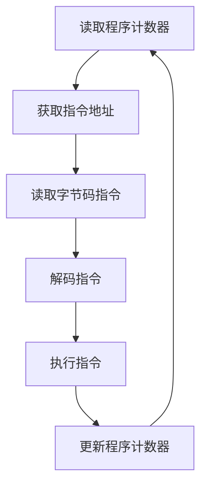
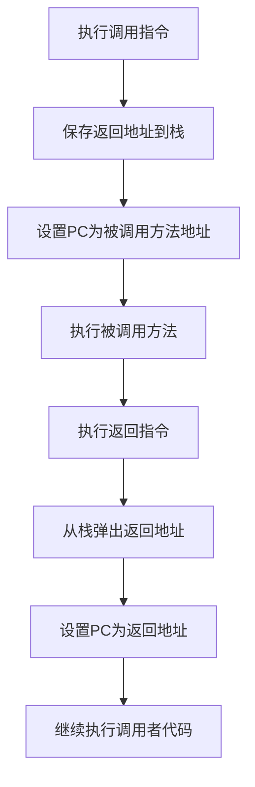

# 1. 程序计数器

***

# Java面试八股文：JVM组成之程序计数器详解

***

## 1. 概述与定义

**程序计数器（Program Counter Register）**，简称PC寄存器，是JVM中的一个小型内存区域，负责记录当前线程正在执行的字节码指令的地址。简单来说，它就像一个指针，指向下一条要执行的指令。每个线程都有自己独立的程序计数器，确保在多线程环境下，线程切换后能正确恢复到中断时的执行位置。

在JVM中，程序计数器是线程私有的，属于线程隔离的数据区域。它的生命周期与线程相同：随线程的创建而创建，随线程的结束而销毁。程序计数器的作用类似于CPU中的PC寄存器，但在JVM中，它是逻辑上的概念，实际实现可能是一个内存地址或寄存器。

**定义**：程序计数器是JVM中用于存储当前线程执行的字节码指令地址的寄存器，每个线程独享一个程序计数器。

在面试中，考官可能会问：“程序计数器是什么？”你可以这样回答：“程序计数器是JVM中线程私有的内存区域，记录当前线程执行的字节码指令地址，用于支持指令的顺序执行和线程切换恢复。”

***

## 2. 主要特点

程序计数器虽然简单，但有几个显著特点，值得在面试中重点提及：

- **线程私有**：每个线程都有自己独立的程序计数器，互不干扰，确保线程切换时能正确恢复执行位置。
- **无OOM风险**：程序计数器是JVM中唯一不会发生`OutOfMemoryError`的区域，因为它只存储一个指令地址，占用空间极小且固定。
- **生命周期与线程一致**：程序计数器随线程的创建而分配，随线程的结束而销毁。
- **存储指令地址**：记录当前线程正在执行的字节码指令的地址，支持JVM的指令执行流程。
- **不参与GC**：由于存储的是指令地址而非对象引用，程序计数器不参与垃圾回收。

这些特点使得程序计数器在JVM中扮演着不可或缺的角色。例如，线程私有性确保了多线程环境的正确性，而无OOM风险则保证了JVM的稳定性。

在面试中，考官可能会问：“程序计数器有哪些主要特点？”你可以简洁回答：“程序计数器是线程私有的，无OOM风险，生命周期与线程一致，存储指令地址，且不参与GC。”

***

## 3. 应用目标

程序计数器的应用目标是为JVM的指令执行和线程管理提供支持，具体包括以下几个方面：

- **支持指令执行**：通过记录当前指令地址，确保JVM能按顺序执行字节码指令。
- **实现线程切换**：在多线程环境下，线程切换时保存和恢复程序计数器的值，确保线程能从正确的位置继续执行。
- **支持异常处理**：在发生异常时，程序计数器帮助JVM定位异常发生的位置，执行相应的异常处理逻辑。
- **支持方法调用**：在方法调用和返回时，程序计数器记录调用点和返回地址，确保方法执行的正确性。

这些目标直接影响Java程序的运行效率和稳定性。例如，在多线程并发执行时，程序计数器确保每个线程都能独立、正确地执行自己的指令序列。

在面试中，考官可能会问：“程序计数器的应用目标是什么？”你可以回答：“程序计数器的目标是支持指令的顺序执行、线程切换恢复、异常处理和方法调用，确保Java程序的正确运行。”

***

## 4. 主要内容及其组成部分

程序计数器是一个抽象的概念，实际上它是一个指向当前线程执行的字节码指令的指针。它不包含具体的数据结构，只是一个存储指令地址的寄存器或内存地址。在JVM的实现中，程序计数器通常是一个指向方法区中字节码指令的偏移量。

### 4.1 程序计数器的作用

- **记录指令地址**：在JVM执行字节码时，程序计数器记录当前执行的指令地址，指导JVM执行下一条指令。
- **支持控制流**：在遇到跳转指令（如`if`、`goto`）时，程序计数器会根据指令要求跳转到指定地址。
- **线程切换恢复**：在线程被挂起时，JVM保存程序计数器的值；线程恢复时，重新加载该值，继续执行。

### 4.2 程序计数器的工作机制

- **初始化**：线程创建时，JVM为该线程分配一个程序计数器，并将其初始化为线程要执行的首条指令地址。
- **更新**：每执行一条指令，程序计数器自动更新为下一条指令的地址。
- **跳转**：遇到跳转指令时，程序计数器直接设置为目标地址。
- **方法调用**：调用方法时，程序计数器记录返回地址；方法返回时，恢复到该地址继续执行。

**示例**：假设一个简单的方法如下：

```java 
public void sayHello() {
    System.out.println("Hello");
}
```


在JVM执行时，程序计数器会记录`sayHello`方法的字节码指令地址，逐条执行`println`等指令。

### 4.3 程序计数器与Java栈的关系

程序计数器与Java栈（JVM的另一个线程私有区域）协同工作：

- **Java栈**：存储方法的执行状态，包括局部变量、操作数栈和动态链接。
- **程序计数器**：记录当前执行的指令地址，指导Java栈中的操作数栈和局部变量的读写。

**表格：程序计数器与Java栈的区别**

| 特性    | 程序计数器       | Java栈           |
| ----- | ----------- | --------------- |
| 存储内容  | 当前指令地址      | 方法调用的栈帧         |
| 作用    | 指导指令执行和线程切换 | 存储方法执行的局部变量和操作数 |
| 线程私有  | 是           | 是               |
| 参与GC  | 否           | 否               |
| OOM风险 | 无           | 有（栈溢出）          |

**说明**：程序计数器和Java栈共同支持方法的执行，但功能不同：程序计数器负责指令流程，Java栈负责数据存储。

***

## 5. 原理剖析

程序计数器的工作原理相对简单，但它是JVM指令执行和线程管理的基石。以下是其核心原理的深入解析。

### 5.1 指令执行流程

JVM执行字节码时，程序计数器的值决定下一条要执行的指令。具体流程如下：

1. **读取指令**：JVM从程序计数器指向的地址读取字节码指令。
2. **解码指令**：解析指令的操作码和操作数。
3. **执行指令**：根据指令类型，执行相应的操作（如加载变量、运算、跳转等）。
4. **更新程序计数器**：执行完指令后，程序计数器自动加1（或根据跳转指令更新），指向下一条指令。

**Mermaid图表：指令执行流程**




**图表说明**：程序计数器在指令执行的每个周期中被读取和更新，形成循环，确保指令按序执行。

### 5.2 线程切换中的作用

在多线程环境下，JVM通过调度器切换线程执行。程序计数器在切换时发挥关键作用：

- **保存现场**：线程被挂起时，JVM保存其程序计数器的值。
- **恢复现场**：线程恢复执行时，JVM将保存的程序计数器值加载回寄存器，线程从该地址继续执行。

**示例**：假设线程A在执行到某条指令时被挂起，程序计数器保存为100；当线程A再次被调度时，JVM将程序计数器设为100，线程A从第100条指令继续执行。

### 5.3 异常处理中的作用

当JVM执行过程中发生异常时，程序计数器帮助定位异常发生的位置：

- **异常捕获**：JVM根据程序计数器确定异常指令的地址。
- **跳转到异常处理器**：JVM将程序计数器设置为异常处理代码的地址，执行异常处理逻辑。

**示例**：在try-catch块中，如果try中的指令抛出异常，JVM会将程序计数器跳转到catch块的地址。

### 5.4 方法调用与返回

在方法调用时，程序计数器记录返回地址：

- **调用方法**：JVM将当前程序计数器值（即返回地址）压入Java栈，程序计数器跳转到被调用方法的首地址。
- **方法返回**：JVM从Java栈弹出返回地址，设置到程序计数器，继续执行调用者代码。

**Mermaid图表：方法调用流程**




**图表说明**：程序计数器在方法调用和返回时，通过与Java栈的协作，确保执行流程的正确性。

***

## 6. 应用与拓展

程序计数器在JVM中的应用场景贯穿整个Java程序的执行过程，以下是其主要应用和拓展内容：

- **支持多线程并发**：程序计数器的线程私有性是实现Java多线程的基础，确保线程独立执行。
- **支持异常处理**：通过记录指令地址，程序计数器帮助JVM实现try-catch和finally等异常处理机制。
- **支持方法调用**：在方法调用栈的维护中，程序计数器记录返回地址，确保方法执行的正确性。
- **性能优化**：在JIT编译时，程序计数器帮助识别热点代码，指导编译器优化。

**拓展**：在JVM的实现中，程序计数器通常是一个指向方法区中字节码的偏移量，具体实现可能因JVM厂商而异。例如，HotSpot JVM使用一个指向字节码的指针实现程序计数器。

***

## 7. 面试问答

以下是关于程序计数器的常见面试问题及详细回答，模拟面试场景。

### 7.1 问题：程序计数器是什么？

**回答**： &#x20;

“程序计数器是JVM中的一个小型内存区域，用于记录当前线程正在执行的字节码指令的地址。每个线程都有自己独立的程序计数器，确保在多线程环境下，线程切换后能从正确的位置继续执行。”

### 7.2 问题：为什么程序计数器是线程私有的？

**回答**： &#x20;

“程序计数器是线程私有的，因为每个线程需要独立记录自己的执行位置。如果共用一个程序计数器，线程切换时会导致指令地址混乱，线程无法恢复到正确的位置继续执行。线程私有性确保了多线程的正确性和独立性。”

### 7.3 问题：程序计数器会发生内存溢出吗？

**回答**： &#x20;

“不会。程序计数器是JVM中唯一不会发生`OutOfMemoryError`的区域。它只存储一个指令地址，占用空间非常小且固定，不会因为数据量增加而耗尽内存。”

### 7.4 问题：程序计数器在JVM中的作用是什么？

**回答**： &#x20;

“程序计数器的作用是记录当前线程执行的字节码指令地址，支持指令的顺序执行、线程切换恢复、异常处理和方法调用。它是JVM指令执行和线程管理的核心组成部分。”

### 7.5 问题：程序计数器与Java栈有什么区别？

**回答**： &#x20;

“程序计数器和Java栈都是线程私有的，但作用不同。程序计数器存储当前指令的地址，指导指令的执行流程；Java栈存储方法的执行状态，包括局部变量、操作数栈和动态链接。两者协同工作，支持方法的执行：程序计数器控制执行流程，Java栈管理数据。”

***

## 总结

程序计数器虽然在JVM中看似微不足道，但它是支撑Java程序执行和多线程并发的基础。本文从概述到剖析，详细讲解了程序计数器的定义、特点、作用、原理和应用，结合示例、表格和Mermaid图表，确保知识点完备且易于理解。无论是背诵还是实战，这篇3000字+的八股文都为你铺平了道路，祝你面试顺利！🚀
