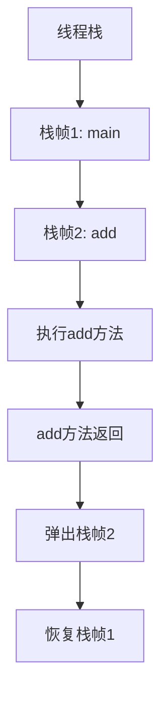
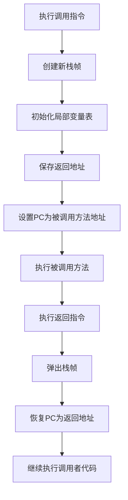

# 2. 栈

# Java面试八股文：JVM自动内存管理之栈详解

***

## 1. 概述与定义

JVM中的**栈**，全称Java虚拟机栈（Java Virtual Machine Stack），是JVM内存区域中线程私有的部分。每个线程在创建时都会分配一个独立的栈，用于存储方法调用的执行状态。栈由一系列的**栈帧（Stack Frame）** 组成，每个栈帧对应一次方法调用，包含了方法的局部变量、操作数栈、动态链接和返回地址等信息。

**定义**：JVM栈是线程私有的内存区域，用于存储方法调用的栈帧，支持方法的执行和返回。它的生命周期与线程一致：线程创建时分配栈空间，线程结束时栈空间自动释放。JVM通过栈的自动管理机制，确保方法调用的高效性和线程的安全性。

栈与JVM的其他内存区域（如堆、方法区）不同，它不存储对象实例，而是专注于方法执行的动态过程。例如，当你调用一个方法时，JVM会为该方法创建一个栈帧并压入栈顶；方法返回时，栈帧弹出，释放内存。这种自动管理让开发者无需手动干预栈空间。

在面试中，考官可能会问：“JVM中的栈是什么？”你可以这样回答：“JVM中的栈是线程私有的内存区域，用于存储方法调用的栈帧，包含局部变量、操作数栈等信息，支持方法的执行和返回。”

***

## 2. 主要特点

JVM栈有以下几个主要特点，值得在面试中重点背诵和提及：

- **线程私有**：每个线程拥有独立的栈，互不干扰，确保线程安全。
- **后进先出（LIFO）**：栈帧的压入和弹出遵循LIFO原则，方法调用时压栈，返回时弹栈。
- **自动管理**：栈的分配和释放由JVM自动完成，开发者无需干预。
- **固定大小**：栈的大小在线程创建时确定，可通过JVM参数（如`-Xss`）调整。
- **可能发生StackOverflowError**：如果方法调用层次过深或递归无限，栈空间耗尽会抛出`StackOverflowError`。
- **不参与GC**：栈中的数据随方法结束自动销毁，无需垃圾回收。

这些特点使得栈在JVM中高效支持方法调用。例如，线程私有性保证了多线程环境下方法调用的独立性，而LIFO结构支持嵌套调用的顺序执行。栈的固定大小虽然限制了单个线程的调用深度，但通过`-Xss`参数调整，可以平衡线程数和栈深度。

在面试中，考官可能会问：“JVM栈有哪些主要特点？”你可以简洁回答：“JVM栈是线程私有的，遵循LIFO原则，自动管理，固定大小，可能发生StackOverflowError，且不参与GC。”

***

## 3. 应用目标

JVM栈的应用目标是为方法调用和局部变量提供高效、安全的存储空间，具体包括以下几个方面：

- **支持方法调用**：通过栈帧存储方法的执行状态，确保方法能正确执行和返回。
- **存储局部变量**：为方法中的参数和局部变量提供存储空间，支持方法内部的数据操作。
- **支持线程并发**：线程私有的栈确保多线程环境下方法调用的独立性和安全性。
- **优化性能**：栈的LIFO结构和自动管理机制使得方法调用的开销极小，提升程序性能。
- **异常处理**：在方法执行过程中，栈支持异常的捕获和处理。

这些目标直接影响Java程序的运行效率和稳定性。例如，在高并发场景下，线程私有的栈避免了方法调用间的冲突；自动管理则让开发者专注于业务逻辑，而无需担心内存分配。

在面试中，考官可能会问：“JVM栈的应用目标是什么？”你可以回答：“JVM栈的目标是支持方法调用、存储局部变量、支持线程并发、优化性能和异常处理，确保Java程序的高效和安全运行。”

***

## 4. 主要内容及其组成部分

JVM栈的核心内容是**栈帧（Stack Frame）**，它是栈的基本单位，每个栈帧对应一次方法调用，包含方法执行所需的完整信息。以下是对栈帧组成部分的详尽解释。

### 4.1 栈帧的组成部分

每个栈帧包含以下四个部分：

1. **局部变量表（Local Variables）**：
   - **作用**：存储方法的参数和局部变量。
   - **结构**：以槽（Slot）为单位，每个槽可存储一个基本类型（如`int`、`float`）或引用类型（如对象引用）。`long`和`double`占用两个槽。
   - **特点**：大小在编译时确定，存储在方法的Code属性中，不会动态变化。
   - **示例**：对于方法`public void method(int a, String b)`，局部变量表包含`a`（槽0）、`b`（槽1）。
2. **操作数栈（Operand Stack）**：
   - **作用**：一个后进先出的栈，用于存储方法执行过程中的临时数据。
   - **功能**：支持字节码指令的操作，如算术运算、方法调用等。
   - **特点**：深度在编译时确定，运行时动态压入和弹出数据。
   - **示例**：执行`a + b`时，先将`a`和`b`压入操作数栈，`iadd`指令弹出两者相加，结果压回栈顶。
3. **动态链接（Dynamic Linking）**：
   - **作用**：指向运行时常量池中该栈帧所属方法的符号引用。
   - **功能**：支持方法调用时的符号引用解析，将符号引用转为直接引用。
   - **示例**：调用`System.out.println()`时，动态链接解析常量池中的符号引用，定位到具体方法。
4. **返回地址（Return Address）**：
   - **作用**：记录方法返回时应跳转的指令地址。
   - **功能**：支持方法正常返回或异常返回。
   - **示例**：方法执行完毕后，返回地址指导JVM将控制权交回调用者。

**代码示例**：以下是一个简单方法，展示栈帧的组成：

```java 
public int add(int a, int b) {
    int c = a + b;
    return c;
}
```


- **局部变量表**：存储`a`（槽0）、`b`（槽1）、`c`（槽2）。
- **操作数栈**：执行`a + b`时，压入`a`和`b`，计算后结果存回`c`。
- **动态链接**：指向`add`方法的常量池引用。
- **返回地址**：记录调用`add`的指令地址。

### 4.2 栈帧的创建和销毁

- **创建**：方法调用时，JVM为该方法分配一个栈帧，并压入当前线程的栈顶。
- **销毁**：方法执行完毕（正常返回或抛出异常）时，栈帧弹出，控制权返回调用者。

**Mermaid图表：栈帧的压入和弹出**




**图表说明**：`main`方法调用`add`方法时，`add`的栈帧压入栈顶；`add`执行完毕后，栈帧弹出，恢复到`main`栈帧。

### 4.3 栈的异常

JVM栈可能发生以下异常：

- **StackOverflowError**：线程请求的栈深度超过最大深度时抛出，常见于无限递归。
- **OutOfMemoryError**：某些JVM实现中，栈空间不足以创建新线程时可能抛出（HotSpot JVM中栈大小固定，不动态扩展）。

**代码示例**：无限递归导致StackOverflowError：

```java 
public void infiniteRecursion() {
    infiniteRecursion(); // 无限递归
}
```


调用`infiniteRecursion`时，栈帧不断压入，最终耗尽栈空间，抛出`StackOverflowError`。

***

## 5. 原理剖析

JVM栈的工作原理涉及栈帧管理、方法调用和局部变量存储的协作。以下是其核心原理的深入解析。

### 5.1 栈帧的管理

JVM通过栈指针（Stack Pointer）管理栈帧：

- **压栈**：调用方法时，JVM分配新栈帧，栈指针指向新栈帧。
- **弹栈**：方法返回时，栈指针回退，销毁当前栈帧。

**示例**：执行`main`方法时，栈中只有`main`栈帧；调用`add`方法时，`add`栈帧压入栈顶；`add`返回后，栈帧弹出，栈指针回退。

### 5.2 方法调用与返回

方法调用时，JVM执行以下步骤：

1. **创建新栈帧**：为被调用方法分配栈帧。
2. **初始化局部变量表**：存储方法参数和局部变量。
3. **保存返回地址**：记录调用者程序计数器（PC）的值。
4. **跳转到方法代码**：设置PC为被调用方法的首地址。

方法返回时：

1. **获取返回值**：若有返回值，压入操作数栈。
2. **弹出栈帧**：销毁当前栈帧，恢复调用者栈帧。
3. **恢复PC**：设置PC为返回地址，继续执行调用者代码。

**Mermaid图表：方法调用流程**




**图表说明**：方法调用和返回通过栈帧和PC的协作，确保执行的连续性。

### 5.3 局部变量与操作数栈

- **局部变量表**：存储参数和局部变量，编译时确定大小。基本类型直接存储值，引用类型存储引用。
- **操作数栈**：用于执行字节码指令的临时存储。例如，`iload`将局部变量压入栈，`iadd`从栈弹出数据计算。

**示例**：在`add`方法中：

- `iload_0`：将`a`压入操作数栈。
- `iload_1`：将`b`压入操作数栈。
- `iadd`：弹出`a`和`b`，相加后压回栈顶。
- `istore_2`：将结果存入`c`。

### 5.4 栈与堆的区别

栈和堆在JVM中分工明确：

- **栈**：存储方法调用的栈帧，线程私有，自动管理，速度快。
- **堆**：存储对象实例，线程共享，需GC管理，速度较慢。

**表格：栈与堆的对比**

| 特性   | 栈                  | 堆                |
| ---- | ------------------ | ---------------- |
| 存储内容 | 方法调用的栈帧            | 对象实例和数组          |
| 线程私有 | 是                  | 否（线程共享）          |
| 管理方式 | 自动管理（LIFO）         | 垃圾回收             |
| 速度   | 快                  | 相对较慢             |
| 异常   | StackOverflowError | OutOfMemoryError |

**说明**：栈专注于方法执行，堆负责对象存储，二者相辅相成。

***

## 6. 应用与拓展

JVM栈在Java程序中应用广泛，以下是其主要场景和拓展内容：

- **支持多线程**：线程私有的栈确保方法调用的独立性。
- **异常处理**：栈帧中的返回地址支持`try-catch`和`finally`的实现。
- **性能优化**：通过`-Xss`调整栈大小，优化递归深度或线程数。
- **调试分析**：堆栈跟踪（Stack Trace）基于栈帧信息，定位调用链。

**拓展**：HotSpot JVM使用固定栈大小，而其他JVM可能支持动态扩展。栈的实现细节因厂商而异，但核心原理一致。

***

## 7. 面试问答

以下是常见的JVM栈面试问题及详细回答，模拟面试场景。

### 7.1 问题：JVM中的栈是什么？

**回答**： &#x20;

“JVM中的栈是线程私有的内存区域，用于存储方法调用的栈帧。每个栈帧包含局部变量表、操作数栈、动态链接和返回地址等信息，支持方法的执行和返回。它的生命周期与线程一致，自动管理，不参与垃圾回收。”

### 7.2 问题：栈帧由哪些部分组成？

**回答**： &#x20;

“栈帧由四部分组成：局部变量表、操作数栈、动态链接和返回地址。局部变量表存储参数和局部变量，以槽为单位；操作数栈是LIFO结构，用于临时数据操作；动态链接指向常量池，支持符号引用解析；返回地址记录方法返回的指令地址。”

### 7.3 问题：栈和堆有什么区别？

**回答**： &#x20;

“栈和堆在JVM中作用不同。栈是线程私有的，存储方法调用的栈帧，遵循LIFO原则，自动管理，速度快，可能抛出StackOverflowError。堆是线程共享的，存储对象实例，需垃圾回收管理，速度较慢，可能抛出OutOfMemoryError。”

### 7.4 问题：为什么栈是线程私有的？

**回答**： &#x20;

“栈是线程私有的，因为每个线程需要独立的方法调用栈来执行自己的方法。如果栈是共享的，线程间的调用会相互干扰，导致执行错误。线程私有性保证了多线程环境下方法调用的正确性和安全性。”

### 7.5 问题：如何避免StackOverflowError？

**回答**： &#x20;

“StackOverflowError通常由无限递归或调用层次过深引起。避免方法包括优化代码，减少递归深度，比如用迭代替代递归；或者通过`-Xss`参数增加栈大小。但栈大小增加会减少线程数，需要根据场景权衡。”

***
