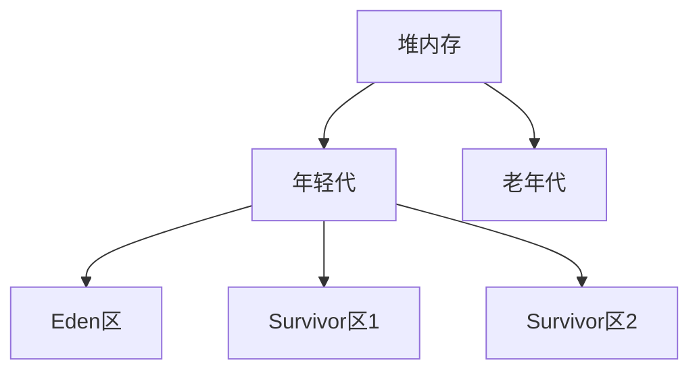

# 3. 堆

***

## 1. 概述与定义

在 Java 语言的运行环境中，JVM（Java Virtual Machine）承担着自动内存管理的重要职责。其中，堆（Heap）是 JVM 中最为关键的内存区域，它主要用于存储所有的对象实例及数组数据。堆内存采用动态分配机制，支持垃圾回收（Garbage Collection），从而减轻了程序员手动管理内存的负担。面试中，关于堆的定义、结构以及相关的垃圾收集机制是高频考点。

堆的主要特点在于： &#x20;

- 作为所有线程共享的内存区域，堆中的对象生命周期由垃圾回收器管理 &#x20;
- 根据不同的 GC 策略，堆通常被划分为年轻代（Young Generation）和老年代（Old Generation）两个区域；在 JDK8 及之后的版本中，永久代（PermGen）已被元空间（Metaspace）所取代 &#x20;
- 堆内存大小可以通过 JVM 参数（如 -Xms、-Xmx）进行调优，满足不同场景下的性能要求

通过对堆的了解，可以帮助面试者深入理解 Java 自动内存管理机制，并对常见内存问题（如内存泄露、OOM 异常）给出有效的优化建议。😊

***

## 2. 主要特点

堆作为 JVM 自动内存管理中的核心区域，具有以下主要特点：

- **动态分配与共享** &#x20;

  堆内存是动态分配的，所有在程序中通过 new 关键字创建的对象都会存放在堆中。由于堆被所有线程共享，因此对象的访问和传递具有跨线程特性。 &#x20;
- **垃圾回收机制** &#x20;

  堆内存采用垃圾回收机制自动释放不再被引用的对象。垃圾回收器（GC）根据不同的算法（如标记-清除、复制算法、标记-整理、分代收集等）对堆中的对象进行管理，从而提高内存使用效率。 &#x20;
- **分代设计** &#x20;

  为了提高垃圾回收效率，堆通常被划分为年轻代和老年代（以及元空间/永久代），其中年轻代存储新生对象，老年代存储经过多次垃圾回收仍然存活的对象。这样的设计符合对象“朝生暮死”的大部分特性。 &#x20;
- **调优灵活性** &#x20;

  通过 JVM 参数（如 -Xms、-Xmx、-XX:NewRatio、-XX:SurvivorRatio 等），可以灵活配置堆的大小和分区比例，从而在不同应用场景中取得最佳性能。 &#x20;
- **内存溢出风险** &#x20;

  由于堆内存有限，如果对象创建过多或垃圾回收策略配置不当，可能会引发 OutOfMemoryError，导致系统异常或崩溃。 &#x20;

下表总结了堆内存的几个主要特性：

| 特性     | 描述                                    |
| ------ | ------------------------------------- |
| 动态分配   | 对象在堆中动态分配内存，由垃圾回收器管理                  |
| 分代收集   | 堆分为年轻代与老年代，满足大部分对象生命周期特性              |
| 调优灵活性  | 可通过 JVM 参数动态配置堆大小与分区比例                |
| 共享性    | 堆内存为所有线程共享，保证对象在多线程间的传递与使用            |
| 内存溢出风险 | 堆内存不足时可能引发 OutOfMemoryError，需要合理配置和监控 |

以上特点构成了堆内存在 JVM 自动内存管理中的基础，也是面试中重点考察的内容。🚀

***

## 3. 应用目标

堆内存的应用目标主要体现在以下几个方面：

- **对象存储** &#x20;

  堆内存是存储所有 Java 对象和数组的主要区域，它支持动态内存分配，确保程序运行时能够随时创建和销毁对象。
- **垃圾回收与内存优化** &#x20;

  通过垃圾回收机制，堆自动释放不再被使用的内存，降低内存泄露风险，提高内存利用率。垃圾回收策略的调优目标是减少 GC 停顿时间并提高系统吞吐量。
- **系统性能优化** &#x20;

  合理配置堆内存大小以及分代比例，可以大幅度改善应用性能。在高并发、大数据处理场景中，通过监控堆内存使用情况和 GC 行为，可以及时发现性能瓶颈并进行优化。
- **面试答题辅助** &#x20;

  对于面试者来说，深入理解堆内存的工作原理与调优方法，有助于在面试中从容应对关于内存管理、OOM 错误、GC 调优等方面的问题。通过结合实际案例和调优经验，面试者可以展示自己对 JVM 内存机制的深刻理解。

总体而言，堆内存的设计和管理目标是为了实现高效、自动化的内存管理，并在程序运行过程中达到最佳性能和稳定性。📈

***

## 4. 主要内容及其组成部分

堆内存作为 JVM 内存模型中的重要组成部分，其内部结构与组成十分丰富。下面对堆内存的主要组成部分进行详细说明：

### 4.1 堆的整体结构

根据垃圾回收机制的需要，堆通常被划分为多个区域，常见的划分方式包括： &#x20;

- **年轻代（Young Generation）** &#x20;

  年轻代主要用于存放新创建的对象，通常又分为 Eden 区和两个 Survivor 区。大部分对象在年轻代中经历一次或几次 GC 后，如果仍然存活，则会被移入老年代。 &#x20;
- **老年代（Old Generation）** &#x20;

  老年代存放经过多次垃圾回收依然存活的对象，其生命周期较长。相比年轻代，老年代的垃圾回收次数较少，但回收成本较高。 &#x20;
- **元空间/永久代（Metaspace/PermGen）** &#x20;

  虽然元空间主要用于存储类信息和常量，但在一些文献中也将其作为堆外区域的重要补充。JDK8 之前使用永久代，JDK8 及以后改用元空间。 &#x20;

下面通过 Mermaid 图展示堆内存的分区结构（叶子节点为各分区的具体内容）：

该图直观展示了堆内存的分代划分与年轻代内部的细分区域，便于面试者快速建立概念和记忆各部分的作用。

### 4.2 年轻代详解

年轻代主要用于存储新创建的对象，其特点是对象生命周期短，垃圾回收频率高。具体组成如下：

- **Eden 区** &#x20;

  所有新创建的对象最初都会被分配到 Eden 区。当 Eden 区内存不足时，会触发一次 Minor GC，对存活的对象移动到 Survivor 区。 &#x20;
- **Survivor 区** &#x20;

  Survivor 区通常由两个区域组成，分别用于对象在多次 GC 之间的复制与迁移。经过多次 GC 后仍然存活的对象会被晋升到老年代。 &#x20;

使用下表对年轻代的各部分进行总结：

| 区域名称      | 作用描述                    | 特点描述                     |
| --------- | ----------------------- | ------------------------ |
| Eden区     | 新对象的初始分配区               | 大部分对象在此产生，GC 时回收率高       |
| Survivor1 | 存放从 Eden 区转移来的存活对象      | 与 Survivor2 交替使用         |
| Survivor2 | 存放从 Survivor1 区复制后的存活对象 | 与 Survivor1 交替使用，晋升老年代对象 |

这种分区机制符合大部分对象“朝生暮死”的特性，能显著降低垃圾回收的代价。😊

### 4.3 老年代详解

老年代用于存储生命周期较长的对象，经过多次 Minor GC 后仍然存活的对象会被转移到老年代。老年代的特点在于： &#x20;

- 回收频率低，但每次回收的开销较大 &#x20;
- 对象在老年代中占用的内存空间较大，一旦发生 Full GC，系统可能会出现较长的停顿时间

对于老年代的调优，需要关注内存碎片问题和 Full GC 的频率，保证系统稳定性和高效性。

### 4.4 垃圾回收器与堆管理

堆内存的垃圾回收策略主要依赖于所选用的垃圾收集器。常见的垃圾收集器包括： &#x20;

- Serial GC &#x20;
- Parallel GC（吞吐量优先） &#x20;
- CMS（并发标记清除） &#x20;
- G1 GC（面向服务端应用） &#x20;

每种垃圾收集器对堆内存的分配和回收策略不同，因此在面试中，面试者不仅需要理解堆的结构，还应了解各类 GC 的特点与调优参数。通过合理选择和配置 GC，能够提高应用性能并降低停顿时间。📚

***

## 5. 原理剖析

深入剖析堆内存的工作原理，可以从以下几个方面展开：

### 5.1 内存分配与对象创建

在 Java 程序中，通过 new 关键字创建的对象会首先在堆内存中分配空间。分配策略通常为“指针碰撞法”，即在 Eden 区中连续分配内存，直至内存不足为止。当 Eden 区满时，会触发 Minor GC，将存活的对象复制到 Survivor 区。经过多次 Minor GC 而依然存活的对象，则会晋升到老年代。 &#x20;

这种内存分配机制简单高效，因为内存分配仅涉及指针移动，不涉及复杂的内存碎片管理。

### 5.2 垃圾回收流程

垃圾回收器在堆内存中的主要工作流程包括： &#x20;

- **标记阶段**：遍历对象引用关系，标记出所有存活的对象。 &#x20;
- **清除或整理阶段**：对未标记的对象进行回收，或者在复制算法中将存活对象复制到另一块区域。 &#x20;

以复制算法为例，GC 过程分为两个步骤： &#x20;

1. 将 Eden 区和一个 Survivor 区中的存活对象复制到另一个 Survivor 区 &#x20;
2. 清空 Eden 区和原 Survivor 区，完成内存回收 &#x20;

复制算法避免了内存碎片问题，但需要额外的空间作为目标区域。针对老年代，则通常采用标记-整理算法以应对内存碎片。 &#x20;

这种分代收集机制使得垃圾回收器能够分别采用不同策略优化不同内存区的回收效率，从而提高整体系统性能。💡

### 5.3 GC 日志与调优参数

在实际应用中，通过开启 GC 日志（如 -XX:+PrintGCDetails、-XX:+PrintGCDateStamps）可以实时监控堆内存的使用情况和垃圾回收过程。常见的调优参数包括： &#x20;

- **-Xms 与 -Xmx**：初始堆大小与最大堆大小，影响堆内存的分配空间 &#x20;
- **-XX:NewRatio**：用于设置年轻代与老年代的比例 &#x20;
- **-XX:SurvivorRatio**：控制 Eden 区与 Survivor 区的比例 &#x20;
- **-XX:MaxTenuringThreshold**：对象在年轻代中晋升老年代前允许存活的最大次数 &#x20;

通过分析 GC 日志，开发者可以了解对象的存活率、回收次数以及 Full GC 的频率，从而进行针对性的优化。 &#x20;

例如，若观察到大量对象频繁在年轻代中创建和销毁，可以考虑增大年轻代的比例；若 Full GC 频繁，则需要关注老年代的内存碎片问题。 &#x20;

### 5.4 内存泄露与 OOM 问题分析

尽管 JVM 提供了自动垃圾回收机制，但内存泄露依然可能发生。常见原因包括： &#x20;

- 长生命周期对象引用短生命周期对象，导致垃圾回收器无法及时回收 &#x20;
- 静态集合类（如 HashMap）未及时清理无用数据 &#x20;
- 内部类与外部类的相互引用等

当堆内存长期未能释放，最终可能导致 OutOfMemoryError（OOM）异常。在面试中，能够详细描述内存泄露产生的原因以及调试工具（如 VisualVM、JProfiler 等）的使用方法，是展示深厚技术功力的重要体现。

***

## 6. 应用与拓展

堆内存在实际开发中的应用和拓展主要体现在以下几个方面：

### 6.1 性能调优与监控

在高并发、大流量的生产环境中，堆内存的调优是系统性能优化的关键环节。通过合理配置堆大小、选择合适的垃圾收集器以及调节各项 GC 参数，可以达到减少 GC 停顿、提高系统吞吐量的目的。 &#x20;

同时，借助如 JConsole、VisualVM 等工具，可以实时监控堆内存的使用情况，及时发现内存泄露和异常增长的问题。🔍

### 6.2 垃圾收集器的选择与应用

不同应用场景对垃圾收集器的要求不同。对于响应时间要求高的应用，G1 GC 提供了较低的停顿时间；对于批处理、数据量大且对吞吐量要求较高的场景，Parallel GC 则是较好的选择。 &#x20;

在面试中，能够结合具体场景描述不同垃圾收集器的优势和适用情况，将大大提升面试答题的说服力。

### 6.3 案例分析与调优实践

结合实际项目案例，面试者可以描述在某大型电商系统中，通过调整 -Xmx 和 -XX:NewRatio 参数，成功降低了 Full GC 的频率；或在金融系统中，利用 GC 日志分析工具定位了内存泄露问题并通过代码优化解决。 &#x20;

此类案例不仅展现了理论知识的掌握，更体现了在生产环境中如何将知识应用于解决实际问题的能力。📊

### 6.4 拓展阅读与新特性

随着 JDK 的不断发展，堆内存管理和垃圾回收技术也在不断演进。例如，JDK9 引入的模块化设计、JDK10 及以后的增强型 GC（如 ZGC、Shenandoah）等，都是未来调优的重要方向。面试者可以通过关注最新的技术动态，持续更新知识库，为未来的优化和故障排查打下坚实基础。 &#x20;

***

## 7. 面试问答

以下提供五个典型面试问答场景，模拟面试者口吻进行详细回答，帮助面试者在面试中能够从容应对关于堆内存管理的相关问题。

### 7.1 问题一：请简述 JVM 堆内存的结构和划分。

【回答】： &#x20;

JVM 的堆内存主要用于存储所有通过 new 创建的对象。在堆中，常见的分区包括年轻代和老年代。年轻代又细分为 Eden 区以及两个 Survivor 区，其中大部分新创建的对象首先分配到 Eden 区，当 Eden 区满时会触发 Minor GC，将存活的对象复制到 Survivor 区；经过多次 GC 后仍然存活的对象，则会晋升到老年代。这样的分代设计提高了垃圾回收的效率，符合大多数对象生命周期短暂的特点，同时在老年代中保留生命周期长的对象，从而降低整体的 GC 频率。

### 7.2 问题二：什么是 Minor GC 与 Full GC？它们分别发生在堆的哪个区域？

【回答】： &#x20;

Minor GC 主要针对年轻代进行垃圾回收，当 Eden 区或 Survivor 区内存不足时，会触发 Minor GC，复制存活对象到另一 Survivor 区；而 Full GC（或称 Major GC）则是对整个堆内存进行的回收，主要作用于老年代，同时也会涉及年轻代。通常情况下，Minor GC 发生的频率较高，但回收时间较短；Full GC 发生时回收时间较长，可能导致应用较长时间的停顿。在实际调优中，我们应尽量降低 Full GC 的发生频率，保证系统响应速度。

### 7.3 问题三：如何通过 JVM 参数调整堆内存大小及各个区域的比例？

【回答】： &#x20;

JVM 提供了多个参数来调整堆内存的大小与分区比例。常用参数包括： &#x20;

- **-Xms 与 -Xmx**：分别用于设置初始堆大小与最大堆大小，确保应用在内存不足时不会频繁触发垃圾回收。 &#x20;
- **-XX:NewRatio**：用于设置年轻代与老年代的比例，例如 NewRatio=2 表示老年代与年轻代比例为 2:1。 &#x20;
- **-XX:SurvivorRatio**：用于设置 Eden 区与 Survivor 区的比例，确保在 Minor GC 时 Survivor 区能有效存放存活对象。 &#x20;

通过调整这些参数，可以根据具体应用场景优化内存分配，提高 GC 效率，同时减少内存溢出的风险。

### 7.4 问题四：如何判断一个 Java 应用是否存在内存泄露问题？你会采取哪些措施进行排查？

【回答】： &#x20;

判断内存泄露问题的常用方法包括： &#x20;

1. 监控 JVM 内存使用情况，若发现堆内存长期处于高负荷状态且 Full GC 频繁发生，则可能存在内存泄露； &#x20;
2. 利用 GC 日志和工具（如 VisualVM、JProfiler、MAT）对堆快照进行分析，检查哪些对象占用内存过多并长期未被回收； &#x20;
3. 检查代码中静态集合、缓存等数据结构，确保在数据不再使用时能及时清除。 &#x20;

针对排查措施，我会首先开启 GC 日志进行监控，然后结合内存分析工具查看对象的引用链，最终定位到具体的内存泄露点，并通过代码优化或调整数据结构来解决问题。

### 7.5 问题五：请结合具体案例说明如何通过调优堆内存和 GC 参数来解决性能瓶颈问题。

【回答】： &#x20;

在一次实际项目中，我们遇到过由于大规模对象频繁创建导致 Minor GC 频繁触发的问题，进而影响系统响应时间。通过分析 GC 日志，我发现 Eden 区的内存不足导致大量对象在短时间内复制到 Survivor 区，最终部分对象晋升到老年代。为解决这一问题，我们采取了以下措施： &#x20;

- 调整 -Xms 和 -Xmx 参数，增大堆内存大小，确保系统有足够的空间存放对象； &#x20;
- 通过 -XX:NewRatio 参数增加年轻代的比例，给 Eden 区分配更多内存，减少对象复制次数； &#x20;
- 针对 Survivor 区，调整 -XX:SurvivorRatio 参数，确保在 Minor GC 时能有效存储存活对象，降低不必要的晋升。 &#x20;

经过调优后，GC 停顿时间明显减少，系统整体吞吐量和响应速度得到了显著提升。这个案例不仅证明了合理调优堆内存与 GC 参数的重要性，也展示了在面对性能瓶颈时如何通过细致的监控与调试手段找到解决方案。

***

## 总结

本文详细阐述了 JVM 自动内存管理中的堆内存区域，从概述与定义到主要特点、应用目标，再到详细的组成部分和内在原理剖析，最后通过面试问答的形式展示了如何在实际面试中应答相关问题。全文通过表格、Mermaid 图和示例代码等多种形式，将抽象的内存管理机制具体化、形象化，帮助面试者建立系统化的知识体系，并在实际开发中能够灵活应用这些理论知识。

通过本文的学习，面试者不仅能熟练掌握堆内存的结构和垃圾回收机制，还能在遇到内存泄露、GC 调优等问题时，有条不紊地进行排查和优化。掌握堆内存的细节与调优技巧，是成为优秀 Java 工程师的必备技能，相信在面试中充分展示这些内容，定能为你赢得面试官的认可。🚀

希望这篇文章能为你提供充足的理论支持和实践经验，助你在面试中从容应答每一个关于 JVM 内存管理的问题。祝愿大家在未来的项目中不断优化系统性能，攻克各种技术难关，取得更大成功！
