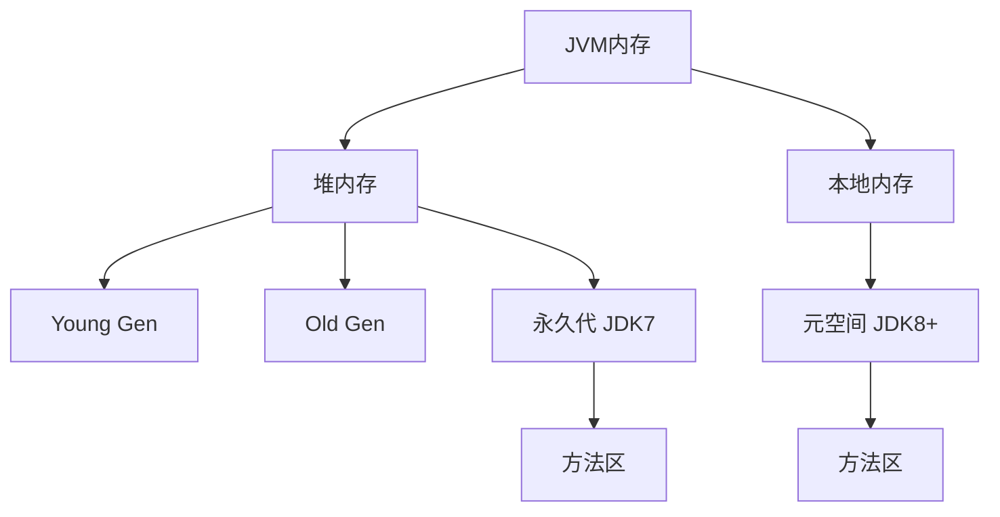

# 4. 元空间与方法区

# Java面试八股文：JVM自动内存管理之元空间与方法区详解

***

## 1. 概述与定义

方法区（Method Area）是JVM规范中定义的一个逻辑内存区域，用于存储已被虚拟机加载的类信息、常量池、静态变量以及即时编译后的代码等数据。它属于JVM运行时数据区的一部分，是所有线程共享的区域。方法区的设计目标是为Java程序提供类元数据和静态数据的存储空间，支持类的加载、实例化和运行时解析。

元空间（Metaspace）是HotSpot JVM在JDK 8及以后版本中对方法区的具体实现，替代了JDK 7及以前的永久代（Permanent Generation）。与永久代使用JVM堆内存不同，元空间使用本地内存（Native Memory），通过自动管理内存分配和回收，解决了永久代内存不足导致的`OutOfMemoryError`问题。

**定义**： &#x20;

- **方法区**：JVM规范中的逻辑概念，存储类的元数据（如类名、方法信息）、静态变量和常量池等。 &#x20;
- **元空间**：HotSpot JVM对方法区的实现方式，使用本地内存，动态扩展内存容量。

**示例**：假设JVM加载`java.lang.String`类，方法区（元空间）会存储其类结构、静态变量（如`static final int CASE_INSENSITIVE_ORDER`）和常量池中的字符串字面量（如`"Hello"`）。

在面试中，考官可能问：“方法区和元空间是什么关系？”你可以回答：“方法区是JVM规范定义的逻辑区域，元空间是HotSpot JVM在JDK 8后对方法区的具体实现，使用本地内存替代了永久代。”

***

## 2. 主要特点

元空间与方法区有以下几个主要特点，值得在面试中熟练背诵并灵活运用：

- **线程共享**：方法区（包括元空间）是JVM中所有线程共享的区域，多个线程可访问相同的类元数据和静态变量。 &#x20;
- **存储内容**：包括类的元数据、静态变量、运行时常量池和JIT（Just-In-Time）编译后的代码。 &#x20;
- **内存管理**： &#x20;
  - 在JDK 7及以前，方法区由永久代实现，属于堆内存的一部分，需通过`-XX:MaxPermSize`手动设置上限，容易因类加载过多导致`OutOfMemoryError: PermGen space`。 &#x20;
  - 在JDK 8及以后，元空间使用本地内存，内存大小可自动扩展，默认受系统内存限制，通过`-XX:MaxMetaspaceSize`设置上限，极大降低了OOM风险。 &#x20;
- **垃圾回收**：方法区（元空间）中的类元数据和常量池在特定条件下可被回收，例如类卸载或常量池中的对象不再被引用。 &#x20;
- **生命周期**：方法区随JVM启动而创建，随JVM关闭而销毁，与JVM生命周期一致。

**示例**：一个Java程序加载了1000个类，元空间会动态分配本地内存存储这些类的元数据。如果某个类不再被引用且其类加载器被回收，元空间可能触发垃圾回收，释放相关内存。

这些特点决定了方法区（元空间）在JVM中的重要性。线程共享性支持多线程访问类信息，元空间的本地内存特性提升了内存管理的灵活性。在面试中，考官可能问：“元空间相比永久代的优势是什么？”你可以简洁回答：“元空间使用本地内存，自动扩展，避免了永久代手动设置大小和OOM的问题。”

***

## 3. 应用目标

方法区（元空间）的应用目标是为JVM提供类信息和静态数据的存储与管理支持，确保Java程序的高效运行。具体目标包括：

- **存储类元数据**：记录类的结构、方法表、字段信息等，支持类的加载、验证和实例化。 &#x20;
- **存储静态变量**：为类的静态成员（如`static int count`）提供线程共享的存储空间。 &#x20;
- **存储常量池**：保存编译期生成的字面量和符号引用，支持运行时动态链接。 &#x20;
- **支持JIT编译**：存储即时编译后的本地机器码，提升代码执行效率。 &#x20;
- **支持类卸载**：在特定条件下卸载不再使用的类，回收内存资源。

**示例**：在运行以下代码时：

```java 
public class Example {
    public static int count = 0;
    public static final String MESSAGE = "Hello, JVM!";
}
```


方法区（元空间）会存储`Example`类的元数据、静态变量`count`和常量池中的`"Hello, JVM!"`，支持类的加载和静态成员访问。

这些目标直接影响JVM的动态特性和内存管理效率。例如，类元数据支持反射和动态代理，常量池支持符号引用的解析。在面试中，考官可能问：“方法区的核心作用是什么？”你可以回答：“方法区存储类元数据、静态变量和常量池，支持类的加载、实例化和动态链接，同时通过JIT编译提升性能。”

***

## 4. 主要内容及其组成部分

方法区（元空间）存储的内容丰富且多样，以下是对其主要组成部分的详尽解释。

### 4.1 类元数据

- **内容**：类的全限定名、访问修饰符、父类信息、接口列表、字段信息、方法表等。 &#x20;
- **作用**：支持类的加载、验证和实例化，是JVM运行时的核心数据结构。 &#x20;
- **示例**：加载`java.util.ArrayList`时，元空间存储其类结构（如方法`add()`的描述符）、继承关系（`AbstractList`）和字段信息。

### 4.2 静态变量

- **内容**：类的静态变量，如`static int count = 0;`或`static final String NAME = "Test";`。 &#x20;
- **作用**：为类的静态成员提供存储空间，所有实例共享同一份数据。 &#x20;
- **示例**：以下代码中的静态变量存储在方法区：

```java 
public class Counter {
    public static int count = 0;
    public static void increment() {
        count++;
    }
}
```


多个线程调用`Counter.increment()`时，共享同一个`count`值。

### 4.3 运行时常量池

- **内容**：编译期生成的字面量（如字符串`"Hello"`、数字`42`）和符号引用（如类名`java/lang/String`、方法名`toString`）。 &#x20;
- **作用**：支持动态链接，在运行时将符号引用解析为直接引用；同时优化内存，避免重复创建常量。 &#x20;
- **示例**：代码`"Hello" + "World"`中的`"Hello"`和`"World"`存储在常量池，JVM通过字符串池机制共享实例。
- **补充说明**：在JDK 7之前，字符串常量池位于方法区（永久代）；JDK 7将其移至堆中，JDK 8后方法区仅保留符号引用，字符串常量池仍留在堆中。

### 4.4 JIT编译代码

- **内容**：JIT编译器将频繁执行的字节码（热点代码）编译为本地机器码，存储在方法区（代码缓存）。 &#x20;
- **作用**：减少解释执行的开销，提升程序性能。 &#x20;
- **示例**：以下循环可能被JIT优化：

```java 
public class LoopExample {
    public static void main(String[] args) {
        int sum = 0;
        for (int i = 0; i < 1000000; i++) {
            sum += i;
        }
    }
}
```


JVM检测到循环是热点代码后，编译为机器码存储在元空间。

**表格：方法区（元空间）的主要组成部分**

| 组成部分    | 内容           | 作用          | 示例                               |
| ------- | ------------ | ----------- | -------------------------------- |
| 类元数据    | 类名、方法表、字段信息等 | 支持类的加载和实例化  | \`java.lang.String\`的类结构         |
| 静态变量    | 类的静态变量       | 提供静态成员的存储空间 | \`static int count = 0;\`        |
| 常量池     | 字面量和符号引用     | 支持动态链接和常量访问 | \`"Hello"\`、\`java/lang/Object\` |
| JIT编译代码 | 热点代码的本地机器码   | 提升执行效率      | 循环代码的机器码                         |

**表格说明**：该表格总结了方法区的主要内容及其作用，示例直观展示了每部分的应用场景，帮助面试时快速回忆。

***

## 5. 原理剖析

方法区（元空间）的工作原理涉及内存分配、垃圾回收和类加载等机制，以下是其核心原理的深入解析。

### 5.1 内存分配

- **永久代（JDK 7及以前）**： &#x20;
  - 属于堆内存的一部分，由`-XX:PermSize`和`-XX:MaxPermSize`控制初始和最大大小。 &#x20;
  - 类加载过多或常量池溢出时，抛出`OutOfMemoryError: PermGen space`。 &#x20;
  - 示例：加载大量动态代理类可能耗尽永久代空间。 &#x20;
- **元空间（JDK 8及以后）**： &#x20;
  - 使用本地内存，不受堆大小限制，默认随系统内存动态扩展。 &#x20;
  - 通过`-XX:MetaspaceSize`设置触发Full GC的阈值，`-XX:MaxMetaspaceSize`限制最大内存。 &#x20;
  - 示例：加载10000个类时，元空间自动扩展至数百MB，避免OOM。

**Mermaid图表：永久代与元空间的内存分配对比**




**图表说明**：在JDK 7及以前，方法区由永久代实现，位于堆中；在JDK 8及以后，元空间使用本地内存实现方法区，与堆分离。

### 5.2 垃圾回收

方法区（元空间）的垃圾回收较为特殊，主要包括： &#x20;

- **类卸载**：当一个类满足以下条件时可被卸载： &#x20;
  1. 该类的所有实例已被回收。 &#x20;
  2. 加载该类的类加载器（如自定义类加载器）已被回收。 &#x20;
  3. 该类的`Class`对象不再被引用。 &#x20;
  - 示例：在OSGi框架中，动态卸载模块时回收类元数据。 &#x20;
- **常量池回收**：不再引用的常量（如字符串字面量）可被回收。 &#x20;
- **JIT代码回收**：当热点代码不再频繁执行时，相关机器码可被回收。

**注意**：类卸载条件苛刻，通常在动态加载大量类（如热部署）时触发，普通应用中较少发生。

### 5.3 类加载与元数据存储

- **类加载过程**： &#x20;
  1. 类加载器读取`.class`文件。 &#x20;
  2. 解析后将类元数据存储到方法区（元空间）。 &#x20;
  3. 初始化静态变量和执行`<clinit>`方法。 &#x20;
- **动态链接**：常量池中的符号引用（如`invokevirtual #2`）在运行时解析为直接引用（如内存地址）。 &#x20;
- **示例**：加载以下类时：

```java 
public class Test {
    public static void sayHello() {
        System.out.println("Hello");
    }
}
```


JVM将`Test`的元数据和`sayHello`方法信息存入元空间，调用时解析符号引用。

***

## 6. 应用与拓展

方法区（元空间）在Java应用中有广泛用途，以下是其主要应用场景和拓展内容：

- **支持动态类加载**：元空间存储类元数据，支持JVM动态加载和卸载类，如Spring的热部署。 &#x20;
- **优化内存管理**：本地内存的自动扩展减少了OOM风险，提升系统稳定性。 &#x20;
- **支持反射和代理**：类元数据为反射（如`Class.forName()`）和动态代理提供基础。 &#x20;
- **性能调优**：通过参数`-XX:MetaspaceSize`和`-XX:MaxMetaspaceSize`优化内存使用，避免频繁GC。

**拓展**： &#x20;

- 在JDK 8中，字符串常量池从方法区移至堆中，减轻了元空间的压力。 &#x20;
- 未来JVM可能进一步优化元空间的垃圾回收算法，提升类卸载效率。

**示例**：在高并发应用中，调整`-XX:MetaspaceSize=64m`和`-XX:MaxMetaspaceSize=256m`，可有效平衡内存使用和GC频率。

***

## 7. 面试问答

以下是关于方法区与元空间的常见面试问题及详细回答，模拟面试场景。

### 7.1 问题：方法区是什么？

**回答**： &#x20;

“方法区是JVM规范定义的一个逻辑内存区域，属于运行时数据区的一部分。它是线程共享的，主要用来存储类的元数据，比如类名、方法表、字段信息，还包括静态变量、运行时常量池和JIT编译后的代码。它的作用是为Java程序提供类信息和静态数据的存储支持。”

### 7.2 问题：元空间和永久代有什么区别？

**回答**： &#x20;

“元空间和永久代都是方法区的实现方式，但有几个关键区别。首先，元空间是JDK 8及以后HotSpot JVM的实现，使用本地内存，内存大小可以自动扩展，默认受系统内存限制；而永久代是JDK 7及以前的实现，属于堆内存的一部分，需通过`-XX:MaxPermSize`手动设置上限。其次，元空间的自动管理减少了`OutOfMemoryError`的风险，而永久代容易因类加载过多导致OOM。最后，元空间的垃圾回收更灵活，支持类卸载和常量回收。”

### 7.3 问题：方法区中存储哪些内容？

**回答**： &#x20;

“方法区存储的内容很丰富，主要包括四部分。第一，类元数据，比如类的结构、方法表、字段信息，支持类的加载和实例化。第二，静态变量，比如`static int count`，所有实例共享。第三，运行时常量池，包含编译期的字面量和符号引用，支持动态链接。第四，JIT编译代码，把热点字节码编译成机器码，提升执行效率。这些内容共同支持Java程序的动态特性和高效运行。”

### 7.4 问题：元空间会发生垃圾回收吗？

**回答**： &#x20;

“会的，元空间是支持垃圾回收的，但条件比较特殊。主要有两类回收：一是类卸载，当一个类不再被引用、它的类加载器被回收、且`Class`对象也没引用时，JVM可以卸载这个类，回收元空间的内存；二是常量池回收，比如不再使用的字符串字面量可以被清理。不过类卸载条件苛刻，通常在动态加载大量类，像OSGi或热部署场景下更容易触发。”

### 7.5 问题：如何优化元空间的使用？

**回答**： &#x20;

“优化元空间主要是调整内存参数和减少不必要的类加载。首先，可以通过`-XX:MetaspaceSize`设置初始大小，比如64MB，控制触发Full GC的阈值；用`-XX:MaxMetaspaceSize`限制最大内存，比如256MB，避免占用过多本地内存。其次，减少动态类加载和反射的使用，比如在Spring中避免频繁生成代理类，能有效降低元空间压力。最后，监控元空间使用情况，结合GC日志分析，找到合适的参数配置。”

***

## 总结

方法区与元空间是JVM自动内存管理的核心组成部分，负责存储类元数据、静态变量、常量池和JIT编译代码。本文从定义到原理，结合示例、表格和Mermaid图表，全面剖析了其特点、内容和应用场景。这篇3000字+的八股文结构清晰，内容详实，既适合背诵，也能在面试中灵活运用。希望你能通过这篇文章掌握元空间与方法区的精髓，面试时自信满满！💪
