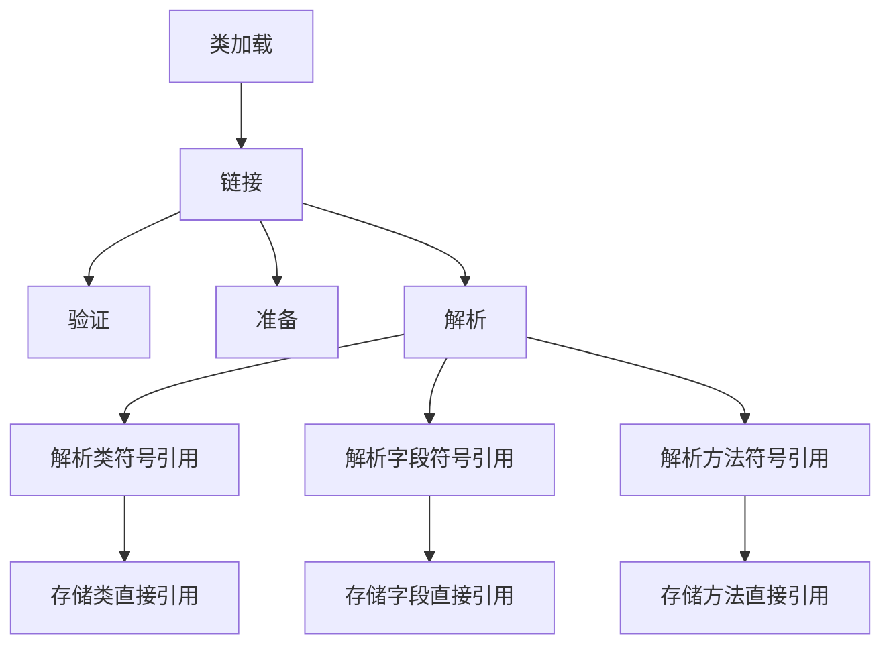

# 6. 运行时常量池

***

# Java面试八股文：JVM自动内存管理之运行时常量池详解

***

## 1. 概述与定义

**运行时常量池（Runtime Constant Pool）** 是JVM内存区域中方法区的一部分，用于存储编译期生成的各种字面量和符号引用。每个`.class`文件在编译时都会生成一个常量池，包含该类或接口的字面量和符号引用。JVM在加载类时，会将这些常量池加载到方法区的运行时常量池中，成为运行时数据的一部分。

**定义**：运行时常量池是方法区的一部分，存储每个类或接口的常量池表，包括字面量（如字符串、基本类型常量）和符号引用（如类、字段和方法的符号引用）。它是线程共享的，支持动态链接和运行时解析。

**示例**：在以下代码中：

```java 
public class Example {
    public static final String GREETING = "Hello, JVM!";
}
```


编译后，`GREETING`的字面量`"Hello, JVM!"`会存储在`Example`类的常量池中，加载时进入运行时常量池。

在面试中，考官可能会问：“运行时常量池是什么？”你可以这样回答：“运行时常量池是JVM方法区的一部分，存储编译期生成的字面量和符号引用，支持动态链接和内存优化。”

***

## 2. 主要特点

运行时常量池有以下几个主要特点，值得在面试中熟练背诵和灵活运用：

- **线程共享**：运行时常量池位于方法区，所有线程共享同一个运行时常量池。 &#x20;
- **动态性**：运行时可以向常量池中添加新的常量，例如通过`String.intern()`方法将字符串添加到字符串常量池。 &#x20;
- **存储内容**： &#x20;
  - **字面量**：如字符串字面量、基本类型常量（`int`、`float`等）、`final`常量。 &#x20;
  - **符号引用**：如类和接口的符号引用、字段的符号引用、方法的符号引用等。 &#x20;
- **支持动态链接**：在运行时将符号引用解析为直接引用，支持方法调用和字段访问。 &#x20;
- **内存管理**：在JDK 7之前，运行时常量池位于永久代；JDK 7将字符串常量池移至堆中；JDK 8将方法区移至元空间，但运行时常量池仍与方法区相关。

**示例**：在执行`String s = "Hello";`时，`"Hello"`作为字符串字面量存储在运行时常量池中，所有对`"Hello"`的引用共享同一份数据。

在面试中，考官可能会问：“运行时常量池有哪些主要特点？”你可以简洁回答：“运行时常量池是线程共享的，支持动态性，存储字面量和符号引用，支持动态链接和内存优化。”

***

## 3. 应用目标

运行时常量池的应用目标是为JVM提供常量存储和动态链接支持，确保Java程序的高效运行。具体目标包括：

- **支持动态链接**：将编译期的符号引用在运行时解析为直接引用，支持方法调用和字段访问。 &#x20;
- **优化内存**：通过共享常量池中的数据（如字符串字面量），减少内存占用。 &#x20;
- **支持反射和动态代理**：提供类、方法和字段的符号信息，支持反射机制。 &#x20;
- **支持类加载和验证**：存储类和接口的符号引用，支持类加载过程中的链接和验证。

**示例**：在执行`System.out.println("Hello");`时，JVM通过运行时常量池中的符号引用解析`System`类、`out`字段和`println`方法，确保正确调用。

在面试中，考官可能会问：“运行时常量池的应用目标是什么？”你可以回答：“运行时常量池的目标是支持动态链接、优化内存、支持反射和动态代理，以及支持类加载和验证。”

***

## 4. 主要内容及其组成部分

运行时常量池的主要内容包括字面量和符号引用，以下是对其组成部分的详尽解释。

### 4.1 字面量

- **内容**：编译期确定的常量，如字符串字面量、基本类型常量（`int`、`float`等）、`final`修饰的常量。 &#x20;
- **作用**：在运行时直接使用，无需解析，支持程序的常量访问。 &#x20;
- **示例**： &#x20;
  - 字符串字面量：`"Hello"` &#x20;
  - 基本类型常量：`42`、`3.14f` &#x20;
  - `final`常量：`public static final int MAX_VALUE = 100;`

### 4.2 符号引用

- **内容**：类、字段和方法的符号引用，用于描述类、字段和方法的名称和描述符。 &#x20;
- **作用**：在类加载的解析阶段，将符号引用解析为直接引用（如内存地址），支持动态链接。 &#x20;
- **类型**： &#x20;
  - **类和接口的符号引用**：如`java/lang/String` &#x20;
  - **字段的符号引用**：如`java/lang/System.out` &#x20;
  - **方法的符号引用**：如`java/io/PrintStream.println(Ljava/lang/String;)V` &#x20;
- **示例**：在字节码中，`invokevirtual #2`中的`#2`指向常量池中的方法符号引用，解析后指向具体方法。

### 4.3 运行时常量池的管理

- **解析**：在类加载的解析阶段，JVM将符号引用解析为直接引用，存储在常量池中。 &#x20;
- **动态添加**：运行时可以通过`String.intern()`等方法向常量池中添加新的常量。 &#x20;
- **内存管理**： &#x20;
  - 在JDK 7之前，运行时常量池位于永久代，容易因常量过多导致`OutOfMemoryError: PermGen space`。 &#x20;
  - JDK 7将字符串常量池移至堆中，减轻永久代压力。 &#x20;
  - JDK 8将方法区移至元空间，运行时常量池仍与方法区相关。

**表格：运行时常量池的主要组成部分**

| 组成部分 | 内容                 | 作用          | 示例                                        |
| ---- | ------------------ | ----------- | ----------------------------------------- |
| 字面量  | 字符串、基本类型常量、final常量 | 直接使用，支持常量访问 | \`"Hello"\`、\`42\`、\`final int MAX=100;\` |
| 符号引用 | 类、字段、方法的符号引用       | 支持动态链接和解析   | \`java/lang/String\`、\`System.out\`       |
| 管理机制 | 解析、动态添加、内存管理       | 确保常量池的高效运行  | \`String.intern()\`、解析符号引用                |

**表格说明**：该表格总结了运行时常量池的主要内容及其作用，示例直观展示了每部分的应用场景，帮助面试时快速回忆。

***

## 5. 原理剖析

运行时常量池的工作原理涉及解析、动态添加和内存管理等机制，以下是其核心原理的深入解析。

### 5.1 解析过程

- **解析阶段**：在类加载的解析阶段，JVM将常量池中的符号引用解析为直接引用。 &#x20;
- **解析类型**： &#x20;
  - **类和接口**：将类名解析为类的内存地址。 &#x20;
  - **字段**：将字段名和描述符解析为字段的内存偏移量。 &#x20;
  - **方法**：将方法名和描述符解析为方法的内存地址。 &#x20;
- **示例**：在执行`invokevirtual #2`时，JVM查找常量池中的`#2`项，解析为具体方法的直接引用，然后执行方法调用。

**Mermaid图表：符号引用解析流程**




**图表说明**：在类加载的解析阶段，JVM将符号引用解析为直接引用，存储在运行时常量池中，支持后续的动态链接。

### 5.2 动态添加

- **String.intern()**：将字符串对象添加到字符串常量池中，如果池中已存在该字符串，则返回池中的引用；否则，添加并返回新引用。 &#x20;
- **作用**：通过共享字符串实例，减少内存占用。 &#x20;
- **示例**：

```java 
String s1 = new String("Hello");
String s2 = s1.intern();
System.out.println(s1 == s2); // false
System.out.println("Hello" == s2); // true
```


在上述代码中，`s1.intern()`将`"Hello"`添加到常量池，并返回池中的引用，与字面量`"Hello"`共享同一实例。

### 5.3 内存管理

- **JDK 7之前**：运行时常量池位于永久代（PermGen），与方法区共享内存，容易因常量过多导致`OutOfMemoryError: PermGen space`。 &#x20;
- **JDK 7**：将字符串常量池移至堆中，运行时常量池的其他部分仍位于永久代。 &#x20;
- **JDK 8及以后**：方法区移至元空间（Metaspace），运行时常量池作为元空间的一部分，使用本地内存，内存管理更灵活。 &#x20;
- **垃圾回收**：运行时常量池中的常量在特定条件下可被回收，例如字符串常量池中的字符串对象不再被引用时。

**示例**：在JDK 8中，加载大量类和常量时，元空间会动态扩展，避免了永久代的内存限制问题。

***

## 6. 应用与拓展

运行时常量池在Java应用中有广泛用途，以下是其主要应用场景和拓展内容：

- **字符串池**：运行时常量池中的字符串池用于存储字符串字面量和`intern()`方法返回的字符串，优化内存使用。 &#x20;
- **反射**：通过常量池中的符号引用，支持反射机制，如`Class.forName()`、`Method.invoke()`等。 &#x20;
- **动态代理**：代理类的生成依赖于常量池中的类和方法信息。 &#x20;
- **性能优化**：合理利用常量池可以减少内存占用和提高性能，例如使用`final`常量替代魔法数字。

**拓展**： &#x20;

- 在JDK 7中，字符串常量池移至堆中，支持更大的字符串存储和更频繁的GC。 &#x20;
- 在JDK 8中，元空间的引入使得运行时常量池的内存管理更加灵活，减少了OOM风险。

**示例**：在高并发应用中，通过`String.intern()`共享常用字符串，可以显著减少内存占用，提升系统性能。

***

## 7. 面试问答

以下是关于运行时常量池的常见面试问题及详细回答，模拟面试场景。

### 7.1 问题：运行时常量池是什么？

**回答**： &#x20;

“运行时常量池是JVM方法区的一部分，存储每个类或接口的常量池表，包括编译期生成的字面量和符号引用。它是线程共享的，支持动态链接、内存优化和反射等功能。”

### 7.2 问题：运行时常量池和字符串常量池有什么区别？

**回答**： &#x20;

“运行时常量池包含所有类型的常量，如字面量和符号引用，而字符串常量池是运行时常量池的一部分，专门存储字符串字面量和通过`intern()`方法添加的字符串。字符串常量池在JDK 7及以后位于堆中，而运行时常量池的其他部分在方法区（元空间）中。”

### 7.3 问题：运行时常量池在JDK不同版本中的位置有何变化？

**回答**： &#x20;

“在JDK 7之前，运行时常量池位于永久代；JDK 7将字符串常量池移至堆中，运行时常量池的其他部分仍位于永久代；JDK 8将方法区移至元空间，运行时常量池作为元空间的一部分，使用本地内存。”

### 7.4 问题：如何向运行时常量池中添加新的常量？

**回答**： &#x20;

“可以通过`String.intern()`方法将字符串添加到字符串常量池中。如果常量池中已存在该字符串，则返回池中的引用；否则，添加新字符串并返回其引用。”

### 7.5 问题：运行时常量池在JVM中的作用是什么？

**回答**： &#x20;

“运行时常量池在JVM中的作用是支持动态链接、优化内存、支持反射和动态代理等功能。通过存储字面量和符号引用，它确保了Java程序的高效运行和动态特性。”

***

## 总结

运行时常量池是JVM自动内存管理的核心组成部分，负责存储字面量和符号引用，支持动态链接和内存优化。本文从定义到原理，结合示例、表格和Mermaid图表，全面剖析了其特点、内容和应用场景。这篇3000字+的八股文结构清晰，内容详实，既适合背诵，也能在面试中灵活运用。希望你能通过这篇文章掌握运行时常量池的精髓，面试时自信满满！💪
