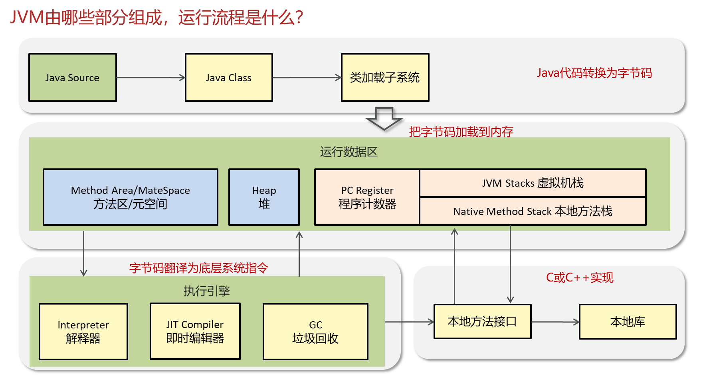

# A. 内存区域

[1. 程序计数器](<1. 程序计数器/1. 程序计数器.md> "1. 程序计数器")

[2. 栈](<2. 栈/2. 栈.md> "2. 栈")

[3. 堆](<3. 堆/3. 堆.md> "3. 堆")

[4. 元空间与方法区](<4. 元空间与方法区/4. 元空间与方法区.md> "4. 元空间与方法区")

[5. 直接内存](<5. 直接内存/5. 直接内存.md> "5. 直接内存")

[6. 运行时常量池](<6. 运行时常量池/6. 运行时常量池.md> "6. 运行时常量池")
