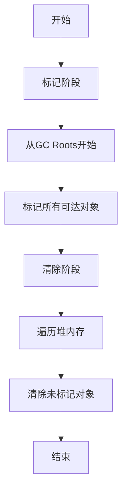
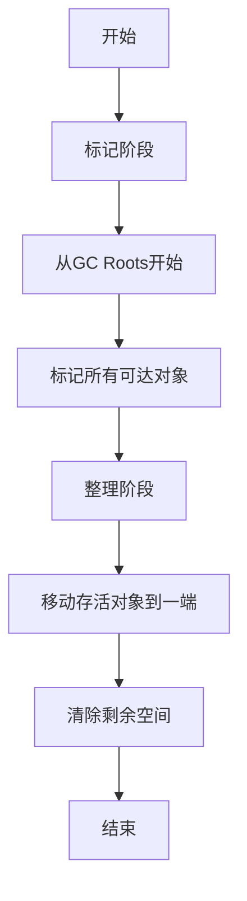

# 2. 回收算法

# Java面试八股文：JVM垃圾收集与内存分配之回收算法（标记清除、标记复制、标记整理）详解

***

## 1. 概述与定义

JVM的垃圾回收机制是Java语言的核心优势之一，它通过自动识别和清理不再使用的对象，释放内存空间，让开发者无需手动管理内存。**回收算法**是垃圾回收的具体实现方式，决定了JVM如何高效地完成这一过程。在JVM中，常见的回收算法包括**标记清除**、**标记复制**和**标记整理**，它们分别通过不同的策略管理内存，适用于不同的场景。

- **标记清除（Mark-Sweep）**：从根对象（GC Roots，如栈帧中的局部变量、静态变量等）开始，标记所有存活的对象，然后清除未标记的对象，回收内存空间。
- **标记复制（Mark-Copy）**：将内存分为两块区域（通常称为From和To区），每次只使用其中一块，回收时将存活对象复制到另一块，清空当前块，然后交换两块的角色。
- **标记整理（Mark-Compact）**：标记存活对象后，将这些对象移动到内存的一端，形成连续的内存区域，然后清除剩余的空闲空间。

这些算法在JVM的分代收集策略中扮演重要角色。例如，新生代（Young Generation）通常使用标记复制算法，而老年代（Old Generation）更倾向于标记清除或标记整理。这些算法共同确保JVM能够高效管理内存，减少内存泄漏和性能瓶颈。

在面试中，如果被问到“JVM中的回收算法有哪些？”你可以这样回答：“JVM常见的回收算法包括标记清除、标记复制和标记整理。标记清除简单但会产生内存碎片；标记复制避免碎片但空间利用率低；标记整理无碎片但移动对象开销较大。它们在不同场景下各有优势。”

***

## 2. 主要特点

每种回收算法都有其独特的工作方式，带来不同的优点和缺点。以下是对三种算法特点的详细分析，方便你在面试中快速抓住重点。

### 2.1 标记清除（Mark-Sweep）

- **特点**：分为两个阶段——标记和清除。标记阶段从GC Roots遍历，标记所有可达对象；清除阶段遍历整个堆，回收未标记的对象。
- **优点**：实现简单，支持处理循环引用（通过可达性分析）。
- **缺点**：清除后内存不连续，产生碎片，可能导致大对象分配失败。
- **适用性**：适合存活对象较多的场景，如老年代。

### 2.2 标记复制（Mark-Copy）

- **特点**：内存分为两块（From和To），回收时将From区的存活对象复制到To区，清空From区，然后交换角色。
- **优点**：无内存碎片，分配效率高，适合存活对象少的场景。
- **缺点**：空间利用率低（仅50%可用），复制开销与存活对象数量成正比。
- **适用性**：适合新生代，因新生代对象存活率低。

### 2.3 标记整理（Mark-Compact）

- **特点**：标记存活对象后，将其移动到内存一端，整理出连续空闲空间，然后清除剩余部分。
- **优点**：无碎片，空间利用率高，适合长期存活对象。
- **缺点**：移动对象并更新引用，开销大，停顿时间较长。
- **适用性**：适合老年代，因老年代对象存活率高。

### 特点对比表格

| 算法   | 优点           | 缺点           | 适用场景  |
| ---- | ------------ | ------------ | ----- |
| 标记清除 | 实现简单，能处理循环引用 | 产生碎片，内存不连续   | 老年代回收 |
| 标记复制 | 无碎片，分配效率高    | 空间利用率低，复制开销大 | 新生代回收 |
| 标记整理 | 无碎片，空间利用率高   | 整理开销大，停顿时间长  | 老年代回收 |

**表格说明**：该表格清晰对比了三种算法的特点，面试时可直接引用，简洁明了地展示你的知识储备。

***

## 3. 应用目标

回收算法的设计目标是高效、安全地管理JVM内存，具体包括以下几个方面：

- **识别无用对象**：通过可达性分析，准确判断哪些对象不再被引用。
- **释放内存空间**：及时回收垃圾对象，为新对象分配提供空间。
- **减少停顿时间**：优化GC过程，尽量减少应用暂停（Stop-The-World）。
- **避免内存碎片**：保持内存的连续性，便于大对象分配。
- **适应不同场景**：根据对象生命周期和内存区域特点，选择合适的算法。

**示例**：在一个高并发Web应用中，请求处理生成的临时对象生命周期短，适合用标记复制快速回收；而缓存对象生命周期长，存活率高，适合用标记整理避免碎片，确保内存分配效率。

***

## 4. 主要内容及其组成部分

### 4.1 标记清除（Mark-Sweep）

- **工作流程**：
  1. **标记阶段**：从GC Roots开始，递归标记所有可达对象。
  2. **清除阶段**：遍历堆内存，清除未标记的对象，回收空间。
- **组成部分**：
  - **GC Roots**：包括栈中的局部变量、方法区中的静态变量、常量引用等。
  - **标记位**：每个对象有一个标记位，记录是否可达。
- **Mermaid流程图**：

**图表说明**：流程图展示了标记清除的两个核心阶段，标记阶段依赖可达性分析，清除阶段负责回收。

### 4.2 标记复制（Mark-Copy）

- **工作流程**：
  1. 内存分为From和To两块，初始时对象分配在From区。
  2. 回收时，将From区的存活对象复制到To区。
  3. 清空From区，交换From和To的角色。
- **组成部分**：
  - **From区**：当前使用的内存区域。
  - **To区**：备用内存区域，用于接收存活对象。
- **示例**：HotSpot JVM新生代的Eden和Survivor区，Minor GC时将存活对象从Eden和From Survivor复制到To Survivor。

### 4.3 标记整理（Mark-Compact）

- **工作流程**：
  1. **标记阶段**：同标记清除，从GC Roots标记存活对象。
  2. **整理阶段**：将存活对象移动到内存一端，清除剩余空间。
- **组成部分**：
  - **GC Roots**：根对象集合。
  - **标记位**：记录对象存活状态。
  - **整理算法**：负责移动对象并更新引用地址。
- **Mermaid流程图**：

**图表说明**：标记整理多了整理阶段，确保内存连续性。

***

## 5. 原理剖析

### 5.1 标记清除（Mark-Sweep）

- **原理**：通过可达性分析，标记存活对象，清除未标记对象。
- **深入剖析**：
  - **标记过程**：从GC Roots出发，遍历对象引用链，标记所有可达对象。时间复杂度与存活对象数量相关。
  - **清除过程**：线性扫描堆，回收未标记对象。时间复杂度与堆大小相关。
  - **碎片问题**：清除后，存活对象之间的空隙形成碎片，可能导致大对象无法分配。
- **示例**：
  - 假设堆中有对象A、B、C，A和B可达，C不可达。标记后，C被清除，但A和B之间可能出现碎片。
  - 老年代使用标记清除时，碎片可能触发Full GC。
- **解决方法**：结合标记整理，或使用分代收集减少碎片影响。

### 5.2 标记复制（Mark-Copy）

- **原理**：将存活对象复制到新区域，清空旧区域，交换角色。
- **深入剖析**：
  - **复制过程**：只复制存活对象，时间复杂度与存活对象数量相关。
  - **空间利用**：内存分为两块，仅一半可用，浪费严重。
  - **优化**：HotSpot JVM将新生代分为Eden和两个Survivor区（比例8:1:1），空间利用率提升至90%。
- **示例**：
  - Eden区8MB，两个Survivor区各1MB。Minor GC时，Eden和From Survivor的存活对象复制到To Survivor，清空Eden和From。
  - 若存活对象超过To Survivor容量，则进入老年代。
- **适用性**：新生代对象存活率低，复制开销小。

### 5.3 标记整理（Mark-Compact）

- **原理**：标记存活对象后，移动到内存一端，清除剩余空间。
- **深入剖析**：
  - **标记过程**：同标记清除。
  - **整理过程**：移动对象并更新所有引用地址，时间复杂度与存活对象数量和堆大小相关。
  - **开销**：移动对象需要调整引用，停顿时间长。
- **示例**：
  - 老年代有对象A、B、C，标记后A和B存活，移动到内存一端，清除C占用的空间。
  - Full GC时，老年代整理避免碎片，但停顿明显。
- **优化**：现代收集器（如G1、ZGC）引入并发整理，减少停顿。

***

## 6. 应用与拓展

### 6.1 应用场景

- **Serial收集器**：单线程，新生代用标记复制，老年代用标记整理，小型应用。
- **Parallel收集器**：多线程，标记复制+标记整理，追求吞吐量。
- **CMS收集器**：并发标记清除，低停顿，适合服务端。
- **G1收集器**：分区管理，标记复制+标记整理，适合大内存低停顿。

### 6.2 JVM参数

- `-XX:+UseSerialGC`：启用Serial收集器。
- `-XX:+UseParallelGC`：启用Parallel收集器。
- `-XX:+UseConcMarkSweepGC`：启用CMS。
- `-XX:+UseG1GC`：启用G1。

### 6.3 拓展

- **增量GC**：分步执行，减少单次停顿。
- **并发GC**：GC线程与应用线程并发，如CMS和G1。
- **未来趋势**：低停顿（如ZGC）、高吞吐量、自适应调优。

***

## 7. 面试问答

### 7.1 JVM有哪些回收算法？

“JVM常见的回收算法有标记清除、标记复制和标记整理。标记清除从GC Roots标记存活对象，然后清除未标记的，简单但有碎片；标记复制将内存分为两块，存活对象复制到另一块，无碎片但空间利用率低；标记整理标记后移动对象到一端，无碎片但开销大。这些算法在分代收集中有不同应用。”

### 7.2 标记清除和标记整理的区别？

“标记清除和标记整理都先标记存活对象，但处理方式不同。标记清除直接清除未标记对象，简单高效，但会产生碎片；标记整理在标记后将存活对象移动到内存一端，整理出连续空间，避免碎片，但移动对象和更新引用的开销大。标记清除适合CMS，标记整理适合老年代Full GC。”

### 7.3 标记复制为什么适合新生代？

“标记复制适合新生代，因为新生代对象存活率低，复制开销小。它将内存分为两块，只复制存活对象到另一块，无碎片且分配快。HotSpot JVM中，Eden和Survivor区用标记复制，Minor GC效率高。若存活对象多，复制开销会增加，所以老年代不用。”

### 7.4 老年代为什么不常用标记复制？

“老年代不常用标记复制，因为老年代对象存活率高，复制大量对象开销大，且空间利用率只有50%，浪费严重。相比之下，标记清除或标记整理更适合老年代，能处理高存活率场景，标记整理还能避免碎片。”

### 7.5 如何选择合适的回收算法？

“选择回收算法要看场景。新生代存活对象少，用标记复制效率高，如Serial和Parallel收集器；老年代存活对象多，用标记清除（如CMS）或标记整理（如G1的Full GC）更合适。现代收集器如G1结合多种算法，根据分区动态调整，兼顾吞吐量和低停顿。”

***
