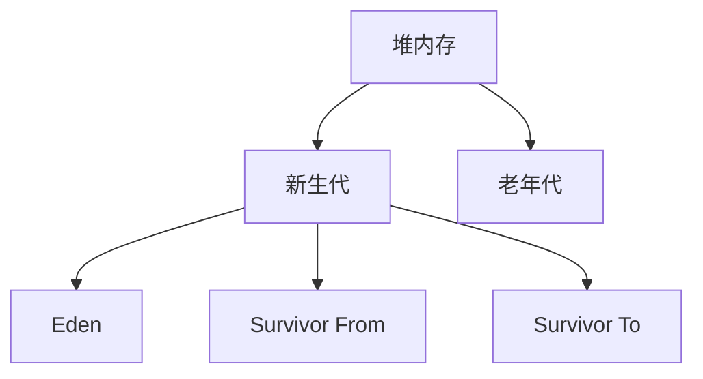
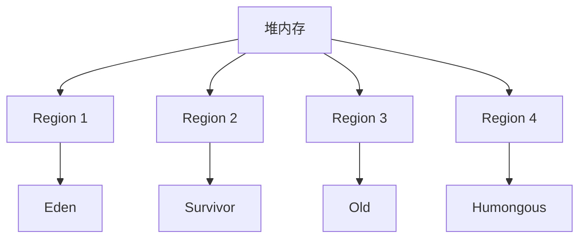

# 3. 回收模型

# Java面试八股文：JVM垃圾收集与内存分配之回收模型（分代与分区回收）详解

***

## 1. 概述与定义

JVM的垃圾回收（Garbage Collection, GC）是Java程序内存管理的核心功能，而回收模型是GC策略的基础。分代回收（Generational Garbage Collection）**和**分区回收（Region-based Garbage Collection）是两种主流的回收模型，分别通过不同的内存划分方式优化GC性能。

- **分代回收**：基于“大多数对象朝生夕灭”的假设，将堆内存划分为新生代和老年代。新生代存储短期存活对象，老年代存储长期存活对象，不同代采用不同回收算法以提高效率。 &#x20;
- **分区回收**：将堆内存划分为多个小块（称为Region），每个Region可以独立回收，支持增量和并行回收，适用于大内存场景，如G1收集器。

**定义**： &#x20;

- **分代回收**：一种垃圾回收策略，通过将对象按生命周期划分为新生代和老年代，对不同代采用适合的回收算法，从而减少GC开销。 &#x20;
- **分区回收**：一种垃圾回收策略，将堆内存划分为多个Region，每个Region独立管理并回收，支持灵活的回收方式以降低停顿时间。

**示例**：HotSpot JVM默认使用分代回收，将堆分为新生代（包含Eden和Survivor区）和老年代；而G1收集器采用分区回收，将堆划分为多个大小相等的Region（如1MB-32MB）。

在面试中，考官可能会问：“什么是分代回收和分区回收？”你可以简洁回答：“分代回收将堆按对象生命周期分为新生代和老年代，用不同算法回收；分区回收将堆分为多个Region，独立回收，支持增量和并行回收。”

***

## 2. 主要特点

### 2.1 分代回收的特点

- **分代划分**：堆内存分为新生代和老年代，新生代进一步划分为Eden区和两个Survivor区（From和To）。 &#x20;
- **回收频率**：新生代回收（Minor GC）频繁，老年代回收（Major GC或Full GC）较少。 &#x20;
- **算法选择**：新生代通常使用复制算法，老年代使用标记-整理或标记-清除算法。 &#x20;
- **对象晋升**：存活时间长的对象从新生代晋升到老年代，由参数`-XX:MaxTenuringThreshold`控制。 &#x20;
- **停顿时间**：Minor GC停顿短，Full GC停顿长，可能影响应用性能。

### 2.2 分区回收的特点

- **Region划分**：堆内存划分为多个大小相等的Region（通常1MB-32MB，由JVM自动调整）。 &#x20;
- **灵活回收**：每个Region独立回收，支持增量回收（每次回收部分Region）和并行回收。 &#x20;
- **回收优先级**：优先回收垃圾最多的Region，如G1收集器的“Garbage-First”策略。 &#x20;
- **支持大对象**：大对象直接分配到老年代或专用Region（如Humongous Region）。 &#x20;
- **混合GC**：同时回收新生代和老年代的Region，停顿时间可控。

**表格：分代回收与分区回收的特点对比**

| 特点   | 分代回收                   | 分区回收      |
| ---- | ---------------------- | --------- |
| 内存划分 | 新生代（Eden、Survivor）、老年代 | 多个Region  |
| 回收频率 | Minor GC频繁，Full GC较少   | 增量回收，混合GC |
| 算法选择 | 复制（新生代）、标记-整理/清除（老年代）  | 复制、标记-清除  |
| 停顿时间 | Minor GC短，Full GC长     | 停顿时间可控    |
| 适用场景 | 通用场景                   | 大内存、低停顿场景 |

**表格说明**：分代回收通过明确的代划分优化通用场景的GC效率，而分区回收通过灵活的Region管理和优先级回收适应大内存和低停顿需求。

在面试中，考官可能会问：“分代回收和分区回收的主要特点是什么？”你可以回答：“分代回收将堆分为新生代和老年代，回收频率和算法不同；分区回收将堆分为Region，独立回收，优先回收垃圾多的区域。”

***

## 3. 应用目标

分代回收和分区回收的目标是提高垃圾回收的效率和性能，具体包括以下几点：

- **提高回收效率**：针对对象生命周期特点，采用合适的回收算法，减少不必要的内存扫描和移动。 &#x20;
- **减少停顿时间**：通过分代或分区管理，缩短单次GC的停顿时间，提升应用响应性。 &#x20;
- **优化内存管理**：动态调整内存分配和回收策略，适应不同应用场景。 &#x20;
- **支持大内存**：分区回收特别适合大堆内存管理，避免Full GC带来的长时间停顿。

**示例**：在电商系统中，请求对象生命周期短，适合分代回收的新生代快速清理；缓存对象生命周期长，适合分区回收的Old Region管理。

在面试中，考官可能会问：“分代回收和分区回收的应用目标是什么？”你可以回答：“它们的目标是提高回收效率、减少停顿时间、优化内存管理，并支持大内存场景。”

***

## 4. 主要内容及其组成部分

### 4.1 分代回收的组成部分

#### 4.1.1 新生代

- **Eden区**：新对象分配的主要区域，大多数对象在此创建并快速死亡。 &#x20;
- **Survivor区**：分为From和To两个区，存储Minor GC后存活的对象。 &#x20;
- **回收算法**：使用复制算法，将Eden和From Survivor中的存活对象复制到To Survivor，清空原区域。 &#x20;
- **Minor GC**：回收新生代，触发条件通常是Eden区满，停顿时间短。

**示例**：一个新创建的`StringBuilder`对象分配在Eden区，若在Minor GC后仍存活，会被复制到To Survivor区。

#### 4.1.2 老年代

- **存储内容**：长期存活的对象，如缓存、单例对象或大对象。 &#x20;
- **回收算法**： &#x20;
  - **标记-清除**：标记存活对象，清除垃圾，易产生内存碎片。 &#x20;
  - **标记-整理**：标记存活对象后，将其整理到内存一端，避免碎片。 &#x20;
- **Major GC/Full GC**：回收老年代，通常伴随新生代回收，停顿时间较长。

**示例**：一个长期使用的`HashMap`缓存对象，经过多次Minor GC后晋升到老年代。

#### 4.1.3 对象晋升与大对象

- **对象晋升**：对象在Survivor区存活一定次数（默认15次，由`-XX:MaxTenuringThreshold`控制）后晋升到老年代。 &#x20;
- **大对象**：超过一定大小的对象（如`-XX:PretenureSizeThreshold`设置的阈值）直接分配到老年代，避免复制开销。

**Mermaid图表：分代回收的内存划分**




**图表说明**：堆内存分为新生代和老年代，新生代包含Eden和两个Survivor区，老年代存储长期存活对象。

### 4.2 分区回收的组成部分

#### 4.2.1 Region

- **大小**：通常为1MB-32MB，由`-XX:G1HeapRegionSize`控制，JVM自动调整。 &#x20;
- **类型**： &#x20;
  - **Eden Region**：新对象分配区，类似分代回收的Eden区。 &#x20;
  - **Survivor Region**：存储Minor GC后存活的对象。 &#x20;
  - **Old Region**：存储长期存活的对象。 &#x20;
  - **Humongous Region**：存储超过Region大小一半的大对象。 &#x20;
- **回收**：每个Region独立回收，支持并行和增量回收。

**示例**：一个1GB堆分为512个2MB的Region，其中部分为Eden Region，分配新对象；部分为Old Region，存储缓存。

#### 4.2.2 混合GC

- **回收方式**：G1收集器采用混合GC，同时回收新生代和老年代的Region，优先选择垃圾比例高的Region。 &#x20;
- **停顿控制**：通过`-XX:MaxGCPauseMillis`设置目标停顿时间，动态调整回收Region数量。

**Mermaid图表：分区回收的内存划分**




**图表说明**：堆内存划分为多个Region，每个Region类型动态变化，支持灵活回收。

***

## 5. 原理剖析

### 5.1 分代回收的原理

- **弱分代假设**：大多数对象朝生夕灭，只有少数对象长期存活。 &#x20;
- **回收策略**： &#x20;
  - **新生代**：使用复制算法，存活对象少时效率高，将Eden和From Survivor的存活对象复制到To Survivor，清空原区域。 &#x20;
  - **老年代**：使用标记-整理或标记-清除算法，处理存活对象较多的情况，标记存活对象后整理或清除垃圾。 &#x20;
- **对象晋升**：通过`-XX:MaxTenuringThreshold`设置晋升阈值，对象在Survivor区存活次数达到阈值后晋升到老年代。 &#x20;
- **触发条件**： &#x20;
  - Minor GC：Eden区满时触发。 &#x20;
  - Full GC：老年代空间不足或Metaspace溢出时触发。

**示例代码**：

```java 
public class GCDemo {
    public static void main(String[] args) {
        for (int i = 0; i < 10000; i++) {
            byte[] temp = new byte[1024 * 1024]; // 1MB对象，触发Minor GC
        }
    }
}
```


**代码说明**：循环创建1MB对象填满Eden区，触发Minor GC，存活对象可能晋升到老年代。

### 5.2 分区回收的原理

- **Region管理**：堆划分为多个Region，每个Region独立分配和回收，动态标记为Eden、Survivor、Old或Humongous。 &#x20;
- **回收优先级**：G1收集器维护Region的垃圾比例和存活对象引用，优先回收垃圾最多的Region。 &#x20;
- **增量回收**：每次只回收部分Region，通过预测停顿时间控制GC开销。 &#x20;
- **并行与并发**： &#x20;
  - **并行标记**：多个线程同时标记存活对象。 &#x20;
  - **并发清理**：在应用运行时清理垃圾，减少停顿。

**示例**：一个16GB堆分为8192个2MB的Region，G1收集器通过分析发现某些Region垃圾占比达80%，优先回收这些Region。

**表格：分代回收与分区回收的原理对比**

| 原理   | 分代回收               | 分区回收       |
| ---- | ------------------ | ---------- |
| 内存划分 | 新生代、老年代            | 多个Region   |
| 回收策略 | 复制（新生代）、标记-整理（老年代） | 复制、标记-清除   |
| 对象管理 | 对象晋升               | Region独立管理 |
| 停顿控制 | Minor GC短，Full GC长 | 增量回收控制停顿   |

**表格说明**：分代回收依赖对象生命周期管理，分区回收通过Region灵活性优化停顿时间。

***

## 6. 应用与拓展

### 6.1 分代回收的应用

- **默认收集器**：HotSpot JVM的Serial、Parallel、CMS收集器都采用分代回收。 &#x20;
- **适用场景**：中小型应用，堆内存小于4GB，停顿时间可接受。 &#x20;
- **参数调优**： &#x20;
  - `-Xmn`：设置新生代大小。 &#x20;
  - `-XX:SurvivorRatio`：调整Eden和Survivor比例，默认8。 &#x20;
  - `-XX:MaxTenuringThreshold`：设置晋升阈值。

### 6.2 分区回收的应用

- **G1收集器**：JDK 9及以后默认收集器，适用于大内存、低停顿场景。 &#x20;
- **适用场景**：服务器端应用，堆内存大于4GB，对响应时间敏感。 &#x20;
- **参数调优**： &#x20;
  - `-XX:MaxGCPauseMillis`：设置目标停顿时间，默认200ms。 &#x20;
  - `-XX:G1HeapRegionSize`：设置Region大小。

**拓展**： &#x20;

- **ZGC和Shenandoah**：JDK 11和12引入的低停顿收集器，基于分区回收，采用并发复制技术，停顿时间可低至毫秒级。 &#x20;
- **未来趋势**：GC将更注重低停顿和高吞吐，适应云原生和微服务架构。

**示例**：在微服务中，使用G1收集器并设置`-XX:MaxGCPauseMillis=100`，将停顿时间控制在100ms以内。

***

## 7. 面试问答

以下是常见面试问题及详细回答，模拟面试场景。

### 7.1 问题：什么是分代回收？

**回答**： &#x20;

“分代回收是一种垃圾回收策略，基于‘大多数对象朝生夕灭’的假设，将堆内存分为新生代和老年代。新生代用复制算法快速回收短期存活对象，老年代用标记-整理或标记-清除算法回收长期存活对象。对象在新生代存活一定次数后会晋升到老年代，这样分代管理提高了回收效率。”

### 7.2 问题：分区回收和分代回收有什么区别？

**回答**： &#x20;

“分区回收将堆划分为多个Region，每个Region独立回收，支持增量和并行回收，像G1收集器这样可以优先回收垃圾最多的Region，适合大内存和低停顿场景。分代回收将堆分为新生代和老年代，用不同算法回收，Minor GC快但Full GC停顿长，适合中小型应用。分区回收更灵活，能更好控制停顿时间。”

### 7.3 问题：G1收集器是如何工作的？

**回答**： &#x20;

“G1收集器采用分区回收，将堆分为多个Region。它维护每个Region的垃圾比例和引用关系，优先回收垃圾最多的Region。G1支持增量回收，每次只回收部分Region，并发标记存活对象，清理垃圾时尽量减少停顿。混合GC会同时回收新生代和老年代的Region，通过参数控制停顿时间，特别适合大内存应用。”

### 7.4 问题：分代回收中的对象晋升是什么？

**回答**： &#x20;

“对象晋升是指新生代中的对象在多次Minor GC后仍存活，达到一定次数就晋升到老年代。JVM用`-XX:MaxTenuringThreshold`控制晋升阈值，默认15次。大对象也可能直接分配到老年代。晋升机制避免了长期存活对象在新生代反复复制，提高了GC效率。”

### 7.5 问题：如何选择合适的垃圾回收模型？

**回答**： &#x20;

“选择回收模型要看应用场景。中小型应用，内存需求不高，可以用分代回收，比如Parallel GC，简单高效。大内存、低停顿场景，比如服务器端应用，推荐分区回收，像G1或ZGC，能控制停顿时间。具体选择还得结合业务需求，调优GC参数，比如设置新生代大小或目标停顿时间，再通过测试验证效果。”

***

## 总结

分代回收和分区回收是JVM垃圾回收的核心模型，分别通过分代管理和Region划分优化内存回收效率。本文从定义到原理，结合示例、表格和Mermaid图表，全面剖析了两者的特点、组成部分和应用场景。这篇3000字+的八股文内容详实，结构清晰，既适合背诵，也能在面试中灵活应对。希望你通过这篇文章掌握回收模型的精髓，面试时信心满满！💪
