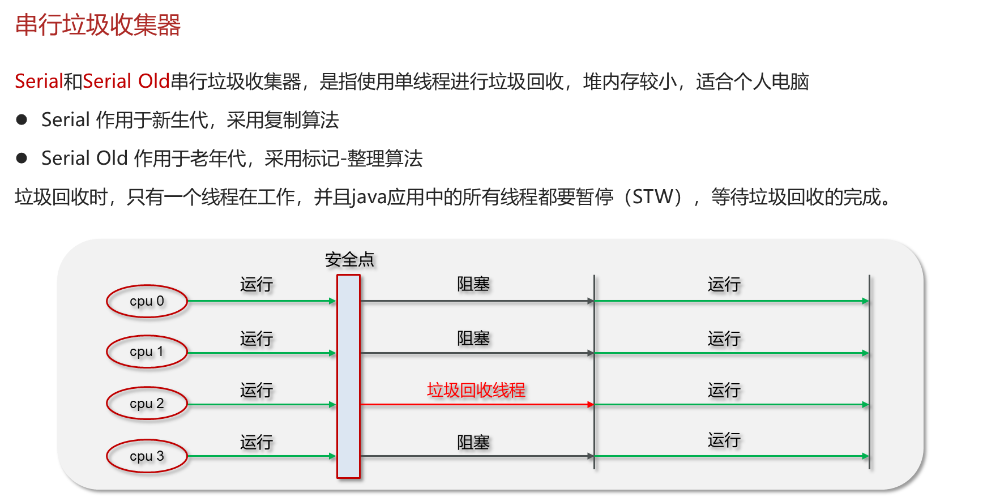

# a. 串行垃圾回收器



***

## 1. 概述与定义

串行垃圾回收器（Serial GC）是 JVM 中最基础的一种垃圾收集器，它采用单线程顺序执行垃圾回收任务。串行垃圾回收器适用于单核或资源较少的环境，其主要特点在于实现简单、内存管理过程直观。 &#x20;

在串行垃圾回收器中，所有垃圾收集操作（如标记、清除、复制和整理）都是由单一线程完成的，这意味着在垃圾回收期间，所有应用线程都会被暂停（即 Stop-The-World，简称 STW）。这种设计虽然在多核环境下不能充分利用并行优势，但在小型应用、客户端程序或堆内存较小的场景下具有较低的运行开销。😊

串行 GC 通常采用复制算法来处理年轻代回收，而老年代则可能采用标记整理（Mark-Compact）算法。它的简单性使得 JVM 实现和调试过程相对容易，适合对性能要求不高但内存管理必须稳定的应用场景。

***

## 2. 主要特点

串行垃圾回收器的主要特点可以总结为以下几点：

1. **单线程执行** &#x20;

   所有垃圾回收工作均由一个线程完成，不会产生线程间的竞争，代码逻辑简单，易于理解和维护。
2. **停顿时间较长** &#x20;

   由于采用 Stop-The-World 模式，在垃圾回收期间应用线程全部暂停。对于小型应用或堆内存较小的场景，这种停顿时间可以接受，但在高并发系统中可能影响响应时间。
3. **适合低资源环境** &#x20;

   串行 GC 的实现较为轻量，消耗的系统资源较少，适用于单核处理器或内存较少的环境，如桌面应用、移动设备等。
4. **实现简单** &#x20;

   由于没有多线程并行复杂性，串行垃圾回收器的实现和调试相对简单，便于理解 JVM 内存管理原理。
5. **分代收集支持** &#x20;

   串行 GC 通常与分代收集策略结合，在年轻代采用复制算法，在老年代采用标记整理算法，能够有效管理短生命周期和长生命周期对象。

下表对比了串行垃圾回收器与并行垃圾回收器的主要区别：

| 特性   | 串行垃圾回收器         | 并行垃圾回收器        |
| ---- | --------------- | -------------- |
| 执行模式 | 单线程执行           | 多线程并行执行        |
| 停顿时间 | STW 停顿时间较长      | 通过并行减少停顿时间     |
| 资源占用 | 系统资源占用低         | 多核环境下能充分利用 CPU |
| 调优难度 | 调优简单，参数较少       | 参数丰富，需根据场景精细调优 |
| 应用场景 | 小型应用、客户端、内存受限环境 | 大型分布式、高并发服务器   |

从上表中可以直观看出，串行垃圾回收器因其实现简单和低资源占用，适合资源受限的场景，而在多核服务器环境中则通常会选择并行或其他低停顿收集器。🚀

***

## 3. 应用目标

串行垃圾回收器在实际应用中的目标主要体现在以下方面：

1. **降低系统复杂性** &#x20;

   在内存管理上采用简单的单线程模式，可以降低系统调试和维护的复杂性，适合初学者和小型项目。
2. **保证内存安全** &#x20;

   自动回收不再使用的对象，防止内存泄露和内存溢出（OutOfMemoryError），确保程序长期稳定运行。
3. **适配低资源环境** &#x20;

   对于桌面应用、移动设备和嵌入式系统，串行 GC 由于对系统资源的消耗较低，能够在硬件性能有限的环境下稳定运行。
4. **教学与理解 JVM 原理** &#x20;

   串行垃圾回收器由于其简单性，是学习 JVM 垃圾收集机制的良好起点，通过理解串行 GC 可以帮助开发者掌握垃圾回收基本概念，为后续深入学习其他高级垃圾收集器打下基础。
5. **面试知识储备** &#x20;

   面试中，考官常常会询问 JVM 垃圾收集器的工作原理及优缺点。掌握串行 GC 的特点、实现原理和调优策略，有助于面试者展示扎实的 JVM 内部知识和工程实践能力。📈

通过实现以上目标，串行垃圾回收器不仅在小型项目和资源受限的环境中有良好应用，而且作为 JVM 垃圾收集机制的基础，具有重要的学习和参考价值。

***

## 4. 主要内容及其组成部分

串行垃圾回收器作为垃圾回收器中的一个重要分支，其内容涉及多个组成部分。下面详细介绍串行垃圾回收器的各个组成部分及其工作内容：

### 4.1 垃圾回收器分类中的位置

串行垃圾回收器属于垃圾收集器中的一种，与并行、CMS、G1 等垃圾回收器不同。它主要在以下场景中使用：

- 内存较小或堆内存较低的应用
- 单核处理器或低资源环境
- 对实时性要求不高但稳定性要求高的系统

### 4.2 工作流程

串行垃圾回收器的工作流程大致包括以下几个阶段：

- **初始标记阶段** &#x20;

  在该阶段，GC 会暂停所有应用线程（STW），快速标记所有直接与 GC Roots 相连的对象。这一步骤只需要很短的时间，因为它仅标记部分对象。
- **复制/清除阶段** &#x20;

  对于年轻代，通常采用复制算法。GC 会将 Eden 区中存活的对象复制到 Survivor 区中，同时清除 Eden 区中不可达的对象；对于老年代，则采用标记整理算法，对所有存活对象进行标记后，整理内存空间，清除不可达对象。
- **整理阶段** &#x20;

  在整理阶段，GC 会对内存空间进行整理，消除内存碎片，为后续内存分配提供连续内存区域。整理过程同样由单一线程执行，暂停所有应用线程。

整个过程中，所有操作均由单线程顺序执行，确保了内存回收的准确性和简单性。

### 4.3 算法实现

串行垃圾回收器中常见的算法实现包括：

- **复制算法** &#x20;

  主要用于年轻代回收。通过将存活对象复制到 Survivor 区来实现内存回收，同时清除无效对象。复制算法简单且高效，但会浪费部分内存空间（如复制区域的一半内存未使用）。
- **标记整理算法** &#x20;

  主要用于老年代回收。先对内存中的所有对象进行标记，然后将存活对象整理到一端，清除不可达对象。该算法可以解决内存碎片问题，但由于需要移动大量对象，停顿时间较长。

### 4.4 调优参数

虽然串行 GC 的调优参数较少，但依然可以通过一些 JVM 参数进行优化，常见参数包括：

- `-XX:+UseSerialGC` &#x20;

  强制 JVM 使用串行垃圾回收器。
- `-Xms` 与 `-Xmx` &#x20;

  设置堆内存的初始大小与最大大小，确保内存足够且避免频繁 GC。
- `-XX:NewSize` 和 `-XX:MaxNewSize` &#x20;

  控制年轻代内存大小，直接影响复制算法的执行效率。

### 4.5 示例代码说明

下面通过一段示例代码说明串行 GC 的使用场景。该示例模拟大量对象创建，触发垃圾回收，并通过 JVM 参数启用串行垃圾回收器：

```java 
public class SerialGCDemo {
    public static void main(String[] args) {
        // 模拟大量对象分配，触发垃圾回收
        for (int i = 0; i < 1000000; i++) {
            byte[] data = new byte[1024 * 10]; // 分配10KB内存块
            if (i % 10000 == 0) {
                System.out.println("已分配对象数：" + i);
            }
        }
        System.out.println("内存分配完成，等待垃圾回收...");
        // 建议调用 System.gc()（仅用于测试，生产环境中不建议频繁调用）
        System.gc();
    }
}
```


运行时可采用以下 JVM 参数启用串行垃圾回收器，并打印 GC 日志供调优参考： &#x20;

`-XX:+UseSerialGC -Xms256m -Xmx256m -XX:NewSize=128m -XX:MaxNewSize=128m -XX:+PrintGCDetails -XX:+PrintGCTimeStamps`

***

## 5. 原理剖析

深入理解串行垃圾回收器的原理，有助于我们更好地掌握 JVM 内存管理机制，以下是对其主要原理的详细剖析：

### 5.1 单线程回收原理

串行垃圾回收器采用单线程执行所有 GC 任务，其基本原理是：

- 在垃圾回收触发时，暂停所有应用线程（STW）。
- 由 GC 线程依次完成标记、清除、复制或整理各个阶段的工作。
- 这种方式的优势在于避免了线程间的同步问题，确保回收过程简单、逻辑清晰；缺点则在于无法利用多核 CPU 的并行优势，从而在大堆内存或高并发场景下可能导致较长停顿。

### 5.2 复制算法与标记整理算法

在串行垃圾回收器中，不同代采用不同算法：

- **年轻代复制算法** &#x20;

  对于年轻代，由于大部分对象生命周期短暂，采用复制算法将存活对象从 Eden 区复制到 Survivor 区，同时清除垃圾对象。该算法简单高效，能快速完成年轻代回收，但存在内存空间浪费问题。
- **老年代标记整理算法** &#x20;

  对于老年代，采用标记整理算法。首先标记所有存活对象，然后将它们整理到内存的一端，清除不可达对象。该方法能有效解决内存碎片问题，但需要移动大量对象，可能导致较长的停顿。

### 5.3 GC 触发条件与策略

串行 GC 的触发通常依赖于内存分配失败或达到一定内存占用阈值：

- 当 JVM 尝试为新对象分配内存而发现堆空间不足时，会触发一次垃圾回收。
- 调优参数（如堆大小和年轻代大小）直接影响 GC 的触发频率。 &#x20;
- 在设计上，串行 GC 更适合堆内存较小的应用，通过合理设置参数，可以避免频繁的垃圾回收。

### 5.4 停顿时间与性能分析

由于串行 GC 采用单线程处理，所有回收阶段均在 STW 状态下完成，因此：

- 在小堆内存环境下，停顿时间较短，对系统影响有限。
- 在大堆内存或高频率对象分配的场景下，停顿时间可能较长，影响用户体验。
- 性能调优时，必须平衡内存大小与 GC 停顿时间，通过监控 GC 日志找出性能瓶颈。

### 5.5 内存整理与碎片问题

串行 GC 在老年代回收时采用标记整理算法，将存活对象移动到连续区域，消除内存碎片：

- 这种整理机制能保证后续内存分配更高效，但移动对象会带来额外的 CPU 开销。
- 理解内存整理机制对于分析 GC 性能和调优具有重要意义。

通过以上原理剖析，我们可以清晰地了解到串行垃圾回收器在内存管理中的工作方式及其优势与局限，为后续的系统调优提供理论依据。💡

***

## 6. 应用与拓展

串行垃圾回收器虽然在多核和高并发场景下不如并行或低停顿收集器，但在特定环境下仍具有重要应用价值。其应用与扩展主要体现在以下方面：

### 6.1 小型应用与嵌入式系统

在桌面应用、移动设备以及嵌入式系统中，由于硬件资源有限，堆内存一般较小，串行 GC 能够以较低的资源消耗实现稳定的垃圾收集，确保系统运行流畅。

### 6.2 学习与教学

由于串行垃圾回收器实现简单，便于理解，是学习 JVM 内存管理和垃圾收集原理的入门典型。很多教学资料和书籍都以串行 GC 为例，帮助初学者理解垃圾回收机制，为进一步学习复杂的并行或低停顿收集器打下基础。📚

### 6.3 工程实践经验分享

在一些中小型项目中，开发者会选用串行 GC 以降低系统调优的复杂性。通过记录 GC 日志和监控工具，团队可以积累宝贵的经验，为项目后续升级到其他垃圾回收器提供参考。

### 6.4 参数调优与问题定位

尽管串行 GC 参数较少，但合理调整堆大小、年轻代大小等参数对系统性能依然至关重要。通过监控 GC 日志，开发者可以准确判断内存分配与回收状况，并进行针对性调优，解决内存碎片和频繁 GC 问题。

### 6.5 与其他垃圾回收器对比与演进

了解串行垃圾回收器的工作原理和局限性，有助于对比并理解其他高级垃圾收集器（如并行 GC、CMS、G1）的改进之处。面对复杂应用场景时，这种比较分析能够帮助开发者做出合理选择，并为未来的系统演进提供指导。🚀

***

## 7. 面试问答

下面提供五个典型面试问答，模拟面试者口吻详细回答关于串行垃圾回收器的常见问题，帮助你在面试中自信从容地展示知识深度与实践经验。

### 7.1 问题一：请简述串行垃圾回收器的工作原理和适用场景

【回答】： &#x20;

串行垃圾回收器采用单线程顺序执行垃圾回收任务。在 GC 触发时，它会暂停所有应用线程，依次完成标记、清除（或复制）以及内存整理的工作。由于其实现简单、资源占用低，适合堆内存较小、运行在单核或资源受限环境下的应用，如桌面客户端或嵌入式系统。尽管停顿时间较长，但在小规模系统中能够保证内存安全和稳定运行。

### 7.2 问题二：串行垃圾回收器在年轻代和老年代分别采用了哪些算法？

【回答】： &#x20;

在串行 GC 中，年轻代通常采用复制算法，将 Eden 区中的存活对象复制到 Survivor 区中，快速回收短生命周期对象；而老年代则采用标记整理算法，先标记所有存活对象，再将它们移动到内存的一端，清除不可达对象，从而解决内存碎片问题。这样的分代策略能够分别针对不同生命周期的对象进行高效回收。

### 7.3 问题三：请谈谈串行垃圾回收器的优缺点及其调优参数

【回答】： &#x20;

串行垃圾回收器的优点在于实现简单、调试方便、资源消耗低，适合小型应用；缺点是所有垃圾回收工作都在单线程下完成，GC 停顿时间较长，难以充分利用多核处理器。常用调优参数包括 `-XX:+UseSerialGC` 强制使用串行 GC，以及通过 `-Xms`、`-Xmx`、`-XX:NewSize` 和 `-XX:MaxNewSize` 控制堆内存和年轻代大小。合理配置这些参数能在一定程度上优化内存管理效率。

### 7.4 问题四：如何通过 GC 日志判断串行垃圾回收器的性能表现？

【回答】： &#x20;

通过启用 GC 日志（例如使用参数 `-XX:+PrintGCDetails` 和 `-XX:+PrintGCTimeStamps`），可以观察到每次 GC 的触发时间、停顿时间和回收前后内存使用情况。若发现 GC 停顿时间较长或 Full GC 频率过高，则可能需要调整堆内存大小或优化对象分配策略。监控 GC 日志有助于了解内存分配情况和垃圾回收效率，进而指导参数调优。

### 7.5 问题五：请结合一个实际案例说明你是如何优化串行垃圾回收器来提升系统性能的

【回答】： &#x20;

在一个桌面客户端项目中，由于内存较小且对象频繁创建，初期我们采用默认的 GC 策略，但发现偶尔会出现较长的 GC 停顿。经过分析 GC 日志后，我们发现 Full GC 触发频率较高。于是我们调整了堆内存参数（适当增大 `-Xms` 和 `-Xmx`，并合理设置 `-XX:NewSize`），同时强制启用了串行 GC（`-XX:+UseSerialGC`）。调优后，GC 停顿时间明显缩短，用户体验得到了改善。这个案例证明了即便在小型系统中，合理调优垃圾回收器参数也能显著提升系统性能。

***

## 总结

本文详细解析了 JVM 垃圾收集与内存分配中“垃圾回收器”下的串行垃圾回收器，从概述与定义、主要特点、应用目标，到主要内容及其组成部分，再到原理剖析、应用与拓展，最后通过面试问答的形式展示了常见问题及详细解答。 &#x20;

全文指出： &#x20;

- 串行垃圾回收器采用单线程顺序执行垃圾回收任务，适用于内存较小、资源受限的环境。 &#x20;
- 它在年轻代采用复制算法，在老年代采用标记整理算法，能够保证内存回收的准确性，但停顿时间较长。 &#x20;
- 尽管在大规模、高并发系统中并非最佳选择，但串行 GC 作为基础垃圾回收器，对于初学者理解 JVM 垃圾收集原理具有重要意义。 &#x20;
- 通过合理设置堆大小和其他调优参数，可以在小型应用中实现较稳定的内存管理，同时为面试中的相关问题提供扎实的理论依据。
