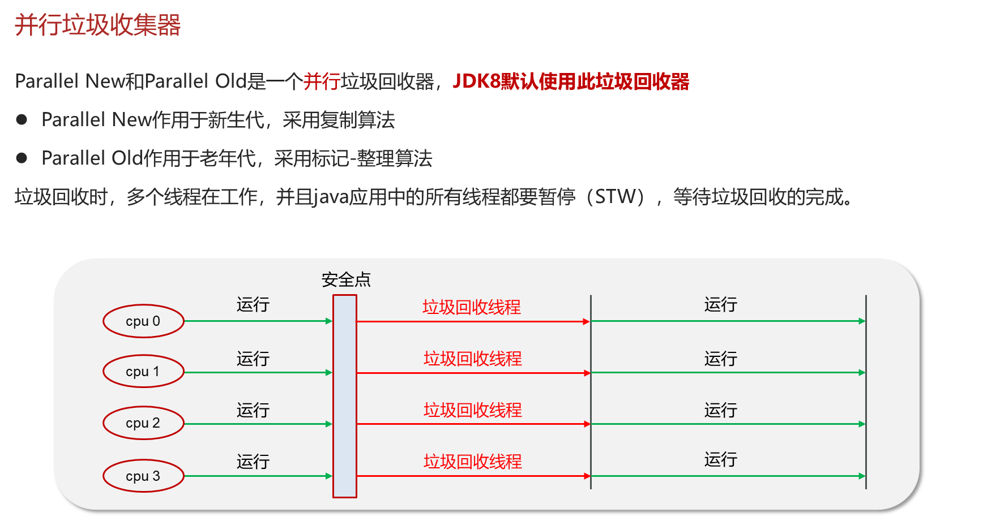

# b. 并行垃圾回收器



***

## 1. 概述与定义

并行垃圾回收器是一类采用多线程并行执行垃圾收集任务的垃圾回收器，主要用于充分利用多核 CPU 资源，提升垃圾回收效率，降低整体回收时间。其核心思想是将垃圾收集工作划分为多个任务，由多个 GC 线程同时处理，从而缩短“Stop-The-World”（STW）停顿时间。 &#x20;

在并行垃圾回收器中，常见的算法有并行标记复制、并行标记清除以及混合回收等。它通常应用于吞吐量要求较高、堆内存较大的场景。并行 GC 的实现既要保证回收效率，又要平衡系统响应时间，使应用能够在高并发环境下稳定运行。😊

***

## 2. 主要特点

并行垃圾回收器具有以下几个主要特点：

- **多线程并行执行** &#x20;

  并行 GC 利用多个线程同时执行垃圾收集任务，充分利用多核处理器优势，从而大大缩短回收时间，降低系统停顿时间。
- **高吞吐量** &#x20;

  通过并行处理垃圾收集任务，并行 GC 在面对大量对象分配和回收时能保持较高的吞吐量，是批处理、大数据处理等场景的理想选择。
- **分代收集支持** &#x20;

  并行垃圾回收器一般与分代收集策略结合，在年轻代采用复制算法，在老年代采用标记整理或标记清除算法，从而进一步提升效率和内存利用率。
- **调优灵活** &#x20;

  JVM 提供了一系列调优参数，如 `-XX:ParallelGCThreads`、`-XX:MaxGCPauseMillis` 等，允许开发者根据应用负载灵活调整并行 GC 的行为，以达到低停顿和高吞吐的平衡。
- **可扩展性强** &#x20;

  并行 GC 能够适应不断增长的堆内存需求，在多核服务器上运行时表现出色，适合大规模分布式系统及企业级应用。

下表总结了并行垃圾回收器与其他类型垃圾回收器的对比：

| 特性     | 并行垃圾回收器               | 其他垃圾回收器（如串行 GC）   |
| ------ | --------------------- | ----------------- |
| 执行模式   | 多线程并行处理，充分利用多核优势      | 单线程执行，停顿时间较长      |
| 吞吐量    | 高吞吐量，适合大数据量应用         | 吞吐量较低，适合小型或单核环境   |
| 停顿时间   | 停顿时间较短，可通过调优进一步降低     | 停顿时间较长，响应速度较慢     |
| 调优灵活性  | 支持丰富调优参数，可根据场景灵活调整    | 参数较少，调优空间有限       |
| 分代收集支持 | 通常与分代收集策略结合，年轻代使用复制算法 | 分代收集较少，整体回收方式较为简单 |

该表有助于面试时直观说明并行垃圾回收器在提高系统吞吐量和降低停顿时间方面的优势。🚀

***

## 3. 应用目标

并行垃圾回收器的应用目标主要包括以下几点：

1. **提升系统吞吐量** &#x20;

   并行垃圾回收器通过多线程并行执行垃圾收集任务，能够快速回收无用对象，从而为新对象分配提供足够内存，适合处理大批量数据的高并发系统。
2. **降低 GC 停顿时间** &#x20;

   多线程并行回收大大缩短了垃圾收集的停顿时间，确保系统在回收过程中尽量减少对业务线程的影响，提高系统整体响应速度。
3. **充分利用多核硬件资源** &#x20;

   并行 GC 设计充分考虑了现代多核 CPU 的优势，通过合理分配回收任务，使得多核资源得到充分利用，提升整体性能。
4. **支持大规模内存管理** &#x20;

   对于拥有大堆内存的应用，如企业级应用、大型分布式系统，并行垃圾回收器能有效管理内存，避免因 GC 造成长时间停顿，确保系统稳定运行。
5. **辅助系统调优** &#x20;

   通过分析 GC 日志和监控工具数据，开发者可以利用并行 GC 的丰富调优参数来调整回收时机和线程数，从而优化系统性能，为内存调优提供理论和实践依据。📈

***

## 4. 主要内容及其组成部分

并行垃圾回收器作为 JVM 垃圾收集的重要组成部分，其内容涉及多个方面，主要包括以下部分：

### 4.1 并行垃圾回收器的基本分类

并行垃圾回收器根据执行模式和回收策略主要分为：

- **并行标记复制算法** &#x20;

  主要用于年轻代垃圾回收，通过复制存活对象到新的内存区域，实现快速回收并避免内存碎片。
- **并行标记清除/标记整理算法** &#x20;

  主要用于老年代垃圾回收，先标记存活对象，然后清除垃圾对象，最后整理内存空间，使内存分配更连续。

### 4.2 并行 GC 的组成阶段

并行垃圾回收器通常包括以下阶段，每个阶段均采用并行执行：

- **初始标记阶段** &#x20;

  对部分对象进行快速标记，通常在 STW（Stop-The-World）模式下短暂停顿。
- **并行标记阶段** &#x20;

  多线程并行遍历对象图，标记所有可达对象，此阶段允许部分并发执行，减小停顿时间。
- **并行清除/复制阶段** &#x20;

  对未标记对象进行清除或将存活对象复制到新区域，多线程协同完成，进一步减少 STW 时间。
- **整理阶段（可选）** &#x20;

  某些并行 GC 算法会进行内存整理，消除碎片，保证内存分配连续性。

### 4.3 调优参数与配置

并行垃圾回收器提供了大量调优参数，常见的包括：

- `-XX:ParallelGCThreads`：设置并行 GC 使用的线程数，通常与 CPU 核数相关。
- `-XX:MaxGCPauseMillis`：目标最大 GC 停顿时间，GC 会根据此目标动态调整回收策略。
- `-XX:+UseParallelOldGC`：启用并行老年代垃圾回收，提升 Full GC 的效率。
- `-XX:+UseAdaptiveSizePolicy`：开启自适应大小策略，使 JVM 根据实际负载动态调整各代内存大小。

合理配置这些参数，可以使并行垃圾回收器在不同应用场景下发挥最佳性能。

### 4.4 示例代码说明

以下示例代码展示了如何通过 JVM 参数启用并行垃圾回收器，并记录 GC 日志供调优参考：

```java 
public class ParallelGCDemo {
    public static void main(String[] args) {
        // 模拟大量对象分配，触发垃圾回收
        for (int i = 0; i < 1000000; i++) {
            byte[] data = new byte[1024 * 10]; // 分配10KB内存块
            if (i % 10000 == 0) {
                System.out.println("分配对象数量：" + i);
            }
        }
        System.out.println("内存分配完成，等待垃圾回收...");
        // 建议调用 System.gc()（不建议在生产环境中使用）
        System.gc();
    }
}
```


在运行该示例时，可通过如下 JVM 参数启用并行 GC 并输出详细日志： &#x20;

`-XX:+UseParallelGC -XX:ParallelGCThreads=4 -XX:MaxGCPauseMillis=200 -XX:+PrintGCDetails -XX:+PrintGCTimeStamps`

***

## 5. 原理剖析

深入解析并行垃圾回收器的原理，主要包括以下几个方面：

### 5.1 并行执行原理

并行垃圾回收器利用多线程同时处理标记、清除和复制等阶段，从而缩短每个阶段的执行时间。 &#x20;

- 在标记阶段，多个线程同时遍历不同区域的对象图，加快存活对象的标记速度。 &#x20;
- 在清除或复制阶段，分片回收任务被分配给各个线程并行执行，充分利用多核处理器的并发能力。

这种并行处理方式能够显著降低 STW 停顿时间，同时提高整体垃圾回收效率。

### 5.2 分代收集与区域划分

并行垃圾回收器通常结合分代收集策略，在年轻代采用复制算法、在老年代采用标记清除或标记整理。 &#x20;

- 年轻代中对象生命周期较短，复制算法能快速将存活对象复制到 Survivor 区，从而迅速回收大部分垃圾。 &#x20;
- 老年代中对象较为稳定，采用并行标记清除和整理算法能够更高效地回收内存，并减少内存碎片问题。

同时，部分并行 GC（如 G1 GC）还将堆内存划分为多个区域，动态选择回收区域，以平衡回收成本和停顿时间。

### 5.3 调优与动态调整策略

JVM 在运行过程中会根据 GC 日志和内存使用情况动态调整回收时机和线程数。 &#x20;

- 自适应大小策略允许 JVM 根据当前负载调整各代内存大小。 &#x20;
- `-XX:MaxGCPauseMillis` 参数设定了期望的最大 GC 停顿时间，GC 算法会根据该目标动态优化回收任务分配。 &#x20;
- 并行线程数可根据系统 CPU 核数自动扩展或缩减，确保在高负载时仍能保持高吞吐量和低停顿。

通过这些动态调整策略，并行垃圾回收器能够在各种应用场景下取得平衡，并减少垃圾回收对业务线程的影响。💡

### 5.4 内存碎片与整理机制

并行 GC 在清除阶段可能采用复制算法以避免内存碎片，或者采用标记整理来压缩内存空间。 &#x20;

- 复制算法通过将存活对象复制到连续区域，彻底消除内存碎片。 &#x20;
- 标记整理算法在清除垃圾后，通过移动存活对象来确保内存的连续性，为后续对象分配提供更高效率的内存空间。

这些机制确保了在高并发下，即便频繁触发垃圾回收，也能保持内存分配的高效性和连续性。

### 5.5 并发与停顿平衡

并行垃圾回收器的核心目标在于平衡并发执行与 STW 停顿时间。 &#x20;

- 并发标记阶段和并发清除阶段允许应用线程与 GC 线程同时运行，降低整体停顿时间。 &#x20;
- 初始标记和最终整理阶段虽然需要短暂 STW，但通过优化任务划分和减少不必要的标记工作，这部分时间可以大幅缩短。

这种平衡策略使得并行 GC 在高并发系统中能够提供稳定、低延迟的垃圾回收服务。

***

## 6. 应用与拓展

并行垃圾回收器在实际工程中的应用和扩展主要体现在以下几个方面：

### 6.1 高吞吐量系统调优

在大数据、分布式系统和高并发应用中，系统对吞吐量要求较高。并行垃圾回收器通过多线程并行执行 GC 任务，使得系统在面对大批量对象分配时仍能保持高吞吐量。通过调优 `-XX:ParallelGCThreads` 参数，可以针对具体业务场景调整回收线程数，从而最大化利用多核 CPU 资源。

### 6.2 降低系统停顿

在实时性要求较高的应用中，如金融交易系统或在线游戏服务器，垃圾回收停顿时间是一个关键指标。利用并行 GC 能够显著降低停顿时间，同时结合 `-XX:MaxGCPauseMillis` 参数进行调优，可以将 GC 停顿控制在可接受的范围内，保证系统响应速度。

### 6.3 系统监控与日志分析

通过 GC 日志、JConsole、VisualVM 等工具，开发者可以实时监控并行 GC 的工作状态，包括各阶段的执行时间、内存回收率以及 STW 停顿时间。借助这些监控数据，能够针对性地调整 JVM 参数，发现并解决系统中存在的内存碎片、GC 频率过高等问题，从而进一步提升系统稳定性。📊

### 6.4 案例实践与经验积累

在实际项目中，不少企业级应用采用并行垃圾回收器来应对高并发场景。例如，在某电商平台中，通过采用并行 GC 并调低 `-XX:MaxGCPauseMillis` 参数，使得系统在高峰期保持了极低的 GC 停顿，显著提升了用户体验。这样的实践案例不仅说明了并行 GC 的优势，也为后续系统优化提供了宝贵经验。

### 6.5 新型垃圾收集器的融合

随着 JVM 技术的发展，新型垃圾收集器（如 G1 GC、ZGC、Shenandoah）不断涌现。这些收集器往往在并行 GC 的基础上，加入了更多智能调优和并发技术。了解并行垃圾回收器的原理和调优方法，有助于工程师在实际项目中更好地选择和迁移到新型垃圾收集器，从而持续提升系统性能。🚀

***

## 7. 面试问答

下面提供五个典型面试问答，采用面试者口吻详细回答有关并行垃圾回收器的常见问题，帮助你在面试中自信从容地回答相关问题。

### 7.1 问题一：请简述并行垃圾回收器的基本工作原理及其优点

【回答】： &#x20;

并行垃圾回收器主要利用多线程同时执行垃圾回收任务，在标记、清除和复制等阶段并行处理，从而大大缩短了回收时间。其主要优点包括：充分利用多核 CPU 资源、提升系统吞吐量、降低 GC 停顿时间，特别适合大内存和高并发环境。通过调优并行线程数和停顿时间目标，可以在吞吐量和响应时间之间取得良好平衡。

### 7.2 问题二：并行垃圾回收器在分代收集策略中如何处理年轻代与老年代的垃圾回收？

【回答】： &#x20;

在分代收集策略下，并行垃圾回收器通常采用不同的回收算法：在年轻代主要使用复制算法，将新生对象从 Eden 区复制到 Survivor 区，从而快速回收大量短命对象；在老年代则采用并行标记清除或标记整理算法，针对存活率较高的对象进行回收，并通过整理减少内存碎片。这样的分代处理能有效提高回收效率并降低停顿时间。

### 7.3 问题三：如何通过 JVM 参数调优并行垃圾回收器以达到低停顿和高吞吐的效果？

【回答】： &#x20;

我会根据实际业务场景设置参数，比如使用 `-XX:ParallelGCThreads` 来设置并行 GC 的线程数，确保能够充分利用多核资源；利用 `-XX:MaxGCPauseMillis` 设定目标最大停顿时间，迫使 GC 算法优化回收时机；同时可以使用 `-XX:+UseParallelOldGC` 开启并行老年代垃圾回收。通过这些调优措施，我曾在项目中将 GC 停顿时间从数百毫秒降低到几十毫秒，大大提升了系统响应速度。

### 7.4 问题四：请描述一下并行垃圾回收器在实际高并发系统中的应用场景和优势

【回答】： &#x20;

在高并发系统中，应用程序往往需要处理海量对象分配和回收任务，并且对系统响应时间要求较高。并行垃圾回收器通过多线程并行执行垃圾收集任务，不仅可以快速回收无用对象，腾出内存空间，还能将 GC 停顿时间控制在极短的时间内。举例来说，在某电商平台的高峰期，通过采用并行 GC 并优化相关参数，系统能够保持低延迟和高吞吐，确保用户体验不受 GC 影响。

### 7.5 问题五：请结合实际案例说明你是如何优化并行垃圾回收器以提升系统性能的

【回答】： &#x20;

在一次项目中，我们发现系统在处理高并发请求时，GC 停顿时间较长，导致部分交易响应延迟。通过分析 GC 日志，我发现 Full GC 触发频率较高。经过调研，我们调整了 `-XX:ParallelGCThreads` 和 `-XX:MaxGCPauseMillis` 参数，并尝试切换至并行老年代回收（`-XX:+UseParallelOldGC`）。调优后，GC 停顿时间明显缩短，同时系统吞吐量提升，响应时间降低。这一案例充分证明了合理调优并行垃圾回收器对系统性能优化的重要作用。

***

## 总结

本文详细解析了 JVM 垃圾收集与内存分配中“垃圾回收器”下的并行垃圾回收器，从概述与定义、主要特点、应用目标，到主要内容及其组成部分，再到原理剖析、应用与拓展，最后通过面试问答的形式展示了常见问题及详细解答。 &#x20;

全文指出： &#x20;

- 并行垃圾回收器通过多线程并行执行垃圾收集任务，充分利用多核 CPU 资源，能显著提高系统吞吐量并降低停顿时间。 &#x20;
- 分代收集策略和区域划分方法是并行 GC 高效回收的关键，通过复制、标记清除或整理等算法分别应对年轻代与老年代的回收需求。 &#x20;
- 丰富的调优参数为开发者提供了灵活调整回收行为的手段，既能满足低停顿要求，又能在高并发场景中保持高效性能。 &#x20;
- 实际案例表明，合理选择和调优并行垃圾回收器能有效解决系统性能瓶颈，是高并发、大数据系统中常用的垃圾收集方案。
