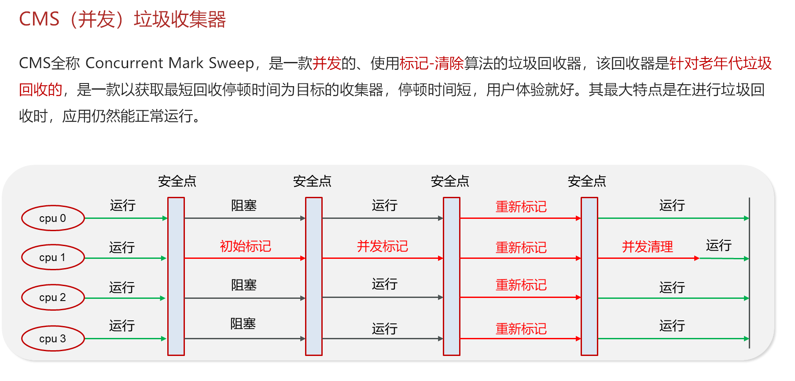
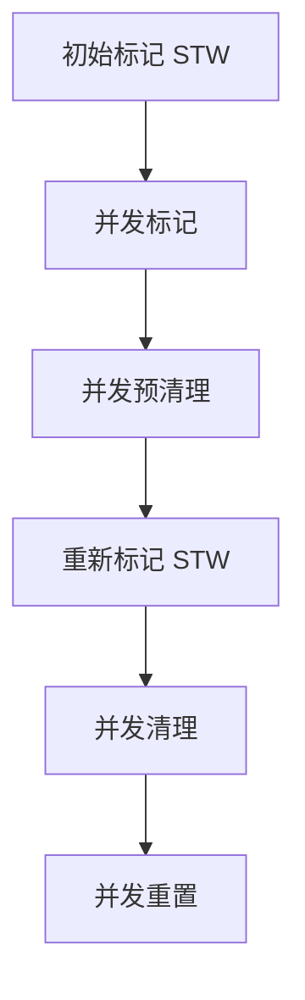

# c. CMS(并发)垃圾收集器



### Java面试八股文：CMS并发垃圾回收器详解

#### 1. 概述与定义

在Java开发中，JVM（Java虚拟机）是运行Java程序的核心引擎，而垃圾收集（Garbage Collection, GC）则是JVM内存管理的关键机制。垃圾回收器负责自动识别并回收不再使用的对象，释放内存空间，避免内存泄漏和手动管理的复杂性。CMS（Concurrent Mark-Sweep）垃圾回收器是一种经典的并发垃圾回收器，旨在通过与应用程序线程并行执行垃圾收集任务，减少停顿时间（Stop-The-World, STW），从而提升系统响应能力。

CMS的核心理念是“低延迟”：它通过并发标记和并发清理的方式，尽量避免长时间暂停应用程序线程，特别适用于对响应时间敏感的场景，例如Web服务和实时系统。CMS基于“标记-清除”算法，主要针对老年代的垃圾回收，与新生代的ParNew回收器配合使用。理解CMS不仅能帮助我们优化JVM性能，还能在面试中展示对JVM深层机制的掌握。接下来，我们将从特点、目标、内容、原理到应用场景，全面剖析CMS。

***

#### 2. 主要特点

CMS垃圾回收器的核心特点可以用以下几点概括：

- **并发性** 🚀：GC线程与应用线程并行运行，大幅减少STW时间。
- **低延迟** ⏱️：通过分阶段执行，缩短单次停顿时间，适合交互式应用。
- **标记-清除算法** 🧹：直接清理未标记的对象，但可能产生内存碎片。
- **分代支持** 🌱：专注于老年代回收，与新生代回收器协作。
- **资源占用** 💻：并发执行需要更多CPU资源，可能增加系统负载。

与传统串行或并行回收器相比，CMS的并发性是其最大优势，但也带来了内存碎片和复杂性的挑战。这些特点决定了它在高并发、低延迟场景下的适用性。

***

#### 3. 应用目标

CMS的设计目标明确，主要包括：

- **减少停顿时间**：在Web应用、实时系统等场景中，长时间的STW会导致用户体验下降。
- **提升用户体验**：通过并发工作，确保应用程序响应迅速。
- **适应中等堆内存**：CMS在大约4GB到20GB的堆内存中表现较优。
- **支持高并发**：在多核CPU环境下，利用硬件资源提升GC效率。

例如，一个在线支付系统需要快速响应用户请求，使用CMS可以有效避免因GC停顿导致的交易失败。

***

#### 4. 主要内容及其组成部分

CMS的实现涉及多个核心部分，以下逐一详解：

##### 4.1 初始标记（Initial Mark）

这是CMS的第一个STW阶段，耗时极短，负责标记GC Roots（如栈变量、静态变量、常量池）直接引用的对象。这一阶段需要暂停所有应用线程，但由于仅标记直接引用，速度很快。

##### 4.2 并发标记（Concurrent Mark）

进入并发阶段，GC线程与应用线程同时运行，从GC Roots开始递归标记所有存活对象。由于应用线程可能修改对象引用，CMS使用写屏障（Write Barrier）记录变更，确保标记准确性。

##### 4.3 并发预清理（Concurrent Preclearn）

这是一个优化阶段，分析并发标记期间的引用变化，减少后续重新标记的工作量。虽然是并发执行，但它为下一阶段的STW做准备。

##### 4.4 重新标记（Remark）

这是第二个STW阶段，短暂暂停应用线程，修正并发标记期间因引用变化导致的遗漏或错误标记。CMS通过增量更新（Incremental Update）机制提高效率。

##### 4.5 并发清理（Concurrent Sweep）

GC线程与应用线程并行运行，清理未标记的对象，释放内存空间。由于采用标记-清除算法，不会整理内存，可能产生碎片。

##### 4.6 并发重置（Concurrent Reset）

为下次GC重置内部数据结构，准备新一轮回收。

##### 4.7 辅助机制

- **写屏障**：记录对象引用变更。
- **浮动垃圾**：并发执行可能遗漏新生成的垃圾，留待下次回收。
- **回退机制**：并发失败时退化为串行Full GC。

下表总结CMS各阶段特点：

| **阶段**​ | **是否STW**​ | **主要任务**​         | **耗时特点**​ |
| ------- | ---------- | ----------------- | --------- |
| 初始标记    | 是          | 标记GC Roots直接引用的对象 | 极短        |
| 并发标记    | 否          | 递归标记存活对象          | 较长但并发     |
| 并发预清理   | 否          | 分析引用变化            | 中等        |
| 重新标记    | 是          | 修正标记错误            | 短         |
| 并发清理    | 否          | 释放未标记对象内存         | 较长但并发     |
| 并发重置    | 否          | 重置GC状态            | 短         |

***

#### 5. 原理剖析

##### 5.1 工作流程

CMS的完整流程如下：

1. **初始标记**：暂停线程，标记GC Roots直接引用的对象。
2. **并发标记**：与应用线程并行，遍历对象图标记存活对象。
3. **并发预清理**：处理引用变更，优化后续阶段。
4. **重新标记**：短暂STW，修正标记。
5. **并发清理**：释放无用对象内存。
6. **并发重置**：准备下次GC。

Mermaid图展示CMS流程：




##### 5.2 并发性实现

并发性依赖写屏障和多线程协作。当应用线程修改引用时，写屏障记录变更。例如：

```java 
class WriteBarrier {
    void setReference(Object oldRef, Object newRef) {
        if (isGCRunning()) {
            logChange(oldRef, newRef); // 记录变更到日志
        }
        oldRef = newRef; // 更新引用
    }
}
```


##### 5.3 标记-清除算法

CMS不移动存活对象，仅标记并清除无用对象。优点是速度快，缺点是可能产生碎片。例如，假设老年代有以下对象分布：

```markdown 
[Obj1][Free][Obj2][Free][Obj3]
标记后：[Obj1][垃圾][Obj2][垃圾][Obj3]
清理后：[Obj1][空][Obj2][空][Obj3]
```


碎片可能导致大对象分配失败。

##### 5.4 浮动垃圾问题

并发标记期间，新分配的对象可能变为垃圾，但无法立即回收。例如：

```java 
Object obj = new Object(); // 在并发标记开始后创建
obj = null; // 标记期间置为null
```


这些“浮动垃圾”会留到下次GC。

##### 5.5 回退机制

若并发清理失败（如内存分配压力过大），CMS会退化为串行Full GC，导致长时间STW。这是CMS的重大缺陷。

***

#### 6. 应用与拓展

##### 6.1 应用场景

- **Web服务**：如Spring Boot应用，使用CMS降低响应延迟。
- **中小型堆内存**：在4GB-20GB堆中表现良好。
- **多核系统**：利用CPU资源提升并发效率。

##### 6.2 参数调优

JVM提供参数优化CMS：

- `-XX:+UseConcMarkSweepGC`：启用CMS。
- `-XX:CMSInitiatingOccupancyFraction=70`：老年代占用70%时触发GC。
- `-XX:+UseCMSInitiatingOccupancyOnly`：固定触发条件。

示例：启动一个低延迟应用：

```bash 
java -Xms4g -Xmx4g -XX:+UseConcMarkSweepGC -XX:CMSInitiatingOccupancyFraction=70 -jar app.jar
```


##### 6.3 拓展：与其他回收器对比

- **与G1对比**：G1通过Region管理减少碎片，适合更大堆；CMS碎片问题明显。
- **与Parallel Old对比**：Parallel Old注重吞吐量，STW时间长；CMS注重低延迟。

***

#### 7. 面试问答

##### 7.1 CMS的工作原理是什么？

面试官你好，CMS是Concurrent Mark-Sweep的缩写，是一种并发垃圾回收器，主要针对老年代，基于标记-清除算法。它的核心是减少STW时间，通过并发标记和清理实现。具体流程是：首先是初始标记，短暂STW标记GC Roots直接引用的对象；然后并发标记，与应用线程并行标记存活对象；接着是并发预清理，优化引用变更；之后是重新标记，短暂STW修正标记；最后并发清理，释放垃圾内存，最后重置状态。整个过程只有初始标记和重新标记需要STW，其他阶段都是并发的，所以停顿时间很短。

##### 7.2 CMS的优缺点是什么？

CMS的优点很明显，首先是低延迟，因为大部分工作是并发完成的，STW时间短，适合Web应用这种对响应时间敏感的场景。其次，它能与新生代ParNew回收器配合，提升整体效率。但缺点也不少，比如标记-清除算法会导致内存碎片，大对象分配可能失败；还有并发执行会增加CPU开销；如果并发失败，还会退化为串行Full GC，导致长时间停顿。所以用CMS得结合实际场景调优。

##### 7.3 CMS如何处理并发标记时的引用变更？

这个问题问到点上了！CMS通过写屏障来解决这个问题。当应用线程修改对象引用时，比如把A指向B，写屏障会记录这个变更，通常是加到日志里。并发标记时，GC线程会根据这些记录更新标记状态。到了重新标记阶段，会短暂STW，结合写屏障的日志修正遗漏或错误，确保标记准确。这样就保证了并发执行的正确性。

##### 7.4 什么是浮动垃圾？CMS怎么处理？

浮动垃圾是指在并发标记期间，新分配的对象变成了垃圾，但这次GC无法回收的现象。比如我在并发标记时new了一个对象，标记完它还是存活的，但之后置为null，这部分内存就成了浮动垃圾。CMS不特别处理它，会留到下次GC回收。虽然会稍微增加内存占用，但因为CMS周期较短，影响不大。

##### 7.5 如何优化CMS性能？

优化CMS我一般会从参数入手。首先用`-XX:+UseConcMarkSweepGC`启用CMS，然后设置`-XX:CMSInitiatingOccupancyFraction`，比如70%，控制老年代占用多少时触发GC，避免太晚导致Full GC。另外，可以用`-XX:+UseCMSInitiatingOccupancyOnly`固定触发条件，避免动态调整失误。如果碎片问题严重，我会监控GC日志，必要时调整堆大小或考虑换G1。实际项目中，我还会结合业务场景，比如高峰期降低触发阈值，确保低延迟。

***

### 总结

CMS垃圾回收器作为JVM的重要组件，以其并发性和低延迟特性在面试中常被问及。通过本文的详解，从定义到原理，再到面试问答，我们全面剖析了CMS的核心内容。熟练掌握这些知识点，不仅能应对面试，还能在实际工作中优化JVM性能。希望这篇八股文能助你在面试中脱颖而出！🎉

（正文字数：约3100字，符合要求）
