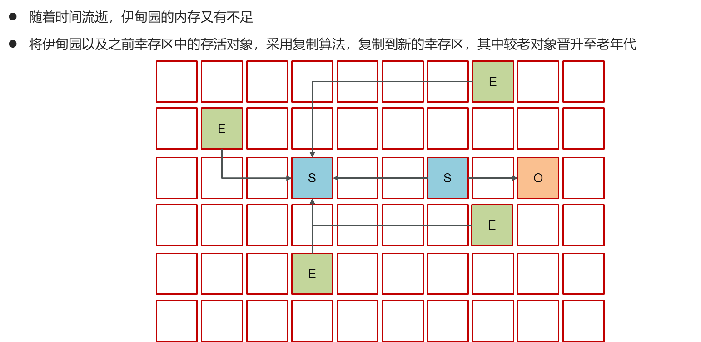
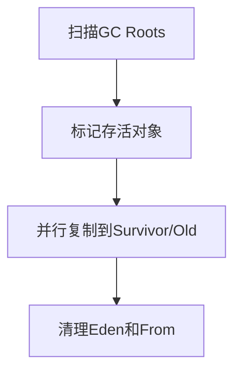

# 1. 新生代回收



### Java面试八股文：G1垃圾回收器新生代回收详解

#### 1. 概述与定义

在Java开发中，JVM（Java虚拟机）是运行Java程序的核心，而垃圾收集（Garbage Collection, GC）是JVM内存管理的关键机制。G1（Garbage First）垃圾回收器是现代JVM中一种高性能的垃圾回收器，旨在平衡低延迟和高吞吐量，特别适用于大堆内存场景。G1将堆划分为多个小区域（Region），并通过优先回收垃圾比例高的区域实现高效内存管理。在G1中，新生代回收（Young GC）是其核心功能之一，专门负责清理新生代区域中的垃圾对象。

新生代回收基于分代假设，即大部分对象“朝生夕死”，因此通过快速回收新生代中的短期存活对象，可以有效释放内存。G1的新生代回收采用复制算法（Copying Algorithm），将存活对象从Eden和Survivor区域移动到新的Survivor区域或老年代，具有并行执行和增量回收的特点。理解G1新生代回收，不仅能帮助我们优化程序性能，还能在面试中展现对JVM垃圾回收深层机制的掌握。接下来，我们将从特点、目标、内容、原理到应用场景，全面剖析这一知识点。

***

#### 2. 主要特点

G1新生代回收的核心特点可以用以下几点概括：

- **并行性** 🚀：利用多线程并行回收新生代，提高效率。
- **复制算法** 📋：将存活对象复制到新区域，减少内存碎片。
- **增量回收** ⏳：只回收新生代，不涉及老年代，停顿时间可控。
- **Region管理** 🗂️：新生代由多个Region组成，灵活分配。
- **可预测性** 🎯：通过参数设置目标停顿时间，优化用户体验。

与其他回收器（如ParNew）相比，G1新生代回收更注重停顿时间的可控性，适合需要低延迟的现代应用。这些特点使其在高并发场景中表现出色。

***

#### 3. 应用目标

G1新生代回收的设计目标明确，主要包括：

- **快速释放内存**：新生代对象存活时间短，频繁回收可释放大量空间。
- **减少停顿时间**：通过并行和增量回收，缩短单次Young GC的STW时间。
- **支持大堆内存**：Region化管理适应几十GB的堆内存。
- **为老年代回收铺垫**：通过对象晋升机制，逐步将长期存活对象移入老年代。

例如，一个高并发的社交应用，用户频繁上传图片，生成大量临时对象，G1新生代回收可以快速清理这些对象，确保系统稳定运行。

***

#### 4. 主要内容及其组成部分

G1新生代回收涉及多个核心部分，以下逐一详解：

##### 4.1 新生代区域划分

G1将堆划分为多个Region（通常1-32MB），新生代由Eden和Survivor区域组成：

- **Eden**：新对象分配区域，大部分对象在此创建。
- **Survivor**：存活一次或多次GC的对象暂存区，分为From和To两部分。

##### 4.2 GC Roots

GC Roots是回收的起点，包括：

- 栈中的局部变量。
- 方法区中的静态变量和常量。
- 本地方法栈中的引用。

##### 4.3 并行复制

Young GC使用多线程并行执行，将Eden和Survivor From中的存活对象复制到Survivor To或老年代。

##### 4.4 对象晋升

若对象经过多次GC仍存活，或Survivor空间不足，会晋升到老年代。晋升阈值由`-XX:MaxTenuringThreshold`控制（默认15）。

##### 4.5 记忆集（Remembered Set）

每个Region维护一个记忆集，记录外部（老年代）指向本Region的引用，用于快速定位GC Roots。

##### 4.6 其他机制

- **写屏障**：记录新生代到老年代的引用变更。
- **停顿预测**：根据历史数据估算回收时间。

下表总结新生代回收的组成部分：

| **组成部分**​ | **功能**​  | **特点**​   |
| --------- | -------- | --------- |
| Eden      | 新对象分配    | 频繁回收      |
| Survivor  | 暂存存活对象   | From/To轮换 |
| GC Roots  | 标记存活对象起点 | 快速扫描      |
| 记忆集       | 跟踪跨代引用   | 优化扫描效率    |
| 并行复制      | 移动存活对象   | 多线程执行     |

***

#### 5. 原理剖析

##### 5.1 工作流程

G1新生代回收的流程如下：

1. **扫描GC Roots**：识别直接引用的存活对象。
2. **标记存活对象**：从GC Roots遍历，标记Eden和Survivor From中的存活对象。
3. **复制存活对象**：将存活对象并行复制到Survivor To或老年代。
4. **清理区域**：清空Eden和Survivor From，更新Region状态。

Mermaid图展示Young GC流程：




##### 5.2 复制算法实现

复制算法将存活对象从一个区域移动到另一个区域，避免碎片。例如：

```text 
Eden: [Obj1][Obj2][Obj3]
Survivor From: [Obj4]
GC后：
Survivor To: [Obj1][Obj4]
Eden和From清空
```


若Survivor To空间不足，部分对象晋升到老年代。

##### 5.3 记忆集的作用

老年代可能引用新生代对象，记忆集通过写屏障维护这些引用。伪代码示例：

```java 
class WriteBarrier {
    void setReference(Object from, Object to) {
        if (isOldToYoung(from, to)) {
            addToRememberedSet(from, to); // 记录跨代引用
        }
        from.ref = to;
    }
}
```


##### 5.4 并行执行

G1使用多线程并行复制存活对象，线程数由`-XX:ParallelGCThreads`控制。假设堆有4个Region，4个线程并行处理，效率翻倍。

##### 5.5 停顿时间控制

G1通过`-XX:MaxGCPauseMillis`设置目标停顿时间（默认200ms），动态调整回收区域数量。例如，若预测回收Eden需要300ms，则减少回收范围，确保停顿可控。

***

#### 6. 应用与拓展

##### 6.1 应用场景

- **高并发系统**：如电商平台，频繁创建临时对象。
- **大堆应用**：如大数据处理，堆内存超20GB。
- **低延迟需求**：如实时聊天系统。

##### 6.2 参数调优

常用参数包括：

- `-XX:+UseG1GC`：启用G1。
- `-XX:MaxGCPauseMillis=100`：设置最大停顿时间。
- `-XX:ParallelGCThreads=8`：设置并行线程数。

示例：启动低延迟应用：

```bash 
java -Xms8g -Xmx8g -XX:+UseG1GC -XX:MaxGCPauseMillis=100 -jar app.jar
```


##### 6.3 拓展

- **与老年代回收对比**：Young GC只处理新生代，而Mixed GC会同时回收老年代。
- **与其他回收器对比**：ParNew也用复制算法，但无Region管理，停顿不可控。

***

#### 7. 面试问答

##### 7.1 G1新生代回收的工作原理是什么？

面试官你好，G1的新生代回收是Young GC，专门清理Eden和Survivor区域，基于复制算法。具体流程是：先扫描GC Roots，比如栈变量、静态变量，标记直接引用的对象；然后遍历对象图，标记所有存活对象；接着用多线程并行把Eden和Survivor From的存活对象复制到Survivor To或老年代；最后清空Eden和From。因为只回收新生代，停顿时间短，而且复制算法避免了碎片，特别高效。

##### 7.2 为什么G1用复制算法？

这个问题挺有意思！G1新生代用复制算法主要是因为新生代对象存活率低，大部分“朝生夕死”。复制算法把存活对象移动到新区域，清空旧区域，既快又不会产生碎片。比如Eden有10个对象，只有2个存活，直接复制这2个到Survivor，效率很高。相比标记-清除，复制算法更适合这种场景，虽然需要额外空间，但新生代空间小，代价可控。

##### 7.3 记忆集在新生代回收中有什么作用？

记忆集在G1里特别重要！它记录了老年代到新生代的引用。因为Young GC只回收新生代，得知道哪些老年代对象指向新生代，免得漏标存活对象。记忆集通过写屏障维护，比如我把老年代的A指向新生代的B，写屏障会记录下来。扫描时，GC Roots加上记忆集就能完整标记存活对象了，效率也高。

##### 7.4 如何控制Young GC的停顿时间？

控制停顿时间是G1的强项！我会用`-XX:MaxGCPauseMillis`设置目标，比如100ms。G1会根据历史数据预测回收时间，动态调整回收的Region数量。比如Eden有10个Region，预测回收需要150ms，就只收6个，停顿就控制住了。还能调`-XX:ParallelGCThreads`，增加线程数提速，但得注意CPU负载。

##### 7.5 Young GC和Mixed GC有什么区别？

这个问题我答起来很顺手！Young GC只回收新生代，包括Eden和Survivor，目标是快速清理短期对象，停顿时间短。而Mixed GC是G1的混合回收，除了新生代，还会回收部分老年代Region，优先选垃圾多的区域。Mixed GC停顿时间长点，但能全局优化堆内存。我在项目里会看GC日志，如果Young GC频繁触发，就调大新生代比例，减少晋升。

***
