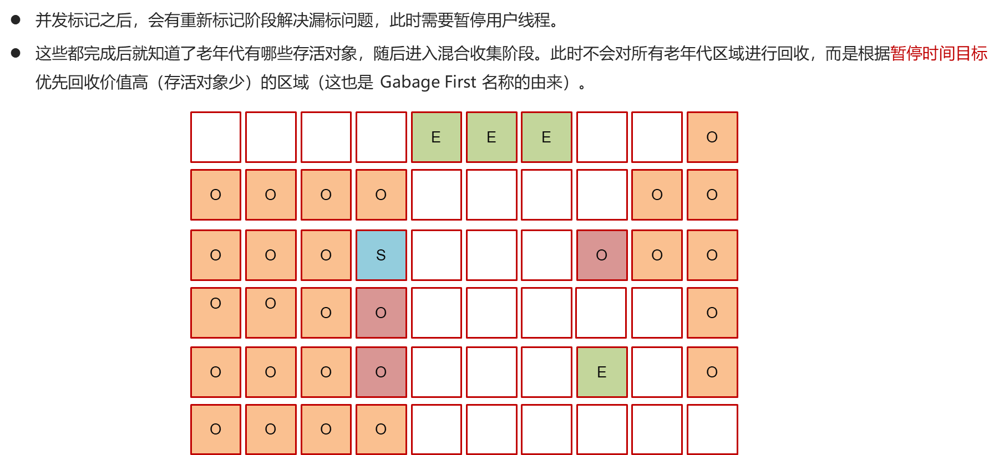

# 2. 并发标记



***

## 1. 概述与定义

并发标记阶段是 G1 垃圾回收器中的一个关键环节，其主要任务是通过并发方式遍历堆内存中所有对象，从 GC Roots 出发标记所有可达对象。与传统的 STW（Stop-The-World）标记方式不同，并发标记允许 GC 线程与应用线程同时运行，从而大幅降低垃圾回收对应用响应时间的影响。 &#x20;

在 G1 中，整个堆被划分为多个 Region，每个 Region 的对象存活情况都会在并发标记阶段得到判断。标记结束后，未被标记的 Region 会作为回收候选区域，进入混合回收阶段。并发标记阶段既保证了回收判定的准确性，又尽量减少了 STW 停顿时间，使得 G1 能在大堆内存和多核环境下实现低停顿、高吞吐。😊

## 2. 主要特点

并发标记阶段具有如下主要特点：

1. **并发执行** &#x20;

   采用多线程与应用线程同时执行标记任务，降低停顿时间，提升系统实时性。
2. **全堆扫描** &#x20;

   从 GC Roots 出发，遍历整个堆中所有 Region，对对象的可达性进行全面判断，确保准确回收无用对象。
3. **动态适应** &#x20;

   并发标记过程中，G1 根据实际内存使用情况动态调整标记策略，并与后续混合回收紧密配合，以达到预设的停顿时间目标。
4. **高效利用多核** &#x20;

   利用现代多核 CPU，多线程并发执行标记任务，可以充分发挥硬件性能，适用于大规模堆内存的服务器应用。
5. **减少 STW 时间** &#x20;

   除了初始和最终标记需要短暂 STW 外，绝大部分标记工作在并发阶段完成，有效降低 GC 对应用响应的影响。

下表总结了并发标记阶段与传统标记方式的对比：

| 特性   | 并发标记阶段                | 传统 STW 标记方式     |
| ---- | --------------------- | --------------- |
| 执行模式 | 多线程并发执行，与应用线程同时运行     | 全部暂停应用线程        |
| 停顿时间 | 仅初始和最终标记短暂停顿，整体停顿时间较短 | 停顿时间长           |
| 资源利用 | 充分利用多核 CPU，标记速度更快     | 单线程，无法充分利用多核资源  |
| 应用场景 | 大堆内存、高并发、响应时间要求高的应用   | 小堆或对响应时间要求不高的场景 |

这些特点使得并发标记阶段成为 G1 垃圾回收器低停顿设计的重要组成部分。🚀

## 3. 应用目标

并发标记阶段的应用目标主要体现在以下几个方面：

1. **降低 GC 停顿时间** &#x20;

   通过与应用线程并发运行标记任务，减少传统 GC 标记过程中长时间的 STW 停顿，提升系统实时响应能力。
2. **提高系统吞吐量** &#x20;

   并发标记减少了应用停顿，从而使得系统能够持续处理业务请求，即使在高内存占用情况下也能保持较高的吞吐量。
3. **精准垃圾判定** &#x20;

   通过全堆扫描与标记，可确保所有可达对象都能被正确识别，减少内存泄露风险，为后续混合回收提供准确依据。
4. **动态调优与预测** &#x20;

   与 `-XX:MaxGCPauseMillis` 等参数配合，开发者可根据实际业务需求动态调整标记和回收策略，精确控制 GC 停顿时间，满足不同场景的性能要求。
5. **支持大堆应用** &#x20;

   并发标记特别适用于大堆内存和多核服务器环境，确保在大规模数据处理和高并发访问时，垃圾收集依然高效稳定。

通过实现这些目标，并发标记阶段使得 G1 垃圾回收器在现代企业级和分布式系统中具有显著优势，同时为系统调优提供了重要依据。📈

## 4. 主要内容及其组成部分

并发标记阶段是 G1 垃圾回收器中的一个重要组成部分，其内容主要包括以下几个部分：

### 4.1 标记阶段的划分

- **初始标记** &#x20;

  在 STW 模式下快速标记直接与 GC Roots 相连的对象。初始标记阶段时间较短，是后续并发标记的基础。
- **并发标记** &#x20;

  多线程并发遍历整个堆中所有 Region，从 GC Roots 开始逐层标记所有可达对象。该阶段与应用线程并发执行，主要目标是尽可能全面地标记存活对象。
- **最终标记** &#x20;

  在 STW 模式下对并发标记过程中可能漏标的对象进行补充标记，确保所有存活对象都被正确标记。该阶段需要短暂停顿，但时间通常较短。

### 4.2 区域垃圾统计

- 每个 Region 在并发标记结束后都会统计出垃圾比例，即未被标记的对象占 Region 总容量的比例。 &#x20;
- 系统根据这些数据选择垃圾比例高的 Region 进入混合回收阶段，从而优先回收内存垃圾最多的区域。

### 4.3 调优与策略配置

- **停顿时间目标** &#x20;

  通过 `-XX:MaxGCPauseMillis` 参数设定期望的最大 GC 停顿时间，G1 根据该目标动态选择并发标记与混合回收的策略。
- **并发线程控制** &#x20;

  系统自动调整并发标记线程数，以充分利用多核 CPU 资源，确保标记任务能够快速完成而不干扰应用。
- **数据统计与反馈** &#x20;

  在标记阶段结束后，统计各 Region 的垃圾比例数据，为混合回收决策提供依据，这部分数据也可用于后续调优和性能监控。

### 4.4 示例代码说明

以下示例代码展示了如何模拟大量对象分配以触发 G1 垃圾回收器的并发标记阶段，并通过 JVM 参数记录 GC 日志以便调优参考：

```java 
public class G1ConcurrentMarkDemo {
    public static void main(String[] args) {
        // 模拟大量对象分配，促使垃圾收集器启动并发标记阶段
        for (int i = 0; i < 500000; i++) {
            byte[] data = new byte[1024 * 5]; // 分配 5KB 的对象
            if (i % 10000 == 0) {
                System.out.println("当前分配对象数：" + i);
            }
        }
        System.out.println("分配完成，建议触发垃圾回收...");
        System.gc();
    }
}
```


运行时建议使用如下 JVM 参数启用 G1 垃圾回收器并打印详细 GC 日志： &#x20;

`-XX:+UseG1GC -XX:MaxGCPauseMillis=200 -XX:+PrintGCDetails -XX:+PrintGCTimeStamps`

这些日志有助于观察并发标记阶段的时间、各阶段停顿时长和 Region 垃圾比例数据，从而为系统调优提供依据。

## 5. 原理剖析

深入解析并发标记阶段的原理，有助于我们全面理解 G1 垃圾回收器的工作机制，其主要原理如下：

### 5.1 并发标记算法

- **标记遍历** &#x20;

  并发标记阶段采用多线程并发遍历的方式，从 GC Roots 出发，对整个堆中所有 Region 进行深度或广度优先搜索，标记所有可达对象。 &#x20;
- **并发与应用线程协作** &#x20;

  此阶段与应用线程并发执行，借助硬件多核优势，在不显著增加 STW 停顿时间的前提下，实现全堆扫描。 &#x20;
- **数据一致性保护** &#x20;

  为避免应用线程修改对象引用导致标记不准确，G1 采用写屏障等机制确保并发标记期间数据的一致性。

### 5.2 初始标记与最终标记

- **初始标记** &#x20;

  在 STW 模式下快速标记直接与 GC Roots 关联的对象，为并发标记阶段建立基础。 &#x20;
- **最终标记** &#x20;

  再次进入 STW 模式，补充并发标记过程中漏标的对象，确保所有存活对象都能被正确标记。这两个阶段虽然需要停顿，但时间极短，整体停顿时间主要取决于并发标记阶段的表现。

### 5.3 垃圾统计与决策

- 在并发标记结束后，每个 Region 的垃圾比例会被统计出来，系统根据这些数据判断哪些 Region 垃圾最多。 &#x20;
- 垃圾比例高的 Region 将优先进入混合回收阶段，从而最大限度释放内存空间。 &#x20;
- 此过程涉及数据收集和统计计算，为后续回收决策提供关键依据。

### 5.4 停顿时间预测与动态调整

- G1 根据 `-XX:MaxGCPauseMillis` 目标预测本次回收所需时间，并动态选择回收 Region 的数量和回收策略。 &#x20;
- 内部算法结合当前内存使用率、对象存活率和历史 GC 数据，动态调整并发标记和混合回收策略，实现预期的停顿目标。

### 5.5 并发标记的优缺点分析

- **优点**： &#x20;
  - 能大幅降低 GC 停顿时间，提高系统实时性。 &#x20;
  - 充分利用多核 CPU 资源，加速全堆扫描。 &#x20;
  - 提供准确的垃圾统计，为后续回收决策提供依据。 &#x20;
- **缺点**： &#x20;
  - 并发标记过程中需要额外的写屏障开销，可能对性能产生一定影响。 &#x20;
  - 在极端高负载情况下，标记线程与应用线程的资源竞争可能导致性能波动。

通过以上原理剖析，我们可以看出并发标记阶段在 G1 垃圾回收器中的关键作用及其优化手段，为后续系统调优提供理论支持。💡

## 6. 应用与拓展

并发标记阶段作为 G1 垃圾回收器的重要部分，在实际工程中的应用和扩展主要体现在以下几个方面：

### 6.1 大型企业级系统

- 在大堆内存和高并发场景下，G1 的并发标记能够显著降低垃圾收集停顿时间，保证系统持续响应。 &#x20;
- 适用于金融、电商、在线游戏等需要高实时性和高吞吐量的系统。

### 6.2 系统性能调优

- 利用 GC 日志和监控工具（如 VisualVM、GCViewer）观察并发标记阶段的表现，根据停顿时间、Region 垃圾比例等数据进行参数调优。 &#x20;
- 动态调整 `-XX:MaxGCPauseMillis`、并发线程数和 Region 大小等参数，以达到最佳的系统性能。

### 6.3 内存管理策略优化

- 通过并发标记得到准确的垃圾统计数据，可以更合理地规划混合回收和全堆整理，降低内存碎片和 Full GC 发生率。 &#x20;
- 在实际应用中，将并发标记与其他低停顿技术（如 CMS、ZGC）结合，为内存管理提供多种解决方案。

### 6.4 工程实践与经验分享

- 通过实际案例积累调优经验，将并发标记与系统监控数据结合，形成一套完整的内存管理和调优流程。 &#x20;
- 团队内可以通过技术分享会，介绍并发标记调优案例，为后续项目提供借鉴。

### 6.5 新技术融合与未来趋势

- 随着 JVM 技术不断演进，未来低停顿垃圾收集器（如 ZGC、Shenandoah）会在并发标记基础上进一步改进。 &#x20;
- 了解并发标记原理有助于开发者适应新技术，选择更合适的垃圾回收器，持续提升系统性能。🚀

## 7. 面试问答

下面提供五个典型面试问答，采用面试者口吻详细回答关于 G1 垃圾回收器中并发标记阶段的常见问题，帮助你在面试中自信展示知识深度与实践经验。

### 7.1 问题一：请介绍一下 G1 垃圾回收器中并发标记阶段的基本流程和设计理念

【回答】： &#x20;

G1 垃圾回收器将堆划分为多个 Region，并在初始标记阶段短暂停顿后进入并发标记阶段。在并发标记阶段，多线程同时从 GC Roots 开始遍历整个堆，对所有可达对象进行标记。最后在短暂的最终标记阶段补充漏标对象。设计理念是“垃圾优先”，通过统计各 Region 的垃圾比例，为后续混合回收决策提供依据，同时最大限度降低停顿时间。

### 7.2 问题二：并发标记阶段如何与应用线程并发执行，又如何保证数据一致性？

【回答】： &#x20;

在并发标记阶段，GC 线程与应用线程同时运行，通过写屏障技术来捕捉应用线程对对象引用的修改，从而保证并发标记期间数据的一致性。初始和最终标记阶段会短暂停止所有应用线程，以确保标记准确性。这样既能充分利用多核资源，又能保持数据一致，避免漏标或误标。

### 7.3 问题三：请说明并发标记阶段在降低 GC 停顿时间方面发挥的作用，并举例说明调优方法

【回答】： &#x20;

并发标记阶段主要通过将全堆扫描工作与应用线程并发执行，大幅缩短了传统全停顿标记阶段所需的时间，从而降低整体 GC 停顿。比如，通过设置 `-XX:MaxGCPauseMillis` 参数，G1 会根据目标停顿时间动态调整标记任务量和回收 Region 数量。调优时，我会观察 GC 日志，调整并发线程数（如 `-XX:ConcGCThreads`）以达到预期停顿目标，从而改善系统响应速度。

### 7.4 问题四：如何通过 GC 日志监控并发标记阶段的执行效果？请举例说明你在项目中的实践经验

【回答】： &#x20;

我通常会使用 `-XX:+PrintGCDetails` 和 `-XX:+PrintGCTimeStamps` 参数启用详细 GC 日志，通过工具如 GCViewer 分析各阶段执行时间、停顿时间以及各 Region 的垃圾比例。如果发现并发标记阶段耗时过长或标记不全，就可能需要调整并发线程数或优化应用对象引用结构。在之前的一个项目中，我们调整了并发线程数，使并发标记阶段的时间减少了 30%，显著降低了混合回收停顿时间。

### 7.5 问题五：在 G1 垃圾回收器中，并发标记阶段与混合回收之间如何协同工作？请结合实际案例说明

【回答】： &#x20;

在 G1 中，并发标记阶段完成后，每个 Region 的垃圾比例被统计出来，并由系统决定哪些 Region 将进入混合回收。混合回收不仅回收年轻代，也会回收部分老年代，从而降低 Full GC 的概率。曾在一个高并发项目中，我们通过调优 `-XX:MaxGCPauseMillis` 参数使得并发标记阶段数据更加准确，结果混合回收选取了更多垃圾比例高的 Region，系统停顿时间从原来的 250 毫秒下降到 150 毫秒，整体吞吐量明显提高。
