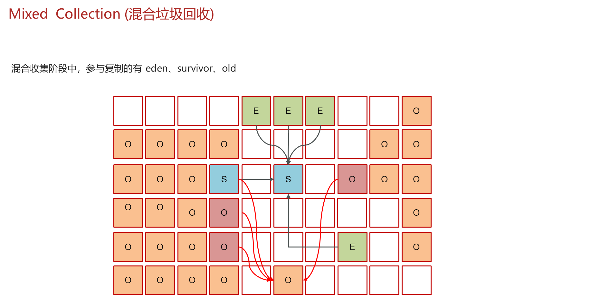
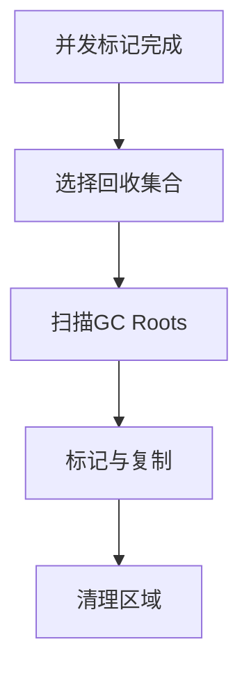

# 3. 混合回收



### Java面试八股文：G1垃圾回收器混合收集详解

#### 1. 概述与定义

在Java开发中，JVM（Java虚拟机）是运行Java程序的核心，而垃圾收集（Garbage Collection, GC）是JVM内存管理的关键环节。G1（Garbage First）垃圾回收器是现代JVM中的一种高级回收器，旨在平衡低延迟和高吞吐量，特别适用于大堆内存场景。G1通过将堆划分为多个小区域（Region），并优先回收垃圾比例高的区域来优化内存管理。在G1中，混合收集（Mixed GC）是其核心功能之一，负责同时回收新生代和部分老年代区域，以实现全局内存清理。

混合收集是G1在新生代回收（Young GC）之外的一种更全面的回收方式，它不仅清理Eden和Survivor区域，还会选择部分老年代Region进行回收。混合收集的目标是通过增量清理老年代，控制堆内存占用，同时保持可预测的停顿时间。理解G1混合收集，不仅能帮助我们优化JVM性能，还能在面试中展示对垃圾回收深层机制的掌握。接下来，我们将从特点、目标、内容、原理到应用场景，全面剖析这一知识点。

***

#### 2. 主要特点

G1混合收集的核心特点可以用以下几点概括：

- **混合性** 🌟：同时回收新生代和部分老年代Region，兼顾全局优化。
- **增量回收** ⏳：每次只回收部分老年代，避免长时间STW。
- **优先级调度** 🎯：优先选择垃圾比例高的老年代Region，回收收益最大化。
- **并行执行** 🚀：利用多线程并行清理，提高效率。
- **内存整理** 🧹：通过复制算法整理存活对象，减少碎片。

与其他回收器（如CMS）相比，G1混合收集更注重全局内存管理和碎片控制，适合需要低延迟和大堆管理的现代应用。这些特点使其在高并发场景中表现出色。

***

#### 3. 应用目标

G1混合收集的设计目标明确，主要包括：

- **全局内存清理**：通过回收老年代，控制堆内存占用。
- **减少碎片**：整理存活对象，避免内存碎片影响大对象分配。
- **可控停顿时间**：通过增量回收，保持单次GC停顿可预测。
- **支持大堆内存**：适应几十GB甚至上百GB的堆内存场景。

例如，一个大型微服务系统，运行时堆内存高达50GB，频繁的对象晋升导致老年代占用过高，混合收集可以逐步清理老年代，确保系统稳定运行。

***

#### 4. 主要内容及其组成部分

G1混合收集涉及多个核心部分，以下逐一详解：

##### 4.1 回收区域选择

混合收集的目标区域包括：

- **新生代**：Eden和Survivor From区域，回收短期存活对象。
- **老年代**：根据回收收益（垃圾比例/回收时间）选择部分Region。

##### 4.2 GC Roots

GC Roots是标记的起点，包括：

- 栈中的局部变量。
- 方法区中的静态变量和常量。
- 本地方法栈中的引用。

##### 4.3 并发标记

混合收集依赖之前的并发标记阶段（Concurrent Marking），标记存活对象并计算每个Region的垃圾比例。包括：

- 初始标记（STW）。
- 并发标记（与应用线程并行）。
- 重新标记（STW）。

##### 4.4 并行复制与整理

使用多线程将存活对象从回收区域复制到新的Region，整理内存空间。

##### 4.5 记忆集（Remembered Set）

每个Region维护记忆集，记录外部引用，用于快速扫描跨代引用。

##### 4.6 其他机制

- **写屏障**：记录引用变更，确保标记准确。
- **停顿预测模型**：根据历史数据估算回收时间。
- **回退机制**：若混合收集失败，可能触发Full GC。

下表总结混合收集的组成部分：

| **组成部分**​ | **功能**​         | **特点**​ |
| --------- | --------------- | ------- |
| 新生代区域     | 回收Eden和Survivor | 强制回收    |
| 老年代区域     | 选择垃圾比例高的Region  | 增量回收    |
| GC Roots  | 标记存活对象起点        | 快速扫描    |
| 记忆集       | 跟踪跨代引用          | 优化效率    |
| 并行复制      | 移动并整理存活对象       | 多线程执行   |

***

#### 5. 原理剖析

##### 5.1 工作流程

混合收集的流程如下：

1. **并发标记完成**：提前标记存活对象，计算Region垃圾比例。
2. **选择回收集合**：包括所有新生代Region和部分老年代Region。
3. **扫描GC Roots**：识别直接引用的存活对象。
4. **标记与复制**：并行标记存活对象并复制到新Region。
5. **清理区域**：清空回收区域，更新Region状态。

Mermaid图展示Mixed GC流程：




##### 5.2 回收集合选择

G1根据“垃圾优先”原则选择老年代Region，核心公式：

- **回收收益 = 回收内存量 / 预计回收时间**

优先回收收益高的Region，并根据`-XX:MaxGCPauseMillis`限制停顿时间。例如，若目标停顿为200ms，G1会动态调整回收区域数量。

##### 5.3 复制与整理

混合收集使用复制算法整理内存。例如：

```markdown 
Eden: [Obj1][Obj2]
Old Region1: [Obj3][垃圾]
GC后：
Survivor: [Obj1]
Old Region2: [Obj3]
```


存活对象被复制到新区域，原区域清空，避免碎片。

##### 5.4 记忆集与写屏障

记忆集记录老年代到新生代的引用，通过写屏障维护。伪代码示例：

```java 
class WriteBarrier {
    void setReference(Object from, Object to) {
        if (isCrossGeneration(from, to)) {
            addToRememberedSet(from, to); // 记录跨代引用
        }
        from.ref = to;
    }
}
```


##### 5.5 停顿时间控制

G1通过预测模型估算回收时间，动态调整回收集合。例如，若回收5个Region需300ms，而目标是200ms，则只收3个Region。

##### 5.6 潜在问题

- **并发标记失败**：若标记未完成，可能退化为Full GC。
- **空间不足**：复制目标区域不足时，可能触发晋升失败。

***

#### 6. 应用与拓展

##### 6.1 应用场景

- **大堆系统**：如分布式数据库，堆内存超50GB。
- **低延迟应用**：如实时推荐系统。
- **高并发服务**：如微服务架构。

##### 6.2 参数调优

常用参数包括：

- `-XX:+UseG1GC`：启用G1。
- `-XX:MaxGCPauseMillis=200`：设置最大停顿时间。
- `-XX:G1MixedGCCountTarget=8`：控制混合收集次数。

示例：启动大堆低延迟应用：

```bash 
java -Xms32g -Xmx32g -XX:+UseG1GC -XX:MaxGCPauseMillis=200 -jar app.jar
```


##### 6.3 拓展

- **与Young GC对比**：Young GC只收新生代，Mixed GC兼顾老年代。
- **与CMS对比**：CMS无整理功能，易碎片化；G1通过复制减少碎片。

***

#### 7. 面试问答

##### 7.1 G1混合收集的工作原理是什么？

面试官你好，G1的混合收集是Mixed GC，主要回收新生代和部分老年代Region，目标是全局清理内存。它依赖之前的并发标记，标记存活对象并算出每个Region的垃圾比例。回收时，先选定回收集合，包括所有新生代和收益高的老年代Region；然后扫描GC Roots，标记存活对象；接着用多线程把存活对象复制到新Region，最后清空旧区域。因为用复制算法，还能整理内存，减少碎片，整个过程停顿时间可控。

##### 7.2 混合收集和新生代回收有什么区别？

这个问题我很熟！Young GC只回收新生代，包括Eden和Survivor，目标是快速清理短期对象，停顿时间短。而Mixed GC更全面，除了新生代，还会选部分老年代Region回收，解决老年代内存占用问题。Mixed GC依赖并发标记结果，回收收益高的区域，停顿时间比Young GC长，但能全局优化堆内存。我在项目里会看GC日志，如果老年代涨得快，就指望Mixed GC来救场。

##### 7.3 如何选择混合收集的回收区域？

G1的选择逻辑很聪明！它根据“垃圾优先”原则，算每个Region的回收收益，就是回收内存量除以预计时间。混合收集会把所有新生代Region加上收益最高的老年代Region放进回收集合。但有个限制，得符合`-XX:MaxGCPauseMillis`设的目标停顿时间，比如200ms。G1会预测回收时间，动态调整区域数量，确保停顿可控。这点在面试里挺常考的！

##### 7.4 混合收集如何减少内存碎片？

这个问题有意思！混合收集用复制算法，把存活对象从回收区域复制到新Region，原区域直接清空。比如Eden有个对象A，老年代有个对象B，Mixed GC会把A、B复制到新的Survivor或老年代Region，旧区域就没碎片了。相比CMS的标记-清除，G1这招能有效避免碎片问题，特别适合大对象分配多的场景。

##### 7.5 如何优化混合收集的性能？

优化Mixed GC我有经验！首先用`-XX:MaxGCPauseMillis`设停顿目标，比如200ms，让G1自己调整回收范围。其次，可以调`-XX:G1MixedGCCountTarget`，默认8次，控制每次混合收集的次数，多了会频繁触发，少了老年代清理不及时。还能用`-XX:ParallelGCThreads`加并行线程数，提速回收。实际项目里，我会看GC日志，如果Mixed GC太慢，就调大堆或优化对象分配，减少晋升。

***
