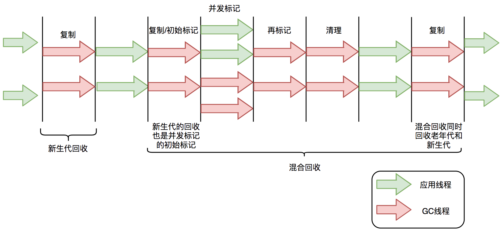

# d. G1垃圾收集器

***

## 1. 概述与定义

G1 垃圾回收器（Garbage-First Collector）是 Oracle 在 JDK 7u4 后推出的一款面向服务端应用的垃圾收集器。它主要针对大堆内存和多核处理器环境设计，能够在保证较高吞吐量的同时，将垃圾回收停顿时间控制在较低水平。G1 的核心思想是将整个堆划分为多个大小相同的区域（Region），根据每个区域垃圾的比例（即“垃圾优先”）动态决定回收顺序和范围，从而优先回收垃圾最多的区域，最大限度地回收内存并减少停顿时间。😊

G1 垃圾回收器支持分代收集策略，即将堆分为年轻代和老年代，但这两者并不是固定区域，而是基于 Region 的动态划分。它能适应大规模堆内存的变化，并提供预测停顿时间的能力，使得系统在面对大数据量时依然能保持较低延迟和较高的响应速度。

***

## 2. 主要特点

G1 垃圾回收器具有如下主要特点：

1. **区域化管理** &#x20;
   - G1 将整个堆划分为多个相同大小的 Region，每个 Region 可独立作为年轻代或老年代使用。这种区域化管理方式使得垃圾收集更加灵活，能够对堆内存进行细粒度控制。
2. **垃圾优先回收** &#x20;
   - G1 会计算各个 Region 中的垃圾比例，并优先回收垃圾比例高的 Region，从而在回收时最大限度地回收内存，同时降低复制或整理成本。
3. **低停顿时间预测** &#x20;
   - G1 提供了 `-XX:MaxGCPauseMillis` 参数，使得开发者可以设定期望的最大 GC 停顿时间。G1 根据该目标动态选择回收 Region 数量，实现低停顿目标。
4. **并发与混合回收** &#x20;
   - G1 在垃圾收集过程中大部分阶段均支持并发执行，只有少量阶段需要 STW。特别是混合回收阶段，不仅回收年轻代，还会同时回收部分老年代区域，有助于降低 Full GC 的发生频率。
5. **适用于大堆内存** &#x20;
   - 针对大堆内存环境，G1 能够更高效地管理内存，减少内存碎片问题，并提供更好的吞吐量和响应速度，特别适合服务器端和分布式系统应用。

下表对比了 G1 垃圾回收器与其他常见收集器（如 Serial GC、Parallel GC、CMS GC）的主要特点：

| 特性     | G1 垃圾回收器                       | Serial GC | Parallel GC      | CMS GC     |
| ------ | ------------------------------ | --------- | ---------------- | ---------- |
| 堆内分区管理 | 将堆划分为多个 Region                 | 整个堆连续分配   | 同 Serial，连续堆内存分配 | 整个堆连续分配    |
| 停顿时间预测 | 提供 -XX:MaxGCPauseMillis 预测停顿时间 | 无预测       | 无精准预测            | 无预测（但较低停顿） |
| 并发执行   | 大部分阶段并发执行                      | 单线程       | 并行执行             | 部分并发（标记阶段） |
| 适用场景   | 大堆、大数据、高并发系统                   | 小堆或单核环境   | 吞吐量优先场景          | 实时性要求较高的场景 |

这些特点使得 G1 在现代服务器端应用中受到广泛关注和使用。🚀

***

## 3. 应用目标

掌握 G1 垃圾回收器的核心原理和调优方法，其应用目标主要包括：

1. **提升系统响应与吞吐量** &#x20;
   - 通过分区管理和垃圾优先回收，G1 能够在回收过程中最大限度减少停顿时间，确保系统在大负载情况下依然能保持较高响应速度和吞吐量。
2. **降低内存碎片与 Full GC 频率** &#x20;
   - G1 的区域化设计和混合回收机制能有效降低内存碎片问题，同时通过混合回收降低 Full GC 发生的频率，从而提高系统整体稳定性。
3. **满足高并发应用需求** &#x20;
   - 在面对大规模、多线程并发访问时，G1 能更好地利用多核 CPU 资源，确保垃圾回收对业务线程影响最小，适用于电商、金融、社交等高并发场景。
4. **动态调优与预测管理** &#x20;
   - 通过设置 `-XX:MaxGCPauseMillis` 等参数，开发者可以根据业务需求动态调整垃圾回收策略，实现预期停顿时间目标，进而实现精准的内存管理。
5. **面试答题与工程实践** &#x20;
   - 深入理解 G1 垃圾回收器的设计理念、内部实现和调优参数，有助于在面试中详细解答 JVM 内存管理问题，并能在工程实践中进行有效的系统调优和问题排查。📈

***

## 4. 主要内容及其组成部分

G1 垃圾回收器的主要内容及其组成部分主要包括以下几部分：

### 4.1 堆区域划分

- **Region 概念** &#x20;
  - G1 将整个堆内存划分为大小相同的 Region，每个 Region 可以独立作为 Eden、Survivor 或老年代使用。 &#x20;
  - 这种划分方式使得内存管理更细粒度，同时能动态调整各区域的角色。
- **区域标记与管理** &#x20;
  - G1 会实时统计每个 Region 的垃圾比例，通过算法判断哪些 Region 是垃圾优先回收的目标区域。

### 4.2 垃圾回收流程

G1 垃圾回收流程主要包括以下几个阶段：



- **初始标记阶段** &#x20;
  - 在 STW 模式下快速标记与 GC Roots 直接关联的 Region。 &#x20;
  - 时间短，主要用于准备后续的并发标记。
- **并发标记阶段** &#x20;
  - 多线程并发遍历整个堆内对象，从 GC Roots 开始标记所有可达对象。 &#x20;
  - 该阶段不需要 STW，降低了停顿时间。
- **最终标记阶段** &#x20;
  - 在 STW 模式下，完成漏标对象的补充标记，确保标记工作全面完成。
- **混合回收阶段** &#x20;
  - 根据每个 Region 的垃圾比例，从年轻代和部分老年代中选择若干 Region 进行回收。 &#x20;
  - 回收过程采用复制和整理等技术，同时释放内存空间。

### 4.3 调优参数与策略

- **停顿时间目标** &#x20;
  - `-XX:MaxGCPauseMillis` 参数允许开发者设定期望的最大 GC 停顿时间，G1 会尽量满足该目标。 &#x20;
- **区域大小控制** &#x20;
  - `-XX:G1HeapRegionSize` 参数控制每个 Region 的大小，通常根据堆总大小自动计算，但也可以手动指定。 &#x20;
- **混合回收比例** &#x20;
  - G1 内部有一套算法用于确定混合回收时选择的 Region 数量，确保回收效果与停顿时间之间的平衡。

### 4.4 示例代码说明

下面提供一段简单的示例代码，用于演示大量对象分配以触发 G1 垃圾回收，同时结合 JVM 参数打印 GC 日志以便调优参考：

```java 
public class G1GCDemo {
    public static void main(String[] args) {
        // 模拟大量对象分配，触发垃圾回收
        for (int i = 0; i < 500000; i++) {
            byte[] data = new byte[1024 * 5]; // 分配5KB内存块
            if (i % 10000 == 0) {
                System.out.println("已分配对象数：" + i);
            }
        }
        System.out.println("对象分配完成，触发垃圾回收...");
        System.gc(); // 仅为建议，不建议频繁调用
    }
}
```


运行该示例时，建议使用如下 JVM 参数启用 G1 垃圾回收器并打印详细 GC 日志： &#x20;

`-XX:+UseG1GC -XX:MaxGCPauseMillis=200 -XX:+PrintGCDetails -XX:+PrintGCTimeStamps -XX:G1HeapRegionSize=4m`

***

## 5. 原理剖析

深入解析 G1 垃圾回收器的原理，有助于理解其内部工作机制及调优策略。主要内容包括以下方面：

### 5.1 区域化管理原理

- G1 将堆划分为若干固定大小的 Region，每个 Region 可动态指定为 Eden、Survivor 或老年代。 &#x20;
- 每个 Region 都会记录自身的垃圾比例，系统通过统计数据判断哪些 Region 垃圾最多，优先进行回收。这种“垃圾优先”的策略使得内存回收更加高效。

### 5.2 并发标记与回收

- **初始标记阶段**：在 STW 模式下对直接与 GC Roots 关联的 Region 进行快速标记，为后续并发标记提供基础。 &#x20;
- **并发标记阶段**：多个 GC 线程同时遍历整个堆，从 GC Roots 开始标记所有可达对象。该阶段与应用线程并发执行，大大降低了停顿时间。 &#x20;
- **最终标记阶段**：在短暂的 STW 中完成漏标补充，确保所有存活对象被正确标记。 &#x20;
- **混合回收阶段**：根据各 Region 垃圾比例，选取多个 Region 同时回收。回收过程中使用复制和整理技术，将存活对象复制到新区域或整理内存，释放垃圾区域。

### 5.3 停顿时间预测与调优

- G1 通过 `-XX:MaxGCPauseMillis` 参数设定期望停顿时间目标，并根据此目标动态调整回收策略，选择合适的回收区域数量。 &#x20;
- 内部算法会根据堆内存占用情况、对象存活率等指标预测回收成本，从而实现精准的停顿控制。

### 5.4 内存整理与碎片管理

- 在混合回收过程中，G1 会对回收 Region 进行整理，消除内存碎片。 &#x20;
- 与传统标记整理相比，G1 只对部分 Region 进行整理，避免了全堆整理所带来的长时间停顿，同时确保内存分配连续性。

### 5.5 性能调优与监控

- 通过 GC 日志、JMX 和内存监控工具（如 VisualVM、GCViewer）观察各阶段的执行时间和内存回收效率，开发者可以判断 G1 的性能表现。 &#x20;
- 调优策略主要集中在调整 Region 大小、目标停顿时间以及并发线程数等参数上，以适应不同应用场景需求。💡

***

## 6. 应用与拓展

G1 垃圾回收器在实际工程中的应用及其拓展主要体现在以下方面：

### 6.1 大型分布式与企业级系统

- G1 适用于拥有大堆内存和高并发访问的服务器端应用。其低停顿特性和区域化管理能够保证系统在高负载下依然保持较高响应速度和稳定性。

### 6.2 高性能实时系统

- 对于金融交易、在线游戏等对响应时间要求极高的系统，通过合理配置 `-XX:MaxGCPauseMillis` 和混合回收策略，G1 能够有效控制 GC 停顿时间，从而提高系统实时性。

### 6.3 动态调优与自动化监控

- 利用 GC 日志与内存监控工具，结合自动化调优平台，开发者可以实时调整 G1 参数，优化内存回收过程，确保系统稳定运行。 &#x20;
- 未来，随着 JVM 技术不断演进，新型收集器（如 ZGC、Shenandoah）会在 G1 基础上进一步改进低停顿性能，开发者应关注这些前沿技术动态。

### 6.4 工程实践经验分享

- 通过实际项目调优案例，团队可以形成一套完整的 G1 垃圾回收器调优经验，为后续系统优化和技术培训提供支持。📚

### 6.5 与其他收集器的比较与迁移

- 深入理解 G1 的工作机制后，开发者可以根据业务需求与系统资源选择合适的垃圾收集器，并在必要时从 G1 迁移至更适合的收集器，如 CMS、Parallel GC 或新型低停顿收集器，确保系统始终保持最佳性能。🚀

***

## 7. 面试问答

以下提供五个典型面试问答，模拟面试者口吻详细回答关于 G1 垃圾回收器的常见问题，帮助你在面试中自信展示知识深度与实践经验。

### 7.1 问题一：请介绍 G1 垃圾回收器的基本原理和设计思想

【回答】： &#x20;

G1 垃圾回收器采用区域化管理思想，将整个堆划分为多个大小相同的 Region，并根据每个区域的垃圾比例动态选择回收目标。它通过初始标记、并发标记、最终标记和混合回收等阶段，最大限度地减少停顿时间，同时兼顾吞吐量。其设计思想是“垃圾优先”，即优先回收垃圾比例高的区域，以达到低停顿和高效率的目标。

### 7.2 问题二：G1 垃圾回收器如何实现低停顿目标？请说明相关调优参数

【回答】： &#x20;

G1 通过 `-XX:MaxGCPauseMillis` 参数设定目标停顿时间，系统会根据当前内存占用情况和对象存活率动态调整回收策略，选择回收数量和区域，以控制停顿时间。此外，通过调整 `-XX:G1HeapRegionSize` 和并发线程数，可以进一步优化各回收阶段的执行效率，确保停顿时间控制在预期范围内。

### 7.3 问题三：请描述 G1 垃圾回收器的混合回收阶段及其优势

【回答】： &#x20;

在混合回收阶段，G1 不仅回收年轻代区域，还会选择部分老年代 Region 进行回收。这样可以在一次回收中同时清理新生对象和部分长期存活对象，从而降低 Full GC 的频率。混合回收利用了垃圾优先策略和区域化管理，使得内存回收更均衡，进一步降低内存碎片问题，同时保持较低的 GC 停顿。

### 7.4 问题四：如何通过 GC 日志监控和调优 G1 垃圾回收器的性能？

【回答】： &#x20;

我会使用 `-XX:+PrintGCDetails` 和 `-XX:+PrintGCTimeStamps` 参数启用详细 GC 日志，并结合工具如 GCViewer、VisualVM 分析日志。通过观察各个阶段的执行时间、各 Region 垃圾比例和停顿时长，判断是否满足业务需求。若发现停顿过长或 Full GC 频率较高，就可以调整 `-XX:MaxGCPauseMillis`、`-XX:G1HeapRegionSize` 或并发线程参数，进而优化 GC 性能。

### 7.5 问题五：请结合实际案例说明你是如何在项目中使用 G1 垃圾回收器提升系统性能的

【回答】： &#x20;

在一个大型分布式系统项目中，我们面临堆内存大、对象频繁创建且对响应时间要求较高的问题。我们采用 G1 垃圾回收器，并通过调整 `-XX:MaxGCPauseMillis` 参数将目标停顿时间设置为 200 毫秒，同时调整 `-XX:G1HeapRegionSize` 和并发线程数，使得各阶段执行更加均衡。通过 GC 日志监控，我们发现混合回收阶段频率明显提高，Full GC 几乎不出现，系统响应时间大幅降低，整体吞吐量提升了 20%。这充分证明了 G1 在大堆内存和高并发场景下的优势。

***

[1. 新生代回收](<1. 新生代回收/1. 新生代回收.md> "1. 新生代回收")

[2. 并发标记](<2. 并发标记/2. 并发标记.md> "2. 并发标记")

[3. 混合回收](<3. 混合回收/3. 混合回收.md> "3. 混合回收")

[4. 记忆集与写屏障](<4. 记忆集与写屏障/4. 记忆集与写屏障.md> "4. 记忆集与写屏障")
