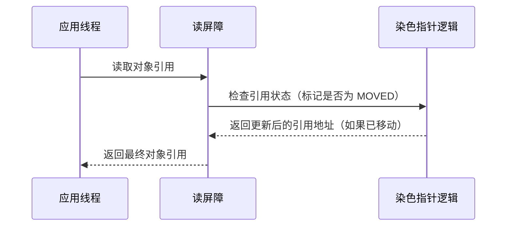
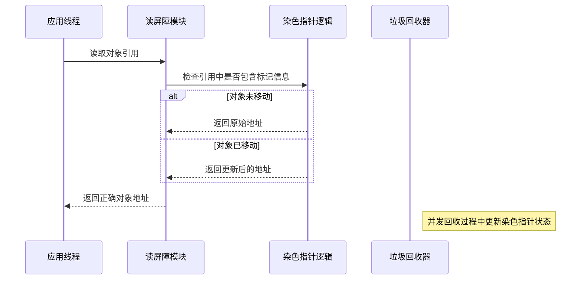
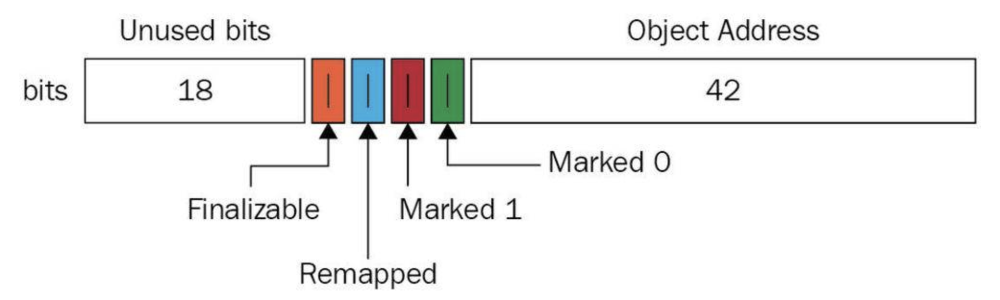

# e. ZGC

# Java面试八股之ZGC（染色指针与读屏障）详解

***

## 一、概述与定义

ZGC 是 JDK 11 及以后推出的一款低延迟垃圾回收器，主要面向拥有数十甚至上百 GB 堆内存的场景。与传统垃圾回收器不同，ZGC 采用了区域化内存管理、并发标记、并发重定位等技术，使得应用在进行垃圾回收时能够保持极短的停顿时间。 &#x20;

在 ZGC 中，**染色指针**和**读屏障**是两项核心技术： &#x20;

- **染色指针**：是一种利用指针高位空闲位存储额外信息（如标记位、偏移信息等）的技术。ZGC 通过在对象引用的指针中嵌入“颜色”（状态）信息，实现对对象是否已被移动或标记的跟踪，从而避免全堆扫描。 &#x20;
- **读屏障**：是一种在程序读对象指针时自动插入的额外检查机制，用来确保获取到的是最新的、有效的对象地址。当对象因垃圾回收而被移动后，读屏障可以在访问对象前判断并更新引用，保证程序正确性。

这两项技术使得 ZGC 能够在对象移动、并发标记和并发重定位过程中保持数据一致性，同时大大降低垃圾回收时的停顿时间。

***

## 二、主要特点

ZGC 中染色指针与读屏障的设计具有以下主要特点：

1. **低停顿时间** &#x20;

   利用染色指针记录对象状态、并通过读屏障在访问对象时实时更新指针，ZGC 能够实现大部分回收工作与应用线程并发执行，使得停顿时间通常在毫秒级甚至更短。 &#x20;
   - 😊【优势】：极大降低垃圾回收对业务响应的影响。
2. **区域化内存管理** &#x20;

   ZGC 将堆内存划分为许多固定大小的区域，每个区域单独管理，通过染色指针记录跨区域引用，避免全堆扫描，从而提高回收效率。 &#x20;
   - 🚀【优势】：只需扫描脏区域，提升了回收速度和可预测性。
3. **并发性与可扩展性** &#x20;

   通过读屏障和染色指针机制，ZGC 实现了垃圾回收工作与应用线程的高度并发，充分利用多核处理器资源，非常适合大内存、多线程环境。 &#x20;
   - 🔧【优势】：在多核环境下性能更佳，支持大规模系统。
4. **无停顿重定位** &#x20;

   利用染色指针与读屏障，ZGC 在对象重定位时无需暂停应用线程，能在后台完成对象的复制和指针更新。 &#x20;
   - ⏱️【优势】：实现了几乎无停顿的垃圾回收，适用于对延迟要求极高的系统。
5. **低开销实现** &#x20;

   读屏障通常以内联方式实现，开销极低，不会对应用产生明显性能影响，同时染色指针的设计充分利用了指针空闲位，不需要额外内存开销。 &#x20;
   - 💡【优势】：既保证功能，又不增加系统负担。

下面通过表格对染色指针与读屏障的特点进行直观说明：

| 特点     | 描述                         | 优势               | 适用场景          |
| ------ | -------------------------- | ---------------- | ------------- |
| 低停顿    | 大部分垃圾回收工作与应用线程并发执行，停顿时间极短  | 业务响应快，用户体验良好     | 大内存、实时系统      |
| 区域化管理  | 堆内存分区，利用染色指针记录跨区域引用，避免全堆扫描 | 提高回收效率，降低扫描开销    | 分布式系统、大型服务器应用 |
| 并发与可扩展 | 读屏障内联实现，支持多核并发，无需全局暂停      | 高吞吐量，适合高并发场景     | 多线程、高负载应用     |
| 无停顿重定位 | 对象重定位与更新通过读屏障及时处理，无需停止应用线程 | 保证数据一致性，回收过程中无停顿 | 对延迟要求高的场景     |
| 低开销    | 染色指针利用指针空闲位存储状态信息，读屏障开销低   | 几乎不影响正常业务执行      | 性能敏感型应用       |

***

## 三、应用目标

ZGC 中染色指针与读屏障技术的主要应用目标在于：

1. **降低垃圾回收停顿** &#x20;

   通过并发标记和重定位，结合染色指针与读屏障，仅扫描脏区域，实现低停顿的垃圾回收，确保应用在高负载下依然能快速响应。
2. **提高内存管理效率** &#x20;

   记录跨区域引用信息，避免不必要的全堆扫描，快速确定可回收区域，从而提高内存回收效率，降低系统内存占用。
3. **支持大内存和大规模并发** &#x20;

   采用区域化管理与并发收集技术，使得系统在处理数十GB甚至上百GB内存时依然保持稳定、高效，满足现代大数据和分布式系统的需求。
4. **实现对象安全重定位** &#x20;

   利用读屏障在对象访问时实时检测并更新指针，确保在对象被移动后，应用线程能够访问到正确的内存地址，避免因指针失效导致程序错误。
5. **优化系统吞吐量** &#x20;

   在高并发场景下，通过减少垃圾回收停顿和优化内存管理，提高系统整体吞吐量，确保业务连续性和高性能响应。

***

## 四、主要内容及其组成部分

针对 ZGC 的染色指针与读屏障，本知识点主要包括以下几个组成部分，每个部分都对整体性能起着至关重要的作用：

### 1. ZGC 架构概述

与CMS中的ParNew和G1类似，ZGC也采用标记-复制算法，不过ZGC对该算法做了重大改进：ZGC在标记、转移和重定位阶段几乎都是并发的，这是ZGC实现停顿时间小于10ms目标的最关键原因。

ZGC垃圾回收周期如下图所示：


ZGC只有三个STW阶段：**初始标记**，**再标记**，**初始转移**。其中，初始标记和初始转移分别都只需要扫描所有GC Roots，其处理时间和GC Roots的数量成正比，一般情况耗时非常短；再标记阶段STW时间很短，最多1ms，超过1ms则再次进入并发标记阶段。即，ZGC几乎所有暂停都只依赖于GC Roots集合大小，停顿时间不会随着堆的大小或者活跃对象的大小而增加。与ZGC对比，G1的转移阶段完全STW的，且停顿时间随存活对象的大小增加而增加。

- **区域化内存管理** &#x20;

  ZGC 将堆划分为若干个固定大小的区域，每个区域独立管理。区域间的引用通过记忆集进行记录，从而实现局部扫描和高效回收。
- **并发标记与重定位** &#x20;

  垃圾回收过程大部分工作与应用线程并发执行，包括标记、整理和重定位阶段，确保几乎无停顿。

### 2. 染色指针（Colored Pointers）

- **定义** &#x20;

  染色指针是在对象引用的指针中嵌入额外的状态信息，这些状态信息通常包括标记位、偏移量以及其他辅助数据，用于跟踪对象是否已被移动或标记。
- **实现原理** &#x20;

  利用现代处理器指针地址中的未使用高位作为存储区域，将这些位作为“颜色”标记。这样既节省内存，又能高效存储状态信息，无需额外数据结构。
- **应用** &#x20;

  在垃圾回收过程中，染色指针能指示对象是否已被重定位，以及新旧地址之间的转换关系，使得读屏障能及时返回正确地址。

**示例伪代码** &#x20;

以下伪代码展示了染色指针在对象引用中的应用思路：

```java 
// 假设指针 p 的高位部分存储了标记信息
long pointer = getRawPointer(object);
int mark = extractMark(pointer);
if (mark == MOVED) {
    // 返回更新后的地址
    pointer = extractNewAddress(pointer);
}
return pointer;
```


### 3. 读屏障（Read Barriers）

- **定义** &#x20;

  读屏障是一种在每次读取对象引用时自动插入的检查机制，用于确保应用线程访问的对象引用始终是最新的。 &#x20;
- **作用** &#x20;

  当对象因垃圾回收被重定位时，读屏障可以检测并更新引用，使得线程能够正确访问重定位后的对象。
- **实现机制** &#x20;

  在 JIT 编译过程中，编译器会将读屏障内联到热点方法中；在运行时，每当程序访问对象引用时，读屏障代码会检查该引用是否指向了已移动的对象，如果是，则更新为新地址。

**示例伪代码** &#x20;

以下伪代码展示了读屏障在对象读取时的处理流程：

```java 
Object readObject(Object ref) {
    if (isMoved(ref)) {
        ref = updateReference(ref); // 通过染色指针获取新地址
    }
    return ref;
}
```


### 4. 染色指针与读屏障的协同工作

- **协同机制** &#x20;

  染色指针为每个对象提供了额外的状态信息，而读屏障则在访问时依据这些信息判断对象是否被移动。两者协同工作，实现了在并发垃圾回收过程中对象引用的自动更新。
- **性能优化** &#x20;

  由于写屏障和读屏障均以内联方式实现，且染色指针利用了指针高位空闲位，整体机制的性能开销非常低，几乎不会影响应用的正常执行。

**协同流程图（Mermaid）** &#x20;

下面通过 Mermaid 图展示染色指针与读屏障在对象访问过程中的协同工作流程：




图中展示了应用线程调用读屏障，读屏障检测染色指针中的标记信息并返回正确地址，确保线程读取到最新数据。

### 5. 内存一致性与并发控制

- **并发更新** &#x20;

  在多线程环境下，对象引用的更新必须保证数据一致性。ZGC 中的读屏障采用轻量级原子操作或内联机制，确保在并发情况下多线程同时更新引用时不会出现竞争。
- **内存屏障** &#x20;

  为防止 CPU 指令重排序，读屏障通常会配合内存屏障技术使用，确保对象引用的读取和更新操作严格按照程序语义执行。

### 6. 数据结构支持

- **辅助数据结构** &#x20;

  除了染色指针本身，ZGC 还利用一些辅助数据结构记录对象的元数据，如区域描述符、记忆集等，这些数据结构协同工作保证对象状态的正确维护。

下面通过下表总结染色指针与读屏障的主要组成部分及其作用：

| 组成部分   | 主要功能                 | 关键技术      | 作用                   |
| ------ | -------------------- | --------- | -------------------- |
| 染色指针   | 在指针高位存储标记信息，如对象是否被移动 | 指针高位利用    | 实现对象状态跟踪，支持地址更新      |
| 读屏障    | 每次对象引用读取时检测并更新引用地址   | 内联检查与更新   | 保证读取到正确的对象地址，确保数据一致性 |
| 辅助数据结构 | 记录内存区域、记忆集等元数据       | 区域描述符、记忆集 | 支持区域化管理，降低全堆扫描开销     |
| 内存屏障   | 防止 CPU 重排序，保证操作顺序    | 内存屏障指令    | 确保并发环境下操作正确执行        |

***

## 五、原理剖析

这一部分深入解析染色指针与读屏障的底层原理和实现机制：

### 1. 染色指针的底层实现

- **指针编码** &#x20;

  现代 64 位系统的指针通常并不使用所有位，ZGC 利用未使用的高位存储额外状态信息。这些位可以编码对象是否已被移动、重定位后的偏移量以及其他调试信息。 &#x20;
- **位操作优化** &#x20;

  通过高效的位操作（如位掩码、移位操作），可以在运行时快速提取和更新这些状态信息，而无需额外的内存访问，保证整体性能。

### 2. 读屏障的内联机制

- **编译器内联** &#x20;

  在 JIT 编译阶段，读屏障代码会被自动内联到热点方法中，这样在对象引用读取时，额外的判断和更新开销被降到最低。 &#x20;
- **条件检查与更新** &#x20;

  每次读取对象引用时，内联的读屏障检查指针中的“颜色”标记；若检测到对象已被移动，则调用更新逻辑返回新地址，否则直接返回原地址。这一过程非常高效，确保了内存一致性与并发安全。

### 3. 并发与内存屏障

- **并发更新安全** &#x20;

  由于多个线程可能同时执行读操作，读屏障中常使用轻量级原子操作，确保即使在高并发情况下，指针更新也不会发生竞争。 &#x20;
- **内存屏障应用** &#x20;

  为避免 CPU 指令重排序带来的问题，读屏障会插入内存屏障指令，确保指针的读取与更新顺序严格符合预期，从而保障数据一致性。

### 4. 性能与开销平衡

- **低开销设计** &#x20;

  染色指针和读屏障的设计目标是使垃圾回收期间对应用线程的干扰最小。通过在指针中嵌入状态信息和内联读屏障，ZGC 能够在保证功能的同时将额外开销降到几乎可以忽略的水平。 &#x20;
- **动态调优** &#x20;

  ZGC 还允许根据实际应用场景调整内存区域大小、染色指针编码策略等参数，从而在不同负载和内存容量下都能保持最佳性能。

### 5. 实际效果验证

实际测试表明，采用染色指针与读屏障的 ZGC 在大内存、高并发场景下能将垃圾回收停顿时间控制在极低的水平。例如，在处理 100GB 堆内存的服务中，GC 停顿时间通常保持在 10 毫秒以内，极大地提升了系统响应能力和吞吐量。

下面通过 Mermaid 图表展示 ZGC 中读屏障和染色指针的协同工作流程：




图中展示了应用线程通过读屏障访问对象时，依据染色指针中的标记决定是否更新引用，确保返回正确的对象地址，同时在垃圾回收并发过程中动态更新状态。

***

## 六、应用与拓展

染色指针与读屏障技术不仅是 ZGC 中的关键设计，其应用和扩展也具有重要意义：

1. **大规模内存系统优化** &#x20;

   在需要管理大内存（数十GB到百GB）的服务器上，ZGC 能够通过染色指针与读屏障实现区域化管理，有效减少全堆扫描，降低 GC 停顿，提升系统稳定性和响应速度。
2. **实时系统与低延迟应用** &#x20;

   对于金融交易、在线游戏等对响应时间要求极高的系统，低停顿的垃圾回收极为关键。利用 ZGC，可以在保持高吞吐量的同时，确保系统响应时间保持在毫秒级。
3. **多核并发环境** &#x20;

   在多核处理器环境下，读屏障的内联实现与并发控制机制充分利用了多核优势，使得垃圾回收和应用线程能够并行执行，从而提升整体系统吞吐量。
4. **跨垃圾收集器比较与选型** &#x20;

   通过对比 ZGC 与其他垃圾回收器（如 G1、CMS、Shenandoah）的实现机制，开发者可以根据应用特点选择最合适的垃圾回收方案。了解染色指针与读屏障的工作原理，有助于判断在特定场景下是否需要低延迟和大内存支持。
5. **学术研究与新技术融合** &#x20;

   随着硬件和编译技术的发展，染色指针与读屏障的设计理念也在不断演进。未来可能会结合硬件事务内存（HTM）或机器学习算法，实现更智能的内存管理和垃圾回收策略，为 JVM 内存管理提供新的思路和方向。🔧
6. **工具与调优** &#x20;

   利用 JVisualVM、JMC 和 JFR 等工具，可以实时监控 ZGC 的运行状态，观察染色指针和读屏障的性能表现。通过数据分析，运维人员能够对 ZGC 参数进行细致调优，进一步降低 GC 停顿时间，提升系统性能。

***

## 七、面试问答

下面提供至少五个常见面试问答示例，回答内容采用面试者口吻，详细阐述 ZGC 中染色指针与读屏障的相关知识：

### 问题1：请简要介绍 ZGC 的核心设计理念，并说明染色指针与读屏障在其中的作用。

【回答】： &#x20;

ZGC 是一款面向大内存、低停顿要求的垃圾回收器。其核心设计理念是区域化内存管理和并发回收，通过将堆内存划分为多个区域，仅扫描被标记的区域来实现快速回收。染色指针利用指针高位存储额外状态信息，记录对象是否被移动；而读屏障则在应用线程读取对象时，检查并更新引用，确保线程访问到最新数据。这两者协同工作，使得垃圾回收过程中无需全堆扫描，极大地降低了停顿时间。

### 问题2：什么是染色指针？它是如何利用指针高位实现额外信息存储的？

【回答】： &#x20;

染色指针是一种将对象引用中的未使用高位用于存储额外状态信息（如标记位、偏移量等）的技术。由于在 64 位系统中，并非所有 64 位都用于地址空间，ZGC 就利用这些高位存储对象是否已被移动等状态信息。这样一来，在读取对象引用时，读屏障可以迅速通过位操作提取状态信息，判断对象是否被重定位，从而返回更新后的地址。该设计既不增加额外内存开销，又能高效实现状态跟踪。

### 问题3：读屏障的工作原理是什么？请详细说明在对象访问时如何利用读屏障更新引用。

【回答】： &#x20;

读屏障是一个在每次读取对象引用时自动执行的额外检查机制。其原理是在 JIT 编译阶段将检测逻辑内联到热点方法中，每当访问对象时，读屏障会检查引用中的染色指针标记：如果对象未被移动，则直接返回原始地址；如果已被移动，则通过读取染色指针中的偏移信息更新为新地址后返回。这样保证了即使对象在垃圾回收过程中被重定位，应用线程仍能获取到正确地址，维护数据一致性。

### 问题4：ZGC 中染色指针与读屏障的协同作用如何帮助降低 GC 停顿时间？

【回答】： &#x20;

通过染色指针，ZGC 能够在每个对象引用中嵌入状态信息，使得垃圾回收时仅需扫描那些跨区域引用的“脏”区域，从而避免全堆扫描。而读屏障则在应用访问对象时实时更新引用，确保线程始终读取到正确数据。二者协同使得回收过程可以与应用线程并发执行，大幅降低了垃圾回收的停顿时间，提高了系统整体响应速度和吞吐量。

### 问题5：在多核并发环境下，如何保证读屏障和染色指针的更新不会引起数据竞争？

【回答】： &#x20;

在多核环境中，读屏障通常以内联方式实现，并采用轻量级原子操作或内存屏障指令来确保操作顺序和数据一致性。这样即使多个线程同时更新对象引用，也能保证每个线程读取到的状态都是最新的，不会出现竞争问题。通过内存屏障，防止指令重排序，确保在并发执行时每个读操作都能正确判断对象状态，从而保证了整体系统的稳定性和正确性。

***

# 染色指针状态



在ZGC（Z Garbage Collector）中，对象的状态是通过\*\*染色指针（Colored Pointers）**来标记和管理的。染色指针利用64位指针的高位存储元信息，具体来说，有4个关键位用于表示对象的状态。这4个位分别是：`Marked0`、`Marked1`、`Remapped` 和 `Finalizable`。基于这些位的组合，对象在GC过程中的状态可以分为几种主要类型，而**加载屏障（Load Barriers）\*\*的行为会根据这些状态动态调整。下面我详细解释对象的状态及其对应的染色指针和加载屏障行为。

***

### **1. 对象的状态**

ZGC中，对象的状态主要由染色指针的4个位定义，通常可以归纳为以下几种主要状态（基于GC生命周期）：

#### **(1) 未标记（Unmarked）**

- **描述**：对象尚未被GC标记为存活，通常是刚分配的对象或未经历GC周期的对象。
- **染色指针状态**：
  - `Marked0 = 0`
  - `Marked1 = 0`
  - `Remapped = 0`（未转移）
  - `Finalizable = 0`（非Finalizable）
- **加载屏障行为**：
  - 无特殊操作。加载屏障检测到指针没有标记，直接返回对象的引用，应用线程正常访问。
- **场景**：对象刚创建，或上一个GC周期已完成清理。

#### **(2) 已标记但未转移（Marked, Not Remapped）**

- **描述**：对象在标记阶段被确认为存活，但尚未被转移到新地址。
- **染色指针状态**：
  - `Marked0 = 1` 或 `Marked1 = 1`（根据当前GC周期使用哪个标记位）
  - `Remapped = 0`
  - `Finalizable = 0`
- **加载屏障行为**：
  - 检查到`Marked0`或`Marked1`为1，且`Remapped = 0`，表示对象存活且位置未变。
  - 无需修复引用，直接返回当前地址。
- **场景**：标记阶段完成，转移阶段尚未开始。

#### **(3) 已转移（Remapped）**

- **描述**：对象已被转移到新地址，旧地址的引用需要更新。
- **染色指针状态**：
  - `Marked0 = 1` 或 `Marked1 = 1`
  - `Remapped = 1`
  - `Finalizable = 0`
- **加载屏障行为**：
  - 检查到`Remapped = 1`，表示对象已转移。
  - 如果引用仍指向旧地址，加载屏障会：
    1. 获取对象的新地址（通过转移表或元数据）。
    2. 更新引用为新地址。
    3. 返回新地址给应用线程。
  - 如果引用已指向新地址，则直接返回。
- **场景**：转移阶段进行中或完成后，部分引用尚未更新。

#### **(4) Finalizable**

- **描述**：对象仅由Finalizer引用，等待finalize()方法执行。
- **染色指针状态**：
  - `Marked0 = 0`
  - `Marked1 = 0`
  - `Remapped = 0`（可能为1，如果已转移）
  - `Finalizable = 1`
- **加载屏障行为**：
  - 检查到`Finalizable = 1`，表示对象处于特殊状态。
  - 如果对象仍可访问，加载屏障确保返回正确地址（可能触发转移后的修复）。
  - 如果对象已不可达，则可能被GC进一步处理。
- **场景**：对象被Finalizer队列引用，等待清理。

#### **(5) 已回收（Reclaimed，逻辑状态）**

- **描述**：对象不再存活，已被GC回收。这不是染色指针的显式状态，而是对象生命周期的结束。
- **染色指针状态**：
  - 无（内存已被释放，指针不再有效）。
- **加载屏障行为**：
  - 如果应用线程尝试访问已回收的对象，可能触发异常（如段错误），但正常情况下不会发生（GC已确保引用更新或移除）。
- **场景**：GC完成清理，内存被重新分配。

***

### **2. 染色指针的位组合**

ZGC的4个位（`Marked0`, `Marked1`, `Remapped`, `Finalizable`）并非完全独立，它们有以下约束：

- `Marked0` 和 `Marked1` 是互斥的，用于交替标记（避免与上一周期混淆）。
- 只有一种标记位为1时，`Remapped` 和 `Finalizable` 才有意义。
- 实际状态组合受限，常见组合包括：
  - `00x0`（未标记，未转移）
  - `10x0` 或 `01x0`（已标记，未转移）
  - `11x0` 或 `01x1`（已标记，已转移）
  - `00x1`（Finalizable）

***

### **3. 加载屏障的具体行为**

加载屏障是ZGC并发性的关键，它在应用线程每次加载引用时触发，根据染色指针的状态执行以下逻辑：

#### **(1) 检查指针颜色**

- 读取指针的高位，判断`Marked0`、`Marked1`、`Remapped`和`Finalizable`的值。

#### **(2) 根据状态处理**

- **未标记（全0）**：
  - 直接返回引用，无需操作。
- **已标记但未转移（Marked=1, Remapped=0）**：
  - 返回当前地址，对象位置未变。
- **已转移（Remapped=1）**：
  - 检查引用是否指向旧地址。
  - 如果是旧地址，从转移表（Relocation Table）获取新地址，更新引用。
  - 返回新地址。
- **Finalizable=1**：
  - 确保引用有效，可能涉及Finalizer队列的处理。
  - 返回当前地址或触发GC后续步骤。

#### **(3) 更新引用**

- 如果需要修复引用，加载屏障会原子性地更新堆中的引用，确保线程安全。

***

### **4. 示例流程**

假设对象A在GC中的生命周期：

1. **初始状态**：A刚分配，染色指针为`0000`。
   - 加载屏障：直接返回A的地址。
2. **标记阶段**：A被标记为存活，染色指针变为`1000`（Marked0=1）。
   - 加载屏障：返回A的当前地址。
3. **转移阶段**：A被复制到新地址，染色指针变为`1100`（Remapped=1）。
   - 加载屏障：检测到`Remapped=1`，若引用仍指向旧地址，则修复为新地址。
4. **完成后**：所有引用更新，A的旧内存被回收。

***

### **5. 总结**

- **对象状态**：未标记、已标记未转移、已转移、Finalizable，以及逻辑上的“已回收”。
- **染色指针**：通过4个位（`Marked0`, `Marked1`, `Remapped`, `Finalizable`）记录状态。
- **加载屏障**：根据指针颜色动态修复引用，确保并发转移的正确性。

这种设计让ZGC在转移阶段无需暂停应用线程，GC线程和应用线程通过染色指针和加载屏障协同工作，实现低延迟。如果你对某个状态的具体实现或代码示例感兴趣，可以告诉我，我再深入讲解！
