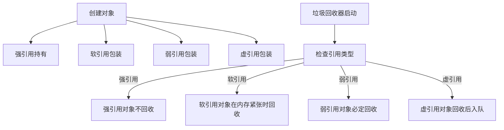

# 5. 各种引用

# Java面试八股之各种引用详解（强引用、软引用、弱引用、虚引用）

***

## 一、概述与定义

在 Java 中，对象的引用决定了垃圾回收器是否能够回收内存。根据引用的不同强度，Java 将引用分为四种主要类型：

1. **强引用（Strong Reference）** &#x20;

   当一个对象具有强引用时，无论内存多么紧张，垃圾回收器都不会回收该对象。常见的如直接使用 `new` 创建对象后赋值给变量。
2. **软引用（Soft Reference）** &#x20;

   软引用允许对象在内存不足时被回收，但在内存充足时不会被回收。通常用于实现内存敏感型缓存，比如图像缓存等。
3. **弱引用（Weak Reference）** &#x20;

   弱引用对对象的引用较弱，在下一次垃圾回收时，无论内存是否充足，这些对象都会被回收。常用于实现映射缓存、ThreadLocal 变量等。
4. **虚引用（Phantom Reference）** &#x20;

   虚引用又称幽灵引用，它不能影响对象的生命周期，主要用于在对象被垃圾回收之前收到一个系统通知，常配合引用队列使用，帮助开发者进行资源清理工作。

这些引用的不同特点为 JVM 内存管理提供了灵活性，允许开发者在不同场景下对对象的生命周期进行精细控制。

***

## 二、主要特点

各种引用各有特点，下面通过表格进行归纳总结：

| 引用类型 | 描述                         | 垃圾回收行为      | 典型应用场景                   |
| ---- | -------------------------- | ----------- | ------------------------ |
| 强引用  | 普通对象引用，程序员最常用              | 不会被 GC 回收   | 一般业务对象                   |
| 软引用  | 内存充足时保持，内存不足时可能被 GC 回收     | GC 内存不足时被回收 | 内存敏感缓存，如图片缓存             |
| 弱引用  | 无论内存充足与否，下一次 GC 都会回收       | 下一次 GC 一定回收 | 临时缓存、映射关系（如 WeakHashMap） |
| 虚引用  | 不能通过 get() 取得对象，必须配合引用队列使用 | 对象回收后才会入队   | 对象回收后资源清理、跟踪对象回收时间       |

**特点说明：**

- **实时性与生存期控制：** 强引用保证对象长期存在，而软引用、弱引用和虚引用分别提供了不同级别的内存敏感性，允许在内存紧张时自动回收对象。
- **缓存应用：** 软引用适合缓存设计，在内存充足时保持缓存，在内存不足时自动释放。弱引用适合对缓存容器进行设计（例如 WeakHashMap），使得对象在不被其它强引用持有时可以被清理。
- **资源清理：** 虚引用提供了一种机制，能够在对象被 GC 前收到通知，常用于对非内存资源（如文件句柄、网络连接等）的清理。

***

## 三、应用目标

掌握各种引用的主要应用目标如下：

1. **精细化内存管理** &#x20;

   通过合理使用软引用和弱引用，可以根据内存使用情况自动调整对象的存活时间，提升系统在不同内存条件下的稳定性。
2. **缓存设计优化** &#x20;

   利用软引用实现缓存设计，在内存充足时保存数据，而在内存紧张时释放无用对象，防止 OOM（内存溢出）。
3. **防止内存泄漏** &#x20;

   弱引用用于构建自动清理的缓存数据结构（如 WeakHashMap），确保不再需要的对象可以及时被垃圾回收器回收，从而防止内存泄漏。
4. **资源回收与后处理** &#x20;

   虚引用配合引用队列可在对象被回收后收到通知，从而进行一些额外的资源回收工作，例如释放本地资源、清理外部缓存等。
5. **系统调优与性能监控** &#x20;

   了解各种引用的工作原理，有助于调优 JVM 参数，在性能调优、内存调优过程中做出合理决策。

***

## 四、主要内容及其组成部分

针对各种引用的知识点，主要内容及组成部分如下：

### 1. 强引用

- **定义与特点** &#x20;

  强引用是程序中最常用的引用形式，通常使用 `new` 创建对象并赋值给变量。只要存在强引用，垃圾回收器绝不会回收该对象。
- **使用示例** &#x20;
  ```java 
  Object obj = new Object();
  ```

  在上述代码中，`obj` 是一个强引用对象，无论内存情况如何，`obj` 始终存在。
- **应用场景** &#x20;

  强引用适用于大部分业务逻辑对象，但在设计缓存系统时不宜使用强引用，因为强引用会阻止对象被回收，可能导致内存溢出。

### 2. 软引用

- **定义与特点** &#x20;

  软引用是一种相对较弱的引用，在内存充足时不会被回收，但在内存不足时可能被回收。通过 `java.lang.ref.SoftReference` 实现。
- **使用示例** &#x20;
  ```java 
  Object strongRef = new Object();
  SoftReference<Object> softRef = new SoftReference<>(strongRef);
  // 当内存不足时，软引用对象可能被 GC 回收
  Object obj = softRef.get();
  ```

  在示例中，`softRef` 包含对 `strongRef` 的软引用，当系统内存紧张时，`obj` 可能返回 null，表示对象已被回收。
- **应用场景** &#x20;

  软引用常用于缓存系统，比如图片缓存、数据缓存等，确保在内存充足时数据存在，而在内存紧张时自动释放，防止内存溢出。

### 3. 弱引用

- **定义与特点** &#x20;

  弱引用更加弱化，对象只持有弱引用时，无论内存是否充足，下一次垃圾回收时都会被回收。通过 `java.lang.ref.WeakReference` 实现。
- **使用示例** &#x20;
  ```java 
  Object obj = new Object();
  WeakReference<Object> weakRef = new WeakReference<>(obj);
  // 当进行一次 GC 后，如果 obj 没有强引用，weakRef.get() 将返回 null
  System.gc();
  Object retrievedObj = weakRef.get();
  ```

  在此例中，调用 `System.gc()` 后，如果没有其它强引用指向 `obj`，则 `retrievedObj` 很可能为 null。
- **应用场景** &#x20;

  弱引用常用于构建自动清理的缓存，比如 `WeakHashMap`，其中键或值使用弱引用，当没有其它强引用时自动从缓存中移除，防止内存泄漏。

### 4. 虚引用（Phantom Reference）

- **定义与特点** &#x20;

  虚引用是最弱的一种引用形式，它并不影响对象的生命周期，调用 `get()` 方法永远返回 null。通过 `java.lang.ref.PhantomReference` 实现，通常配合引用队列使用，用于在对象回收前进行额外操作。
- **使用示例** &#x20;
  ```java 
  Object obj = new Object();
  ReferenceQueue<Object> refQueue = new ReferenceQueue<>();
  PhantomReference<Object> phantomRef = new PhantomReference<>(obj, refQueue);
  // phantomRef.get() 永远返回 null
  Object phantomObj = phantomRef.get(); // 总是 null
  ```

  虚引用主要用于接收垃圾回收通知，通过引用队列判断对象是否被回收，以便进行资源清理等操作。
- **应用场景** &#x20;

  虚引用常用于跟踪对象回收的时间点，配合引用队列可实现更加精细的资源回收策略，如在对象被回收后执行特定的清理操作。

### 5. 数据结构与机制支持

- **引用队列（ReferenceQueue）** &#x20;

  软引用、弱引用和虚引用可以配合 `ReferenceQueue` 使用，当对象被垃圾回收后，系统会将对应的引用放入引用队列中。开发者可以轮询引用队列，从而知道对象是否被回收。
- **卡片标记技术** &#x20;

  虽然主要用于垃圾收集器内部，但在缓存弱引用等场景下，卡片标记技术可辅助分析跨对象引用情况。

下面通过下表对四种引用的组成部分进行总结：

| 引用类型 | 核心类              | get() 返回值 | 是否影响对象回收    | 典型应用场景               |
| ---- | ---------------- | --------- | ----------- | -------------------- |
| 强引用  | 普通对象引用           | 非 null    | 阻止回收        | 一般业务对象               |
| 软引用  | SoftReference    | 可能非 null  | 内存不足时可能回收   | 缓存设计，如图片缓存           |
| 弱引用  | WeakReference    | 可能非 null  | 下一次 GC 一定回收 | 自动清理缓存，如 WeakHashMap |
| 虚引用  | PhantomReference | 总是 null   | 无影响，仅用于通知   | 资源回收后清理、跟踪对象回收时间     |

***

## 五、原理剖析

各种引用机制的底层原理主要依赖于 JVM 内存模型和垃圾回收器的设计。下面对这些原理进行详细解析：

### 1. JVM 内存模型与对象引用

JVM 内存主要由堆、栈、方法区等构成，对象存储在堆中。垃圾回收器根据对象是否被引用决定是否回收内存。强引用会阻止对象被回收，而软、弱、虚引用则允许在不同条件下被回收。这种设计为开发者提供了对内存使用的灵活控制手段。

### 2. 垃圾回收与引用的回收策略

- **强引用回收策略** &#x20;

  只要对象存在强引用，就绝不会被垃圾回收器回收。只有当对象的所有强引用都消失后，对象才会成为垃圾。
- **软引用回收策略** &#x20;

  垃圾回收器在内存不足时会回收那些只有软引用的对象，但在内存充足时，这些对象会继续保留。软引用主要用于实现内存敏感型缓存，既利用内存又防止 OOM。
- **弱引用回收策略** &#x20;

  无论内存是否充足，只要下一次垃圾回收发生，只有弱引用持有的对象都会被回收。这一策略适合用在缓存需要自动清理的场景中。
- **虚引用回收策略** &#x20;

  虚引用本身并不影响对象的回收，它的作用是提供一种机制，在对象被垃圾回收器回收前能够收到通知。开发者通常通过引用队列来获取这些信息，从而执行资源清理等操作。

### 3. 引用队列的工作原理

引用队列（ReferenceQueue）是与软、弱、虚引用配合使用的一个工具。当一个对象被垃圾回收后，垃圾回收器会将相应的引用对象加入到引用队列中。开发者可以定期轮询该队列，从而知道哪些对象已经被回收。例如，在 WeakHashMap 中，当键对应的弱引用被回收后，会自动从映射中删除该键值对。

### 4. 实际案例分析

在一个大型 Web 应用中，为了实现图片缓存，我们通常使用软引用。如果图片对象仅被软引用持有，当系统内存紧张时，垃圾回收器会自动回收这些图片缓存，防止内存溢出。另一方面，在构建对象映射缓存时，我们可能采用弱引用，使得在对象不再被其它部分强引用时能够自动清除缓存数据。通过这种设计，系统能够在保证高性能的同时自动管理内存。

### 5. 性能开销与垃圾回收平衡

各种引用的实现都需要在性能与内存回收之间找到平衡点。强引用简单直接，但在缓存设计中容易导致内存泄漏；软引用与弱引用提供了灵活性，但频繁的垃圾回收会带来一定的性能开销；虚引用虽然不能直接获取对象，但在资源回收后处理外部资源方面有独特优势。理解这些平衡关系，有助于在实际开发中做出合理选择。

下面通过 Mermaid 图展示 JVM 中各种引用的工作流程及其与垃圾回收器的交互：




图中展示了对象创建后，根据引用类型进入不同的处理流程。强引用对象永远不被回收，而软引用对象在内存紧张时被回收，弱引用对象则必定在下一次 GC 时回收，虚引用对象在回收后会被放入引用队列。

***

## 六、应用与拓展

各种引用不仅在理论上具有重要意义，更在实际应用中发挥巨大作用，具体应用与拓展包括：

1. **缓存设计优化** &#x20;

   软引用被广泛用于缓存设计，在内存充足时缓存数据，在内存不足时自动释放缓存，防止 OOM。比如图片、网页数据缓存就是利用软引用实现的。
2. **自动清理映射结构** &#x20;

   弱引用常用于构建自动清理的缓存映射，如 `WeakHashMap`。当键不再被外部引用时，弱引用自动失效，映射关系会被移除，从而有效防止内存泄漏。
3. **资源回收通知** &#x20;

   虚引用与引用队列结合，可用于在对象回收后执行资源清理工作，例如释放本地资源、关闭文件句柄等，实现更加精细的资源管理。
4. **调试与监控工具支持** &#x20;

   现代 JVM 提供了丰富的监控工具，如 JVisualVM、JMC、JFR 等，可以监控各种引用的状态和变化，帮助开发者判断缓存是否工作正常以及是否存在内存泄漏风险。
5. **垃圾回收策略优化** &#x20;

   了解各种引用的回收策略有助于调优垃圾回收器参数。根据应用特点选择合适的引用策略，可以实现更好的内存回收效率，降低 GC 停顿。
6. **学术研究与新技术结合** &#x20;

   随着新一代垃圾回收器（如 ZGC、Shenandoah）的出现，各种引用机制仍然是重要的研究对象。将传统引用技术与现代硬件特性、机器学习算法结合，可能会带来更智能的内存管理机制。

***

## 七、面试问答

以下提供至少五个常见面试问答示例，回答内容以面试者口吻详细阐述各种引用的知识，帮助你在面试中展示专业知识。

### 问题1：请简要介绍 Java 中的四种引用类型及其区别。

【回答】： &#x20;

在 Java 中，对象引用分为四种：强引用、软引用、弱引用和虚引用。强引用是最常见的引用形式，只要对象被强引用持有，就不会被垃圾回收。软引用则允许在内存不足时回收，用于实现内存敏感型缓存；弱引用无论内存是否充足，下一次垃圾回收时都会被清除，适用于自动清理缓存；虚引用主要用于在对象被回收后收到通知，不能通过 get() 方法获取对象实例。这四种引用在内存管理和缓存设计中各有应用场景。

### 问题2：软引用的应用场景是什么？请详细说明其工作原理。

【回答】： &#x20;

软引用主要用于实现缓存机制。在内存充足时，软引用保持对对象的引用，使数据可快速获取；而在内存不足时，垃圾回收器会回收这些软引用对象，以防止内存溢出。工作原理上，通过 `SoftReference` 类包装对象，在调用 `get()` 方法时返回对象实例，如果系统内存紧张，则可能返回 null。这样可以在不影响应用运行的前提下自动释放内存。比如图片缓存就是典型应用场景。

### 问题3：弱引用通常用于哪些场景？它如何防止内存泄漏？

【回答】： &#x20;

弱引用常用于缓存容器（如 WeakHashMap），当键或值仅由弱引用持有时，如果没有其它强引用指向该对象，下一次垃圾回收时就会被清除。这样能防止缓存中长期保存无用数据，从而避免内存泄漏。例如，在设计某些数据映射时，使用弱引用可以确保当数据不再需要时自动清理缓存，保持内存健康。

### 问题4：虚引用的作用是什么？请解释为什么 get() 方法总是返回 null。

【回答】： &#x20;

虚引用也称幽灵引用，其主要作用是提供一种机制，在对象被垃圾回收之前收到系统通知，以便进行后续资源清理。虚引用对象通过 `PhantomReference` 实现，调用 `get()` 方法总是返回 null，因为虚引用本身并不保留对象的实际引用，它仅在对象回收后放入引用队列中供清理操作使用。这样可以让开发者在对象真正被回收后执行一些必要的清理工作。

### 问题5：请举例说明如何使用引用队列配合软、弱或虚引用实现自动清理机制。

【回答】： &#x20;

引用队列可以配合软、弱、虚引用使用，来在对象被回收后收到通知。例如，在使用 `WeakHashMap` 时，键采用弱引用；当键对象被垃圾回收后，对应的映射会自动从 WeakHashMap 中移除。另外，使用虚引用时，我们可以创建一个引用队列，然后在对象包装为 `PhantomReference` 时传入引用队列，当对象被回收后，虚引用会入队，我们便可以从队列中获取该引用，从而执行资源清理操作。示例代码如下：

```java 
ReferenceQueue<Object> refQueue = new ReferenceQueue<>();
PhantomReference<Object> phantomRef = new PhantomReference<>(new Object(), refQueue);
// 当对象被 GC 后，phantomRef 将入队，我们可以在另一个线程中轮询队列进行清理工作
```


这种机制能确保在对象被真正回收后进行必要的后处理工作，避免资源泄漏。

***

## 总结

本文从概述与定义、主要特点、应用目标、主要内容及其组成部分、原理剖析、应用与拓展以及面试问答七个方面，系统、详细地介绍了 Java 中的各种引用（强、软、弱、虚引用）。我们分析了每种引用的定义、工作机制、使用场景及优缺点，并结合代码示例、详细表格和 Mermaid 图表，展示了它们在内存管理、垃圾回收和缓存设计中的实际应用。掌握这些内容不仅能帮助你在面试中从容回答相关问题，还能在实际项目中优化内存管理策略，提高系统性能和稳定性。🚀

希望这篇文章能成为你面试准备和日常开发调优的重要参考资料，助你在 Java 开发与系统优化中不断突破，迎接更高挑战！加油！
