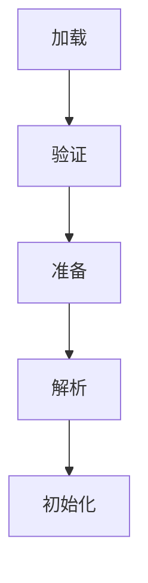

# 一. 自动内存管理

## Java面试八股文：JVM组成详解

***

## 1. 概述与定义

**Java虚拟机（JVM）** 是Java程序运行的环境，它负责将编译后的Java字节码（`.class`文件）转换为特定平台的机器码并执行。JVM是Java平台无关性的基石，使得Java程序无需针对不同硬件或操作系统重新编译即可运行。简单来说，JVM是一个虚拟的计算机，模拟了物理计算机的多种功能，包括内存管理、指令执行和安全控制。

JVM的主要任务包括：

- **加载类文件**：读取并解析`.class`文件，将其加载到内存中。
- **内存管理**：为对象分配内存并通过垃圾回收机制回收无用内存。
- **执行字节码**：将字节码翻译为机器码并执行。
- **提供安全性**：通过类验证和沙箱机制防止恶意代码运行。

在面试中，考官可能会问：“JVM是什么？它有什么作用？”你可以这样回答：“JVM是Java虚拟机，是Java程序的运行环境，负责加载字节码、管理内存、执行指令并确保安全。它通过字节码和虚拟机的设计实现了Java的平台无关性。”

JVM并非单一的实体，而是由多个组件协同工作形成的一个系统，接下来我们将逐一剖析其组成和原理。

***

## 2. 主要特点

JVM的设计赋予了Java语言强大的特性，以下是JVM的五大主要特点：

- **平台无关性**：JVM屏蔽了底层操作系统和硬件的差异，Java程序只需编译为字节码，即可在任何支持JVM的平台运行。
- **自动内存管理**：JVM通过垃圾回收（GC）机制自动管理内存，开发者无需手动释放内存，减少了内存泄漏的风险。
- **类加载机制**：JVM采用动态类加载，按需加载类文件，支持热部署和模块化开发。
- **即时编译（JIT）**：JVM通过即时编译器将频繁执行的字节码编译为本地机器码，提升运行效率。
- **安全性**：JVM内置沙箱机制和字节码验证，限制程序权限，防止非法操作。

这些特点使得Java成为一种高效、安全且跨平台的编程语言。例如，平台无关性让开发者无需担心Windows和Linux的差异，而JIT编译则显著提升了程序性能。

在面试中，考官可能会问：“JVM有哪些主要特点？”你可以简洁回答：“JVM的特点包括平台无关性、自动内存管理、类加载机制、即时编译和安全性。”

***

## 3. 应用目标

JVM的设计目标是为Java程序提供一个统一的、可靠的运行环境，具体包括以下几个方面：

- **实现平台无关性**：通过字节码和JVM，Java程序无需为不同平台编写特定代码。
- **提供高效内存管理**：自动分配和回收内存，减少开发者的负担。
- **支持动态扩展**：通过类加载器动态加载类文件，实现程序的灵活扩展。
- **确保安全性**：通过类验证和权限控制，防止恶意代码破坏系统。
- **优化执行性能**：借助JIT编译和自适应优化，提升程序运行速度。

这些目标直接影响Java程序的开发效率和运行稳定性。例如，自动内存管理让开发者专注于业务逻辑，而安全性则保障了Java在服务器端的广泛应用。

在面试中，考官可能会问：“JVM的设计目标是什么？”你可以回答：“JVM的目标是实现平台无关性、提供高效内存管理、支持动态扩展、确保安全性和优化性能。”

***

## 4. 主要内容及其组成部分

JVM的组成是面试中的核心考点，主要包括三大模块：**类加载子系统**、**运行时数据区**和**执行引擎**。每个模块都由多个子部分构成，下面逐一详细解释。

### 4.1 类加载子系统

类加载子系统负责将编译后的`.class`文件加载到JVM内存中，并完成类的链接和初始化。其工作分为五个阶段：

1. **加载（Loading）**：通过类加载器（如Bootstrap、Extension、Application ClassLoader）读取`.class`文件，生成`Class`对象。
2. **验证（Verification）**：检查字节码的合法性和安全性，例如文件格式、元数据和指令序列。
3. **准备（Preparation）**：为类的静态变量分配内存并赋予默认值（如`int`为0，`Object`为`null`）。
4. **解析（Resolution）**：将常量池中的符号引用（如`java/lang/String`）解析为直接引用（如内存地址）。
5. **初始化（Initialization）**：执行类的`<clinit>`方法，初始化静态变量并运行静态代码块。

**示例代码**：

```java 
public class MyClass {
    static int num = 10;
    static {
        System.out.println("MyClass initialized");
    }
}
```


当JVM首次使用`MyClass`时，类加载子系统会加载其字节码，验证安全性，为`num`分配内存并设为0，解析引用，最后执行静态块并将`num`赋值为10。

### 4.2 运行时数据区

运行时数据区是JVM执行程序时使用的内存空间，分为线程共享和线程私有两类。

#### 4.2.1 线程共享区域

- **方法区（Method Area）**：存储类的元数据（如类名、方法表）、静态变量和运行时常量池。JDK 8后，方法区由元空间（Metaspace）实现，使用本地内存。
- **堆（Heap）**：存储所有对象实例和数组，是垃圾回收的主要区域。堆通常分为新生代（Young Generation）和老年代（Old Generation）。

#### 4.2.2 线程私有区域

- **Java栈（Java Stack）**：每个线程拥有独立的栈，存储方法调用的栈帧。栈帧包含局部变量表、操作数栈和动态链接等。
- **本地方法栈（Native Method Stack）**：支持本地方法（用C/C++编写）的执行，结构与Java栈类似。
- **程序计数器（PC Register）**：记录当前线程执行的字节码指令地址，多线程时用于切换恢复。

**表格：JVM运行时数据区及其作用**

| 区域    | 共享性 | 作用              | 示例数据                 |
| ----- | --- | --------------- | -------------------- |
| 方法区   | 共享  | 存储类元数据、静态变量、常量池 | 类结构、\`static int x\` |
| 堆     | 共享  | 存储对象实例和数组       | \`new Object()\`     |
| Java栈 | 私有  | 存储方法调用的栈帧       | 局部变量、方法参数            |
| 本地方法栈 | 私有  | 支持本地方法执行        | JNI调用栈               |
| 程序计数器 | 私有  | 记录当前指令地址        | 字节码偏移量               |

**说明**：线程共享区域（如堆）可能引发并发问题，需通过锁机制控制访问；线程私有区域（如Java栈）则无需同步。

### 4.3 执行引擎

执行引擎是JVM的核心，负责执行字节码指令，包括以下组件：

- **解释器（Interpreter）**：逐条解释执行字节码，启动快但效率较低。
- **即时编译器（JIT Compiler）**：将热点代码编译为本地机器码，存入代码缓存（Code Cache），提升性能。
- **垃圾回收器（GC）**：回收堆中不再使用的对象，释放内存。

**示例**：假设一个方法如下：

```java 
public int add(int a, int b) {
    return a + b;
}
```


初次调用时，解释器逐条执行字节码；若频繁调用，JIT编译器会将其编译为机器码，直接运行。

***

## 5. 原理剖析

JVM的运行原理涉及类加载、内存管理和执行机制，下面深入解析每个部分。

### 5.1 类加载过程

类加载的完整流程可以用Mermaid图表表示：




- **加载**：通过类加载器（如双亲委派模型）读取`.class`文件，生成`Class`对象。
- **验证**：检查字节码的合法性，包括文件格式、元数据验证、字节码验证和符号引用验证。
- **准备**：为静态变量分配内存并设默认值，如`static int x`设为0。
- **解析**：将符号引用（如类名、方法名）转换为直接引用（如内存地址）。
- **初始化**：执行`<clinit>`方法，运行静态代码块和初始化静态变量。

**注意**：类加载遵循懒加载原则，仅在首次使用（如`new`或调用静态方法）时触发。

### 5.2 内存管理

JVM的内存管理主要围绕堆展开，包括对象创建、内存分配和垃圾回收。

#### 5.2.1 对象创建

- **步骤**：检查类是否加载 -> 分配内存 -> 初始化对象。
- **内存分配算法**：
  - **指针碰撞**：假设内存连续，移动指针分配空间。
  - **空闲列表**：内存不连续时，维护空闲列表分配空间。

#### 5.2.2 垃圾回收

- **可达性分析**：从GC Roots（如栈帧中的局部变量、方法区中的静态变量）开始，标记可达对象。
- **垃圾回收算法**：
  - **标记-清除（Mark-Sweep）**：标记存活对象，清除未标记对象，缺点是产生内存碎片。
  - **复制（Copying）**：将存活对象复制到另一块内存，清空原区域，适合新生代。
  - **标记-整理（Mark-Compact）**：标记存活对象，整理内存消除碎片，适合老年代。

**示例**：新生代使用复制算法，将存活对象从Eden区移到Survivor区，效率高但需额外空间。

### 5.3 执行引擎工作原理

执行引擎通过解释器和JIT编译器协作运行：

- **解释器**：逐条翻译字节码，适合启动阶段。
- **JIT编译器**：监控执行频率，编译热点代码为机器码，存入代码缓存。
- **分层编译**：JDK 7引入分层编译，结合解释器和不同级别编译器（如C1、C2）优化性能。

**示例**：一个循环10000次的代码，初次由解释器执行，后被JIT编译为机器码，速度提升数倍。

***

## 6. 应用与拓展

JVM在实际开发中的应用场景丰富，以下是几个典型案例：

- **性能调优**：调整`-Xms`（初始堆大小）、`-Xmx`（最大堆大小）等参数优化内存。
- **内存分析**：使用VisualVM、JProfiler监控堆使用，定位内存泄漏。
- **类加载优化**：解决类冲突问题，如多个类加载器加载相同类。
- **垃圾回收优化**：选择CMS、G1等GC算法，减少Full GC停顿。

**拓展**：JVM不断演进，如JDK 8引入元空间替换永久代，JDK 11推出ZGC实现低延迟GC。未来，JVM将更注重云原生和性能优化。

***

## 7. 面试问答

以下是JVM组成的常见面试问题及详细回答，模拟面试场景。

### 7.1 问题：JVM由哪些部分组成？

**回答**： &#x20;

“JVM主要由三部分组成：类加载子系统、运行时数据区和执行引擎。类加载子系统负责加载、验证、准备、解析和初始化类文件；运行时数据区包括方法区、堆、Java栈、本地方法栈和程序计数器，分别存储类信息、对象实例和线程数据；执行引擎包括解释器、JIT编译器和垃圾回收器，负责执行字节码和内存管理。”

### 7.2 问题：JVM的内存区域有哪些？各有什么作用？

**回答**： &#x20;

“JVM的内存区域分为线程共享和私有两类。线程共享的有方法区和堆：方法区存类的元数据、静态变量和常量池，堆存对象实例和数组，是GC的主要区域。线程私有的有Java栈、本地方法栈和程序计数器：Java栈存方法调用的栈帧，本地方法栈支持本地方法，程序计数器记录当前指令地址。每块区域各司其职，协同支持程序运行。”

### 7.3 问题：类加载的过程是什么？

**回答**： &#x20;

“类加载过程有五个阶段：加载、验证、准备、解析和初始化。加载是通过类加载器读取`.class`文件生成`Class`对象；验证是检查字节码的正确性和安全性；准备是为静态变量分配内存并设默认值；解析是将符号引用转为直接引用；初始化是执行静态代码块和初始化静态变量。这个过程是懒加载的，只有首次使用类时触发。”

### 7.4 问题：JVM如何管理内存？

**回答**： &#x20;

“JVM通过堆管理内存，主要包括对象创建和垃圾回收。对象创建时，先检查类是否加载，然后在堆中分配内存，使用指针碰撞或空闲列表算法。垃圾回收通过可达性分析标记存活对象，再用标记-清除、复制或标记-整理算法回收不可达对象。新生代常用复制算法，老年代用标记-整理，GC确保内存高效利用。”

### 7.5 问题：JIT编译器是什么？有什么作用？

**回答**： &#x20;

“JIT编译器是即时编译器，它监控字节码执行频率，将热点代码编译为本地机器码，存入代码缓存。它的作用是提升执行效率，比如一个循环频繁执行时，解释器速度慢，JIT编译后直接运行机器码，性能大幅提高。JDK 7还引入分层编译，结合不同级别编译器进一步优化。”

***

[A. 内存区域](<A. 内存区域/A. 内存区域.md> "A. 内存区域")

[B. 垃圾收集与内存分配](<B. 垃圾收集与内存分配/B. 垃圾收集与内存分配.md> "B. 垃圾收集与内存分配")
