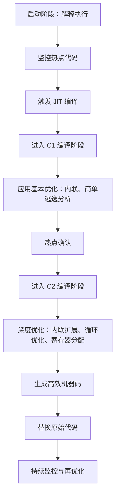

# A. 后端编译与优化

# Java面试八股之后端编译与优化详解

***

## 一、概述与定义

后端编译与优化主要指的是 JVM 中 JIT（Just-In-Time）编译器在后台将 Java 字节码转换为本地机器码时所采取的一系列优化技术和策略。JIT 编译器不仅负责将热点代码编译为高效的本地代码，还在编译过程中应用多种优化手段，如方法内联、逃逸分析、循环优化、寄存器分配以及分支预测等，以提升代码执行效率。该技术实现了“运行时优化”，即在程序运行过程中根据实际执行情况动态优化代码，从而使得 Java 应用既能保持跨平台性，又能在长时间运行时获得接近手写汇编的性能。

后端编译与优化是 JVM 调优的重要组成部分，其核心思想在于通过对热点代码的编译优化，提高系统整体吞吐量，同时降低延迟。对于面向后端服务、分布式系统以及高并发场景下的 Java 应用来说，掌握后端编译与优化的相关知识具有非常重要的意义。

***

## 二、主要特点

后端编译与优化具有如下主要特点：

1. **动态编译与优化** &#x20;

   后端编译技术采用动态编译（JIT）机制，对运行中的热点代码进行编译优化。JIT 编译器根据代码执行频率、分支情况以及内存分配等信息，实时决定是否对代码进行编译以及应用哪些优化策略。这种动态性使得 JVM 能够根据运行时实际情况不断调整优化方案，达到最佳性能效果。🔥
2. **多层次编译策略** &#x20;

   为了平衡启动时间与长时间运行性能，现代 JVM 通常采用多层次编译策略（Tiered Compilation），即初始阶段先使用解释执行或简单编译，待热点代码确定后再采用高级优化（如 C2 编译器）对代码进行深度优化。
3. **广泛的优化技术** &#x20;

   后端编译涉及的优化技术十分丰富，包括但不限于： &#x20;
   - **内联优化**：将被频繁调用的方法直接嵌入调用处，减少方法调用开销。 &#x20;
   - **逃逸分析**：确定对象是否在方法内部使用，从而决定是否进行栈上分配或标量替换。 &#x20;
   - **循环优化**：通过循环展开、循环不变代码外提等手段优化循环执行效率。 &#x20;
   - **寄存器分配**：合理分配 CPU 寄存器资源，减少内存访问。 &#x20;
   - **分支预测优化**：优化条件判断和分支跳转，提升 CPU 分支预测准确率。 &#x20;
     这些优化技术相互配合，使得 JIT 编译器能够在编译阶段为热点代码生成高效的机器码。
4. **实时性与自适应性** &#x20;

   JIT 编译器在程序运行时不断监控代码执行情况，并对热点代码进行动态优化。优化方案具有实时性与自适应性，能够根据不同场景灵活调整优化策略，从而在保持启动速度的同时获得长期高性能表现。⏱️

下面给出一张表格，对后端编译与优化的关键技术进行直观说明：

| 优化技术   | 主要内容                      | 优点               | 应用场景             |
| ------ | ------------------------- | ---------------- | ---------------- |
| 内联优化   | 将方法调用直接内联到调用处，减少函数调用开销    | 提高执行速度，降低调用延迟    | 高频调用的小方法         |
| 逃逸分析   | 分析对象作用域，判断是否可以进行栈上分配或标量替换 | 降低垃圾回收压力，减少堆内存分配 | 对象创建频繁，生命周期短的场景  |
| 循环优化   | 展开循环、提取不变代码等，减少循环内计算      | 提高循环体执行效率        | 大量循环计算密集型任务      |
| 寄存器分配  | 合理分配 CPU 寄存器，减少内存读写操作     | 提高指令执行效率         | 性能要求较高的计算密集型任务   |
| 分支预测优化 | 改进条件判断逻辑，减少分支错误预测带来的性能损失  | 降低分支跳转开销         | 分支逻辑复杂、条件判断频繁的场景 |

***

## 三、应用目标

后端编译与优化在 Java 应用中的目标主要体现在以下几个方面：

1. **提升程序运行效率** &#x20;

   通过对热点代码进行深度优化，使得关键路径的执行速度显著提高，从而提升整体系统的吞吐量和响应速度。对后端服务器、分布式系统和高并发场景尤为重要。
2. **降低内存占用与垃圾回收压力** &#x20;

   利用逃逸分析等技术，将部分对象分配到栈上或进行标量替换，从而减少堆内存分配，降低垃圾回收的频率，提升内存使用效率。
3. **实现高性能动态调整** &#x20;

   通过实时监控代码执行情况，并对热点代码动态优化，实现自适应调优。这种实时调整机制可以根据不同运行环境与负载情况灵活应对，确保系统始终处于最佳性能状态。
4. **缩短响应延迟** &#x20;

   在后端应用中，快速响应是衡量系统性能的重要指标。通过内联优化和分支预测优化等技术，可以有效降低方法调用和条件判断的延迟，缩短系统响应时间。⏳
5. **兼顾启动速度与长期性能** &#x20;

   采用多层次编译策略，在保证程序启动速度的同时，通过对热点代码进行深度优化，达到长期高性能运行的目标。这种平衡对实际项目部署和持续稳定运行至关重要。

***

## 四、主要内容及其组成部分

后端编译与优化这一知识点涵盖了多个方面，下面对各个组成部分进行详细解释：

### 1. JIT 编译器的编译策略

JIT 编译器是后端编译与优化的核心组件，其主要任务是将热点代码从字节码转换为高效的本地机器码。当前主流的 JVM 通常采用分层编译策略，如 Tiered Compilation，主要包含以下几个阶段：

- **解释执行阶段** &#x20;

  程序启动时，JVM 先采用解释执行模式，快速进入运行状态，并对代码执行情况进行采样和监控。
- **C1 编译器（客户端编译器）** &#x20;

  对初步判定为热点的代码，C1 编译器进行快速编译，并应用基本优化。该阶段侧重于编译速度，保证系统响应速度。
- **C2 编译器（服务器编译器）** &#x20;

  对持续热点且性能要求高的代码，C2 编译器采用更深层次的优化技术，如内联扩展、逃逸分析、循环优化等，从而生成高效的机器码。C2 编译器的优化过程更为复杂，编译时间也较长，但能显著提高运行性能。

这种分层编译策略既能保证程序启动时的快速响应，又能在运行过程中不断优化关键代码段，达到性能和效率的最佳平衡。

### 2. 内联优化（Method Inlining）

内联优化是将被频繁调用的方法直接嵌入调用者代码中，避免函数调用开销的一种优化技术。其主要原理是将目标方法的代码直接复制到调用位置，从而消除调用栈开销，同时为后续更多优化（如常量传播、死代码消除等）创造条件。

**示例代码**（展示内联优化前后的效果）：

```java 
// 内联优化前
public int add(int a, int b) {
    return a + b;
}

public int computeSum(int[] arr) {
    int sum = 0;
    for (int num : arr) {
        sum += add(num, 10);
    }
    return sum;
}
```


在 JIT 编译优化后，编译器可能将 `add` 方法直接内联到 `computeSum` 方法中，等效于：

```java 
public int computeSum(int[] arr) {
    int sum = 0;
    for (int num : arr) {
        sum += num + 10; // 内联了 add 方法的代码
    }
    return sum;
}
```


内联优化有效减少了方法调用带来的额外开销，对小而频繁调用的方法尤其有效。😊

### 3. 逃逸分析（Escape Analysis）

逃逸分析是一种静态分析技术，用于判断对象的作用域是否超出其创建方法或线程的范围。如果对象不“逃逸”出局部范围，编译器就可以将其分配在栈上，甚至进行标量替换，从而避免堆内存分配与垃圾回收带来的性能消耗。

**应用场景**： &#x20;

- 对于仅在方法内部使用且不会被外部引用的对象，逃逸分析可以将其优化为局部变量，提升内存分配效率。 &#x20;
- 在高频对象创建的场景下，利用逃逸分析可以大幅降低垃圾回收的压力。

### 4. 循环优化（Loop Optimization）

循环优化针对循环体内部频繁执行的代码，通过多种手段提高其执行效率。常见的循环优化技术包括：

- **循环展开（Loop Unrolling）**：减少循环次数，将循环体复制多份，从而减少循环判断与跳转带来的开销。 &#x20;
- **循环不变代码外提（Loop Invariant Code Motion）**：将循环中不变的表达式提前到循环外计算，只计算一次。 &#x20;
- **循环融合与分裂**：通过合并或拆分多个循环，优化缓存利用率和数据局部性。

这些优化技术在后端编译时往往联合应用，以最大限度提升循环执行性能。

### 5. 寄存器分配与指令调度

寄存器分配是编译器优化过程中一项关键技术，其目标是将变量分配到 CPU 寄存器中，减少内存读写操作。指令调度则是重新排列生成的机器指令顺序，以充分利用 CPU 的流水线和并行执行能力。两者共同作用下，可以大幅提升机器码的执行效率。

### 6. 分支预测与短路优化

分支预测优化旨在减少因条件判断带来的性能损失。现代 CPU 具有先进的分支预测机制，但如果代码中存在复杂或不规律的条件判断，则可能导致预测失败，增加跳转延迟。通过改写条件判断逻辑、使用短路求值和消除不必要的分支，可以提高分支预测的准确性，进而降低分支跳转的开销。

### 7. 其他优化技术

除了上述主要优化策略外，后端编译过程中还涉及诸如内存屏障、指令并行、延迟加载等其他优化技术，这些技术在保证线程安全、数据一致性的同时，也能进一步提升执行效率。每一项优化都有其适用场景，编译器会根据代码特性自动选择合适的优化组合。

下面是一张概览各优化技术组成部分的表格：

| 组成部分      | 主要内容与作用                  | 典型应用场景           |
| --------- | ------------------------ | ---------------- |
| JIT 编译策略  | 解释执行 → C1 快速编译 → C2 深度优化 | 应用启动、热点代码优化      |
| 内联优化      | 将小方法代码内联，减少调用开销          | 高频调用、短小方法        |
| 逃逸分析      | 判断对象是否逃逸，优化内存分配          | 局部对象优化、减少 GC 负担  |
| 循环优化      | 循环展开、不变代码外提等             | 数值计算、数组处理密集型任务   |
| 寄存器分配与调度  | 合理分配寄存器、重排指令，充分利用 CPU 并行 | 性能要求高的计算密集型任务    |
| 分支预测与短路优化 | 改写条件逻辑，降低分支跳转开销          | 分支判断频繁、条件逻辑复杂的代码 |

### 8. 后端编译优化流程图

为了帮助直观理解后端编译与优化的整体流程，下面给出一张基于 Mermaid 语法的流程图：




图中展示了从程序启动、监控热点代码，到逐步进入 JIT 编译不同阶段并应用多种优化技术，最终生成高效机器码的整个过程，帮助大家直观理解后端编译与优化的工作原理。😊

***

## 五、原理剖析

后端编译与优化的核心在于 JIT 编译器如何根据代码执行情况，动态生成并优化机器码。下面对其关键原理进行深入剖析：

### 1. 分层编译策略

现代 JVM 通常采用分层编译（Tiered Compilation）策略，即先使用解释执行或简单的 C1 编译器快速启动程序，再对热点代码进行更深层次的 C2 编译优化。 &#x20;

- **解释执行**：在程序启动初期，解释器迅速执行字节码，同时收集代码执行统计信息。 &#x20;
- **C1 编译器**：针对初步判定为热点的代码进行快速编译，应用基础优化，使得系统尽快进入高效执行状态。 &#x20;
- **C2 编译器**：对经过多次调用确认的热点代码，采用更高成本但效果更好的优化技术，生成高度优化的机器码。 &#x20;

这种分层策略既保证了程序的快速启动，也使得长期运行的关键路径能获得极致性能。

### 2. 内联优化的实现原理

内联优化在编译过程中通过以下步骤实现： &#x20;

- 编译器分析方法调用频率和方法体大小。 &#x20;
- 对于满足条件的方法，将其字节码直接嵌入到调用者代码中。 &#x20;
- 重写调用链，进一步进行常量传播与死代码消除，达到性能提升效果。 &#x20;

这种技术减少了函数调用的开销，尤其对短小且高频调用的方法非常有效。

### 3. 逃逸分析及其优化

逃逸分析通过静态分析方法，判断对象的生命周期是否仅限于局部作用域。如果对象不被外部引用，则可进行以下优化： &#x20;

- **栈上分配**：将对象分配在栈上而非堆上，减少 GC 压力。 &#x20;
- **标量替换**：将对象拆分成各个基本数据类型，在寄存器或栈上直接操作，消除对象创建的开销。 &#x20;

这一过程涉及复杂的数据流分析和指针别名分析，是后端优化中提升内存管理效率的重要手段。

### 4. 循环优化技术的原理

循环优化主要包括： &#x20;

- **循环展开**：通过复制循环体多次，减少每次循环的跳转和条件判断。 &#x20;
- **不变代码外提**：检测循环内部不随迭代变化的表达式，将其计算移至循环外。 &#x20;

这些技术依赖于编译器对循环体的静态分析，并结合数据依赖性判断，确保优化后的代码与原代码语义一致。

### 5. 寄存器分配与指令调度原理

在生成目标机器码时，编译器需要将虚拟寄存器映射到物理寄存器上，并重排指令以充分利用流水线和并行执行能力。 &#x20;

- **寄存器分配**：通过图着色算法等手段，将高频变量分配到物理寄存器中，降低内存访问延迟。 &#x20;
- **指令调度**：对指令顺序进行重新排序，避免数据相关冲突，提高 CPU 执行效率。

### 6. 分支预测优化机制

编译器通过改写条件判断逻辑、调整代码布局等方式，尽量匹配 CPU 的分支预测算法，降低跳转错误带来的性能损失。这通常涉及对条件分支的概率分析和统计信息采集，确保优化后分支预测准确性更高。

***

## 六、应用与拓展

后端编译与优化不仅在理论上具有重要意义，在实际开发中也有广泛的应用。以下是一些具体应用场景及扩展方向：

1. **高性能后端服务** &#x20;

   在微服务、分布式系统和大数据处理等领域，后端编译优化技术能显著降低响应时间和系统延迟。通过调优 JIT 参数（如 -XX:CompileThreshold、-XX:+TieredCompilation 等），开发者可以根据实际业务需求实现最佳性能。
2. **大规模并发应用** &#x20;

   对于高并发场景，利用逃逸分析和内联优化技术，可以减少对象创建和方法调用的开销，降低 GC 压力，保证系统稳定高效运行。
3. **移动与嵌入式设备** &#x20;

   在资源受限的环境下，JIT 编译器的分层编译与自适应优化策略能够在保证启动速度的同时提升运行效率，满足对低延迟和低功耗的要求。
4. **混合执行模式探索** &#x20;

   随着硬件性能不断提升，未来可能会出现更多结合硬件加速与并行编译的后端优化方案。通过与硬件特性结合，实现更高层次的指令级并行与低功耗优化，为移动互联网、物联网等领域提供技术支持。🔧
5. **动态调优与监控** &#x20;

   利用 JVM 提供的监控与诊断工具（如 JVisualVM、JMC 等），可以实时监控 JIT 编译器的行为，动态调整编译与优化策略。这不仅有助于解决性能瓶颈，也为后续系统升级提供理论依据和数据支持。

***

## 七、面试问答

以下是常见的面试问答示例，回答内容采用面试者的口吻，旨在帮助你全面展示对后端编译与优化的理解：

### 问题1：请解释后端编译与优化的核心目的是什么？

【回答】： &#x20;

后端编译与优化的核心目的在于将 Java 字节码动态转换为高效的本地机器码，从而显著提高程序的执行效率。通过采用多层次编译策略、内联优化、逃逸分析、循环优化等技术，JIT 编译器能够针对热点代码生成经过深度优化的代码，既保证程序启动时的快速响应，又在长期运行中降低延迟、减少内存占用，从而满足高并发和高性能系统的要求。

### 问题2：如何理解 JVM 中的 Tiered Compilation 策略？它对后端优化有何作用？

【回答】： &#x20;

Tiered Compilation 策略是现代 JVM 为平衡启动速度和长期运行性能而采用的一种分层编译策略。初期，JVM 采用解释执行或简单的 C1 编译器快速编译代码，在运行过程中监控热点代码；当某段代码执行次数达到一定阈值后，会交由性能更强的 C2 编译器进行深度优化，如内联扩展和循环优化。这样一来，不仅保证了程序启动时的迅速响应，同时在长期高并发场景下实现了极高的执行效率。

### 问题3：什么是内联优化？请举例说明它在提升 Java 应用性能中的作用。

【回答】： &#x20;

内联优化是将被频繁调用的小方法直接嵌入调用者代码中，以避免方法调用时的堆栈开销。举例来说，如果一个方法被大量调用，编译器可以将该方法的代码复制到调用处，从而消除方法调用的额外开销，同时也为后续的常量传播和死代码消除创造了条件。这样不仅能降低延迟，还能使编译器更容易对代码进行整体优化，从而提升整体性能。

### 问题4：请详细说明逃逸分析在后端编译优化中的作用，以及编译器如何判断一个对象是否“逃逸”。

【回答】： &#x20;

逃逸分析是一种静态分析技术，用于判断对象的引用是否超出其创建的局部作用域。如果对象没有“逃逸”，编译器可以将其分配到栈上，甚至进行标量替换，从而减少堆内存分配和垃圾回收负担。判断对象是否逃逸通常依赖于数据流分析和方法调用分析，分析对象在整个程序中的生命周期和作用范围。通过这种优化，可以显著提高内存分配效率，对于高频对象创建场景尤其有效。

### 问题5：如何理解循环优化在后端编译中的应用？请举例说明循环展开或不变代码外提的原理及效果。

【回答】： &#x20;

循环优化主要针对在循环体中重复执行的代码，通过技术手段减少每次迭代的冗余计算。例如，循环展开技术会将循环体复制多次，减少每次循环判断的次数；而循环不变代码外提则是将在循环中不发生变化的计算移至循环外，只计算一次。假设有如下循环：

```java 
for (int i = 0; i < n; i++) {
    result += i * constant; // constant 在循环中不变
}
```


编译器会将 `i * constant` 中 constant 部分提前计算，从而减少循环内的重复计算，提升整体性能。通过这些优化，CPU 的流水线和缓存利用率都能得到改善，最终实现更高效的循环执行。

***

# Java中的AOT编译

从Java 9开始，Oracle引入了实验性的AOT编译功能，通过`jaotc`工具实现（基于Graal编译器）。它允许开发者将Java类文件或模块编译为本地共享库（例如`.so`文件或`.dll`文件），这些库可以在运行时由JVM加载。

#### 工作原理

1. **编译阶段**：使用`jaotc`工具将Java字节码编译为本地机器码。
   - 示例命令：`jaotc --output mylib.so MyClass.class`
2. **运行时**：JVM通过`-XX:AOTLibrary`选项加载预编译的本地代码。
   - 示例：`java -XX:+UseAOT -XX:AOTLibrary=./mylib.so MyClass`

#### 优点

- **启动时间快**：因为不需要在运行时进行JIT编译，程序可以更快地启动。
- **内存效率**：减少了JIT编译器运行时的内存占用。
- **适用于特定场景**：特别适合短生命周期应用（如命令行工具）或资源受限环境（如嵌入式系统）。

#### 局限性

- **动态性受限**：AOT编译生成的代码无法像JIT那样根据运行时数据进行优化，可能导致某些情况下性能不如JIT。
- **兼容性问题**：并非所有Java代码都能完美支持AOT编译，尤其是依赖反射或动态类加载的代码。
- **实验性**：在JDK中，AOT仍被标记为实验性功能，且后续版本（如JDK 17）中支持度有限，很多开发者转向其他解决方案。

### 与GraalVM的关系

GraalVM是一个更成熟的AOT编译解决方案，它提供了`native-image`工具，可以将Java应用直接编译为独立的可执行文件（Native Image）。相比JDK的`jaotc`，GraalVM的AOT更强大，支持更多优化，且在云原生和微服务场景中非常流行。

#### 示例（GraalVM Native Image）

```bash 
native-image -jar myapp.jar -o myapp
```


运行后，生成的可执行文件`myapp`无需JVM即可运行。

### 总结

Java的AOT编译是一个有趣的方向，旨在解决启动时间和资源占用问题。不过，目前它的应用场景相对有限，GraalVM的Native Image在实际生产中更受欢迎。如果你有具体的应用场景或问题（比如想优化某个Java程序），可以告诉我，我再帮你深入分析！
