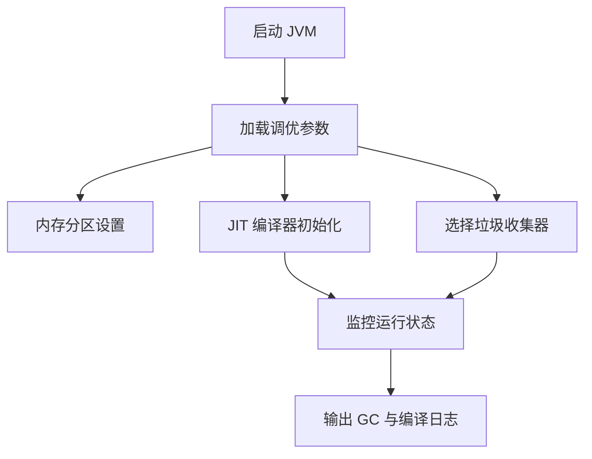

# 1. 调优参数

# Java面试八股之调优参数详解

***

## 一、概述与定义

调优参数是 JVM 在启动时可以通过命令行指定的配置项，这些参数直接影响到 JVM 的内存分配策略、垃圾收集器的选择与行为、JIT 编译器的工作模式以及其他运行时调优策略。简单来说，调优参数就是帮助开发者在不同硬件环境和业务场景下，动态调整 JVM 行为，以达到最佳性能状态的工具。

调优参数可以分为几大类：

- 内存管理相关参数（如堆内存初始值和最大值设置）
- 垃圾收集器相关参数（如 GC 算法选择、 GC 日志、暂停时间控制等）
- JIT 编译器调优参数（如编译阈值、代码缓存大小、分层编译模式等）
- 其他辅助参数（如线程栈大小、系统属性配置等）

这些参数的配置对系统性能、响应时间、吞吐量以及稳定性都有直接影响，因此在面试中，能够清晰阐述各项参数的作用与原理，往往能给面试官留下深刻印象。

***

## 二、主要特点

调优参数具有以下主要特点：

1. **多样性与细粒度** &#x20;

   调优参数覆盖内存分配、垃圾收集、JIT 编译等各个方面，并提供细粒度的控制能力。开发者可以针对不同模块分别进行配置，实现性能的精细调控。 &#x20;

   例如，通过设置 -Xms 和 -Xmx 来控制堆内存大小，通过 -XX:NewRatio 和 -XX:SurvivorRatio 调整年轻代与老年代的比例。
2. **动态性与自适应性** &#x20;

   部分调优参数支持动态调整，JVM 能根据运行时反馈自动优化性能（如自适应大小调整、自动选择垃圾收集器）。这种动态性使得 JVM 能够在不同负载下保持最佳状态。⏱️
3. **平台无关性** &#x20;

   虽然调优参数对 JVM 行为有深刻影响，但由于 JVM 抽象出操作系统与硬件的差异，调优参数在跨平台场景下依然适用，实现“一次配置，多平台通用”。
4. **易于监控与诊断** &#x20;

   许多调优参数可以开启详细日志记录，如 -XX:+PrintGCDetails、-XX:+PrintGCDateStamps 等，使得开发者能够通过日志分析垃圾回收、内存分配和编译行为，从而找出性能瓶颈。🔍
5. **综合调优效应** &#x20;

   调优参数往往不是单独起作用，而是多个参数协同调优的结果。合理组合不同参数能够使系统在启动速度、响应时间与吞吐量之间达到最佳平衡。

下表对常见调优参数类型进行了概览，并给出各自主要作用与适用场景：

| 参数类型      | 主要参数及作用                                                                          | 典型应用场景                    |
| --------- | -------------------------------------------------------------------------------- | ------------------------- |
| 内存管理参数    | -Xms, -Xmx, -XX:NewSize, -XX:MaxNewSize, -XX:NewRatio, -XX:SurvivorRatio         | 控制堆内存分配及内存区比例，适用于内存敏感型应用  |
| 垃圾收集参数    | -XX:+UseG1GC, -XX:MaxGCPauseMillis, -XX:+PrintGCDetails, -XX:+UseConcMarkSweepGC | 优化 GC 停顿时间、降低垃圾收集对响应时间的影响 |
| JIT 编译器参数 | -XX:+TieredCompilation, -XX:CompileThreshold, -XX:ReservedCodeCacheSize          | 提高热点代码编译效率，适用于高并发计算场景     |
| 日志与诊断参数   | -XX:+PrintGCDateStamps, -Xloggc:\\\<file>                                        | 监控 JVM 内部状态，便于调试和性能调优     |

***

## 三、应用目标

调优参数的主要应用目标在于通过对 JVM 内部机制的精准调控，实现以下目标：

1. **提升系统吞吐量与响应速度** &#x20;

   通过设置合理的内存大小、垃圾回收策略以及 JIT 编译参数，最大程度减少垃圾回收停顿和方法调用延迟，从而提高系统整体的处理能力和响应速度。
2. **降低内存占用与 GC 压力** &#x20;

   利用内存分区比例、逃逸分析等技术，使得对象分配和回收更加高效，减少不必要的内存碎片和 GC 次数，提高内存利用率。
3. **缩短启动时间** &#x20;

   通过合理配置调优参数，可以在保证长期高性能的同时，尽量减少程序启动时间，使得系统在冷启动时也能快速响应。
4. **动态自适应调优** &#x20;

   利用 JVM 自适应机制，通过调优参数实现实时监控与动态调整，保证系统在不同负载、不同运行阶段都能保持最佳状态。
5. **提升系统稳定性** &#x20;

   通过调整垃圾回收策略和内存分配策略，减少因 GC 引起的长时间停顿或内存溢出风险，提高系统的整体稳定性和可靠性。🔒

***

## 四、主要内容及其组成部分

调优参数这一知识点涵盖了多个方面，下面详细讲解各组成部分内容，并结合示例、表格与图示加以说明。

### 1. 内存管理参数

内存管理参数主要用于控制 JVM 堆内存的分配与管理，其核心参数包括：

- **-Xms 与 -Xmx** &#x20;

  分别设置堆内存的初始大小和最大大小。合理配置这两个参数可以避免频繁的动态扩容和垃圾回收，提高程序稳定性。
- **-XX:NewSize 与 -XX:MaxNewSize** &#x20;

  控制年轻代内存区域的初始和最大大小。年轻代通常承载大量短命对象，配置合适能减少对象晋升和内存抖动。
- **-XX:NewRatio** &#x20;

  设置老年代与年轻代的比例。例如，-XX:NewRatio=2 表示老年代与年轻代比例为 2:1。
- **-XX:SurvivorRatio** &#x20;

  调整 Eden 区与 Survivor 区的比例，有助于改善对象存活率和内存回收效率。

**示例代码：** &#x20;

启动 JVM 时，可通过以下命令设置内存参数：

```bash 
java -Xms512m -Xmx2048m -XX:NewRatio=2 -XX:SurvivorRatio=8 -jar yourapp.jar
```


此配置将初始堆内存设为 512MB，最大堆内存设为 2048MB，同时将年轻代与老年代比例设置为 1:2，并将 Eden 区与 Survivor 区比例设置为 8:1。

### 2. 垃圾收集器参数

垃圾收集器参数用于选择和调优垃圾收集算法，直接影响 GC 停顿时间和内存回收效率。常用参数包括：

- **-XX:+UseG1GC** &#x20;

  使用 G1 垃圾收集器，该收集器适用于大内存、低停顿要求的应用。
- **-XX:MaxGCPauseMillis** &#x20;

  设置最大 GC 停顿时间目标，JVM 会根据该参数调整 GC 行为以尽可能满足目标。
- **-XX:+PrintGCDetails 与 -XX:+PrintGCDateStamps** &#x20;

  用于输出详细的 GC 日志，帮助开发者监控 GC 行为与内存变化。
- **-XX:+UseConcMarkSweepGC** &#x20;

  使用 CMS 垃圾收集器，适用于对响应时间要求较高的应用（注：此参数在新版 JVM 中已逐渐被 G1 或 ZGC 取代）。

**示例命令：**

```bash 
java -XX:+UseG1GC -XX:MaxGCPauseMillis=200 -XX:+PrintGCDetails -XX:+PrintGCDateStamps -jar yourapp.jar
```


该配置使用 G1 GC，并设置最大 GC 停顿时间为 200 毫秒，同时输出详细 GC 日志，便于性能监控和调优。

### 3. JIT 编译器调优参数

JIT 编译器在运行时将热点代码编译为本地机器码，其调优参数直接影响编译效率和生成代码的性能。常用参数有：

- **-XX:+TieredCompilation** &#x20;

  启用分层编译，先用简单编译器（C1）快速编译，再对热点代码用更高级的编译器（C2）进行深度优化。
- **-XX:CompileThreshold** &#x20;

  设置方法被认为是热点方法前需要调用的次数，达到该阈值后会触发 JIT 编译。
- **-XX:ReservedCodeCacheSize** &#x20;

  设置代码缓存大小，用于存放编译生成的本地机器码，缓存不足可能导致频繁的编译和性能下降。

**示例命令：**

```bash 
java -XX:+TieredCompilation -XX:CompileThreshold=1000 -XX:ReservedCodeCacheSize=256m -jar yourapp.jar
```


此配置启用了分层编译，设置热点阈值为 1000 次调用，并分配 256MB 的代码缓存，确保足够空间存放编译结果。

### 4. 日志与诊断参数

为了便于分析和调试，JVM 提供了一系列日志参数，用于记录内存、GC、编译等详细信息。这些参数包括：

- **-Xloggc:**\<file> &#x20;

  将 GC 日志输出到指定文件，便于离线分析。
- **-XX:+PrintFlagsFinal** &#x20;

  输出所有 JVM 参数的最终配置值，有助于验证调优参数是否生效。
- **-XX:+PrintCompilation** &#x20;

  输出 JIT 编译器的编译过程信息，帮助分析编译行为与热点识别。

**示例命令：**

```bash 
java -Xloggc:gc.log -XX:+PrintFlagsFinal -XX:+PrintCompilation -jar yourapp.jar
```


该配置将 GC 日志写入 gc.log 文件，同时输出 JVM 参数最终值和编译过程信息，方便调试与诊断。

### 5. 其他常用调优参数

除上述主要参数外，还有一些常用的辅助调优参数，如：

- **-XX:+UseStringDeduplication** &#x20;

  针对 G1 GC，有助于减少内存中重复字符串的存储。
- **-XX:+DisableExplicitGC** &#x20;

  禁用显式调用 System.gc()，避免不必要的 GC 触发。
- **-XX:MaxTenuringThreshold** &#x20;

  控制对象在年轻代晋升到老年代前可以存活的最大次数，影响对象在各代之间的分配策略。

这些参数虽然看似细微，但在特定场景下能起到重要的性能调优作用。

***

## 五、原理剖析

调优参数背后的原理主要涉及 JVM 内存管理、垃圾收集与 JIT 编译器的工作机制。下面对关键部分进行深入剖析：

### 1. 内存分配与管理原理

JVM 将内存划分为多个区域（如堆、方法区、栈等），内存管理参数直接决定了各区域的大小和比例。 &#x20;

- 堆内存参数（-Xms、-Xmx）影响对象分配空间，若设置过小会频繁触发 GC，而设置过大可能导致长时间 GC 暂停。 &#x20;
- 年轻代与老年代比例参数（-XX:NewRatio、-XX:SurvivorRatio）则决定了新生代垃圾回收的频率和老年代对象存活率，合理配置能有效减少内存碎片和 GC 频率。

### 2. 垃圾收集器优化原理

垃圾收集器参数主要影响垃圾收集策略和停顿时间。以 G1 GC 为例： &#x20;

- G1 GC 将堆划分为多个区域，通过并行回收和增量整理减少 GC 停顿； &#x20;
- -XX:MaxGCPauseMillis 参数用于告知 JVM 期望的最大停顿时间，JVM 会动态调整回收行为以尽可能满足该目标； &#x20;
- GC 日志参数帮助开发者监控内存回收过程，判断垃圾收集策略是否达到预期效果。

### 3. JIT 编译器与分层编译原理

JIT 编译器通过监控方法调用频率，将热点代码转换为高效机器码。 &#x20;

- TieredCompilation 模式下，C1 编译器负责快速编译初期代码，保证启动速度，而 C2 编译器则对频繁调用的方法进行深度优化，如内联扩展、逃逸分析和循环优化。 &#x20;
- CompileThreshold 参数设置了触发 JIT 编译的调用次数，从而避免不必要的编译开销，同时确保热点代码能及时获得优化。

### 4. 日志与诊断机制原理

调优参数中的日志设置依赖于 JVM 内部诊断机制，能够实时记录 GC、编译、内存分配等信息。 &#x20;

- GC 日志记录各次垃圾收集的开始、结束、停顿时间以及内存回收量，帮助开发者识别内存瓶颈； &#x20;
- 编译日志记录 JIT 编译器对各方法的编译时间和优化级别，便于分析代码热点和编译效果。

下图使用 Mermaid 描述 JVM 调优参数的工作流程：




图中展示了 JVM 启动时加载调优参数、设置内存分区、选择垃圾收集器与 JIT 编译器初始化，进而通过监控运行状态输出 GC 与编译日志的全过程。

***

## 六、应用与拓展

调优参数在实际生产中具有广泛应用，以下列举几种典型场景与扩展方向：

1. **高性能后端服务** &#x20;

   在大规模分布式系统和高并发后端服务中，通过合理配置堆内存、垃圾收集器以及 JIT 编译参数，可以显著降低响应时间和 GC 停顿，提升系统吞吐量。例如，通过调整 -Xmx 与 -Xms 使得内存分配更稳定，配合 -XX:+UseG1GC 实现低停顿垃圾回收，达到高性能服务的要求。
2. **内存敏感型应用** &#x20;

   对于对内存占用要求严格的应用，通过逃逸分析和栈上分配技术减少对象创建、优化年轻代与老年代比例，可有效降低 GC 频率，提升内存使用效率。这对于金融交易系统、实时数据处理平台尤为重要。
3. **调优过程中的动态调整** &#x20;

   利用 JVM 提供的监控工具（如 JVisualVM、JMC 等），可以实时观察 GC 日志与编译日志，通过不断试验不同参数组合，实现动态自适应调优。这种方式在面对业务高峰或负载波动时尤为实用。
4. **混合调优策略探索** &#x20;

   未来 JVM 调优参数可能与硬件特性（如 NUMA、SSD）更紧密结合，开发者可以通过研究不同平台下参数组合的调优效果，为特定场景设计专门的调优方案，从而进一步突破性能瓶颈。🔧
5. **跨平台调优经验分享** &#x20;

   随着云计算和容器化的普及，不同平台间的 JVM 调优参数差异逐渐显现。分享调优经验、构建统一的调优策略，将有助于在跨平台部署中保持系统性能一致性。

***

## 七、面试问答

以下提供至少五个常见面试问答示例，回答内容均采用面试者口吻，详细阐述调优参数的原理与应用：

### 问题1：请解释 JVM 调优参数的意义以及它们在系统性能优化中的作用。

【回答】： &#x20;

调优参数是 JVM 在启动时可配置的命令行参数，用于控制内存分配、垃圾收集、JIT 编译等内部行为。通过合理设置这些参数，可以减少内存碎片、降低 GC 停顿时间、提升热点代码编译效率，从而使系统在高并发场景下获得更高的吞吐量与更低的响应延迟。理解这些参数的原理，有助于针对不同负载设计最优调优方案。

### 问题2：如何设置内存管理参数？请举例说明 -Xms、-Xmx 及相关参数的配置思路。

【回答】： &#x20;

内存管理参数主要控制 JVM 堆内存的初始和最大值。-Xms 表示初始堆大小，-Xmx 表示最大堆大小。通常需要根据应用的内存使用情况设置一个合适的区间，既避免频繁扩容，又防止内存溢出。例如，一个内存需求较高的应用可以设置 -Xms512m -Xmx2048m，同时通过 -XX:NewRatio 和 -XX:SurvivorRatio 调整年轻代与老年代的比例，以优化对象分配与垃圾回收效果。

### 问题3：如何调优垃圾收集器？请说明 G1 GC 及其相关参数对系统响应时间的影响。

【回答】： &#x20;

垃圾收集器调优主要集中在选择合适的 GC 算法以及设置 GC 停顿时间目标。使用 G1 GC（通过 -XX:+UseG1GC）可以将堆分为多个区域，实现并行回收与增量整理，降低 GC 停顿时间。同时，设置 -XX:MaxGCPauseMillis 参数可告知 JVM 希望的最大 GC 停顿时间，JVM 会动态调整回收策略以满足目标。通过这些调优，可以有效提高系统在高并发场景下的响应速度和稳定性。

### 问题4：请阐述 JIT 编译器调优参数的作用，并举例说明如何使用 -XX:+TieredCompilation 和 -XX:CompileThreshold 参数。

【回答】： &#x20;

JIT 编译器调优参数直接影响热点代码编译的时机和优化深度。启用 -XX:+TieredCompilation 可以让 JVM 在程序初期使用简单编译器（C1）快速编译代码，在热点确认后再用 C2 编译器进行深度优化。-XX:CompileThreshold 则设置了触发编译的调用次数阈值，只有当方法调用次数达到该值时才会启动 JIT 编译，从而避免不必要的编译开销。例如，将 -XX:CompileThreshold 设置为 1000，可保证只有真正热点的方法才会进行高成本的深度优化，提升整体性能。

### 问题5：调优参数的配置过程中存在哪些常见问题？你如何通过日志和监控工具进行诊断？

【回答】： &#x20;

在调优参数配置过程中，常见问题包括内存设置不合理导致频繁 GC、GC 停顿时间过长、JIT 编译缓存不足等。解决这些问题时，我通常会通过 -XX:+PrintGCDetails、-Xloggc 以及 -XX:+PrintCompilation 等参数输出详细日志，并结合 JVisualVM、JMC 等监控工具实时观察内存使用和 GC 行为。通过对比日志数据与应用负载，我可以逐步调整各项参数，找到平衡点，从而优化系统性能并降低故障风险。

***
