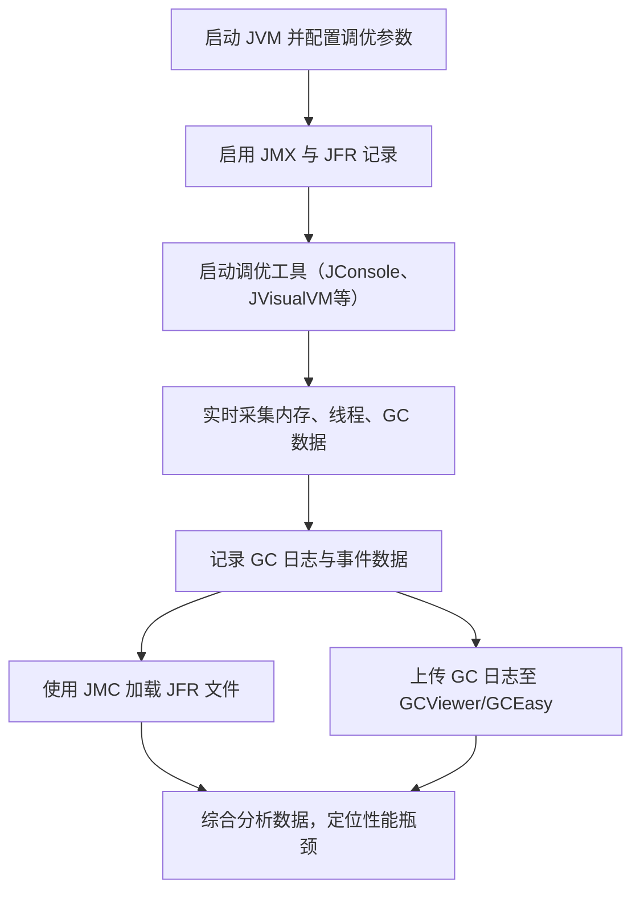

# 2. 调优工具

# Java面试八股之调优工具详解

***

## 一、概述与定义

调优工具是指一系列用于监控、诊断与优化 JVM 性能的工具集合。它们能够通过 JVM 暴露的管理接口（如 JMX）或内置探针，对内存、CPU、线程、GC 及 JIT 编译等关键指标进行实时监控和记录。调优工具的主要目标是帮助开发者定位性能问题、分析垃圾回收停顿、识别内存泄漏以及监控系统负载，为系统调优提供依据。

常见的 JVM 调优工具有：

- **JVisualVM**：基于图形界面的监控工具，可监控内存、CPU、线程，并支持堆转储分析。
- **JConsole**：依托 JMX 技术进行监控，实时查看线程、内存、类加载情况。
- **Java Mission Control (JMC) 与 Java Flight Recorder (JFR)**：用于深入诊断 JVM 运行状态，通过事件记录分析性能瓶颈。
- **GC 日志分析工具**：如 GCViewer、GCEasy，用于解析 GC 日志数据，分析垃圾回收行为。

调优工具通过动态监控和数据记录，让开发者能够直观了解 JVM 内部运行情况，从而为调优决策提供数据支持。😊

***

## 二、主要特点

调优工具具有如下主要特点：

1. **实时监控与数据采集** &#x20;

   调优工具能够实时采集 JVM 各个子系统的数据，如堆内存、垃圾回收、线程状态、类加载信息等，帮助开发者迅速掌握系统运行状况。 &#x20;
   - 例如，JVisualVM 可以实时显示内存曲线，方便发现内存泄漏或频繁 GC 问题。
2. **可视化与图形化展示** &#x20;

   大部分调优工具都采用图形界面展示监控数据，包括折线图、饼图、柱状图等，使数据更加直观易懂。 &#x20;
   - 例如，Java Mission Control 提供了事件流图和时序图，帮助分析应用性能变化趋势。
3. **多维度数据分析** &#x20;

   除了基本的监控功能，调优工具通常提供详细的数据分析与统计，如 GC 日志统计、热点方法分析、线程堆栈采样等，多角度帮助定位问题。 &#x20;
   - 通过 GC 日志分析工具，可以统计各次垃圾回收的停顿时间、回收量等信息。
4. **支持远程监控与集群管理** &#x20;

   调优工具支持通过网络进行远程监控，适用于分布式应用和云平台部署场景。 &#x20;
   - 使用 JMX 技术，开发者可以通过 JConsole 远程连接监控远程服务器的 JVM 状态。
5. **灵活性与扩展性** &#x20;

   调优工具通常提供插件或 API 接口，便于与第三方监控系统（如 Prometheus、Grafana）集成，实现全面的性能监控与告警。 &#x20;
   - 开发者可以自定义数据采集与处理逻辑，满足特定业务需求。🔧

下面通过表格对常见调优工具的特点做个对比说明：

| 调优工具                 | 主要功能                   | 特点描述                  | 适用场景           |
| -------------------- | ---------------------- | --------------------- | -------------- |
| JVisualVM            | 内存、线程、CPU、堆转储分析        | 图形化展示、易于使用，支持插件扩展     | 开发调试、性能分析      |
| JConsole             | JMX 数据实时监控             | 简单轻量，支持远程监控           | 快速监控、基础数据查看    |
| Java Mission Control | 深入诊断、事件记录与分析、JFR 数据查看  | 高级诊断工具，提供详细时序图和热点方法分析 | 生产环境故障排查、长时间监控 |
| GC 日志分析工具            | 解析 GC 日志、统计停顿时间、内存回收效率 | 专注于垃圾回收数据分析，支持图形化报告   | GC 调优、内存泄漏分析   |

***

## 三、应用目标

调优工具在 JVM 调优与实践中的应用目标主要包括：

1. **定位性能瓶颈** &#x20;

   通过实时监控与数据采集，调优工具可以帮助开发者快速定位应用在内存、CPU、线程等方面的瓶颈问题，为后续调优提供依据。
2. **优化垃圾回收行为** &#x20;

   利用 GC 日志分析工具、JMC 与 JFR，可以详细了解垃圾收集的各项指标，调整 GC 策略和参数以减少停顿时间，提升系统吞吐量。
3. **监控内存泄漏** &#x20;

   调优工具能通过堆转储和内存曲线监控，识别对象分配与回收问题，及时发现内存泄漏现象，保障系统长期稳定运行。
4. **提高系统响应与稳定性** &#x20;

   通过实时监控 JVM 状态，开发者可以在系统异常时迅速响应，采取相应措施，确保服务在高并发下依然保持稳定和高效。
5. **辅助调优决策** &#x20;

   调优工具采集的详细数据与分析报告，为开发者调整 JVM 参数、选择合适的垃圾收集器、优化代码提供了科学依据，使得调优过程更具针对性和有效性。⏱️

***

## 四、主要内容及其组成部分

调优工具这一知识点涉及多个方面，下面对各个组成部分进行详尽解释，并结合示例、表格与图示说明。

### 1. 基于 JMX 的监控工具

JMX（Java Management Extensions）是 JVM 暴露管理和监控接口的标准技术。基于 JMX 的工具主要包括 JConsole 与 JVisualVM。 &#x20;

- **JConsole**：通过 JMX 连接到 JVM，实时显示内存、线程、类加载等数据，操作简单、响应迅速。 &#x20;
- **JVisualVM**：功能更为丰富，不仅支持 JMX 监控，还可以进行堆转储、CPU 采样、线程分析等操作，适用于深入性能调试。

**示例** &#x20;

启动 JConsole 后，在连接界面输入目标 JVM 的 IP 与端口，即可实时看到内存使用情况、线程状态等信息。

### 2. Java Flight Recorder (JFR) 与 Java Mission Control (JMC)

JFR 是 JVM 内置的低开销事件记录系统，能够记录 JVM 的运行状态、线程、 GC、锁竞争等事件。JMC 则是用于分析 JFR 记录数据的图形化工具。 &#x20;

- **JFR**：通过命令行参数启动，如 `-XX:StartFlightRecording=filename=recording.jfr,dumponexit=true`，将事件记录到文件中。 &#x20;
- **JMC**：加载 JFR 文件后，提供丰富的图表、时序图和数据过滤功能，便于分析问题。

**示例代码（启动 JFR）：**

```bash 
java -XX:StartFlightRecording=filename=recording.jfr,dumponexit=true -jar yourapp.jar
```


### 3. GC 日志分析工具

GC 日志分析工具专注于解析和分析垃圾回收日志，常见工具包括 GCViewer 和 GCEasy。通过这些工具可以得到每次 GC 的停顿时间、回收量、内存变化等详细信息，帮助开发者优化 GC 策略。 &#x20;

- **GCViewer**：将 GC 日志文件导入后，生成统计图表与报告，直观展示 GC 行为。 &#x20;
- **GCEasy**：基于 Web 的 GC 日志分析平台，自动生成图表报告并提供优化建议。

**示例** &#x20;

使用以下 JVM 参数开启 GC 日志记录：

```bash 
java -XX:+PrintGCDetails -XX:+PrintGCDateStamps -Xloggc:gc.log -jar yourapp.jar
```


将生成的 gc.log 文件上传至 GCViewer 或 GCEasy 网站，即可得到详细报告。

### 4. 性能采样与剖析工具

性能采样工具用于对 CPU、线程和方法调用进行采样分析，常用工具有 JProfiler、YourKit 等。 &#x20;

- 这些工具能够记录应用的 CPU 占用、方法调用频率和调用链，从而定位热点方法和性能瓶颈。 &#x20;
- 通过采样数据，开发者可以了解到哪些方法占用了大量 CPU 时间，从而进行针对性优化。

### 5. 跨平台监控集成工具

随着云计算和容器化技术的发展，越来越多的企业使用 Prometheus、Grafana 等监控系统进行统一监控。调优工具提供的 JMX 导出器（如 JMX Exporter）可以将 JVM 指标采集后推送到这些系统，实现跨平台监控和告警。 &#x20;

- 这种方式不仅便于实时监控，还可以通过 Grafana 仪表盘对历史数据进行趋势分析和容量规划。

下面通过表格展示各类调优工具的组成部分及其特点：

| 组成部分                 | 主要功能                                 | 适用场景          |
| -------------------- | ------------------------------------ | ------------- |
| JConsole / JVisualVM | 实时监控内存、线程、类加载、堆转储等                   | 开发调试、性能实时监控   |
| JFR 与 JMC            | 事件记录、时序分析、深入诊断                       | 生产故障排查、热点分析   |
| GC 日志分析工具            | 分析垃圾回收停顿、回收效率、内存变化                   | GC 调优、内存泄漏检测  |
| 性能采样工具               | CPU、线程采样，方法调用统计                      | 定位热点方法、优化代码性能 |
| JMX Exporter         | 将 JVM 指标导出至 Prometheus、Grafana 等监控系统 | 跨平台监控、集群管理    |

### 6. 调优工具使用流程图

为了帮助直观理解调优工具的整体使用流程，下面使用 Mermaid 绘制一个流程图，展示从启动 JVM、连接调优工具、数据采集、日志记录到数据分析的全过程：




图中展示了调优工具的整体工作流程，从 JVM 启动、数据采集到后续的分析和故障排查，帮助理解各工具之间的协同作用。😊

***

## 五、原理剖析

调优工具背后的原理涉及多个方面，主要包括以下几个部分：

### 1. 基于 JMX 的监控原理

JMX 是 JVM 提供的管理接口，通过 MBean 机制暴露内存、线程、类加载等信息。调优工具利用 JMX 连接目标 JVM，调用 MBean 接口获取实时数据。这种方式开销低，适合实时监控和远程管理。

### 2. 事件记录与采样原理

Java Flight Recorder 利用内置探针，在低开销的前提下记录各种 JVM 事件（如方法调用、 GC 事件、线程切换等）。记录的数据以事件流的方式保存，JMC 则解析这些数据生成详细的时序图与统计报告。采样工具则通过周期性采集 CPU 状态和调用栈，重构出热点方法和瓶颈代码。

### 3. GC 日志采集与解析

通过 JVM 参数启用 GC 日志记录，JVM 将垃圾回收相关信息输出到日志文件中。GC 日志分析工具采用正则表达式解析日志内容，统计各次 GC 的停顿时间、回收量、内存变化等，并通过图表展示数据变化趋势，辅助调优者调整垃圾收集策略。

### 4. 性能采样与调用链分析

性能采样工具通过插桩或者采样技术，对应用在运行时的方法调用进行记录。采样数据经过统计和聚合后，可以展示热点方法及其调用链信息，帮助开发者快速定位性能瓶颈。此过程依赖于 JVM 的调试接口和高精度计时器。

### 5. 跨平台数据整合与可视化原理

通过 JMX Exporter 等工具，将 JVM 指标转换为 Prometheus 格式数据，再由 Grafana 等工具进行可视化展示，实现跨平台监控与告警。此方案利用标准协议和开源工具，保证数据的实时性和一致性。

***

## 六、应用与拓展

调优工具在实际应用中具有广泛用途，其应用与拓展主要体现在以下几个方面：

1. **生产环境监控** &#x20;

   通过调优工具对 JVM 进行实时监控，可以及时发现内存泄漏、线程死锁和 GC 瓶颈问题，从而在生产环境中实现自动告警与快速响应，保障系统稳定性。
2. **性能调优与瓶颈定位** &#x20;

   利用 JFR、JMC、GC 日志分析等工具，开发者能够深入了解热点方法和关键代码的性能表现，针对性地进行代码优化和参数调整，提高系统吞吐量与响应速度。
3. **开发测试阶段调试** &#x20;

   在开发和测试阶段，调优工具可帮助团队发现并解决潜在的内存与线程问题，优化应用启动速度和运行效率，为后续生产部署打下坚实基础。
4. **跨平台与云环境集成** &#x20;

   随着容器化和云计算的普及，将调优工具与 Prometheus、Grafana 等监控系统整合，可以实现大规模集群的统一监控和性能预警，为企业级应用提供数据支持和决策依据。🔧
5. **调优经验积累与自动化** &#x20;

   通过长期监控和数据记录，开发者可以积累调优经验，建立参数优化库和自动调优系统，为未来类似项目提供参考和自动化调优方案。

***

## 七、面试问答

下面提供至少五个常见的面试问答示例，回答内容采用面试者的口吻，详细阐述调优工具的使用原理与应用效果，帮助你在面试中展示深厚的技术功底。

### 问题1：请解释 JVM 调优工具的主要作用及其在性能优化中的意义。

【回答】： &#x20;

调优工具的主要作用是实时监控和记录 JVM 内部运行数据，如内存使用、垃圾回收、线程状态及 JIT 编译行为，从而帮助我们定位性能瓶颈、分析 GC 行为并识别内存泄漏。通过调优工具，我们可以科学地调整 JVM 参数，提升系统吞吐量和响应速度，保障生产环境的稳定运行。我认为掌握这些工具对于构建高性能应用至关重要。

### 问题2：如何使用 JVisualVM 进行内存泄漏的诊断？请简述操作流程。

【回答】： &#x20;

使用 JVisualVM 进行内存泄漏诊断的流程大致如下：首先，通过 JMX 连接到目标 JVM；接着，观察内存曲线，关注堆内存的增长趋势；然后，在出现内存异常时，执行堆转储操作；最后，通过分析堆转储文件，检查对象分布和引用关系，定位未释放的对象及潜在内存泄漏点。整个过程中，JVisualVM 的图形化界面和实时数据监控功能使得问题定位直观高效。

### 问题3：请说明 Java Flight Recorder（JFR）与 Java Mission Control（JMC）的工作原理及它们如何配合使用。

【回答】： &#x20;

JFR 是 JVM 内置的低开销事件记录器，通过内置探针捕捉方法调用、GC、线程切换等事件，并将这些数据记录到文件中。JMC 则是一个图形化分析工具，能够加载 JFR 记录文件，生成详细的时序图、热点方法统计和事件报告，从而帮助我们深入分析系统性能问题。二者配合使用时，JFR 负责数据采集，JMC 负责数据可视化和分析，为调优决策提供有力依据。

### 问题4：在调优过程中，如何利用 GC 日志分析工具帮助调整垃圾回收策略？

【回答】： &#x20;

通过在 JVM 启动时启用 GC 日志参数（例如 -XX:+PrintGCDetails、-Xloggc），我们可以记录每次垃圾回收的详细信息。将生成的日志文件导入到 GCViewer 或 GCEasy 等工具后，便可以直观地看到 GC 停顿时间、回收量以及内存使用变化。如果发现 GC 停顿过长或回收效果不佳，就可以调整垃圾收集器类型或相关参数（如 -XX:MaxGCPauseMillis），以优化 GC 行为，从而提高系统整体性能。

### 问题5：你如何看待调优工具在生产环境监控中的应用？能否举例说明实际案例？

【回答】： &#x20;

我认为调优工具在生产环境中具有非常重要的作用，因为它们可以帮助我们实时监控 JVM 状态，快速识别内存泄漏、线程阻塞以及 GC 瓶颈问题。例如，在我曾经参与的一个电商系统中，通过 JMC 和 JFR，我们成功捕捉到一个由于频繁对象创建导致的内存抖动问题，进而优化了对象池的使用和垃圾回收参数，最终显著降低了 GC 停顿时间，提高了系统响应速度。调优工具不仅为问题定位提供数据支持，还能帮助我们制定切实可行的优化方案。

***
