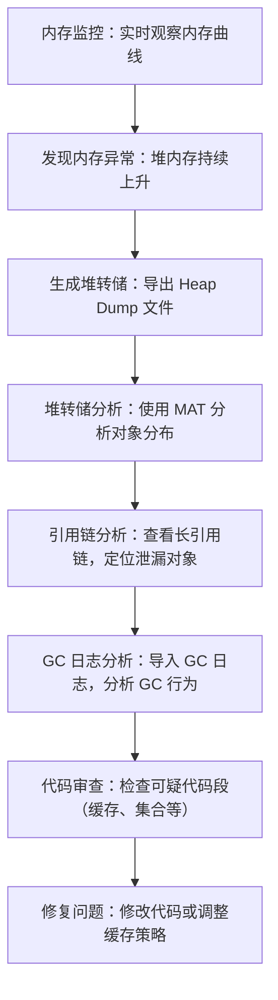

# 1. 内存泄漏排查

# Java面试八股之内存泄漏排查详解

***

## 一、概述与定义

内存泄漏指的是程序中申请的内存资源在使用后未能及时释放，导致内存持续占用、无法被垃圾回收器回收，最终引发堆内存耗尽问题。对于 Java 应用来说，内存泄漏排查主要集中在以下两个方面：

1. **对象未释放** &#x20;

   由于设计缺陷、错误的数据结构引用或缓存机制不当，导致某些对象即使不再需要，但仍然被引用，无法被回收。
2. **集合类持续增长** &#x20;

   比如 Map、List 等集合类在不断插入数据后，没有及时清理无用数据，导致内存持续膨胀。

内存泄漏排查需要借助 JVM 提供的监控与诊断工具（如 JVisualVM、JConsole、Java Flight Recorder 等）以及 GC 日志分析工具，通过采集内存使用情况、对象分布与引用链信息，帮助开发者快速定位泄漏源。

简单来说，内存泄漏排查就是通过分析 JVM 内存数据，找出那些不应存在但却长期占用内存的对象，从而确定问题代码的所在。😊

***

## 二、主要特点

内存泄漏排查具有以下主要特点：

1. **数据监控实时性** &#x20;

   通过工具实时监控 JVM 的内存使用情况，如堆内存占用、GC 次数与停顿时间等，及时发现异常趋势。例如，当堆内存曲线持续上升而未见下降时，很可能存在内存泄漏问题。
2. **多维度分析** &#x20;

   排查过程通常结合堆转储分析、GC 日志解析、对象引用链跟踪等多种技术手段，从内存分布、对象生命周期、引用关系等多个角度寻找问题根源。
3. **工具多样性** &#x20;

   常用的调优工具包括 JVisualVM、JConsole、Java Flight Recorder (JFR)、Java Mission Control (JMC)、GC 日志分析工具（如 GCViewer、GCEasy）等，各具优势，能够从不同层面帮助排查内存泄漏。
4. **可视化表达** &#x20;

   大部分工具支持图形化展示，如内存曲线图、对象分布图、引用链图等，使得数据分析直观易懂。利用 Mermaid 图表等形式，还能手绘内存泄漏的调用或引用关系图，帮助更好地理解问题。
5. **复杂性与隐蔽性** &#x20;

   内存泄漏往往是隐蔽的，可能由于设计缺陷或边缘情况而存在，排查过程需要细致的观察和多次验证。问题可能出现在缓存设计、线程局部变量、长生命周期对象等各个方面，因此排查工作要求开发者具备全面的 JVM 内存模型知识。

下面通过一个表格，对内存泄漏排查的主要特点做简要说明：

| 特点      | 描述                         | 应用场景             |
| ------- | -------------------------- | ---------------- |
| 实时监控    | 通过工具实时显示内存占用与 GC 停顿        | 生产环境监控、预警系统      |
| 多维度分析   | 结合堆转储、引用链、GC 日志等数据，全面排查泄漏源 | 内存泄漏复杂系统、难以定位的问题 |
| 工具多样性   | 提供多种调优工具供不同阶段排查使用          | 开发测试、生产故障排查      |
| 可视化表达   | 直观展示内存曲线、引用关系图等            | 数据分析报告、问题复盘      |
| 隐蔽性与复杂性 | 泄漏问题可能隐藏在多种情况中，需综合分析       | 大型系统、高并发应用       |

***

## 三、应用目标

内存泄漏排查的主要应用目标如下：

1. **保障系统稳定性** &#x20;

   通过及时发现并修复内存泄漏问题，避免长时间运行中内存耗尽导致的 GC 停顿、应用崩溃或性能下降，确保系统长期稳定运行。
2. **提升性能与响应速度** &#x20;

   内存泄漏会导致频繁的垃圾回收，严重影响系统响应速度。排查并解决内存泄漏问题后，可大幅降低 GC 压力，提高系统吞吐量和响应效率。⏱️
3. **降低运维风险** &#x20;

   在生产环境中，及时监控并排查内存泄漏能够减少突发性故障，降低因内存耗尽引发的服务中断风险，为业务连续性保驾护航。
4. **优化资源利用** &#x20;

   通过内存泄漏排查，发现并修正无用对象持续占用内存的情况，可以提升内存利用率，减少不必要的资源浪费，降低运维成本。
5. **支持性能调优决策** &#x20;

   排查过程中获取的数据和分析报告，为进一步调整 JVM 参数和优化应用代码提供了科学依据，使系统整体调优更加有的放矢。

***

## 四、主要内容及其组成部分

内存泄漏排查这一知识点涉及多个方面，下面对各组成部分进行详细说明，并结合实例、表格和图表说明排查思路和方法。

### 1. 内存监控工具

内存监控工具是排查内存泄漏的第一步，常用工具包括：

- **JVisualVM** &#x20;

  提供内存、线程、类加载的实时监控，支持堆转储和对象统计。开发者可以通过内存曲线图判断是否存在异常增长的情况。
- **JConsole** &#x20;

  基于 JMX 连接目标 JVM，实时查看内存使用情况、线程状态和 MBean 数据，适合快速排查。
- **Java Mission Control (JMC) 与 Java Flight Recorder (JFR)** &#x20;

  JFR 记录 JVM 内部事件，JMC 用于可视化分析这些事件，能捕获 GC、锁竞争、方法调用等详细信息，帮助识别内存泄漏源。

**示例命令：** &#x20;

启动 JVM 时启用 JFR 记录：

```bash 
java -XX:StartFlightRecording=filename=recording.jfr,dumponexit=true -jar yourapp.jar
```


### 2. 堆转储（Heap Dump）分析

堆转储文件包含了 JVM 在某一时刻所有对象的详细信息，通过分析堆转储文件，可以找到内存泄漏的根本原因。常用工具包括：

- **Eclipse Memory Analyzer (MAT)** &#x20;

  一款强大的堆转储分析工具，可以生成对象引用图、查找泄漏疑点，并提供详细的报告。

**操作流程：** &#x20;

1. 在内存异常时，通过 JVisualVM 或命令行生成堆转储文件。 &#x20;
2. 使用 MAT 导入堆转储文件，分析对象分布和引用链，定位泄漏对象。

### 3. GC 日志分析

GC 日志记录了垃圾回收过程中的详细信息，能够反映内存使用趋势和 GC 行为。通过 GC 日志分析工具（如 GCViewer、GCEasy），开发者可以了解垃圾回收的频率、停顿时间以及回收效果，从而判断内存泄漏是否导致了频繁 GC。

**示例命令：**

```bash 
java -XX:+PrintGCDetails -XX:+PrintGCDateStamps -Xloggc:gc.log -jar yourapp.jar
```


生成的 gc.log 文件可导入 GCViewer 进行详细分析。

### 4. 引用链分析

引用链分析是定位内存泄漏关键环节，通过查看哪些对象相互引用而未被释放，可以明确泄漏根源。常用方法有：

- 利用堆转储分析工具生成对象引用图，观察长引用链。 &#x20;
- 手动分析代码中缓存、集合或静态变量等容易造成内存泄漏的地方。

### 5. 代码审查与测试

内存泄漏往往与代码实现密切相关，因此代码审查也是内存泄漏排查的重要手段。常见的排查点包括：

- 缓存未及时清理
- 线程局部变量未释放
- 集合对象持续增长

通过单元测试、压力测试与代码审查，可以预防和发现内存泄漏风险。

下面通过一个表格总结内存泄漏排查的主要组成部分及其作用：

| 组成部分    | 主要功能                 | 关键工具及方法                      |
| ------- | -------------------- | ---------------------------- |
| 内存监控工具  | 实时监控堆内存、线程、类加载等      | JVisualVM, JConsole, JMC/JFR |
| 堆转储分析   | 获取内存状态快照，生成对象引用图     | Eclipse MAT, VisualVM        |
| GC 日志分析 | 分析 GC 行为，判断内存回收频率和停顿 | GCViewer, GCEasy             |
| 引用链分析   | 分析对象之间的引用关系，定位泄漏源    | 堆转储工具、手动代码分析                 |
| 代码审查与测试 | 检查代码实现，预防潜在内存泄漏问题    | 单元测试、代码评审、压力测试               |

### 6. 内存泄漏排查流程图

下面通过 Mermaid 绘制一幅流程图，展示内存泄漏排查的整体流程，帮助大家直观理解各步骤之间的关系：




图中展示了从实时内存监控到堆转储、引用链分析、GC 日志解析、代码审查直至最终修复问题的完整排查流程。😊

***

## 五、原理剖析

内存泄漏排查的原理主要涉及 JVM 内存模型、垃圾回收机制和对象引用关系等核心概念。下面对关键原理进行详细剖析：

### 1. JVM 内存模型与对象分配

JVM 内存主要分为堆、方法区、栈、程序计数器等区域，其中堆是对象存储的主要区域。对象在堆上的分配遵循“新生代—老年代”模型：

- 新生代中存在 Eden 区与 Survivor 区，主要存放生命周期短的对象。
- 当对象经过多次 GC 后仍然存活，就会晋升到老年代。

内存泄漏通常发生在对象应当被回收时仍被引用，导致堆内存不断增长。通过监控堆内存的使用情况，可以判断是否存在此类异常。

### 2. 垃圾回收与内存泄漏

垃圾回收器的主要任务是回收不再使用的对象。然而，当存在内存泄漏时，原本应该回收的对象依然被引用，导致 GC 无法释放内存。GC 日志中往往会显示：

- GC 次数异常增多
- 停顿时间不断延长
- 回收后内存回升速度较慢

这些现象提示我们需要进行内存泄漏排查，并通过堆转储和引用链分析确定泄漏源。

### 3. 引用关系与引用链

Java 中对象的引用关系决定了对象能否被垃圾回收。常见的引用类型有强引用、软引用、弱引用和虚引用。内存泄漏往往与强引用相关，因为只要存在强引用，对象就不会被回收。通过生成对象引用图，可以清晰地看到哪些对象形成了长引用链，进而判断是否存在设计缺陷或缓存未及时清理的问题。

### 4. 工具原理与数据采样

调优工具如 JVisualVM、JMC 与 JFR 通过 JVM 暴露的 JMX 接口和内置探针，实现对内存、线程、GC、JIT 编译等数据的实时采样和记录。这些数据经过分析后，可以生成详细的统计报告和图表，帮助我们从数据角度识别内存泄漏问题。GC 日志分析工具则利用正则匹配技术解析 GC 输出，统计各次回收的详细信息。

### 5. 数据整合与可视化

调优工具通过将多维度数据整合并以图形化方式展示，使得内存泄漏问题更加直观。例如，通过观察内存曲线图可以发现内存占用异常上升，通过引用链图可以迅速定位泄漏对象，从而为代码修复提供明确方向。

***

## 六、应用与拓展

内存泄漏排查不仅在日常开发和测试中至关重要，在生产环境中同样具有广泛应用，具体体现在以下几个方面：

1. **生产环境监控与预警** &#x20;

   在大规模生产环境中，结合 JMX Exporter 与 Prometheus、Grafana 等工具，可以实现对 JVM 内存使用、GC 行为的实时监控，自动触发预警机制。一旦发现内存异常增长或 GC 停顿时间超标，运维人员可以及时介入，防止系统崩溃。
2. **性能调优与容量规划** &#x20;

   通过内存泄漏排查，开发团队可以优化代码结构、调整缓存策略和改进对象管理，从而提高系统吞吐量和响应速度。此外，通过分析历史内存使用数据，还能进行容量规划，确保系统在高并发场景下稳定运行。
3. **故障排查与事故复盘** &#x20;

   内存泄漏往往是导致系统崩溃的重要原因。通过详细的堆转储分析、GC 日志解析和引用链跟踪，开发者可以在事故发生后迅速定位问题根源，制定修复方案，并在事故复盘中总结经验，防止类似问题再次发生。
4. **自动化调优与持续集成** &#x20;

   随着 DevOps 与持续集成技术的发展，可以将内存泄漏排查工具与自动化测试、监控系统结合，实现持续的性能检测。一旦检测到内存泄漏风险，自动化系统便会触发报警，甚至自动回滚更新，保障服务稳定性。🔧
5. **新技术探索与融合** &#x20;

   内存泄漏排查技术也在不断演进，未来可能会与机器学习、智能告警等技术相结合，实现更加精准的故障预测和自动优化，为分布式系统和微服务架构提供更强有力的支持。

***

## 七、面试问答

下面提供常见的面试问答示例，回答内容采用面试者的口吻，详细阐述内存泄漏排查的技术原理和应用经验，帮助你在面试中从容展示专业知识。

### 问题1：请简要介绍内存泄漏的定义和内存泄漏排查的重要性。

【回答】： &#x20;

内存泄漏指的是程序中申请的内存资源未能在使用完毕后及时释放，导致堆内存不断累积，最终可能引发 GC 停顿或系统崩溃。内存泄漏排查非常重要，因为它直接关系到系统的稳定性和性能。通过使用堆转储分析、GC 日志解析和引用链跟踪，我们可以快速定位泄漏源，从而采取针对性措施修复问题，保障生产环境的正常运行。

### 问题2：你通常如何利用 JVisualVM 或 JConsole 进行内存监控，识别潜在的内存泄漏？

【回答】： &#x20;

我会先通过 JVisualVM 或 JConsole 连接到目标 JVM，实时观察内存曲线和 GC 行为。如果发现堆内存持续增长且回收后没有明显下降，便说明可能存在内存泄漏。接下来，我会通过堆转储功能导出内存快照，并使用 MAT 工具分析对象分布和引用链，找出那些长时间无法被回收的对象。这样的步骤能帮助我迅速定位问题所在。

### 问题3：请详细说明堆转储分析在内存泄漏排查中的作用，并描述你常用的分析流程。

【回答】： &#x20;

堆转储分析是排查内存泄漏的重要手段，它能获取 JVM 在某一时刻所有对象的详细信息。我的分析流程一般如下：

1. 当监控工具显示内存异常上升时，通过 JVisualVM 生成堆转储文件。
2. 使用 Eclipse MAT 导入堆转储文件，生成对象统计报告和引用链图。
3. 观察哪些对象占用内存较大、引用链较长，并结合代码逻辑找出是否存在缓存未清理或设计缺陷的问题。

这一流程能帮助我定位到泄漏对象的具体来源，从而对症下药。

### 问题4：如何利用 GC 日志分析工具辅助排查内存泄漏？请举例说明常用的 GC 日志参数及其含义。

【回答】： &#x20;

GC 日志记录了每次垃圾回收的详细信息，如回收前后内存使用情况、停顿时间等。通过分析 GC 日志，我们可以发现如果内存泄漏存在，GC 次数会增多，且回收后内存下降幅度较小。我通常会在启动 JVM 时加入如下参数：

```bash 
java -XX:+PrintGCDetails -XX:+PrintGCDateStamps -Xloggc:gc.log -jar yourapp.jar
```


这样生成的 gc.log 文件可以导入 GCViewer 或 GCEasy 进行详细分析。如果日志显示频繁的 Full GC 且内存回收效果不明显，就很可能存在内存泄漏问题。

### 问题5：在排查内存泄漏过程中，你如何结合代码审查和测试来确认问题，并给出实际案例说明？

【回答】： &#x20;

除了使用工具外，代码审查同样是排查内存泄漏的重要环节。我会重点检查容易出问题的地方，如缓存设计、集合类使用、线程局部变量等。比如在一个项目中，我们发现系统内存持续增长，经过堆转储和引用链分析锁定到一个缓存类中，原来开发人员在设计缓存时没有及时清理过期数据。通过代码审查确认问题后，我与团队一起修改了缓存策略，并增加了定时清理机制，最终解决了内存泄漏问题。这样的经验不仅帮助我在面试中详细描述排查过程，也展示了我对内存管理细节的深入理解。

***
