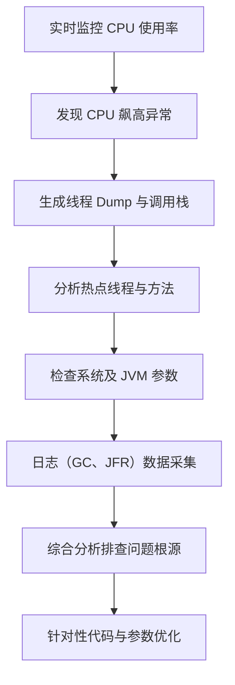

# 2. CPU飙高排查

# Java面试八股之CPU飙高排查详解

***

## 一、概述与定义

CPU飙高排查是指在 Java 系统中，当发现 CPU 使用率异常上升时，通过一系列监控工具与诊断手段，分析并定位导致 CPU 占用过高的根本原因。常见的问题包括：

- 应用中存在死循环或频繁执行的高耗时任务 &#x20;
- 线程竞争激烈，频繁上下文切换 &#x20;
- 错误的多线程设计或锁机制失效 &#x20;
- 不合理的算法或资源浪费问题 &#x20;

排查过程中，我们需要收集线程状态、调用栈、系统负载、JVM 内部指标以及 GC 信息等多维数据。通过对比分析这些数据，最终确定问题所在，并采取针对性的优化措施。😊

***

## 二、主要特点

CPU飙高排查具有如下主要特点：

1. **实时性强** &#x20;

   利用 JVisualVM、JConsole、Java Flight Recorder (JFR) 等工具，可以实时监控 CPU 使用率和线程运行状态，一旦发现异常，能够迅速介入排查。
2. **多维数据分析** &#x20;

   排查不仅依赖于 CPU 使用率，还需结合线程状态、堆栈采样、方法调用频率以及 GC 行为等多方面数据。这样多角度的分析能更准确地找出问题根源。
3. **可视化展示** &#x20;

   多数工具支持图形化展示，例如内置图表显示 CPU 曲线、线程堆栈图、热点方法分布图等，直观展现系统负载和瓶颈。
4. **依赖于监控工具和日志** &#x20;

   排查过程中通常会借助 GC 日志、线程 dump、JFR 记录等辅助数据，这些日志能提供详细的系统内部状态信息，为问题定位提供依据。
5. **复杂性与隐蔽性** &#x20;

   CPU 占用异常可能由多个原因引起，如死循环、频繁上下文切换、I/O 阻塞等，排查时需要综合分析系统各层数据，具有一定复杂性和隐蔽性。

下面通过下表对 CPU 飙高排查的主要特点进行对比说明：

| 特点        | 描述                              | 适用场景       |
| --------- | ------------------------------- | ---------- |
| 实时性强      | 可通过监控工具实时捕获 CPU 使用率异常波动         | 生产环境实时监控   |
| 多维数据分析    | 结合线程 dump、调用栈、GC 日志等多数据源定位瓶颈    | 多线程或高并发应用  |
| 可视化展示     | 利用图表、时序图、堆栈图直观显示系统负载            | 调优报告、问题复盘  |
| 依赖监控工具与日志 | 通过 JVisualVM、JFR、GC 日志等手段获取详实数据 | 故障排查、性能优化  |
| 复杂性与隐蔽性   | 问题成因可能多样，需综合分析不同维度数据            | 大型系统、微服务架构 |

***

## 三、应用目标

CPU飙高排查的主要目标包括：

1. **定位性能瓶颈** &#x20;

   通过对线程状态、热点方法、调用栈等数据的分析，准确定位导致 CPU 占用过高的代码区域或模块，找出瓶颈所在。
2. **保障系统稳定性** &#x20;

   在发现 CPU 异常飙高问题后，及时采取措施（如优化代码、调整线程池、修改锁机制）防止系统因 CPU 过载而出现响应延迟或崩溃。
3. **提升系统吞吐量与响应速度** &#x20;

   通过排查并优化高耗时任务或死循环问题，降低 CPU 占用，释放计算资源，从而提升整体系统的执行效率和响应能力。⏱️
4. **辅助调优决策** &#x20;

   排查过程中获得的详细数据与分析报告，可以为后续的 JVM 参数调优、代码优化和系统架构调整提供科学依据，使调优工作更有针对性。
5. **降低运维风险** &#x20;

   通过定期监控和及时排查 CPU 飙高问题，可以预防系统在高并发或异常情况下出现严重性能下降，保障生产环境的稳定运行。

***

## 四、主要内容及其组成部分

内存泄漏排查的场景中，CPU 飙高排查涉及以下主要内容及其组成部分：

### 1. CPU 监控与数据采集

CPU 监控是排查的第一步，主要通过以下工具与方法完成：

- **JVisualVM 与 JConsole** &#x20;

  通过这些工具实时监控 JVM 的 CPU 使用率、线程活动和系统负载情况。 &#x20;

  示例：在 JVisualVM 中可以查看 CPU 利用率曲线，发现某时段 CPU 使用率突然飙高。
- **Java Flight Recorder (JFR) 与 Java Mission Control (JMC)** &#x20;

  记录 JVM 内部事件，包括线程运行、方法调用、锁竞争等。通过 JMC 可以生成详细的 CPU 使用报告和热点分析。
- **系统监控工具** &#x20;

  除了 JVM 内置工具外，操作系统层面的监控工具（如 top、vmstat、sar）也能帮助确认是否为 CPU 飙高现象，并确定是否与 JVM 内部问题相关。

**示例命令：** &#x20;

在 Linux 环境下使用 top 命令查看系统 CPU 状态：

```bash 
top -d 2
```


### 2. 线程 Dump 与调用栈分析

当发现 CPU 占用异常时，需要生成线程 Dump 分析线程状态、锁竞争和调用栈情况：

- **线程 Dump** &#x20;

  利用 jstack 或 JVisualVM 生成线程 Dump 文件，通过分析可以看到哪些线程正在占用大量 CPU 时间。
- **调用栈分析** &#x20;

  对于占用 CPU 的线程，通过调用栈分析可以确定具体执行了哪些方法，从而定位到高耗时的代码段。

**示例命令：**

```bash 
jstack <pid> > threaddump.txt
```


### 3. 热点方法与代码优化

热点方法是指那些频繁调用且耗时较长的方法，是 CPU 占用的主要来源。排查时可以使用采样工具（如 JProfiler、YourKit）来分析热点方法，并进行代码优化，例如：

- 方法内联 &#x20;
- 循环优化 &#x20;
- 缩减不必要的计算

**示例代码（示例优化前后对比）：**

```java 
// 优化前
public void processData(List<Integer> data) {
    for (int i = 0; i < data.size(); i++) {
        // 复杂计算过程
        doComplexCalculation(data.get(i));
    }
}

// 优化后：缓存数据大小，减少重复计算
public void processData(List<Integer> data) {
    int size = data.size();
    for (int i = 0; i < size; i++) {
        doComplexCalculation(data.get(i));
    }
}
```


### 4. 系统及 JVM 参数调整

当确定 CPU 飙高与 JVM 内部参数设置不合理有关时，需要通过调整参数改善性能。常见参数包括：

- **-XX:ParallelGCThreads** &#x20;

  控制垃圾收集线程数，间接影响 CPU 占用。 &#x20;
- **-XX:CICompilerCount** &#x20;

  控制 JIT 编译线程数，对高并发场景下的 CPU 使用有影响。

结合实际情况，合理配置这些参数可以减轻 CPU 压力。

### 5. 日志分析与故障排查

除了实时监控和线程 Dump 外，还需要通过 GC 日志、JFR 日志等对 CPU 使用与垃圾回收之间的关联进行分析。通过分析日志，确定是否存在频繁 Full GC 或 JIT 编译异常导致的 CPU 占用过高现象。

**示例命令：**

```bash 
java -XX:+PrintGCDetails -XX:+PrintGCDateStamps -Xloggc:gc.log -jar yourapp.jar
```


### 6. 整体排查流程图

为了便于理解整个 CPU 飙高排查的流程，下面给出一个基于 Mermaid 语法的流程图：




图中展示了从实时监控、异常发现、线程 Dump、热点分析、参数检查、日志数据采集，再到综合排查和优化整个排查流程，直观体现出 CPU 飙高问题的调查步骤。😊

***

## 五、原理剖析

针对 CPU 飙高排查的原理，我们主要从以下几个方面进行深入解析：

### 1. JVM 与操作系统的 CPU 占用模型

JVM 内部各个线程执行 Java 代码，同时与操作系统调度紧密结合。CPU 飙高通常有以下几种情况：

- 应用线程中存在死循环或大量计算密集型任务，持续占用 CPU 资源；
- GC 或 JIT 编译线程异常活跃，频繁调度导致 CPU 占用升高；
- 线程竞争激烈，频繁上下文切换导致额外的 CPU 开销。

理解 JVM 与操作系统如何协调执行，是排查 CPU 问题的理论基础。

### 2. 线程 Dump 与调用栈原理

线程 Dump 捕获了 JVM 中所有线程的当前状态和调用栈信息。通过分析调用栈，可以了解每个线程正在执行哪段代码，判断是否存在异常调用或死循环现象。利用调用栈中方法调用层级的信息，还可以定位具体的热点代码区域，为后续优化提供依据。

### 3. JIT 编译与热点方法原理

JIT 编译器会对热点方法进行编译优化，但如果编译策略设置不当，可能导致大量编译线程活动，进而短时间内占用大量 CPU。通过监控 JIT 编译日志，可以判断是否存在编译浪费或不合理的内联导致的 CPU 占用异常。

### 4. GC 行为与 CPU 占用关系

垃圾收集是 JVM 内存管理的重要部分，GC 的执行会占用一定的 CPU 资源。如果内存泄漏或对象创建频繁，会导致 GC 次数增加，从而引发 CPU 占用上升。通过 GC 日志可以分析 GC 次数与每次停顿时间，为定位问题提供数据支持。

### 5. 数据采样与监控技术原理

调优工具通过对 JVM 内部数据的实时采样，如线程活动、CPU 使用率、内存使用情况等，利用统计分析和趋势对比，形成整体的性能诊断报告。这种采样与数据整合技术是 CPU 飙高排查的基础，能帮助开发者从宏观上把握系统运行状况。

***

## 六、应用与拓展

CPU 飙高排查在实际生产环境和开发调优中具有广泛应用，具体体现在：

1. **生产系统监控与预警** &#x20;

   通过整合 JMX 监控、JFR 与操作系统监控工具，可以实时监控 CPU 使用率，设置告警阈值，一旦发现异常迅速介入排查，确保系统在高负载时依然稳定运行。
2. **性能调优与瓶颈定位** &#x20;

   利用线程 Dump、调用栈分析和热点方法分析，能快速定位性能瓶颈，从而有针对性地优化代码与调整 JVM 参数，提高系统整体吞吐量与响应速度。
3. **故障排查与问题复盘** &#x20;

   在 CPU 飙高引发故障后，通过详细的日志和采样数据，开发团队可以复盘事故原因，查明问题根源（如死循环、线程竞争等），并制定长效的优化策略，防止类似问题再次发生。
4. **自动化监控与智能调优** &#x20;

   随着云计算与微服务的发展，越来越多的企业采用 Prometheus、Grafana 等监控平台，将 JVM 指标数据导出，实现自动化告警与智能调优，为系统提供持续的健康保障。🔧
5. **跨平台调优经验积累** &#x20;

   针对不同操作系统与硬件平台，通过对比分析 CPU 使用率数据与 JVM 内部指标，可以积累调优经验，为后续项目提供标准化的 CPU 优化方案，并实现自动化调优脚本与策略。

***

## 七、面试问答

以下提供至少五个常见面试问答示例，回答内容采用面试者口吻，详细阐述 CPU 飙高排查的技术原理与应用经验，帮助你在面试中从容展示专业水平：

### 问题1：请简要介绍 CPU 飙高排查的概念以及其在生产系统中的重要性。

【回答】： &#x20;

CPU 飙高排查是指当系统 CPU 占用率异常上升时，通过实时监控、线程 Dump、调用栈分析等手段，快速定位导致高 CPU 使用的根本原因。它对于生产环境至关重要，因为持续高 CPU 占用会导致系统响应缓慢、资源浪费甚至崩溃。通过及时排查和优化，可以保障系统稳定性和高并发处理能力。

### 问题2：你通常如何利用 JVisualVM 或 JFR 分析 CPU 占用异常，请详细说明操作步骤。

【回答】： &#x20;

首先，我会使用 JVisualVM 实时监控 CPU 使用率，观察是否存在异常波动；若发现异常，我会生成线程 Dump，并通过 JVisualVM 或 JFR 查看线程状态和热点方法。接着，我会分析线程调用栈，定位哪些线程在占用大量 CPU。通过这些步骤，我能够准确判断是否存在死循环或高耗时任务，从而有针对性地优化代码或调整 JVM 参数。

### 问题3：请描述利用线程 Dump 分析 CPU 飙高问题的过程，并举例说明如何从调用栈中发现问题。

【回答】： &#x20;

当 CPU 使用率异常升高时，我会使用 jstack 命令生成线程 Dump。分析 Dump 文件时，我会重点查看那些处于 RUNNABLE 状态且调用栈深度较高的线程。如果发现某个线程一直在执行同一段循环代码，且调用栈中重复出现相同方法调用，就可能是死循环或计算密集型问题。例如，在某次排查中，我发现某线程的调用栈一直停留在一个递归调用中，最终定位到代码逻辑错误，及时修复后 CPU 占用恢复正常。

### 问题4：在 CPU 飙高排查中，如何利用 GC 日志辅助诊断问题？请说明相关参数及其作用。

【回答】： &#x20;

GC 日志能反映 JVM 垃圾回收的行为，如果 GC 次数增加、停顿时间过长，可能与内存泄漏或大量对象创建有关，从而引发 CPU 占用上升。我会在启动 JVM 时加入如下参数：

```bash 
java -XX:+PrintGCDetails -XX:+PrintGCDateStamps -Xloggc:gc.log -jar yourapp.jar
```


然后利用 GCViewer 或 GCEasy 分析 gc.log 文件，观察 GC 停顿时间和内存回收效率。如果发现频繁 Full GC 且回收效果不佳，就需要进一步排查代码中是否存在大量无用对象或循环创建对象的情况。

### 问题5：如何通过综合分析工具实现自动化监控与告警，从而及时发现 CPU 飙高问题？

【回答】： &#x20;

我会结合 JMX Exporter 将 JVM 指标导出到 Prometheus，再利用 Grafana 构建监控仪表盘，设置 CPU 使用率告警阈值。当系统 CPU 占用率超过设定值时，自动触发告警，并通过日志与线程 Dump 数据进一步分析问题。这种自动化监控与告警体系不仅提高了问题发现的及时性，也为后续的自动化调优提供了数据支撑。

***
