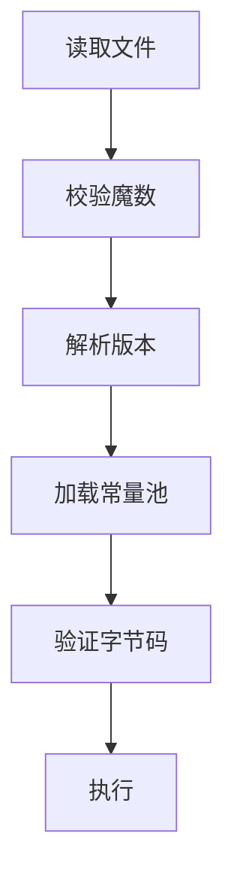

# 1. Class类文件结构

### Java面试八股文：Class类文件结构详解

#### 1. 概述与定义

在Java开发中，JVM（Java虚拟机）是运行Java程序的核心，而执行子系统负责将字节码转化为机器指令执行。Class类文件结构是JVM执行子系统的基石，它定义了Java源代码编译后的二进制格式，是JVM加载、解析和执行代码的基础。Class文件由`javac`编译器将`.java`文件生成，采用平台无关的字节码格式，包含类的所有信息，如字段、方法、常量池等。

简单来说，Class文件是一个结构化的二进制文件，遵循严格的规范（定义在《Java虚拟机规范》中），用于描述类的元数据和行为。JVM通过加载Class文件到内存，解析其结构，最终执行程序逻辑。理解Class文件结构，不仅能帮助我们深入掌握JVM的运行机制，还能在面试中展示对Java底层原理的理解。接下来，我们将从特点、目标、内容、原理到应用场景，全面剖析这一知识点。

***

#### 2. 主要特点

Class类文件结构的核心特点可以用以下几点概括：

- **平台无关性** 🌍：字节码格式与硬件无关，跨平台运行。
- **结构化设计** 📋：分层组织，字段清晰，便于解析。
- **紧凑性** 💾：采用二进制编码，节省空间。
- **扩展性** 🚀：支持自定义属性，适应语言演进。
- **安全性** 🔒：包含访问权限和校验信息，确保运行时安全。

与其他语言的编译产物（如C的机器码）相比，Class文件的平台无关性和结构化设计是其独特优势。这些特点使其成为JVM跨平台执行的关键。

***

#### 3. 应用目标

Class文件结构的设计目标明确，主要包括：

- **描述类信息**：完整记录类的元数据和行为。
- **支持JVM加载**：提供标准格式，便于类加载器解析。
- **跨平台执行**：确保字节码在不同环境下一致运行。
- **优化执行效率**：通过常量池等设计提升解析速度。

例如，一个分布式系统需要在Linux和Windows上运行相同的Java程序，Class文件结构保证了字节码的统一性，JVM只需根据平台生成对应的机器码即可。

***

#### 4. 主要内容及其组成部分

Class文件结构由多个核心部分组成，以下逐一详解：

##### 4.1 魔数（Magic Number）

固定值`0xCAFEBABE`，占4字节，用于标识文件是否为有效的Class文件。

##### 4.2 版本号（Version）

包括次版本号（Minor Version）和主版本号（Major Version），各占2字节，指示编译时的JDK版本。例如，JDK 8对应的主版本号是52。

##### 4.3 常量池（Constant Pool）

存储类的字面量和符号引用，采用变长结构。包括：

- 字面量：如字符串、数字。
- 符号引用：如类名、方法名、字段名。

每个条目以1字节的tag开头，后接具体数据。例如：

```java 
CONSTANT_Utf8_info { tag=1, length=5, bytes="Hello" }
```


##### 4.4 访问标志（Access Flags）

占2字节，定义类的访问权限，如`public`（0x0001）、`final`（0x0010）等。

##### 4.5 类索引（This Class, Super Class, Interfaces）

- **this\_class**：指向常量池中当前类的符号引用。
- **super\_class**：指向父类的符号引用。
- **interfaces**：接口数组，记录实现的接口。

##### 4.6 字段表（Fields）

描述类的字段信息，每个字段包括：

- 访问标志：如`private`、`static`。
- 名称索引：指向常量池中的字段名。
- 描述符索引：指向字段类型（如`I`表示int）。

##### 4.7 方法表（Methods）

描述类的方法，每个方法包括：

- 访问标志：如`public`、`synchronized`。
- 名称索引：指向方法名。
- 描述符索引：指向方法签名（如`(I)V`表示接收int返回void）。
- 属性表：如Code属性，存储字节码。

##### 4.8 属性表（Attributes）

存储额外信息，如：

- **Code属性**：方法的具体字节码。
- **LineNumberTable**：行号映射，用于调试。
- **SourceFile**：源文件名。

下表总结Class文件结构：

| **组成部分**​ | **字节数**​ | **功能**​    | **示例**​            |
| --------- | -------- | ---------- | ------------------ |
| 魔数        | 4        | 标识Class文件  | 0xCAFEBABE         |
| 版本号       | 4        | 记录JDK版本    | 52（JDK 8）          |
| 常量池       | 变长       | 存储字面量和符号引用 | "java/lang/Object" |
| 访问标志      | 2        | 定义访问权限     | 0x0001（public）     |
| 类索引       | 变长       | 记录类、父类、接口  | \\#5（常量池索引）        |
| 字段表       | 变长       | 描述字段信息     | private int x      |
| 方法表       | 变长       | 描述方法信息     | public void run()  |
| 属性表       | 变长       | 存储额外信息     | Code属性             |

***

#### 5. 原理剖析

##### 5.1 文件结构布局

Class文件采用大端字节序（Big-Endian），从高位到低位依次存储。例如，一个简单的类：

```java 
public class Demo {
    private int x;
    public void run() { x = 1; }
}
```


其Class文件结构（简化版）如下：

- 魔数：`0xCAFEBABE`
- 版本：`0x00000034`（JDK 8）
- 常量池：包含`Demo`、`java/lang/Object`、`x`、`run`等。
- 访问标志：`0x0001`（public）
- 方法表：包含`run`方法的Code属性。

##### 5.2 常量池解析

常量池是核心部分，JVM通过索引访问。例如：

```java 
#1 = Class #2           // Demo
#2 = Utf8 "Demo"
#3 = Methodref #4.#5    // run方法引用
```


解析时，JVM从常量池提取符号引用，链接到实际内存地址。

##### 5.3 Code属性与字节码

Code属性存储方法的具体指令。例如`run`方法：

```java 
void run() {
    x = 1;
}
```


字节码：

```java 
0: aload_0       // 加载this引用
1: iconst_1     // 推送常量1
2: putfield #2  // 设置字段x
5: return        // 返回
```


##### 5.4 加载与验证

JVM加载Class文件时：

1. **校验魔数和版本**：确保文件有效。
2. **解析常量池**：构建运行时数据。
3. **验证字节码**：检查安全性，如栈平衡。

Mermaid图展示加载流程：




##### 5.5 扩展性设计

属性表支持自定义属性，如`Deprecated`、`Annotations`，便于语言特性扩展。

***

#### 6. 应用与拓展

##### 6.1 应用场景

- **动态代理**：生成代理类的Class文件。
- **字节码增强**：如ASM、ByteBuddy操作Class结构。
- **调试工具**：解析Class文件定位问题。

##### 6.2 工具支持

- `javap -v`：查看Class文件内容。例如：

```bash 
javap -v Demo.class
```


输出常量池、方法表等。

##### 6.3 拓展

- **与执行子系统协作**：Class文件提供字节码，供解释器和JIT编译。
- **与其他格式对比**：如Python的`.pyc`，无常量池，结构简单。

***

#### 7. 面试问答

##### 7.1 Class文件结构包括哪些部分？

面试官你好，Class文件结构是JVM的基础，包含几大核心部分：首先是魔数，固定`0xCAFEBABE`，4字节，校验文件格式；然后是版本号，4字节，记录JDK版本，比如JDK 8是52；接着是常量池，变长，存字面量和符号引用，像类名、方法名；再是访问标志，2字节，定义`public`、`final`啥的；然后是类索引，指向当前类、父类、接口；还有字段表和方法表，描述字段和方法信息；最后是属性表，像Code属性存字节码。每个部分都有明确作用，结构很清晰。

##### 7.2 常量池的作用是什么？

常量池是Class文件的核心！它存了两类东西：字面量，比如字符串"hello"，和符号引用，比如类名`java/lang/Object`、方法签名。JVM加载时，通过常量池解析这些引用，链接到内存地址。比如我调用`System.out.println`，常量池里就有`println`的引用，加载时找到具体方法。还能复用数据，节省空间，我用`javap -v`看过，一个类几百个常量池条目很常见。

##### 7.3 Code属性有什么用？

Code属性特别重要！它是方法表里的子结构，存方法的具体字节码和执行信息。比如我写个`void run() { x = 1; }`，Code属性里就有`aload_0`、`iconst_1`、`putfield`这些指令，还包括栈大小、局部变量表啥的。JVM执行时，直接读Code属性里的字节码，解释或编译运行。我调试时常看Code属性，找性能瓶颈很方便。

##### 7.4 Class文件怎么保证跨平台？

跨平台的秘密在Class文件设计上！它用字节码格式，跟硬件无关，编译时生成统一结构，比如魔数、常量池这些。JVM加载后，执行子系统根据平台生成机器码，比如Windows生成x86指令，Linux生成ARM指令。我写个`Demo.java`，编译成Class文件，在不同机器上跑，结果一致，就是因为这个设计，太牛了！

##### 7.5 如果面试问怎么解析Class文件，你怎么答？

这个问题有实战性！我要说，解析Class文件得按结构走：先读4字节魔数，确认`0xCAFEBABE`；再读版本号，4字节，看兼容性；然后解析常量池，变长，得循环读tag和数据；接着是访问标志、类索引，提取类信息；再读字段表、方法表，拿到字段和方法细节；最后解析属性表，比如Code属性里的字节码。可以用工具像`javap`，也能手写代码读二进制。我项目里用过ASM改Class文件，流程差不多。

***

### 总结

Class类文件结构作为JVM执行子系统的基石，以其结构化设计和平台无关性在面试中备受关注。通过本文的详解，从定义到原理，再到面试问答，我们全面剖析了其内容。熟练掌握这些知识，不仅能应对面试，还能在字节码操作中游刃有余。希望这篇八股文助你在面试中脱颖而出！🎉
