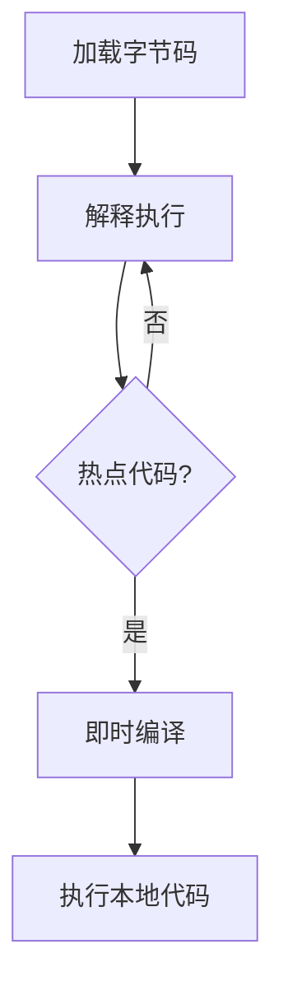

# 2. 字节码指令

# Java面试八股文：JVM执行子系统之字节码指令

## 1. 概述与定义 📚

字节码指令是Java虚拟机（JVM）执行子系统中的核心组成部分之一。Java源代码经过编译后生成的.class文件包含了字节码指令，这些指令是JVM执行程序的基本单位。字节码指令是一种中间代码，它介于高级语言和机器码之间，具有平台无关性，能够在任何支持JVM的平台上运行。

字节码指令集是JVM的设计核心之一，它定义了JVM能够执行的所有操作。每条字节码指令都有一个唯一的操作码（opcode），用于表示该指令的具体操作。字节码指令集的设计考虑了高效性、安全性和可移植性，使得Java程序能够在不同的硬件和操作系统上运行。

## 2. 主要特点 🌟

- **平台无关性**：字节码指令是平台无关的，可以在任何支持JVM的平台上运行。
- **紧凑性**：字节码指令集设计紧凑，指令长度通常为1字节，减少了.class文件的大小。
- **安全性**：字节码指令集经过精心设计，确保Java程序在运行时不会对系统造成危害。
- **高效性**：字节码指令集设计高效，能够快速执行常见的操作。

## 3. 应用目标 🎯

字节码指令的主要应用目标是实现Java程序的跨平台运行。通过将Java源代码编译为字节码指令，JVM可以在不同的硬件和操作系统上执行相同的程序。此外，字节码指令还用于实现Java语言的各种特性，如异常处理、多线程、反射等。

## 4. 主要内容及其组成部分 🧩

字节码指令集包含了多种类型的指令，主要包括以下几类：

### 4.1 加载和存储指令

加载和存储指令用于将数据从局部变量表加载到操作数栈，或者将数据从操作数栈存储到局部变量表。常见的指令包括：

- `iload`：将int类型的局部变量加载到操作数栈。
- `istore`：将int类型的值从操作数栈存储到局部变量表。
- `aload`：将引用类型的局部变量加载到操作数栈。
- `astore`：将引用类型的值从操作数栈存储到局部变量表。

```java 
public void example() {
    int a = 10;  // iload_0
    int b = a;   // istore_1
}
```


### 4.2 算术指令

算术指令用于执行基本的算术操作，如加法、减法、乘法、除法等。常见的指令包括：

- `iadd`：将两个int类型的值相加。
- `isub`：将两个int类型的值相减。
- `imul`：将两个int类型的值相乘。
- `idiv`：将两个int类型的值相除。

```java 
public void example() {
    int a = 10;
    int b = 20;
    int c = a + b;  // iadd
}
```


### 4.3 类型转换指令

类型转换指令用于将一种类型的值转换为另一种类型。常见的指令包括：

- `i2l`：将int类型的值转换为long类型。
- `i2f`：将int类型的值转换为float类型。
- `l2i`：将long类型的值转换为int类型。

```java 
public void example() {
    int a = 10;
    long b = a;  // i2l
}
```


### 4.4 对象创建与操作指令

对象创建与操作指令用于创建对象、访问对象的字段和方法。常见的指令包括：

- `new`：创建一个新的对象。
- `getfield`：获取对象的字段值。
- `putfield`：设置对象的字段值。
- `invokevirtual`：调用对象的实例方法。

```java 
public void example() {
    Object obj = new Object();  // new
    obj.toString();             // invokevirtual
}
```


### 4.5 控制转移指令

控制转移指令用于改变程序的执行流程，如条件分支、循环、方法调用等。常见的指令包括：

- `ifeq`：如果栈顶的int值为0，则跳转到指定的位置。
- `goto`：无条件跳转到指定的位置。
- `jsr`：跳转到子程序。

```java 
public void example() {
    int a = 10;
    if (a == 10) {  // ifeq
        System.out.println("a is 10");
    }
}
```


### 4.6 方法调用与返回指令

方法调用与返回指令用于调用方法和从方法返回。常见的指令包括：

- `invokestatic`：调用静态方法。
- `invokevirtual`：调用实例方法。
- `return`：从方法返回。

```java 
public void example() {
    System.out.println("Hello, World!");  // invokestatic
}
```


### 4.7 异常处理指令

异常处理指令用于处理程序中的异常情况。常见的指令包括：

- `athrow`：抛出异常。
- `jsr_w`：跳转到异常处理程序。

```java 
public void example() {
    try {
        throw new Exception();  // athrow
    } catch (Exception e) {
        e.printStackTrace();
    }
}
```


### 4.8 同步指令

同步指令用于实现多线程同步。常见的指令包括：

- `monitorenter`：进入同步块。
- `monitorexit`：退出同步块。

```java 
public void example() {
    synchronized (this) {  // monitorenter
        System.out.println("Synchronized block");
    }  // monitorexit
}
```


## 5. 原理剖析 🔍

字节码指令的执行过程可以分为以下几个步骤：

1. **加载字节码**：JVM加载.class文件，并将其中的字节码指令加载到内存中。
2. **解释执行**：JVM的解释器逐条解释执行字节码指令。每条指令都有一个对应的操作码，解释器根据操作码执行相应的操作。
3. **即时编译**：为了提高执行效率，JVM会将热点代码（频繁执行的代码）编译为本地机器码，这个过程称为即时编译（JIT）。
4. **执行本地代码**：编译后的本地机器码直接由CPU执行，大大提高了程序的执行速度。




## 6. 应用与拓展 🚀

字节码指令不仅用于执行Java程序，还可以用于实现其他功能，如动态代理、字节码增强等。通过操作字节码，开发者可以在运行时修改类的行为，实现AOP（面向切面编程）等功能。

### 6.1 动态代理

动态代理是一种在运行时生成代理类的技术。通过操作字节码，可以在运行时生成一个新的类，该类实现了指定的接口，并将方法调用转发给指定的处理器。

```java 
public class DynamicProxyExample {
    public static void main(String[] args) {
        InvocationHandler handler = new MyInvocationHandler();
        MyInterface proxy = (MyInterface) Proxy.newProxyInstance(
            MyInterface.class.getClassLoader(),
            new Class[] { MyInterface.class },
            handler
        );
        proxy.doSomething();
    }
}
```


### 6.2 字节码增强

字节码增强是指在编译期或运行期修改字节码，以实现某些特定的功能。常见的字节码增强工具包括ASM、ByteBuddy等。

```java 
public class BytecodeEnhancementExample {
    public static void main(String[] args) {
        ClassReader cr = new ClassReader("MyClass");
        ClassWriter cw = new ClassWriter(cr, ClassWriter.COMPUTE_FRAMES);
        ClassVisitor cv = new MyClassVisitor(cw);
        cr.accept(cv, 0);
        byte[] enhancedClass = cw.toByteArray();
    }
}
```


## 7. 面试问答 💼

### 7.1 什么是字节码指令？

字节码指令是JVM执行的基本单位，它是Java源代码编译后生成的中间代码。字节码指令具有平台无关性，可以在任何支持JVM的平台上运行。

### 7.2 字节码指令有哪些主要类型？

字节码指令主要包括加载和存储指令、算术指令、类型转换指令、对象创建与操作指令、控制转移指令、方法调用与返回指令、异常处理指令和同步指令。

### 7.3 字节码指令是如何执行的？

字节码指令的执行过程包括加载字节码、解释执行、即时编译和执行本地代码。JVM的解释器逐条解释执行字节码指令，热点代码会被即时编译为本地机器码，由CPU直接执行。

### 7.4 字节码指令的应用场景有哪些？

字节码指令不仅用于执行Java程序，还可以用于实现动态代理、字节码增强等功能。通过操作字节码，开发者可以在运行时修改类的行为，实现AOP等功能。

### 7.5 如何查看一个类的字节码？

可以使用`javap`命令查看一个类的字节码。例如，`javap -c MyClass`可以查看`MyClass`类的字节码指令。

```bash 
javap -c MyClass
```


### 7.6 字节码指令与机器码有什么区别？

字节码指令是平台无关的中间代码，而机器码是特定平台的二进制代码。字节码指令由JVM解释执行或即时编译为机器码执行，而机器码直接由CPU执行。

### 7.7 字节码指令如何保证安全性？

字节码指令集经过精心设计，确保Java程序在运行时不会对系统造成危害。JVM在执行字节码指令时会进行各种安全检查，如类型检查、访问控制等。

### 7.8 字节码指令的执行效率如何？

字节码指令的执行效率较高，尤其是在经过即时编译后，热点代码会被编译为本地机器码，直接由CPU执行，大大提高了程序的执行速度。

***

通过以上内容，我们详细剖析了JVM执行子系统中的字节码指令，涵盖了其定义、特点、应用目标、主要内容、原理剖析、应用与拓展以及面试问答。希望这篇文章能够帮助你在Java面试中游刃有余，顺利通过技术考核！🚀
