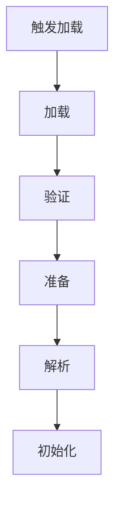

# 1. 加载时机与过程

### Java面试八股文：类加载时机与过程详解

#### 1. 概述与定义

在Java开发中，JVM（Java虚拟机）是运行Java程序的核心，而执行子系统负责将字节码转化为机器指令执行。类加载机制是执行子系统的关键环节，通过类加载器（ClassLoader）将编译后的Class文件加载到内存中，完成类的初始化并使其可供程序使用。类加载时机与过程具体指的是JVM在何时触发类加载，以及加载过程中的具体步骤。

类加载机制的核心在于动态性和按需加载，即JVM并非一次性加载所有类，而是在程序运行时根据需要加载特定类。整个过程包括加载（Loading）、链接（Linking）和初始化（Initialization）三大阶段，每个阶段又细分为多个步骤。理解类加载的时机与过程，不仅能帮助我们优化程序启动和运行，还能在面试中展现对JVM深层机制的掌握。接下来，我们将从特点、目标、内容、原理到应用场景，全面剖析这一知识点。

***

#### 2. 主要特点

类加载时机与过程的核心特点可以用以下几点概括：

- **按需加载** ⏳：只有在类被使用时才加载，节省资源。
- **动态性** 🚀：运行时加载，支持动态扩展。
- **层次性** 🌳：由类加载器的双亲委派机制保证加载顺序。
- **安全性** 🔒：加载过程包含验证，确保字节码合法。
- **一次性** 🎯：类只加载一次，重复使用运行时数据。

与其他语言（如C++的静态链接）相比，Java类加载的动态性和层次性是其独特优势。这些特点使其在灵活性和安全性上表现突出。

***

#### 3. 应用目标

类加载机制的设计目标明确，主要包括：

- **按需提供类**：在程序需要时加载类，优化内存使用。
- **支持动态扩展**：如加载JAR包或网络资源。
- **确保一致性**：通过命名空间隔离，避免类冲突。
- **保证安全性**：验证字节码，防止恶意代码执行。

例如，一个Web应用通过类加载机制动态加载插件模块，只有在用户访问特定功能时才加载相关类，提升启动速度和资源效率。

***

#### 4. 主要内容及其组成部分

类加载的时机与过程涉及多个核心部分，以下逐一详解：

##### 4.1 类加载时机

JVM规范明确了类加载的触发时机，主要包括：

- **new创建对象**：如`new Demo()`。
- **访问静态成员**：如`Demo.staticField`或`Demo.staticMethod()`。
- **反射调用**：如`Class.forName("Demo")`。
- **子类初始化**：初始化子类时，先加载父类。
- **主类启动**：JVM启动时加载`main`方法所在类。

##### 4.2 加载（Loading）

将Class文件读入内存，生成`Class`对象。主要步骤：

- 获取字节码：从文件、JAR或网络读取。
- 创建Class对象：存入方法区。
- 设置加载器：记录加载该类的ClassLoader。

##### 4.3 链接（Linking）

将加载的类与JVM运行时环境连接，包括：

- **验证（Verification）**：检查字节码合法性，如魔数、栈平衡。
- **准备（Preparation）**：为静态变量分配内存，赋默认值（如int为0）。
- **解析（Resolution）**：将符号引用转为直接引用，如解析常量池中的类名。

##### 4.4 初始化（Initialization）

执行类的初始化代码，主要包括：

- **静态变量赋值**：执行`static`块和静态变量的初始值。
- **执行\<clinit>方法**：编译器生成的类构造器，包含静态初始化逻辑。

##### 4.5 其他机制

- **双亲委派**：加载时优先委托父加载器。
- **卸载**：类被GC回收时卸载（较少见）。

下表总结类加载过程：

| **阶段**​ | **主要任务**​       | **特点**​ |
| ------- | --------------- | ------- |
| 加载      | 读取字节码，生成Class对象 | 输入二进制数据 |
| 验证      | 检查字节码合法性        | 确保安全性   |
| 准备      | 分配静态变量内存，赋默认值   | 默认初始化   |
| 解析      | 符号引用转为直接引用      | 链接运行时数据 |
| 初始化     | 执行静态初始化代码       | 完成类准备   |

***

#### 5. 原理剖析

##### 5.1 类加载时机触发

JVM通过运行时需求触发加载。例如：

```java 
public class Demo {
    static int x = 10;
    static { System.out.println("Demo loaded"); }
}
public class Main {
    public static void main(String[] args) {
        System.out.println(Demo.x); // 触发加载
    }
}
```


访问`Demo.x`时，JVM检测到`Demo`未加载，触发类加载。

##### 5.2 加载过程

加载由类加载器完成。例如：

```java 
ClassLoader loader = Demo.class.getClassLoader();
Class<?> clazz = loader.loadClass("Demo");
```


JVM从文件系统读取`Demo.class`，生成`Class`对象，存入方法区。

##### 5.3 链接过程

- **验证**：检查魔数`0xCAFEBABE`，确保栈深度合法。
- **准备**：为`static int x`分配4字节，赋值为0。
- **解析**：将常量池中的`Demo`符号引用解析为内存地址。

##### 5.4 初始化过程

执行`<clinit>`方法。例如：

```java 
class Demo {
    static int x = 10;
    static { x = 20; }
}
```


`<clinit>`包含：

1. `x = 10`。
2. `x = 20`。

最终`x`为20。

Mermaid图展示类加载流程：




##### 5.5 双亲委派机制

加载时，先委托父加载器。例如：

- **Bootstrap ClassLoader**：加载`java.lang.*`。
- **Extension ClassLoader**：加载扩展库。
- **Application ClassLoader**：加载应用类。

若父加载器无法加载，才由子加载器尝试。

***

#### 6. 应用与拓展

##### 6.1 应用场景

- **动态加载**：如Spring通过类加载加载Bean。
- **插件系统**：如OSGi动态加载模块。
- **热部署**：修改类后重新加载。

##### 6.2 工具与参数

- `Class.forName()`：手动触发加载。
- `-verbose:class`：打印加载日志。例如：

```bash 
java -verbose:class Main
```


##### 6.3 拓展

- **与执行子系统协作**：加载后交给解释器或JIT执行。
- **与C++对比**：C++静态链接，无动态加载。

***

#### 7. 面试问答

##### 7.1 类加载的时机有哪些？

面试官你好，类加载时机是JVM按需加载的关键！主要有五种情况：一是用`new`创建对象，比如`new Demo()`；二是访问静态成员，像`Demo.x`或`Demo.staticMethod()`；三是反射调用，比如`Class.forName("Demo")`；四是初始化子类时，先加载父类；五是JVM启动时，加载`main`方法所在类。这些时机都是程序主动使用类时触发，挺好记的！

##### 7.2 类加载过程包括哪些步骤？

类加载过程我很熟！分三大阶段：首先是加载，JVM通过类加载器把Class文件读进内存，生成`Class`对象；然后是链接，细分为验证、准备、解析，验证检查字节码安全，准备给静态变量分配内存赋默认值，解析把符号引用转直接引用；最后是初始化，执行静态块和静态变量赋值，跑`<clinit>`方法。整个过程从二进制到可用类，环环相扣！

##### 7.3 双亲委派机制是什么？有什么用？

双亲委派是类加载的核心机制！简单说，加载类时，先委托父加载器干活，比如Bootstrap加载核心库，Extension加载扩展类，Application加载应用类，父加载器搞不定才自己上。好处有两个：一是避免重复加载，同一个类只加载一次；二是保证安全性，像`java.lang.String`只能由Bootstrap加载，防止自定义类冒充。我项目里自定义过ClassLoader，深刻体会到这点！

##### 7.4 静态变量初始化什么时候发生？

这个问题有意思！静态变量初始化发生在类加载的初始化阶段。具体是，链接的准备阶段先给静态变量分配内存，赋默认值，比如int是0；到了初始化阶段，执行`<clinit>`方法，把代码里的初始值赋上。比如`static int x = 10`，准备时x是0，初始化时变成10。如果有静态块，还会按顺序执行。我调试时用过这个规律找问题！

##### 7.5 如果类加载失败会怎样，怎么排查？

类加载失败挺常见！我遇到过，可能是文件找不到、格式错或者权限问题。失败时会抛异常，像`ClassNotFoundException`或`NoClassDefFoundError`。排查的话，先看异常栈，定位类名；然后用`-verbose:class`打印加载日志，看哪个加载器出错；再检查classpath，确保Class文件在路径里。我还用过`javap -v`验文件格式，实战经验告诉我，日志是关键！

***

### 总结

类加载时机与过程作为JVM执行子系统的核心，以其动态性和安全性在面试中备受关注。通过本文的详解，从定义到原理，再到面试问答，我们全面剖析了其内容。熟练掌握这些知识，不仅能应对面试，还能在动态加载和调试中得心应手。希望这篇八股文助你在面试中大放异彩！🎉
