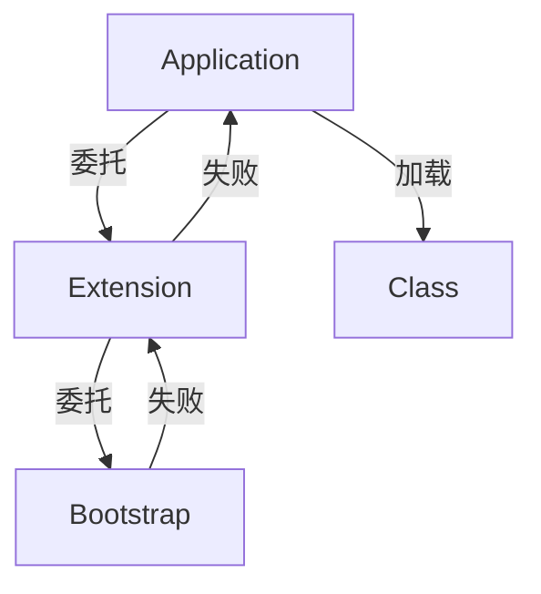

# 2. 类加载器

### Java面试八股文：类加载器详解

#### 1. 概述与定义

在Java开发中，JVM（Java虚拟机）是运行Java程序的核心，而执行子系统负责将字节码转化为机器指令执行。类加载机制是执行子系统的关键环节，而类加载器（ClassLoader）则是类加载机制的核心组件。类加载器是一个特殊的Java类，负责将Class文件从文件系统、网络或其他来源加载到JVM内存中，生成`Class`对象供程序使用。

类加载器的本质是一个抽象类`java.lang.ClassLoader`，JVM通过其实现类完成类的动态加载。Java提供了多层次的类加载器体系，包括启动类加载器（Bootstrap ClassLoader）、扩展类加载器（Extension ClassLoader）和应用程序类加载器（Application ClassLoader），并支持自定义加载器。理解类加载器的工作原理，不仅能帮助我们实现动态扩展和热部署，还能在面试中展现对JVM深层机制的掌握。接下来，我们将从特点、目标、内容、原理到应用场景，全面剖析这一知识点。

***

#### 2. 主要特点

类加载器的核心特点可以用以下几点概括：

- **层次性** 🌳：采用树状结构，遵循双亲委派机制。
- **动态性** 🚀：运行时加载类，支持灵活扩展。
- **隔离性** 🗂️：通过命名空间区分不同加载器加载的类。
- **安全性** 🔒：内置加载优先级，防止核心类被篡改。
- **可扩展性** 🌟：支持自定义加载器，适应复杂需求。

与其他语言的加载机制（如C的静态链接）相比，Java类加载器的动态性和隔离性是其独特优势。这些特点使其在模块化和安全性上表现突出。

***

#### 3. 应用目标

类加载器的设计目标明确，主要包括：

- **动态加载类**：按需将Class文件加载到内存。
- **支持模块化**：隔离不同来源的类，避免冲突。
- **确保安全性**：优先加载核心类库，防止恶意覆盖。
- **提供扩展性**：允许开发者自定义加载逻辑。

例如，一个插件系统需要动态加载用户上传的JAR包，类加载器可以隔离插件类与主程序类，确保互不干扰，同时支持热插拔。

***

#### 4. 主要内容及其组成部分

类加载器体系由多个核心部分组成，以下逐一详解：

##### 4.1 启动类加载器（Bootstrap ClassLoader）

- **作用**：加载JVM核心类库，如`java.lang.*`、`java.util.*`。
- **实现**：由C++实现，非Java类，无父加载器。
- **路径**：`<JAVA_HOME>/lib`下的JAR包（如`rt.jar`）。

##### 4.2 扩展类加载器（Extension ClassLoader）

- **作用**：加载JVM扩展类库。
- **实现**：Java类`sun.misc.Launcher$ExtClassLoader`。
- **路径**：`<JAVA_HOME>/lib/ext`下的JAR包。
- **父加载器**：Bootstrap ClassLoader。

##### 4.3 应用程序类加载器（Application ClassLoader）

- **作用**：加载应用程序的类路径（classpath）下的类。
- **实现**：Java类`sun.misc.Launcher$AppClassLoader`。
- **路径**：由`-cp`或环境变量`CLASSPATH`指定。
- **父加载器**：Extension ClassLoader。

##### 4.4 自定义类加载器

- **作用**：加载特定来源的类，如文件、网络、加密Class。
- **实现**：继承`ClassLoader`，重写`loadClass`或`findClass`。
- **父加载器**：通常是Application ClassLoader。

##### 4.5 双亲委派机制

加载类时，先委托父加载器加载，父加载器失败后再尝试自己加载。

##### 4.6 其他机制

- **命名空间**：由加载器和类全限定名共同决定。
- **缓存机制**：已加载的类缓存到`ClassLoader`中，避免重复加载。

下表总结类加载器体系：

| **类型**​     | **加载路径**​                 | **实现语言**​ | **父加载器**​       |
| ----------- | ------------------------- | --------- | --------------- |
| Bootstrap   | \`\<JAVA\_HOME>/lib\`     | C++       | 无               |
| Extension   | \`\<JAVA\_HOME>/lib/ext\` | Java      | Bootstrap       |
| Application | classpath                 | Java      | Extension       |
| 自定义         | 自定义路径                     | Java      | Application（默认） |

***

#### 5. 原理剖析

##### 5.1 双亲委派机制

双亲委派是类加载器的核心规则，流程如下：

1. 检查缓存：查看类是否已加载。
2. 委托父加载器：调用父加载器的`loadClass`。
3. 自行加载：父加载器失败后，调用`findClass`加载。

例如：

```java 
public class MyClassLoader extends ClassLoader {
    @Override
    protected Class<?> findClass(String name) throws ClassNotFoundException {
        byte[] bytes = loadClassData(name); // 自定义加载逻辑
        return defineClass(name, bytes, 0, bytes.length);
    }
}
```


加载`java.lang.String`时，最终由Bootstrap加载。

##### 5.2 命名空间隔离

每个类加载器有独立命名空间，类全限定名+加载器实例决定唯一性。例如：

```java 
ClassLoader cl1 = new MyClassLoader();
ClassLoader cl2 = new MyClassLoader();
Class<?> c1 = cl1.loadClass("Demo");
Class<?> c2 = cl2.loadClass("Demo");
System.out.println(c1 == c2); // false
```


`c1`和`c2`由不同加载器加载，属于不同命名空间。

##### 5.3 类加载过程

以`loadClass`为例：

```java 
protected Class<?> loadClass(String name, boolean resolve) throws ClassNotFoundException {
    Class<?> c = findLoadedClass(name); // 检查缓存
    if (c == null) {
        try {
            if (parent != null) {
                c = parent.loadClass(name, false); // 委托父加载器
            }
        } catch (ClassNotFoundException e) {
            c = findClass(name); // 自己加载
        }
    }
    if (resolve) {
        resolveClass(c); // 链接类
    }
    return c;
}
```


##### 5.4 加载来源

- **Bootstrap**：读取`rt.jar`。
- **Extension**：扫描`lib/ext`。
- **Application**：读取classpath。
- **自定义**：如从网络下载字节码。

Mermaid图展示双亲委派：




##### 5.5 安全性保障

Bootstrap优先加载核心类，防止自定义类覆盖。例如，自定义`java.lang.String`会被忽略。

***

#### 6. 应用与拓展

##### 6.1 应用场景

- **插件系统**：如Eclipse使用自定义加载器加载插件。
- **热部署**：如Tomcat为每个Web应用分配独立加载器。
- **动态代理**：加载运行时生成的字节码。

##### 6.2 参数与工具

- `-Xbootclasspath`：修改Bootstrap路径。
- `-verbose:class`：打印加载日志。例如：

```bash 
java -verbose:class Main
```


##### 6.3 拓展

- **与类加载过程协作**：加载后进入链接和初始化。
- **与OSGi对比**：OSGi支持更复杂的模块加载。

***

#### 7. 面试问答

##### 7.1 类加载器有哪些类型？

面试官你好，类加载器分几大类！首先是启动类加载器，用C++写的，加载`<JAVA_HOME>/lib`里的核心类，像`java.lang.Object`；然后是扩展类加载器，Java实现的，加载`lib/ext`里的扩展库，父加载器是Bootstrap；再是应用程序类加载器，也叫系统类加载器，加载classpath里的类，父加载器是Extension；最后是自定义加载器，继承`ClassLoader`，可以加载任何地方的类，默认父加载器是Application。这体系挺层次分明的！

##### 7.2 双亲委派机制是什么？有什么好处？

双亲委派是类加载的灵魂！简单说，加载类时，先丢给父加载器干活，比如Application委托Extension，Extension委托Bootstrap，父加载器搞不定才自己上。好处有俩：一是避免重复加载，同一个类全局唯一；二是安全，核心类像`String`只能由Bootstrap加载，防止我写个假的`String`捣乱。我在项目里打破过双亲委派，体会到它的重要性！

##### 7.3 怎么实现自定义类加载器？

这个问题有实战性！我要说，自定义类加载器得继承`ClassLoader`，重写`findClass`方法。流程是：先用`loadClassData`读字节码，比如从文件或网络；然后调用`defineClass`把字节码转成`Class`对象。比如我写个加载器从`d:/classes`读类，代码大概这样：

```java 
byte[] bytes = Files.readAllBytes(Paths.get("d:/classes/Demo.class"));
Class<?> clazz = defineClass("Demo", bytes, 0, bytes.length);
```


加载时还得考虑父加载器，挺有意思的！

##### 7.4 类加载器的命名空间是怎么回事？

命名空间是隔离的关键！每个类加载器有独立空间，类全限定名加加载器实例决定类的唯一性。比如我用两个自定义加载器加载`Demo`，即使类名一样，JVM也认为是不同类，`instanceof`都不通过。这能隔离插件和主程序，Tomcat就靠这招给每个Web应用分加载器。我试过打印加载器，验证过这点！

##### 7.5 如果类加载失败怎么办？

类加载失败我遇到过！可能是文件找不到、路径错或者权限问题，会抛`ClassNotFoundException`或`NoClassDefFoundError`。排查方法：先看异常栈，找类名；然后加`-verbose:class`看加载日志，定位哪个加载器出问题；再检查classpath或自定义路径，确保文件在。必要时用`javap -v`验Class文件。我修过一个JAR包加载失败的bug，靠日志搞定的！

***

### 总结

类加载器作为JVM类加载机制的核心，以其层次性、动态性和安全性在面试中备受关注。通过本文的详解，从定义到原理，再到面试问答，我们全面剖析了其内容。熟练掌握这些知识，不仅能应对面试，还能在插件开发和热部署中游刃有余。希望这篇八股文助你在面试中脱颖而出！🎉
