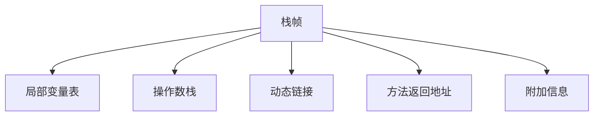

# 1. 运行时栈帧结构

# Java面试八股文：运行时栈帧结构详解

***

## 1. 概述与定义

在Java开发中，JVM（Java虚拟机）是运行Java程序的基石，而执行子系统负责将字节码转化为机器指令。字节码执行引擎是执行子系统的核心，负责解析和执行字节码指令。运行时栈帧结构是字节码执行引擎在执行方法时的关键数据结构，用于管理方法的调用和执行状态。简单来说，每当JVM执行一个方法时，会在Java虚拟机栈中为该方法分配一个栈帧，栈帧就像方法的“工作区”，记录了方法的运行时数据，包括局部变量、操作数栈、动态链接和返回地址等。

栈帧的生命周期与方法调用紧密相关：方法调用时创建栈帧，方法返回时销毁栈帧。理解栈帧结构不仅能帮助我们深入掌握JVM的执行机制，还能在调试、性能优化和面试中展现专业能力。例如，面试官常问“栈帧包含哪些部分？”或“栈帧如何管理方法调用？”等问题，掌握这些知识点能让你脱颖而出。下面，我们将从特点到应用，逐步展开栈帧的完整图景。

***

## 2. 主要特点

运行时栈帧结构有以下几个核心特点，简洁却直击要点：

- **方法级隔离** 🗂️：每个方法调用对应一个栈帧，互不干扰，保证数据安全。
- **动态分配** 🚀：方法调用时创建栈帧，返回时销毁，动态管理内存。
- **结构化设计** 📋：包含局部变量表、操作数栈、动态链接等部分，层次分明。
- **高效访问** 💻：局部变量和操作数栈支持快速读写，提升执行效率。
- **平台无关** 🌍：与字节码指令集配合，确保跨平台运行。

与其他语言的调用栈相比，比如C语言的栈帧，Java栈帧的结构化设计和平台无关性是其独特优势。C栈帧通常只包含返回地址和局部变量，而Java栈帧多了操作数栈和动态链接，功能更强大。这些特点让栈帧在方法调用和执行中既高效又安全，是JVM的精妙设计之一。

***

## 3. 应用目标

栈帧的设计目标明确，直接服务于JVM的执行需求，主要包括：

- **管理方法执行**：为方法运行提供必要的数据空间。
- **支持方法调用**：记录调用关系和返回地址，确保调用链正确。
- **优化性能**：通过局部变量表和操作数栈加速数据访问。
- **支持异常处理**：记录异常表和返回点，处理异常跳转。

举个例子，在递归调用中，JVM通过栈帧管理每一层调用的状态，确保数据隔离和正确返回。如果栈帧设计不当，递归过深可能导致栈溢出（StackOverflowError），这也是面试中常考的点。

***

## 4. 主要内容及其组成部分

运行时栈帧结构由多个核心部分组成，每部分都有明确作用。以下逐一详解，带你深入理解：

### 4.1 局部变量表（Local Variable Table）

- **作用**：存储方法的参数和局部变量。
- **结构**：按槽（Slot）组织，每个槽占32位，可存int、float等类型；64位数据（如long、double）占两个槽。
- **访问**：通过索引快速访问，例如字节码指令`iload_0`加载第0个槽的int值。

**示例**：

```java 
public int add(int a, int b) {
    int c = a + b;
    return c;
}
```


局部变量表分配：

- 槽0：`this`（实例方法，静态方法无此槽）。
- 槽1：`a`。
- 槽2：`b`。
- 槽3：`c`。

### 4.2 操作数栈（Operand Stack）

- **作用**：临时存储计算数据，用于算术运算、方法调用等。
- **结构**：后进先出（LIFO）栈，栈顶元素参与计算。
- **操作**：如`iadd`指令，从栈顶弹出两个int值相加，结果压回栈顶。

**示例**：上述`add`方法中，计算`a + b`时：

- 压入`a`和`b`到操作数栈。
- 执行`iadd`，弹出`a`和`b`，结果压栈。

### 4.3 动态链接（Dynamic Linking）

- **作用**：指向运行时常量池，解析符号引用为直接引用。
- **示例**：调用`obj.toString()`时，字节码为：
  ```java 
  invokevirtual #2 // Method java/lang/Object.toString:()Ljava/lang/String;
  ```

  动态链接通过#2索引解析具体方法地址。

### 4.4 方法返回地址（Return Address）

- **作用**：记录方法返回时的程序计数器（PC）值。
- **类型**：
  - 正常返回：执行`return`指令。
  - 异常返回：抛出异常，跳转到异常处理逻辑。

### 4.5 附加信息

- **异常表**：记录try-catch块的范围和跳转点。
- **行号表**：映射字节码到源代码行号，用于调试。
- **其他**：如栈映射表（Stack Map Table），支持JVM验证字节码。

**表格总结**：

| **组成部分**​ | **功能**​   | **特点**​    |
| --------- | --------- | ---------- |
| 局部变量表     | 存储参数和局部变量 | 按槽组织，快速访问  |
| 操作数栈      | 临时存储计算数据  | LIFO栈，参与计算 |
| 动态链接      | 解析符号引用    | 指向常量池      |
| 方法返回地址    | 记录返回点     | 支持方法返回     |
| 附加信息      | 异常表、行号表等  | 支持调试和异常处理  |

**表格说明**：此表清晰列出栈帧的五个部分，功能和特点一目了然，面试背诵时可直接引用。

***

## 5. 原理剖析

栈帧的运行原理是JVM执行方法的核心，下面深入解析其生命周期和各部分的运作机制。

### 5.1 栈帧创建与销毁

- **创建**：方法调用时，JVM在Java虚拟机栈顶为该方法分配栈帧，初始化局部变量表、操作数栈等。
- **销毁**：方法返回时，栈帧弹出，恢复调用者的栈帧状态。

**示例**：

```java 
public void foo() {
    bar(); // 调用bar
}
public void bar() {
    System.out.println("Hello");
}
```


- 调用`bar`时，`bar`的栈帧压入栈顶，`foo`的栈帧暂停。
- `bar`返回后，其栈帧弹出，`foo`继续执行。

### 5.2 局部变量表使用

局部变量表按方法签名分配槽位。以`add`方法为例，字节码如下：

```java 
0: iload_1     // 加载a
1: iload_2     // 加载b
2: iadd        // 相加
3: istore_3    // 存到c
4: iload_3     // 加载c
5: ireturn     // 返回
```


- `iload_1`从槽1加载`a`，`iload_2`加载`b`。
- 计算结果存入槽3（`istore_3`），最后返回。

### 5.3 操作数栈操作

操作数栈是计算的“临时工”。以上述`iadd`为例：

- 初始栈：空。
- 压入`a`（栈顶）、`b`（次顶）。
- 执行`iadd`，弹出`a`和`b`，结果压栈。

### 5.4 动态链接解析

动态链接在运行时解析符号引用。例如：

```java 
invokevirtual #2 // Method java/lang/Object.toString:()Ljava/lang/String;
```


- \#2指向常量池中的方法引用。
- JVM通过动态链接找到`toString`的实际地址，完成调用。

### 5.5 方法返回

- **正常返回**：执行`ireturn`（返回int）等指令，恢复调用者的程序计数器。
- **异常返回**：抛出异常，查找异常表，跳转到catch块。

**Mermaid图展示栈帧结构**：




**图表说明**：此图直观展示栈帧的层次结构，面试时可用纸笔画出，清晰表达。

***

## 6. 应用与拓展

### 6.1 应用场景

- **方法调用**：管理参数传递和局部变量。
- **异常处理**：通过异常表定位catch块。
- **调试**：行号表映射字节码到源代码，定位问题。

### 6.2 工具支持

- **javap**：查看字节码和栈帧信息：
  ```bash 
  javap -v Demo.class
  ```

- **JVisualVM**：监控线程栈帧，分析性能。

### 6.3 拓展

- **与执行引擎协作**：栈帧为解释器和JIT编译器提供执行环境。
- **与C栈帧对比**：C栈帧无操作数栈和动态链接，结构更简单，但功能有限。

***

## 7. 面试问答

### 7.1 运行时栈帧结构包括哪些部分？

面试官你好！栈帧是JVM执行方法的基础，主要包含五部分：首先是局部变量表，存方法参数和局部变量，按槽组织；然后是操作数栈，LIFO结构，临时存计算数据；再是动态链接，指向常量池，解析符号引用；还有方法返回地址，记录返回点；最后是附加信息，比如异常表、行号表。这些部分各司其职，挺好记的！

### 7.2 局部变量表和操作数栈有什么区别？

这个问题我很熟！局部变量表存方法的参数和局部变量，比如`int a = 1`，a就在表里，访问快且持久。操作数栈是临时的，存计算数据，比如`a + b`，先压入a、b，执行`iadd`相加，结果压栈后弹出。调试字节码时，我经常分析这两者的区别，一个是“仓库”，一个是“工作台”！

### 7.3 动态链接在栈帧中起什么作用？

动态链接是解析的关键！它指向运行时常量池，把符号引用转为直接引用。比如调用`obj.toString()`，字节码是`invokevirtual #2`，#2是常量池索引，动态链接通过它找到方法地址。运行时解析很灵活，我在看字节码时常关注这部分！

### 7.4 栈帧是怎么创建和销毁的？

栈帧的生命周期和方法调用绑定！调用方法时，JVM在栈顶创建栈帧，分配局部变量表、操作数栈等；返回时，栈帧弹出，恢复调用者的状态。比如递归调用，每层有独立栈帧，互不干扰。我调栈溢出时，深刻体会到这点！

### 7.5 栈帧在调试中的作用是什么？

这个问题有实战性！栈帧在调试很关键，比如异常栈追踪，显示调用链，每级对应一个栈帧；行号表还能映射字节码到源码行，定位问题。我用JVisualVM看线程栈，分析死锁，全靠栈帧信息支持！

***

## 总结

运行时栈帧结构是JVM执行引擎的基石，以其结构化设计和高效性在面试中备受关注。通过本文的详解，从定义到原理，再到面试问答，我们全面剖析了栈帧的内容。掌握这些知识，不仅能应对面试，还能在调试和优化中得心应手。希望这篇八股文助你在面试中大放异彩！🎉
