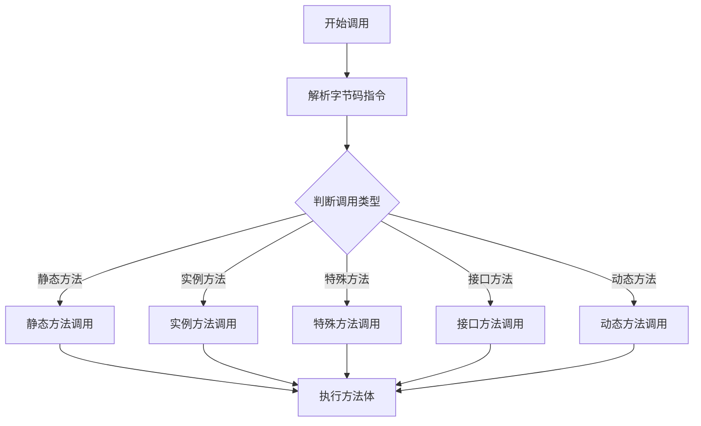
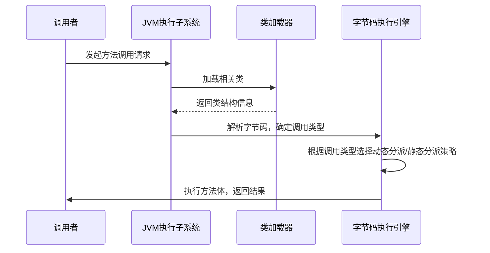

# 2. 方法调用

# Java面试八股之JVM执行子系统：字节码执行引擎及方法调用详解

***

## 一、概述与定义

Java面试八股文是Java面试中经常考察的一系列基础与进阶知识，涵盖了Java语言、JVM、并发、网络、数据库等多个模块。其中，JVM的相关内容尤为重要，因为它直接影响到Java程序的运行效率和稳定性。本文的重点是JVM内部的执行子系统，特别是字节码执行引擎及方法调用机制。

JVM（Java Virtual Machine，Java虚拟机）是Java程序运行的虚拟环境，其核心任务是将Java字节码转换为机器代码并执行。JVM的整体架构可以分为多个子系统，包括类加载器、运行时数据区、执行子系统等，而执行子系统又包括解释器、即时编译器（JIT）和垃圾回收器等。

其中，字节码执行引擎是JVM中负责解释和执行字节码的模块，而方法调用则是Java程序运行过程中最常见的操作之一，涉及静态、实例、接口及动态调用等多种形式。

***

## 二、主要特点

JVM执行子系统中的字节码执行引擎及方法调用机制具有以下主要特点：

1. **平台无关性** &#x20;

   JVM将Java代码编译成字节码，使得同一份代码可以在不同平台上运行，实现了“一次编译，到处运行”的理念。🌍
2. **高效的动态编译** &#x20;

   通过即时编译器（JIT），字节码在运行时可以被编译为本地机器码，从而提高程序执行效率。⚡
3. **灵活的调用机制** &#x20;

   支持多种方法调用类型，包括虚拟方法、静态方法、特殊方法、接口方法和动态方法调用，各种调用方式在运行时由JVM自动解析，保障了调用的正确性和高效性。
4. **自动内存管理与安全性** &#x20;

   JVM在执行过程中实现了自动垃圾回收和内存分配，极大地降低了内存泄漏与安全问题的风险。🔒

为直观呈现这些特点，下面是一个简要的表格对比说明：

| 特点     | 描述                         | 说明            |
| ------ | -------------------------- | ------------- |
| 平台无关性  | Java字节码与平台无关，通过JVM在不同平台上运行 | 实现“一次编译，到处运行” |
| 动态编译   | 即时编译器将热点代码编译为本地机器码         | 提升运行效率        |
| 多样调用机制 | 支持多种方法调用方式，按需采用不同调用策略      | 满足面向对象需求      |
| 自动内存管理 | 自动垃圾回收和内存分配                | 提高安全性与稳定性     |

***

## 三、应用目标

在面试及实际项目中，深入掌握JVM执行子系统及方法调用机制具有如下应用目标：

1. **优化程序性能** &#x20;

   通过理解JVM的动态编译、内存管理和方法调用机制，可以对程序进行针对性调优。例如，了解热点方法和内联优化，有助于减少调用开销，提升系统性能。
2. **排查故障与调试** &#x20;

   面对内存泄漏、性能瓶颈等问题时，具备对JVM内部原理的了解，可以更快定位问题源头并进行修复。💡
3. **面试自信与系统性知识储备** &#x20;

   面试官往往会关注应聘者对JVM内部机制的理解，通过掌握字节码执行引擎及方法调用的细节，可在面试中展示深厚的技术功底和系统性知识。
4. **指导系统设计与架构决策** &#x20;

   对JVM工作原理的了解，有助于在系统设计时做出合理的架构决策，特别是涉及高并发、高性能场景下的优化方案。

***

## 四、主要内容及其组成部分

本部分将对本知识点涉及的所有组成部分进行详尽解释，内容包括但不限于：

### 1. JVM

JVM作为Java程序的运行平台，主要由以下部分构成： &#x20;

- **类加载器子系统**：负责加载、验证、准备、解析及初始化类文件。 &#x20;
- **运行时数据区**：包括方法区、堆、虚拟机栈、本地方法栈和程序计数器。 &#x20;
- **执行子系统**：负责字节码的解释与执行。 &#x20;
- **本地接口**：与本地代码交互的桥梁。

**示例代码：** &#x20;

下面代码展示了简单的Java类加载过程的伪代码示例，帮助理解类加载器的基本概念：

```java 
public class ClassLoaderDemo {
    public static void main(String[] args) {
        ClassLoader loader = ClassLoaderDemo.class.getClassLoader();
        System.out.println("当前类加载器: " + loader);
    }
}
```


### 2. 执行子系统

执行子系统是JVM中实现代码执行的核心模块，其主要功能包括： &#x20;

- **解释器**：逐条解释执行字节码指令，适用于初次运行或不常执行的代码。 &#x20;
- **即时编译器（JIT）**：在运行时将热点代码编译为本地机器码，极大提高执行速度。 &#x20;
- **垃圾回收器**：负责自动管理内存，回收不再使用的对象。

### 3. 字节码执行引擎

字节码执行引擎是执行子系统的重要组成部分，其核心职责为： &#x20;

- **解析字节码**：将编译后的字节码转换为具体指令，并进行调度执行。 &#x20;
- **指令优化**：利用JIT技术对热点代码进行优化编译，例如内联、逃逸分析等。 &#x20;
- **跨平台适配**：借助JVM的抽象层实现不同操作系统与硬件之间的适配。

### 4. 方法调用

方法调用是Java程序运行过程中最频繁的操作之一，其主要类型包括：

- **静态方法调用（invokestatic）** &#x20;

  静态方法属于类级别，不需要实例化对象即可调用。适用于工具类和常量方法。
- **实例方法调用（invokevirtual）** &#x20;

  实例方法调用依赖于对象的动态绑定，主要用于面向对象多态特性。
- **特殊方法调用（invokespecial）** &#x20;

  主要用于构造函数、私有方法和父类方法的调用，具有特殊的调用规则。
- **接口方法调用（invokeinterface）** &#x20;

  接口方法调用涉及到接口的动态绑定，确保多实现类之间调用的一致性。
- **动态方法调用（invokedynamic）** &#x20;

  在Java 7之后引入，通过动态链接使得方法调用更加灵活，支持如Lambda表达式和方法句柄等特性。

下表详细对比了几种方法调用方式的特点：

| 调用方式            | 适用场景             | 特点说明                |
| --------------- | ---------------- | ------------------- |
| invokestatic    | 静态方法调用           | 无需对象实例，直接通过类名调用     |
| invokevirtual   | 普通实例方法调用         | 支持多态，运行时动态绑定        |
| invokespecial   | 构造方法、私有方法、父类方法调用 | 调用特殊方法，不走虚拟方法分派     |
| invokeinterface | 接口方法调用           | 适用于接口的动态绑定          |
| invokedynamic   | 动态方法调用（如Lambda）  | 提供更灵活的调用机制，减少反射调用开销 |

此外，通过Mermaid语法绘制方法调用流程图，可以直观展现不同调用方式的执行路径。如下图展示了方法调用在JVM中的简化流程：




图中展示了从方法调用开始，到字节码解析，判断调用类型，再到实际执行方法体的完整流程。每种调用类型对应不同的执行路径，确保Java程序的灵活性与高效性。😊

***

## 五、原理剖析

在这一部分，我们将深入解析字节码执行引擎及方法调用的工作原理，帮助面试者更好地理解Java虚拟机内部的运行机制。

### 1. 字节码加载与解析

- **类加载器工作原理** &#x20;

  JVM中的类加载器负责将.class文件加载到内存中，并对其进行验证、准备、解析和初始化。加载过程遵循双亲委派模型，确保Java核心类库的安全性和一致性。 &#x20;

  在解析过程中，字节码执行引擎将字节码指令转换为内部数据结构，并对每条指令进行缓存优化处理。
- **字节码指令集** &#x20;

  Java字节码是一组低级指令，包括数据操作、控制流、方法调用、对象创建等。每个指令都有固定的格式和操作码，JVM通过解释器逐条执行。 &#x20;

  例如，下面展示一段简单的字节码伪代码说明方法调用指令的基本格式：
  ```java 
  // 假设有如下简单的方法调用字节码流程：
  aload_0        // 加载this引用
  invokevirtual  // 调用实例方法
  return         // 返回
  ```


### 2. 方法调用的详细原理

- **静态分派与动态分派** &#x20;

  在Java中，静态方法调用（invokestatic）在编译期就可以确定调用目标，而实例方法调用（invokevirtual）则采用动态分派机制。动态分派的实现基于方法表（vtable），当程序运行时，根据实际对象类型选择正确的重写方法。 &#x20;

  动态调用过程大致可分为如下步骤： &#x20;

  a. 在字节码中识别调用指令 &#x20;

  b. 根据对象引用确定实际类型 &#x20;

  c. 通过方法表查找对应方法实现 &#x20;

  d. 执行方法体代码
- **内联缓存和内联扩展** &#x20;

  为了提高动态分派的效率，JIT编译器引入了内联缓存（Inline Cache），即在第一次调用时缓存方法地址，后续调用直接使用缓存结果；同时，对热点方法进行内联扩展，将方法体直接嵌入调用处，减少函数调用开销。
- **动态方法调用（invokedynamic）的机制** &#x20;

  invokedynamic指令为语言设计者提供了一种更灵活的调用方式，其运行过程通常涉及一个引导方法（bootstrap method），用于在运行时确定实际调用目标。 &#x20;

  例如，在使用Lambda表达式时，JVM会通过invokedynamic来解析函数式接口的目标方法，使得Lambda表达式在底层具有更高效的执行性能。

### 3. 方法调用过程图示

为了更好地理解方法调用的内在原理，我们可以使用Mermaid绘制方法调用过程的详细流程图，如下所示：




图中详细描述了从方法调用请求发起到字节码执行引擎解析、分派及执行方法体的完整过程，展示了JVM内部各模块之间的协作关系。

***

## 六、应用与拓展

了解JVM执行子系统及方法调用机制不仅对面试至关重要，同时在实际开发与性能优化中也具有深远意义。下面列举几个具体的应用场景和拓展方向：

1. **性能调优** &#x20;

   通过分析热点方法的调用情况，可以利用JIT编译器进行内联扩展和逃逸分析，减少不必要的调用开销。例如，在高并发环境下，通过调优方法调用策略能够显著提升响应速度。
2. **内存管理优化** &#x20;

   了解JVM的内存分配和垃圾回收机制，可以帮助开发者设计更高效的对象创建和释放策略，避免内存泄露和频繁的GC停顿。配合方法调用分析，还能优化对象的生命周期管理。💾
3. **多态与设计模式** &#x20;

   对于面向对象编程来说，方法调用机制与多态性密切相关。掌握invokevirtual和invokespecial等指令的工作原理，有助于更好地设计模式应用，如工厂模式、策略模式和代理模式，从而提高代码的灵活性与可维护性。
4. **动态语言支持** &#x20;

   invokedynamic的引入为Java引入了更灵活的动态语言特性，例如Lambda表达式和方法句柄。这一机制不仅丰富了Java的语法糖，同时也推动了函数式编程的应用，满足现代企业级应用对高性能和可扩展性的需求。
5. **安全性和稳定性** &#x20;

   通过深入理解JVM内部机制，可以更好地识别和预防由于错误的内存管理或方法调用错误导致的安全漏洞，为系统安全加固提供理论支持和实践指导。🔐

***

## 七、面试问答

以下提供至少五个常见的面试问答，回答内容模拟面试者的口吻，详尽说明问题背景及解答思路，帮助考官和面试者之间展开深入讨论。

### 问题1：请详细解释JVM的类加载机制及双亲委派模型。

**回答：** &#x20;

JVM的类加载机制主要分为加载、验证、准备、解析和初始化五个阶段。类加载器负责从文件系统或网络中读取字节码文件，并将其转换为Class对象。双亲委派模型是JVM中确保安全性的重要策略，即当一个类加载器接到加载请求时，会首先委托父加载器进行加载，只有在父加载器无法加载时才会尝试加载当前类。这种机制有效防止了自定义类加载器对核心类的覆盖，保证了系统的稳定性。通过这一机制，我们可以在面试中展示对JVM安全机制的深刻理解。

### 问题2：JIT编译器在字节码执行引擎中的作用是什么？请结合示例说明。

**回答：** &#x20;

即时编译器（JIT）在JVM中负责将热点代码从字节码编译为本地机器码，从而大幅度提高运行效率。JIT编译器会监控方法的执行频率，对于多次执行的方法进行编译优化，应用内联扩展、逃逸分析等技术。举个例子，当某个循环中的方法被频繁调用时，JIT会将该方法内联到循环体中，减少方法调用的开销。如下代码示例展示了一个简单的方法调用场景：

```java 
public class JITDemo {
    public int add(int a, int b) {
        return a + b;
    }
    public void compute() {
        int result = 0;
        for (int i = 0; i < 1000000; i++) {
            result += add(i, i);
        }
        System.out.println("计算结果：" + result);
    }
    public static void main(String[] args) {
        new JITDemo().compute();
    }
}
```


在实际运行中，JIT编译器会识别出`add`方法的高调用频率，并对其进行内联处理，从而提升整体运算速度。

### 问题3：请阐述invokevirtual与invokespecial之间的主要区别及其应用场景。

**回答：** &#x20;

`invokevirtual`用于普通的实例方法调用，其实现多态，通过对象的实际类型进行方法查找；而`invokespecial`主要用于调用构造函数、私有方法和父类方法，属于特殊方法调用，不进行多态分派。 &#x20;

例如，在实现子类对父类方法的重写时，调用重写后的方法应采用`invokevirtual`，而在构造对象时，调用父类构造函数则需要使用`invokespecial`。这种区分确保了不同调用场景下方法的正确解析与执行，体现了JVM对方法调用细节的精细管理。

### 问题4：如何理解invokedynamic指令，它对Java语言发展有何影响？

**回答：** &#x20;

`invokedynamic`是Java 7引入的一条字节码指令，其设计初衷在于为动态语言提供更好的支持。通过一个引导方法（bootstrap method），JVM在运行时能够灵活确定方法调用的目标，从而降低了传统反射调用的开销。 &#x20;

这种机制使得Lambda表达式和方法句柄的实现更加高效，同时为后续的动态语言在JVM上的运行铺平了道路。因此，invokedynamic不仅提升了Java运行时的灵活性，也推动了Java语言向函数式编程的拓展，进一步丰富了语言特性。

### 问题5：在实际应用中，如何通过对方法调用机制的理解来优化系统性能？

**回答：** &#x20;

在实际应用中，优化系统性能往往需要从方法调用层面进行深度分析。首先，通过监控工具确定热点方法后，可以利用JIT编译器进行内联优化，减少方法调用的堆栈开销。其次，针对频繁调用的接口方法，可以通过调整接口设计或使用默认方法来提升执行效率。最后，合理使用缓存策略（例如内联缓存）也能显著降低动态调用带来的性能消耗。总之，全面了解方法调用机制，不仅有助于定位性能瓶颈，还能为系统调优提供理论依据和实践方向。

***
