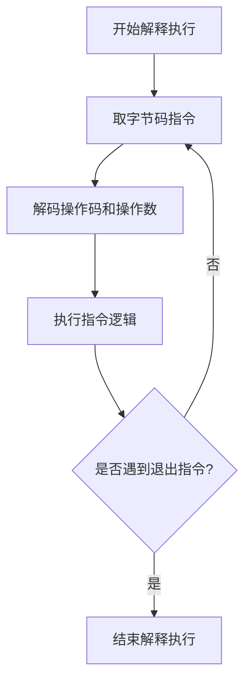
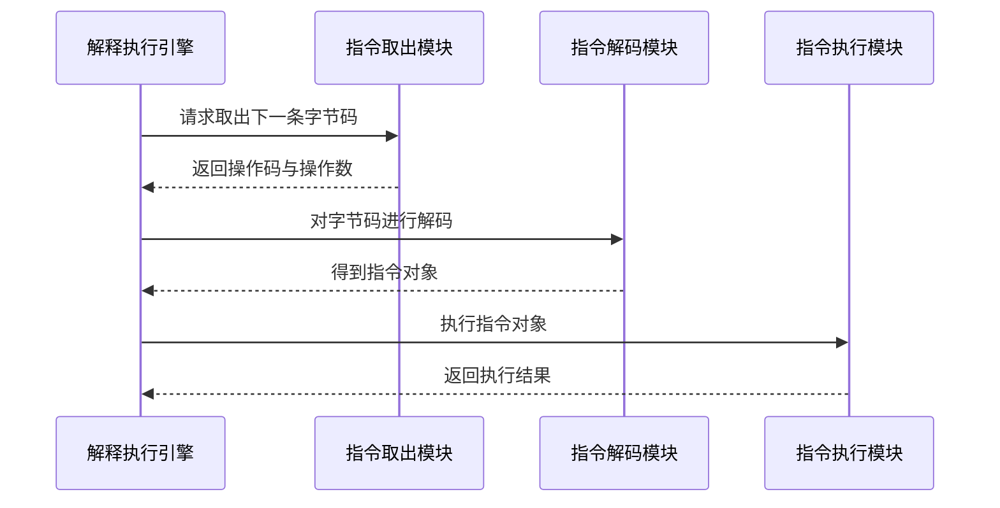

# 3. 解释执行引擎

# Java面试八股之解释执行引擎详解

***

## 一、概述与定义

解释执行引擎是JVM字节码执行引擎的重要组成部分，其主要作用是按照“取指令—解码—执行”的循环机制，逐条解释执行存储在内存中的字节码指令。Java编译器将Java源代码转换为与平台无关的字节码，而解释执行引擎则负责将这些字节码转换为对应的机器操作，通过不断循环完成程序运行。

与即时编译（JIT）技术不同，解释执行引擎不做复杂的优化编译，而是采用简单直接的方式执行代码。这样虽然在长期运行的性能上不如JIT，但却具备启动快、调试友好等优势，适合初期加载、调试和处理冷代码。正因如此，解释执行引擎在Java虚拟机中依然占据重要地位，尤其在小型设备、嵌入式系统或需要快速启动的场景中应用广泛。

***

## 二、主要特点

解释执行引擎具有以下主要特点：

1. **简单直接** &#x20;

   采用取指令—解码—执行的循环方式，每条字节码指令均按顺序执行，逻辑清晰，易于理解和调试。 &#x20;

   🚀 优点：实现简单、易于维护； &#x20;

   🔧 缺点：在热点代码上性能略逊于JIT编译后的本地代码。
2. **启动迅速** &#x20;

   由于不进行复杂的编译优化，解释执行引擎启动时间较短，适合需要快速响应的应用场景。 &#x20;

   ⏱️ 在程序初次加载时，能够较快进入执行状态。
3. **跨平台性强** &#x20;

   基于统一的字节码规范，解释执行引擎在不同操作系统和硬件平台上都能保持一致的执行行为，实现了Java“一次编译，到处运行”的理念。
4. **调试与安全性优势** &#x20;

   由于逐条执行字节码，解释执行引擎对调试工具、跟踪器友好，便于分析每一步的执行过程。同时，其执行过程对内存操作的控制较为严谨，有助于保障程序运行的安全性。 &#x20;

   🔒 在调试复杂问题时，更容易发现潜在的异常。

为直观展示解释执行引擎与JIT编译器的对比，下面给出一张对比表：

| 特性    | 解释执行引擎           | JIT编译器                     |
| ----- | ---------------- | -------------------------- |
| 启动时间  | 启动快，无需预热         | 启动较慢，需要一定的预热时间             |
| 执行方式  | 逐条解释字节码          | 将热点代码编译为本地机器码后执行           |
| 调试友好性 | 易于单步调试与跟踪        | 调试过程较为复杂，难以直接跟踪优化后的机器码     |
| 性能表现  | 在冷代码和低频调用场景下表现良好 | 对热点代码进行大量优化，长期运行性能显著优于解释执行 |
| 适用场景  | 快速启动、调试和资源受限的场景  | 长期运行、高性能要求的服务器端和大数据处理场景    |

***

## 三、应用目标

解释执行引擎的应用目标主要包括以下几个方面：

1. **快速启动与调试** &#x20;

   在程序启动初期或调试过程中，解释执行引擎能快速进入工作状态，无需等待复杂的编译过程。这一特性非常适用于开发调试、测试验证和小型应用部署。
2. **跨平台运行保障** &#x20;

   解释执行引擎基于统一的字节码标准，确保同一套字节码能够在不同平台上以相同的逻辑运行，提升了Java程序的跨平台能力。
3. **资源受限环境下的可靠执行** &#x20;

   在嵌入式系统、移动设备等资源有限的平台上，解释执行引擎不需要大量的内存和编译优化资源，能够稳定地运行Java程序。
4. **作为JIT的补充方案** &#x20;

   在JIT编译器尚未对代码进行优化编译之前，解释执行引擎提供了一个即时的执行路径，确保程序能尽快响应用户请求。同时，对于一些不常用、执行频率低的代码，解释执行引擎可以避免不必要的编译开销。

***

## 四、主要内容及其组成部分

解释执行引擎作为字节码执行引擎的一部分，其内部结构和工作流程主要包括以下几个组成部分，每个部分均在整个执行过程中发挥着关键作用：

### 1. 字节码获取与存储

解释执行引擎首先需要从JVM内存的运行时数据区中获取字节码，这些字节码由类加载器加载并存储在方法区中。字节码以二进制形式保存，每个指令都有固定的长度与格式。

### 2. 指令解码

获取字节码后，解释执行引擎需要对每条指令进行解码。解码过程主要包括：

- 识别指令操作码（opcode）；
- 分析操作数（operand）的数量与类型；
- 根据指令定义确定执行逻辑。

这一过程类似于CPU的指令译码过程，确保每条字节码都能被正确解析为具体的操作。

### 3. 指令执行

解码完成后，解释执行引擎按照指令的含义在JVM内存中的数据区（如操作数栈、局部变量表等）进行操作。指令执行包括数据运算、对象创建、方法调用、分支跳转等多种操作。每条指令的执行过程均与Java虚拟机栈密切相关。

### 4. 解释器循环（Interpreter Loop）

解释器循环是解释执行引擎的核心，它不断重复“取指令—解码—执行”这一过程。简单的伪代码示例如下：

```java 
while (true) {
    byte opcode = fetch();        // 取指令
    Instruction instr = decode(opcode); // 解码指令
    execute(instr);               // 执行指令
    if (instr.isExit()) {
        break;
    }
}
```


在实际实现中，解释器循环会考虑异常处理、线程安全、栈溢出等多种情况，但总体思想保持一致。

### 5. 分派机制

分派机制决定了解释执行引擎如何根据指令的类型选择对应的执行逻辑。常见的分派方式包括：

- 使用大switch-case语句，根据操作码分支执行；
- 利用函数指针表（或“直接线程”技术）进行快速跳转，以减少分支判断带来的性能开销。

下面展示一个简化的分派机制示例：

```c 
while (running) {
    opcode = fetch();
    switch (opcode) {
        case ICONST:
            push(constant);
            break;
        case IADD: {
            int value2 = pop();
            int value1 = pop();
            push(value1 + value2);
            break;
        }
        // 其他字节码指令……
    }
}
```


### 6. 内部数据结构

解释执行引擎依赖于JVM的运行时数据区，主要包括：

- **操作数栈**：用于存储指令执行过程中的中间数据；
- **局部变量表**：存储方法内的参数和局部变量；
- **常量池**：存放类和方法的各种常量数据；
- **方法区**：存放已加载的类信息和字节码数据。

这些数据结构共同支持了解释执行引擎的指令执行与数据处理。

为了更清晰地说明解释执行引擎的工作流程，下面给出一个Mermaid流程图：




图中展示了从开始取指令、解码、执行到判断是否结束的完整流程，帮助大家直观理解解释执行引擎的基本运作机制。😊

***

## 五、原理剖析

解释执行引擎的内部工作原理可以归纳为“取—解—执行”三大步骤，下面进行深入剖析：

### 1. 取指令（Fetch）

解释执行引擎从方法区获取当前正在执行的方法的字节码，并依次按照程序计数器（PC）的指示位置取出下一条指令。取指令过程需要考虑字节码的边界、长度以及与局部变量表的关联，确保每条指令都能被正确读取。

### 2. 解码（Decode）

字节码的解码过程主要是将二进制数据转换为具体的操作命令。每条字节码指令通常包含操作码和若干个操作数，解释执行引擎需要：

- 识别操作码，并映射到内部定义的操作类型；
- 根据操作码确定需要读取的操作数个数和数据类型；
- 将操作数从字节流中提取出来，为后续执行做准备。

这种解码机制与硬件CPU的指令译码类似，不同之处在于解释执行引擎需要在软件层面模拟这一过程，从而在跨平台环境中实现一致的行为。

### 3. 执行（Execute）

解码完成后，解释执行引擎调用对应的执行逻辑。执行过程中可能涉及以下几种情况：

- **算术运算**：如整数加法、减法、乘法等操作，会在操作数栈上完成数据计算。
- **对象操作**：如对象创建、字段赋值、方法调用等，需要访问堆内存、调用构造函数等复杂过程。
- **控制转移**：包括条件判断、循环、异常处理等，需要修改程序计数器，实现非线性流程控制。

在执行过程中，解释执行引擎需要及时处理异常情况，如数组越界、空指针等，确保整个执行过程的安全与稳定。

### 4. 分派机制的实现

对于分派机制，传统的解释器多采用switch-case分支语句进行调度。然而，这种方式在高频调用场景下可能导致分支预测失误，从而影响性能。为此，一些高级实现采用了直接线程技术（Direct Threading）或基于跳转表的方式，减少分支判断的次数，从而提高执行效率。

下述序列图展示了解释执行引擎在分派机制中的工作过程：




图中展示了从字节码的取出、解码到最终执行的整个过程，清晰说明了各模块之间的交互与协作。

### 5. 优化机会与局限性

虽然解释执行引擎实现简单、启动迅速，但在性能上与JIT编译存在明显差距。为弥补这一不足，现代JVM通常采用混合执行模式：初始阶段使用解释执行引擎快速启动程序，待热点代码确定后再交由JIT编译器进行优化编译。此外，即使在解释执行阶段，也可以利用内联缓存（Inline Cache）等技术对重复执行的指令进行优化，减少重复解码的开销。

***

## 六、应用与拓展

深入理解解释执行引擎不仅有助于掌握JVM内部机制，还能为实际项目中的性能调优、调试和系统优化提供理论基础。下面列举一些应用场景和扩展方向：

1. **快速启动与开发调试** &#x20;

   在开发过程中，解释执行引擎能够快速响应代码修改，帮助开发者在不等待JIT优化的情况下就能进行单步调试与问题排查。对于初始加载速度要求较高的应用，解释执行引擎确保了低延迟启动。
2. **嵌入式系统和资源受限平台** &#x20;

   在一些嵌入式系统、移动设备或物联网设备上，由于资源受限，JIT编译的内存和计算开销可能难以承受，此时解释执行引擎成为稳定运行Java程序的理想选择。
3. **混合执行模式** &#x20;

   现代JVM往往采用解释执行与JIT编译相结合的方式：在程序启动及冷路径中使用解释执行引擎，在检测到热点代码后由JIT编译器进行优化。通过合理调配这两种执行方式，可以兼顾启动速度与长期运行性能，实现最优的运行效率。
4. **性能调优与问题诊断** &#x20;

   了解解释执行引擎的内部工作原理，有助于开发者在面对性能瓶颈时判断问题是出在解释阶段还是JIT优化不足，从而有针对性地进行调优。比如，在分析某个方法执行缓慢时，可以检查是否因频繁的解释执行导致分派开销过大，从而优化代码结构或调整JVM参数。
5. **未来拓展与新技术结合** &#x20;

   随着硬件性能和编译技术的不断发展，解释执行引擎也在不断演进。未来可能会借鉴更多硬件加速、并行处理的技术，使解释执行在保持调试友好性的同时进一步提升性能。这为JVM在跨平台、低延迟场景中的应用提供了更大空间。🔧

***

## 七、面试问答

以下为常见的与解释执行引擎相关的面试问答，回答内容以面试者口吻详尽阐述，以便在面试中更好地展示自己的理解与思考。

### 问题1：请简要介绍一下解释执行引擎是什么，它在JVM中扮演什么角色？

【回答】： &#x20;

解释执行引擎是JVM字节码执行引擎中的核心模块，其主要任务是按照“取指令—解码—执行”的循环机制逐条解释执行字节码。它为Java程序提供了一条即时的执行路径，能够快速启动程序并便于调试。虽然在性能上不如JIT编译器生成的本地代码，但它在启动速度、跨平台性以及调试友好性上具有明显优势。在实际运行中，解释执行引擎往往与JIT编译器结合使用，以实现快速启动与长期高性能之间的平衡。

### 问题2：解释执行引擎与JIT编译器有何区别，各自的优缺点是什么？

【回答】： &#x20;

解释执行引擎和JIT编译器都是JVM中执行字节码的机制，但工作原理和适用场景有所不同。解释执行引擎采用逐条解释的方式执行字节码，启动速度快、实现简单，适合初始加载和调试；但在长时间运行的热点代码上，执行效率较低。相比之下，JIT编译器在程序运行过程中会将热点代码编译为本地机器码，通过优化技术如内联扩展、逃逸分析等极大提升运行速度，但其启动时间较长且调试过程不如解释执行直观。因此，在实际应用中，JVM通常采用两者结合的混合模式，利用解释执行保证快速启动，再借助JIT编译实现性能优化。

### 问题3：请描述解释执行引擎的工作流程，并说明每一步的作用。

【回答】： &#x20;

解释执行引擎的工作流程主要分为三个步骤：取指令、解码和执行。首先，从方法区中获取当前方法对应的字节码（取指令）；接着，对取出的字节码进行解析，识别出操作码和操作数（解码）；最后，根据解析结果在操作数栈、局部变量表等数据结构上进行具体操作（执行）。这一循环不断重复，直至遇到退出指令或方法执行完毕。整个流程类似于CPU的工作模式，确保字节码能被逐条正确执行，同时支持异常处理和线程调度。

### 问题4：如何设计一个简单的字节码解释器？能否给出伪代码示例？

【回答】： &#x20;

设计一个简单的字节码解释器可以从实现一个解释器循环开始。首先需要定义一个取指令函数用于从字节码流中获取下一个操作码，然后通过switch-case语句或者跳转表对操作码进行解码和分派，最后调用相应的指令执行逻辑。下面是一个伪代码示例：

```c 
while (running) {
    opcode = fetch();                // 从字节码流中取出当前指令
    switch (opcode) {
        case ICONST:
            push(constant);
            break;
        case IADD: {
            int value2 = pop();
            int value1 = pop();
            push(value1 + value2);
            break;
        }
        // 处理其他字节码指令……
        case RETURN:
            running = false;
            break;
    }
}
```


这个伪代码展示了如何循环获取字节码、解码操作码，并根据操作码执行相应操作。虽然实际实现会更加复杂，但基本思路是一致的。

### 问题5：在面试中，如何回答有关解释执行引擎对Java性能和调试的影响？

【回答】： &#x20;

在面试中，我会说明解释执行引擎虽然在执行效率上不如经过JIT编译的代码，但其优势在于启动速度快和调试友好。它能够在程序初始阶段迅速响应，并且由于逐条执行字节码，便于开发者进行单步调试和错误定位。同时，在JIT编译器介入前，解释执行引擎为系统提供了稳定的执行路径，确保程序能够在资源受限的环境中正常运行。理解这一机制有助于我们在性能调优时，合理设置JVM参数，平衡启动速度与长期性能之间的关系，从而使系统在各个场景下都能发挥最佳表现。

***
