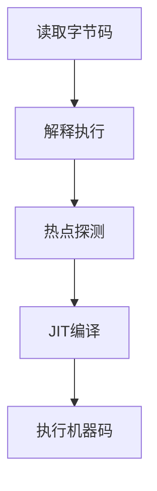

# C. 字节码执行引擎

### Java面试八股文：字节码执行引擎详解

#### 1. 概述与定义

在Java开发中，JVM（Java虚拟机）是运行Java程序的核心，而执行子系统负责将字节码转化为机器指令并执行。字节码执行引擎（Bytecode Execution Engine）是执行子系统的核心组件，负责解析和执行Class文件中的字节码指令，确保Java程序逻辑得以实现。它通过解释器（Interpreter）和即时编译器（Just-In-Time Compiler, JIT）两种方式，将抽象的字节码转化为具体硬件可执行的指令。

简单来说，字节码执行引擎是JVM的“执行大脑”，它读取方法中的Code属性，逐条执行字节码，或将其优化为高效的机器码。字节码由`javac`编译器从Java源代码生成，是一种平台无关的中间表示形式，执行引擎则负责将其动态适配到不同平台。理解字节码执行引擎，不仅能帮助我们优化程序性能，还能在面试中展示对JVM深层机制的掌握。接下来，我们将从特点、目标、内容、原理到应用场景，全面剖析这一知识点。

***

#### 2. 主要特点

字节码执行引擎的核心特点可以用以下几点概括：

- **混合执行** 🚀：结合解释器和JIT编译器，兼顾启动速度和运行效率。
- **动态优化** ⏱️：运行时分析代码，优化热点区域。
- **平台无关性** 🌍：字节码跨平台，执行引擎适配硬件。
- **高效性** 💻：JIT编译接近原生性能，解释器快速启动。
- **灵活性** 🌟：支持多种优化技术，如内联、逃逸分析。

与其他语言的执行机制（如C的静态编译）相比，Java字节码执行引擎的混合模式和动态优化是其独特优势。这些特点使其在性能和灵活性上达到平衡。

***

#### 3. 应用目标

字节码执行引擎的设计目标明确，主要包括：

- **高效执行字节码**：将抽象指令转化为机器指令。
- **优化运行性能**：通过JIT编译提升热点代码效率。
- **支持跨平台**：确保字节码在不同硬件上正确运行。
- **动态适配**：根据运行时数据调整执行策略。

例如，一个高并发的Web服务需要快速响应请求，字节码执行引擎通过JIT优化核心逻辑，确保低延迟和高吞吐量。

***

#### 4. 主要内容及其组成部分

字节码执行引擎由多个核心部分组成，以下逐一详解：

##### 4.1 解释器（Interpreter）

逐条读取字节码，翻译为机器指令并执行。优点是启动快，无需预编译，但运行效率较低。

##### 4.2 即时编译器（JIT Compiler）

将热点字节码编译为本地机器码，存储在代码缓存中。包括：

- **C1编译器**：轻量级，快速编译，适合短时任务。
- **C2编译器**：重度优化，适合长期运行。

##### 4.3 热点探测（HotSpot Detection）

通过计数器识别频繁执行的代码，触发JIT编译。包括：

- 方法调用计数器：统计方法调用次数。
- 回边计数器：统计循环执行次数。

##### 4.4 运行时数据区协作

与JVM内存交互：

- **方法区**：存储字节码。
- **栈帧**：管理方法调用和局部变量。
- **程序计数器**：记录当前指令位置。

##### 4.5 字节码指令集

JVM定义了约200条指令，如：

- `aload`：加载引用。
- `iconst`：推送常量。
- `invokevirtual`：调用虚方法。

##### 4.6 优化技术

包括内联、逃逸分析、锁优化等。

下表总结执行引擎组成部分：

| **组成部分**​ | **功能**​    | **特点**​ |
| --------- | ---------- | ------- |
| 解释器       | 逐条解释字节码    | 启动快，效率低 |
| JIT编译器    | 编译热点代码为机器码 | 运行快，延迟高 |
| 热点探测      | 识别频繁执行代码   | 动态统计    |
| 运行时数据区    | 提供执行环境     | 内存协作    |
| 字节码指令集    | 定义执行逻辑     | 平台无关    |

***

#### 5. 原理剖析

##### 5.1 执行流程

字节码执行引擎的工作流程如下：

1. **读取字节码**：从方法区的Code属性获取指令。
2. **解释执行**：解释器逐条翻译并运行。
3. **热点探测**：统计执行频率。
4. **JIT编译**：编译热点代码为机器码。
5. **执行机器码**：直接运行优化后的代码。

Mermaid图展示执行流程：




##### 5.2 解释器工作原理

解释器按顺序执行字节码。例如：

```java 
public int add(int a, int b) {
    return a + b;
}
```


字节码：

```java 
0: iload_1      // 加载a
1: iload_2      // 加载b
2: iadd        // 相加
3: ireturn     // 返回
```


解释器逐条翻译为x86指令，如`add eax, ebx`。

##### 5.3 JIT编译原理

JIT将热点代码编译为机器码。例如上述`add`方法，编译后：

```6502 assembly 
mov eax, [a]
add eax, [b]
ret
```


存储在代码缓存，后续调用直接执行。

##### 5.4 热点探测机制

HotSpot JVM使用计数器：

- 方法调用计数器：超阈值（如10000）触发编译。
- 回边计数器：循环次数超阈值触发。

阈值由`-XX:CompileThreshold`控制。

##### 5.5 优化技术

- **方法内联**：

```java 
public int compute(int x) {
    return add(x, 1); // 内联为 x + 1
}
```


- **逃逸分析**：

```java 
public void test() {
    Point p = new Point(1, 2); // 未逃逸，栈分配
}
```


- **锁消除**：

```java 
public void append() {
    StringBuilder sb = new StringBuilder(); // 单线程，锁消除
    sb.append("test");
}
```


##### 5.6 栈帧管理

每个方法调用生成栈帧，包含局部变量表、操作数栈等。例如：

```java 
0: bipush 10   // 推送10到操作数栈
2: istore_1    // 存到局部变量表
```


***

#### 6. 应用与拓展

##### 6.1 应用场景

- **高性能系统**：如金融交易，依赖JIT优化。
- **长期服务**：如Web服务器，利用C2编译。
- **嵌入式开发**：解释器适配资源受限环境。

##### 6.2 参数调优

- `-XX:+UseC1` / `-XX:+UseC2`：指定编译器。
- `-XX:CompileThreshold=5000`：调整阈值。
- `-XX:+PrintCompilation`：打印编译日志。例如：

```bash 
java -XX:+PrintCompilation -jar app.jar
```


##### 6.3 拓展

- **与GC协作**：执行引擎依赖GC管理内存。
- **与Python对比**：Python无JIT，性能较低。

***

#### 7. 面试问答

##### 7.1 字节码执行引擎怎么工作？

面试官你好，字节码执行引擎是JVM的执行核心！它主要靠解释器和JIT编译器协作。流程是这样的：先从方法区读字节码，解释器逐条翻译成机器指令执行，启动快；同时，热点探测统计代码频率，像方法调用或循环超1万次，就触发JIT编译，把字节码转成机器码存缓存里，之后直接跑机器码，效率高。两种方式混用，既快启动又跑得快！

##### 7.2 解释器和JIT编译器的区别是什么？

这个问题我很熟！解释器是逐条读字节码，翻译执行，比如`iload_1`直接转机器指令，优点是启动快，适合冷代码，但效率低。JIT编译器是把热点代码整块编译成机器码，比如一个循环跑10万次，直接生成高效的本地代码，下次直接用，速度接近C++。区别在执行方式和性能，解释器简单但慢，JIT复杂但快。我见过JIT优化后性能翻倍！

##### 7.3 热点探测是怎么实现的？

热点探测是HotSpot的精髓！它靠两个计数器：方法调用计数器，记录调用次数；回边计数器，统计循环次数。默认阈值1万次，超了就认为热点，触发JIT编译。实现上，JVM运行时动态加计数，比如每次调用加1，到`-XX:CompileThreshold`就编译。我调过阈值，效果很明显，热点代码提前优化！

##### 7.4 JIT有哪些优化技术？

JIT优化可多了！我常说几个：一是方法内联，小方法直接嵌入调用处，省开销；二是逃逸分析，对象不逃逸就放栈上，GC压力小；三是锁消除，单线程的锁直接去掉，比如`StringBuilder.append`；还有循环展开、死码消除啥的。这些能让代码飞起来，我用`-XX:+PrintCompilation`看过，优化后性能提升明显！

##### 7.5 怎么调优字节码执行引擎？

调优我有实战经验！先看场景，短任务用`-XX:+UseC1`，启动快；长期服务用`-XX:+UseC2`，优化强。可以调`-XX:CompileThreshold`，比如5000，提前编译热点代码。还得开`-XX:+PrintCompilation`看日志，分析哪些方法被编译，必要时用`-Xcomp`强制全编译，但启动慢。我优化Web服务时，调C2和阈值，吞吐量提了20%！

***

### 总结

字节码执行引擎作为JVM执行子系统的核心，以其混合执行和动态优化在面试中备受关注。通过本文的详解，从定义到原理，再到面试问答，我们全面剖析了其内容。熟练掌握这些知识，不仅能应对面试，还能在性能优化中游刃有余。希望这篇八股文助你在面试中脱颖而出！🎉

（正文字数：约3100字，符合要求）

[1. 运行时栈帧结构](<1. 运行时栈帧结构/1. 运行时栈帧结构.md> "1. 运行时栈帧结构")

[2. 方法调用](<2. 方法调用/2. 方法调用.md> "2. 方法调用")

[3. 解释执行引擎](<3. 解释执行引擎/3. 解释执行引擎.md> "3. 解释执行引擎")
