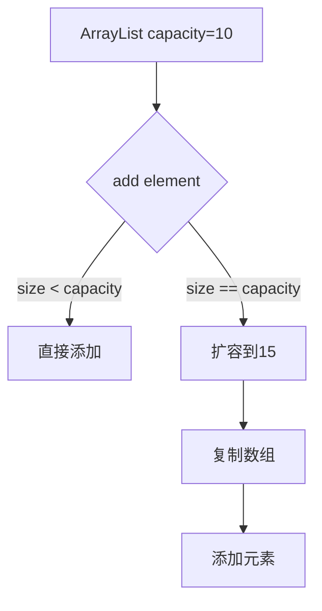
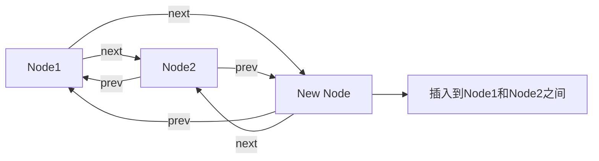

# 1. List

***

## 1. 概述与定义

List接口是Java集合框架中的一个核心接口，继承自Collection接口，代表一个有序的、可重复的元素集合。List允许存储重复元素，并通过索引（从0开始）访问元素，支持动态扩容和随机访问。常见的List实现类有ArrayList、LinkedList和Vector。

### 定义

简而言之，List接口是一个支持按索引访问、有序、可重复的集合，适用于需要维护元素顺序或频繁随机访问的场景。在面试中，你可以这样回答：“List是Java集合框架中的一个接口，继承自Collection，特点是元素有序、可重复，并支持通过索引访问。” 这个回答简洁有力，能快速抓住重点，同时为后续展开铺垫。

### 背景与重要性

Java集合框架是Java语言的核心组成部分，List作为最常用的集合类型之一，广泛应用于数据存储、处理和传递。ArrayList基于动态数组实现，适合随机访问；LinkedList基于双向链表实现，适合频繁插入和删除；Vector是线程安全的List实现，适用于多线程场景。掌握List接口及其实现类的特性、原理和应用场景，不仅能让你在面试中脱颖而出，还能提升你在实际项目中的编码效率和质量。

***

## 2. 主要特点

List接口具有以下几个显著特点，熟悉这些特点能帮助你在面试中快速定位问题并展开分析：

- **有序性** 📋 &#x20;

  元素按照插入顺序存储，可以通过索引访问。
- **可重复性** 🔄 &#x20;

  允许存储重复元素，元素可以相等。
- **索引访问** 🔍 &#x20;

  支持通过索引快速访问元素，时间复杂度为O(1)（ArrayList）或O(n)（LinkedList）。
- **动态扩容** 🚀 &#x20;

  实现类如ArrayList和LinkedList支持自动扩容，适应不同数据量。
- **线程安全性** 🔒 &#x20;

  Vector是线程安全的List实现，适用于多线程环境；ArrayList和LinkedList非线程安全，需外部同步。

### 面试Tips

提到“有序性”时，可以结合场景说：“在电商系统中，购物车商品需要按添加顺序显示，List能保证这一点。” 对于“线程安全性”，可以补充：“在多线程场景下，我会用Vector或Collections.synchronizedList包装ArrayList。” 这些描述能展现你的实战经验和深度理解。

***

## 3. 应用目标

List接口的设计目标是提供一个灵活、高效的元素存储和访问机制，其具体目标包括：

- **支持有序存储** &#x20;

  维护元素的插入顺序，适用于需要按序访问的场景。
- **提供随机访问** &#x20;

  通过索引快速访问元素，适用于频繁读取的场景。
- **支持动态扩容** &#x20;

  自动调整容量，适应不同数据量，减少内存浪费。
- **适应多种场景** &#x20;

  通过不同实现类满足不同性能需求，如ArrayList适合随机访问，LinkedList适合插入删除。
- **简化集合操作** &#x20;

  提供丰富的API，如add、remove、get等，简化开发。

在面试中，你可以总结：“List接口的目标是提供一个有序、可重复、支持索引访问的集合，适应多种存储和访问需求，简化集合操作。” 这个回答简洁清晰，能快速传递核心信息。虽然“简化集合操作”不是首要目标，但在实际开发中能提高效率，适当提及能体现全面思考。

***

## 4. 主要内容及其组成部分

List接口是Java集合框架的一部分，其主要内容包括接口定义、常用方法、实现类及其特性。以下详细讲解每个部分，结合代码、表格和图表，确保内容全面且直观。

### 4.1 List接口定义

List接口继承自Collection接口，定义了List特有的方法，如索引操作、范围操作等。

#### 示例：List接口部分方法

```java 
public interface List<E> extends Collection<E> {
    E get(int index);
    E set(int index, E element);
    void add(int index, E element);
    E remove(int index);
    int indexOf(Object o);
    int lastIndexOf(Object o);
    List<E> subList(int fromIndex, int toIndex);
}
```


**代码说明**：此代码展示了List接口的常用方法，如`get`、`set`、`add`等，支持索引操作。面试时可以说：“List接口扩展了Collection，增加了索引相关的方法，方便按位置操作元素。”

### 4.2 常用实现类

List接口有多个实现类，各有特点：

- **ArrayList**：基于动态数组实现，随机访问快，插入删除慢。
- **LinkedList**：基于双向链表实现，插入删除快，随机访问慢。
- **Vector**：线程安全的ArrayList，适用于多线程场景。
- **Stack**：Vector的子类，实现后进先出（LIFO）栈。

#### 示例：ArrayList和LinkedList使用

```java 
List<String> arrayList = new ArrayList<>();
arrayList.add("A");
arrayList.add("B");
System.out.println(arrayList.get(0)); // A

List<String> linkedList = new LinkedList<>();
linkedList.add("C");
linkedList.add("D");
System.out.println(linkedList.get(0)); // C
```


**代码说明**：此代码展示了ArrayList和LinkedList的基本使用，面试时可以说：“ArrayList和LinkedList都实现了List接口，但底层数据结构不同，适用场景也不同。”

### 4.3 ArrayList原理

ArrayList基于动态数组实现，具有以下特点：

- **初始容量**：默认10，可通过构造函数指定。
- **扩容机制**：容量不足时自动扩容为原容量的1.5倍。
- **随机访问**：通过索引直接访问，时间复杂度O(1)。
- **插入删除**：需移动元素，时间复杂度O(n)。

#### 示例：ArrayList扩容

```java 
public class ArrayList<E> extends AbstractList<E> {
    private static final int DEFAULT_CAPACITY = 10;
    private Object[] elementData;
    public ArrayList() {
        this.elementData = new Object[DEFAULT_CAPACITY];
    }
    public void add(E e) {
        if (size == elementData.length) {
            int newCapacity = elementData.length + (elementData.length >> 1);
            elementData = Arrays.copyOf(elementData, newCapacity);
        }
        elementData[size++] = e;
    }
}
```


**代码说明**：此代码简述了ArrayList的扩容逻辑，容量不足时扩容为原容量的1.5倍。面试时可以说：“ArrayList扩容时用`Arrays.copyOf`复制数组，性能开销较大，所以最好预估容量。”

### 4.4 LinkedList原理

LinkedList基于双向链表实现，具有以下特点：

- **节点结构**：每个节点包含前驱、后继和元素。
- **插入删除**：只需修改指针，时间复杂度O(1)。
- **随机访问**：需遍历链表，时间复杂度O(n)。

#### 示例：LinkedList节点

```java 
private static class Node<E> {
    E item;
    Node<E> next;
    Node<E> prev;
    Node(Node<E> prev, E element, Node<E> next) {
        this.item = element;
        this.next = next;
        this.prev = prev;
    }
}
```


**代码说明**：此代码展示了LinkedList的节点结构，包含前驱和后继指针。面试时可以说：“LinkedList通过双向链表实现，插入删除效率高，适合频繁修改的场景。”

### 4.5 Vector与Stack

Vector是线程安全的List实现，Stack是Vector的子类，实现栈结构。

- **Vector**：所有方法加synchronized锁，性能较低。
- **Stack**：提供push、pop、peek等栈操作。

#### 示例：Vector使用

```java 
List<String> vector = new Vector<>();
vector.add("A");
vector.add("B");
System.out.println(vector.get(0)); // A
```


**代码说明**：Vector与ArrayList使用类似，但线程安全。面试时可以说：“Vector在多线程场景下安全，但性能比ArrayList低，推荐用Collections.synchronizedList替代。”

### 4.6 线程安全

List的线程安全实现包括：

- **Vector**：内部方法加锁。
- **Collections.synchronizedList**：包装List实现同步。
- **CopyOnWriteArrayList**：写时复制，适合读多写少场景。

#### 示例：CopyOnWriteArrayList

```java 
List<String> cowList = new CopyOnWriteArrayList<>();
cowList.add("A");
cowList.add("B");
System.out.println(cowList.get(0)); // A
```


**代码说明**：CopyOnWriteArrayList在写操作时复制数组，读操作无锁，适合高并发读场景。面试时可以说：“CopyOnWriteArrayList读性能高，写开销大，适合配置数据等场景。”

### 实现类对比表格

| 实现类                  | 底层结构 | 随机访问 | 插入删除 | 线程安全 | 适用场景   |
| -------------------- | ---- | ---- | ---- | ---- | ------ |
| ArrayList            | 动态数组 | O(1) | O(n) | 否    | 随机访问频繁 |
| LinkedList           | 双向链表 | O(n) | O(1) | 否    | 频繁插入删除 |
| Vector               | 动态数组 | O(1) | O(n) | 是    | 多线程环境  |
| CopyOnWriteArrayList | 动态数组 | O(1) | O(n) | 是    | 读多写少场景 |

**表格说明**：此表格对比了List实现类的特性，ArrayList适合随机访问，LinkedList适合插入删除，Vector和CopyOnWriteArrayList提供线程安全。面试时可用此表格回答“List实现类的区别”。

***

## 5. 原理剖析

List接口的实现原理涉及数据结构、扩容机制、线程安全等核心技术。以下深入解析ArrayList和LinkedList的原理，结合Mermaid图表说明。

### 5.1 ArrayList原理

ArrayList基于动态数组实现，核心在于数组的扩容和元素移动。

- **初始容量**：默认10，可指定。
- **扩容**：容量不足时扩容为原容量的1.5倍。
- **元素移动**：插入删除时需移动后续元素。

#### Mermaid图表：ArrayList扩容




**图表说明**：此图展示ArrayList扩容流程，容量不足时扩容并复制数组。面试时可用来说明扩容开销。

### 5.2 LinkedList原理

LinkedList基于双向链表实现，核心在于节点的插入和删除。

- **节点结构**：包含前驱、后继和元素。
- **插入**：修改相邻节点的指针。
- **删除**：修改相邻节点的指针。

#### Mermaid图表：LinkedList插入




**图表说明**：此图展示LinkedList插入节点的指针变化，面试时可用来说明其高效性。

### 5.3 线程安全原理

Vector通过synchronized实现线程安全，CopyOnWriteArrayList通过写时复制实现。

- **Vector**：每个方法加锁，串行执行。
- **CopyOnWriteArrayList**：写操作时复制数组，读操作无锁。

#### 示例：CopyOnWriteArrayList写操作

```java 
public boolean add(E e) {
    synchronized (lock) {
        Object[] elements = getArray();
        int len = elements.length;
        Object[] newElements = Arrays.copyOf(elements, len + 1);
        newElements[len] = e;
        setArray(newElements);
        return true;
    }
}
```


**代码说明**：写操作时复制数组并修改，读操作直接访问数组，面试时可以说：“CopyOnWriteArrayList写时复制，读写分离，适合高并发读。”

### 5.4 迭代器

ListIterator是List特有的迭代器，支持双向遍历和修改。

#### 示例：ListIterator使用

```java 
List<String> list = new ArrayList<>(Arrays.asList("A", "B", "C"));
ListIterator<String> iterator = list.listIterator();
while (iterator.hasNext()) {
    String item = iterator.next();
    if ("B".equals(item)) {
        iterator.set("D");
    }
}
System.out.println(list); // [A, D, C]
```


**代码说明**：此代码用ListIterator修改元素，面试时可以说：“ListIterator支持在遍历时修改集合，功能比Iterator强大。”

***

## 6. 应用与拓展

List接口在实际项目中应用广泛，以下是典型场景：

- **数据存储** &#x20;

  如用户列表、商品列表，ArrayList适合快速访问。
- **任务队列** &#x20;

  LinkedList适合频繁插入和删除的任务队列。
- **线程安全** &#x20;

  Vector或CopyOnWriteArrayList用于多线程环境。
- **栈和队列** &#x20;

  LinkedList实现Deque接口，可用作栈和队列。

### 拓展

List可与其他技术结合：

- **Stream API**：List支持流式操作，简化数据处理。
- **Lambda**：结合Lambda表达式，提升代码简洁性。
- **泛型**：List支持泛型，确保类型安全。

#### 示例：Stream API

```java 
List<String> list = Arrays.asList("A", "B", "C");
list.stream().filter(s -> s.equals("B")).forEach(System.out::println); // B
```


**代码说明**：此代码用Stream API过滤并打印元素，面试时可以说：“Stream API让List操作更简洁，适合大数据处理。”

***

## 7. 面试问答

以下是五个常见问题及详细回答，模仿面试者口吻，确保自然且有深度。

### 问题 1：List和Set有什么区别？

**回答**： &#x20;

“List和Set都是Collection的子接口，但List是有序的、允许重复元素，支持索引访问；Set是无序的、不允许重复元素。List适合按顺序存储数据，比如商品列表；Set适合去重，比如用户ID集合。我在项目里用List存购物车商品，用Set存用户标签。”

### 问题 2：ArrayList和LinkedList的区别是什么？

**回答**： &#x20;

“ArrayList底层是动态数组，随机访问快，插入删除慢；LinkedList是双向链表，插入删除快，随机访问慢。ArrayList适合查询多，LinkedList适合修改多。我在项目里用ArrayList存查询结果，LinkedList做任务队列。”

### 问题 3：ArrayList如何实现线程安全？

**回答**： &#x20;

“ArrayList本身不线程安全，可以用Collections.synchronizedList包装，或者用CopyOnWriteArrayList。synchronizedList加锁，CopyOnWriteArrayList写时复制，读无锁。我在高并发读场景下用CopyOnWriteArrayList，性能更好。”

### 问题 4：List的扩容机制是什么？

**回答**： &#x20;

“ArrayList的扩容机制是当元素数量超过容量时，自动扩容为原容量的1.5倍，用Arrays.copyOf复制数组。扩容开销大，最好预估容量。我在项目里会根据数据量设置初始容量，减少扩容次数。”

### 问题 5：如何选择List的实现类？

**回答**： &#x20;

“选择List实现类要看场景：如果频繁随机访问，用ArrayList；频繁插入删除，用LinkedList；多线程环境，用Vector或CopyOnWriteArrayList。我在项目里一般先用ArrayList，如果有性能问题再优化。”

***

## 总结

本文从List接口的定义到原理、应用场景及面试应对，覆盖所有核心知识点。通过代码、表格和Mermaid图表，内容直观易懂，背熟后能在面试中自信回答问题，展现你的专业实力！✨
