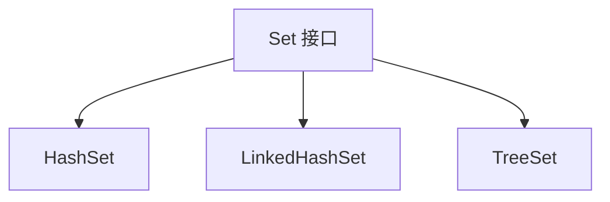

# 2. Set

## 1. 概述与定义

在 Java 集合框架中，Set 接口是 Collection 接口的一个重要子接口，专门用于存储**不重复**的元素。Set 的主要特性在于不允许集合中出现重复元素，因此它经常被用来实现数据去重、判断成员资格等需求。常见的 Set 实现类包括 HashSet、LinkedHashSet、TreeSet 和 EnumSet 等。

Set 的定义与设计思想在于确保集合中的每个对象都是唯一的。其内部实现要求所存储的对象必须正确地重写 equals() 与 hashCode() 方法，这样才能保证在添加元素时判断是否已经存在。Set 接口为开发人员提供了一种灵活的数据存储方式，既可以支持无序集合（如 HashSet），也可以支持有序集合（如 TreeSet 和 LinkedHashSet），满足不同应用场景下对数据顺序的需求。📚

此外，Set 接口不仅适用于数据去重，还可用于构建高性能的查找表、数学集合运算（并集、交集、差集）等功能。在现代开发中，Set 作为一种基础的数据结构，已经成为 Java 工程师必备的知识点之一。

## 2. 主要特点

Set 接口具有如下几个主要特点，这些特点在面试中也是常被考察的重点：

1. **元素唯一性** &#x20;

   Set 的最核心特点就是不允许包含重复的元素。当试图添加一个已经存在的元素时，添加操作将返回 false，不会改变集合内容。这为数据去重、成员资格判断等场景提供了天然支持。✅
2. **无序或有序存储** &#x20;

   不同的 Set 实现类对元素顺序有不同要求： &#x20;
   - **HashSet**：无序存储，内部基于[0. HashTable](<../../二. Map/0. HashTable/0. HashTable.md> "0. HashTable")实现，查找速度快。 &#x20;
   - **LinkedHashSet**：在 HashSet 基础上维护了元素的插入顺序，便于按添加顺序遍历。 &#x20;
   - **TreeSet**：基于红黑树实现，存储的元素保持自然顺序或自定义顺序。 &#x20;
     这种灵活性使得 Set 能够适应不同的业务场景。🔀
3. **高效查找** &#x20;

   由于 Set 实现类通常采用哈希表或树结构，判断元素是否存在的操作具有较高的效率。HashSet 的平均时间复杂度为 O(1)，而 TreeSet 的查找时间为 O(log n)，在大数据量场景下具有显著优势。⚡
4. **线程安全性问题** &#x20;

   默认情况下，集合框架中的 Set 实现都不是线程安全的。需要在多线程场景下，通过 Collections.synchronizedSet() 或使用并发集合（如 CopyOnWriteArraySet）来实现线程安全。🚦
5. **与 Collection 其他子接口的差异** &#x20;

   与 List 接口相比，Set 不保证元素的插入顺序（除非使用 LinkedHashSet 或 TreeSet），也不允许重复数据；而与 Queue 接口相比，Set 更强调集合内元素的唯一性而非队列的先进先出（FIFO）特性。🤝

下面的表格归纳了 Set 接口主要特点及对应的实现类：

| 特点    | 说明                                                 | 代表实现类                         | 应用场景       |
| ----- | -------------------------------------------------- | ----------------------------- | ---------- |
| 元素唯一性 | 集合中不允许重复元素                                         | HashSet、TreeSet               | 去重、成员资格判断  |
| 无序或有序 | HashSet 无序；LinkedHashSet 保持插入顺序；TreeSet 自然排序或自定义排序 | HashSet、LinkedHashSet、TreeSet | 排序需求、数据展示  |
| 高效查找  | 采用哈希表或树结构，查找效率高                                    | HashSet、TreeSet               | 快速判断元素是否存在 |
| 非线程安全 | 默认实现不是线程安全，需要额外处理                                  | HashSet                       | 单线程或并发包装场景 |

## 3. 应用目标

在实际项目中，Set 接口的应用目标主要体现在以下几个方面：

1. **数据去重** &#x20;

   当需要处理大量数据并去除重复项时，使用 Set 是最直接和高效的解决方案。例如，在处理用户注册信息、商品编号、日志记录等场景中，可以利用 Set 的唯一性保证数据不重复，从而减少错误和冗余数据。🎯
2. **快速查找与判断** &#x20;

   由于 Set 实现类提供了高效的查找操作，常用于需要快速判断某个元素是否存在的场景，如权限校验、白名单/黑名单管理等。
3. **集合运算** &#x20;

   在一些数学、统计以及业务逻辑中，经常需要对集合进行交集、并集和差集等操作。Set 的设计使得这些操作可以非常高效地实现，帮助开发者轻松处理数据关系。🔢
4. **构建无序集合** &#x20;

   某些应用中并不关心元素的顺序，只需要保证数据集合的唯一性，此时 Set 提供了简单且直观的实现方式，减少了对数据排序的额外开销。
5. **支持业务逻辑灵活扩展** &#x20;

   由于 Set 接口是 Collection 的一部分，可以与其他集合类无缝结合，如 List 与 Set 的相互转换，满足多种数据处理需求。同时，集合框架中还提供了丰富的工具方法，进一步提升了开发效率。

通过这些目标，Set 成为了 Java 开发中解决数据去重、快速查找和集合运算等问题的重要工具。

## 4. 主要内容及其组成部分

Set 接口作为 Collection 的一个子接口，其核心内容和组成部分主要包括以下几个方面：

### 4.1 基本操作方法

Set 接口继承了 Collection 接口的所有基本操作方法，常用的包括：

- **add(E e)**：将元素添加到 Set 中，如果元素已存在则添加失败。
- **remove(Object o)**：从 Set 中删除指定元素。
- **contains(Object o)**：判断 Set 中是否存在某个元素。
- **size()**：返回 Set 中的元素个数。
- **clear()**：清空 Set 中所有元素。
- **iterator()**：返回 Set 的迭代器，用于遍历所有元素。

示例代码（添加、删除、遍历）：

```java 
Set<String> fruits = new HashSet<>();
fruits.add("Apple");
fruits.add("Banana");
fruits.add("Cherry");

// 删除元素
fruits.remove("Banana");

// 遍历 Set
for (String fruit : fruits) {
    System.out.println(fruit);
}
```


### 4.2 主要实现类

Set 接口有多种实现，各自适用于不同场景：

- **HashSet** &#x20;

  基于哈希表实现，不保证元素的顺序。查找、添加和删除操作的时间复杂度为 O(1)，适用于快速查找和去重。 &#x20;
- **LinkedHashSet** &#x20;

  在 HashSet 的基础上，通过链表维护插入顺序，因此既能保证元素唯一性，又能按插入顺序遍历。 &#x20;
- **TreeSet** &#x20;

  基于红黑树实现，能够对集合中的元素进行排序。添加和查找操作的时间复杂度为 O(log n)，适合需要排序的数据存储。 &#x20;
- **EnumSet** &#x20;

  专门用于存储枚举类型的集合，具有高效、紧凑的存储特点。

下表总结了各个实现类的主要特点及适用场景：

| 实现类           | 数据结构   | 元素顺序      | 主要特点                   | 适用场景        |
| ------------- | ------ | --------- | ---------------------- | ----------- |
| HashSet       | 哈希表    | 无序        | 高效、查找时间平均为 O(1)        | 数据去重、快速查找   |
| LinkedHashSet | 哈希表+链表 | 插入顺序      | 保持元素插入顺序，性能略低于 HashSet | 顺序要求较高的去重场景 |
| TreeSet       | 红黑树    | 自然顺序或定制顺序 | 自动排序、支持范围操作            | 排序、范围查询     |
| EnumSet       | 位向量    | 按枚举定义顺序   | 高效、专用于枚举类型             | 枚举类型的集合管理   |

### 4.3 迭代与流操作

Set 的遍历主要依赖于迭代器模式和 for-each 循环，Java 8 之后还可以利用 Stream API 进行数据过滤、映射和统计等操作。示例代码（使用 Stream API 进行过滤）：

```java 
Set<Integer> numbers = new HashSet<>();
numbers.add(1);
numbers.add(2);
numbers.add(3);
numbers.add(4);

// 过滤出偶数
Set<Integer> evens = numbers.stream()
    .filter(n -> n % 2 == 0)
    .collect(Collectors.toSet());
```


这种方式使得数据处理更加声明式和简洁，同时支持并行流操作，进一步提高处理效率。🔄

### 4.4 辅助工具类

Java 提供了大量辅助工具类（例如 Collections 类）来对 Set 进行操作，如排序、同步包装、反转等。使用这些工具类可以大大简化代码编写，提升程序的复用性。例如，对 HashSet 进行同步包装：

```java 
Set<String> syncSet = Collections.synchronizedSet(new HashSet<>());
```


这些工具类为集合操作提供了更高层次的抽象，使得开发人员能够专注于业务逻辑而非底层实现。

## 5. 原理剖析

深入理解 Set 接口的原理，有助于我们在面试中回答相关问题。下面对 Set 的核心实现机制和底层原理进行详细解析。

### 5.1 唯一性保证机制

Set 的最大特点就是不允许重复元素。其实现原理依赖于对象的 equals() 和 hashCode() 方法：

- 当调用 add() 方法时，Set 会根据元素的 hashCode() 值确定存储位置，然后再利用 equals() 方法判断是否存在相同的元素。如果相同，则添加操作失败。
- 对于 TreeSet，其基于红黑树实现，需要对元素进行排序，因此要求元素实现 Comparable 接口或传入 Comparator，用于比较元素大小，从而实现唯一性和顺序性。

### 5.2 HashSet 的内部实现

HashSet 内部主要依赖于 HashMap 来实现存储，每个添加的元素都作为 HashMap 的 key 存储，而对应的 value 则为一个固定的常量对象。这样利用 HashMap 的查找、插入和删除操作，HashSet 能够实现平均时间复杂度为 O(1) 的性能。

- 当集合中存储的元素较多时，HashMap 会自动扩容，以保证负载因子在一定范围内，从而提高性能。
- HashSet 不保证遍历顺序，其顺序与元素的 hashCode 值密切相关。

### 5.3 TreeSet 的内部原理

TreeSet 采用红黑树（平衡二叉查找树）实现元素存储，能够在插入时对元素进行排序：

- 红黑树具有自平衡特性，确保插入和查找操作的时间复杂度为 O(log n)。
- TreeSet 的元素排序可以是自然排序（元素必须实现 Comparable 接口）或通过自定义 Comparator 实现定制排序。

### 5.4 线程安全性问题

默认情况下，Set 实现类（如 HashSet、TreeSet）均不是线程安全的。如果在多线程环境下需要使用 Set，可以使用以下方法：

- 使用 Collections.synchronizedSet() 对 Set 进行包装，使其具备线程安全性；
- 使用并发集合类，如 CopyOnWriteArraySet，其内部通过复制机制实现线程安全，但写操作性能较低。

### 5.5 数据结构与性能对比

下面通过 Mermaid 图表展示 HashSet、LinkedHashSet 和 TreeSet 在内部数据结构上的差异：




图中展示了 Set 接口的三个常见实现类，分别基于哈希表、哈希表+链表和红黑树实现。不同数据结构决定了它们在查找、插入、遍历时的性能差异和顺序保证能力。

## 6. 应用与拓展

在实际开发中，Set 接口及其实现类应用广泛，以下是几个典型应用场景及扩展方向：

### 6.1 数据去重与唯一性校验

Set 的最大优势在于自动去重。常见应用包括：

- 从数据库或文件中读取数据后进行去重；
- 对用户输入进行校验，确保提交数据唯一；
- 统计不重复元素数量，用于数据分析。

### 6.2 集合运算

利用 Set 可以方便地实现集合的交集、并集和差集运算，这在数据分析、权限控制以及业务逻辑判断中非常有用。例如：

```java 
Set<String> set1 = new HashSet<>(Arrays.asList("A", "B", "C"));
Set<String> set2 = new HashSet<>(Arrays.asList("B", "C", "D"));

// 求交集
set1.retainAll(set2);  // set1 变为 {"B", "C"}
```


### 6.3 与 Stream API 结合

Java 8 的 Stream API 为 Set 提供了强大的数据处理能力。通过流操作可以轻松实现过滤、映射、分组等复杂数据处理逻辑，提高代码简洁性和可读性。利用并行流，还可以在多核环境下提高处理效率。

### 6.4 并发场景下的扩展

在多线程环境中，Set 的线程安全问题需要重点考虑。可以使用如下方式实现线程安全的 Set：

- 使用 Collections.synchronizedSet() 进行同步包装；
- 使用 CopyOnWriteArraySet，适用于读多写少的场景。

### 6.5 与第三方框架集成

Set 在许多开源框架中都有广泛应用，如 Spring、Hibernate 等。在数据绑定、关系映射和集合排序等场景中，Set 作为数据容器发挥着重要作用。熟悉 Set 的特性可以帮助工程师更好地使用这些框架，提高开发效率。

## 7. 面试问答

下面整理了五个常见面试问题及详细回答，从面试者角度帮助你从容应对关于 Set 的考查。

### 问题1：请介绍 Java 中 Set 接口及其主要特点？

答： &#x20;

Set 接口是 Collection 的子接口，主要用于存储不重复的元素。它的核心特点在于： &#x20;

- 元素唯一性，保证集合中不包含重复元素； &#x20;
- 不同实现类提供不同的存储顺序，如 HashSet 无序、LinkedHashSet 保持插入顺序、TreeSet 自动排序。 &#x20;

这些特点使得 Set 在数据去重、快速查找以及集合运算中具有广泛应用。

### 问题2：HashSet 与 TreeSet 有什么区别？各自适用于哪些场景？

答： &#x20;

HashSet 基于哈希表实现，支持快速查找、添加和删除操作，平均时间复杂度为 O(1)，但不保证元素顺序； &#x20;

TreeSet 基于红黑树实现，支持自动排序，查找和插入操作时间复杂度为 O(log n)，适用于需要有序存储和范围查询的场景。 &#x20;

因此，如果追求性能且不关心顺序，可选择 HashSet；若需要排序或按范围查找，则选择 TreeSet 更合适。

### 问题3：如何保证自定义对象在 Set 中的唯一性？

答： &#x20;

自定义对象在 Set 中的唯一性依赖于正确重写 equals() 和 hashCode() 方法。 &#x20;

- equals() 方法用于判断两个对象内容是否相等； &#x20;
- hashCode() 方法用于确定对象在哈希表中的存储位置。 &#x20;

只要这两个方法满足相等对象 hashCode 相同的约定，自定义对象就能在 Set 中正确判断重复性。

### 问题4：请说明 LinkedHashSet 的工作原理及其优势？

答： &#x20;

LinkedHashSet 是 HashSet 的子类，在内部通过双向链表维护元素的插入顺序。这样在保持 HashSet 高效查找特性的同时，LinkedHashSet 还能按插入顺序进行遍历。 &#x20;

这种特性使其非常适合那些既需要数据去重又要求遍历顺序与插入顺序一致的场景，如缓存实现和日志记录。

### 问题5：在多线程环境下如何使用 Set 以保证线程安全？

答： &#x20;

默认的 Set 实现（如 HashSet）并不是线程安全的。在多线程环境下，可以采用以下方式保证线程安全： &#x20;

- 使用 Collections.synchronizedSet() 对普通 Set 进行包装； &#x20;
- 使用 CopyOnWriteArraySet，该集合适合读多写少的场景。 &#x20;

例如，使用同步包装的代码如下：

```java 
Set<String> syncSet = Collections.synchronizedSet(new HashSet<>());
```


这种方式能保证在并发读写时，数据不会出现不一致的情况，从而提高系统的稳定性。

## 总结

本文从概述与定义、主要特点、应用目标、主要内容及其组成部分、原理剖析、应用与拓展以及面试问答七个方面，全面详细地解析了 Java 集合框架中 Set 接口的各项知识。 &#x20;

我们详细讨论了 Set 接口的基本操作、各主要实现类（HashSet、LinkedHashSet、TreeSet、EnumSet）的特性、数据唯一性保证机制以及其在不同业务场景下的应用。同时，通过示例代码、归纳表格和 Mermaid 图表，展示了 Set 在集合框架中所起的关键作用及其底层实现原理。 &#x20;

最后，结合面试问答部分，总结了常见问题和解答思路，帮助 Java 工程师在面试中从容应对关于 Set 的各项考察问题。 &#x20;

希望这篇文章能够为各位在项目开发和面试复习中提供充分支持，构建出高效、健壮的数据处理系统。加油！🚀
