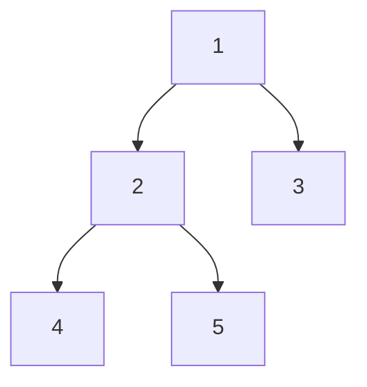
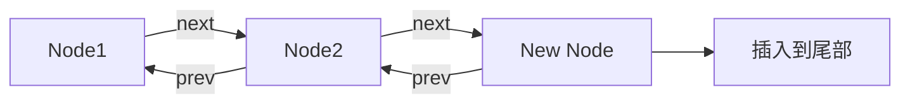
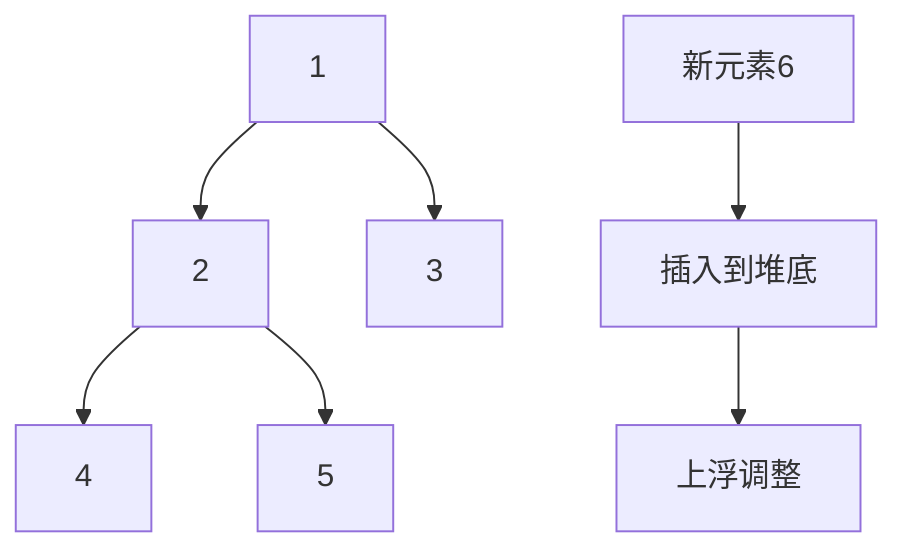

# 3. Queue

***

# Java集合框架之Queue接口：Java面试八股文详解

***

## 1. 概述与定义

Queue接口是Java集合框架中的一个核心接口，继承自Collection接口，表示一个**先进先出（FIFO）** 的元素集合。它的核心特性是元素按照入队顺序依次出队，队尾添加元素，队头移除元素，并支持检查队头元素、判断队列是否为空等操作。常见的实现类包括LinkedList（基于双向链表）、PriorityQueue（基于堆的优先级队列）和ArrayDeque（基于循环数组的双端队列）。

### 定义

简单来说，Queue接口是一个支持FIFO的集合，适用于需要按顺序处理元素的场景，例如任务队列或消息队列。在面试中，你可以这样回答：“Queue是Java集合框架中的一个接口，继承自Collection，特点是先进先出，支持入队、出队和检查操作。”这个回答简洁有力，能快速抓住重点，同时为后续展开铺垫。

### 背景与重要性

Java集合框架是Java语言的核心组成部分，而Queue作为一种特殊的数据结构，在多线程、并发编程和任务调度中应用广泛。例如，LinkedList可作为普通队列，PriorityQueue支持优先级管理，ArrayDeque提供高效的队列和栈操作。掌握Queue接口及其实现类的特性、原理和应用场景，不仅能让你在面试中脱颖而出，还能提升你在实际项目中的编码效率和质量。即使某些特性（如泛型支持）不是Queue的主要关注点，但在开发中能提高类型安全性和代码可读性，因此也值得一提。

***

## 2. 主要特点

Queue接口有以下几个显著特点，熟悉这些特点能帮助你在面试中快速定位问题并展开分析：

- **先进先出（FIFO）** 📋 &#x20;

  元素按入队顺序出队，队头是最早入队的元素。
- **支持阻塞与非阻塞操作** 🔄 &#x20;

  Queue定义了阻塞和非阻塞的入队出队方法，适应不同场景。
- **多种实现类** 🛠️ &#x20;

  LinkedList、PriorityQueue、ArrayDeque等，满足不同性能需求。
- **线程安全性** 🔒 &#x20;

  部分实现类如ConcurrentLinkedQueue是线程安全的，适用于多线程环境。
- **支持优先级** ⚖️ &#x20;

  PriorityQueue根据自然顺序或自定义Comparator实现优先级队列。

### 面试Tips

提到“先进先出”时，可以结合场景说：“在任务调度系统中，任务按提交顺序执行，Queue能保证这一点。”对于“线程安全性”，可以补充：“在多线程场景下，我会用ConcurrentLinkedQueue避免锁竞争。”这些描述能展现你的实战经验和深度理解。

***

## 3. 应用目标

Queue接口的设计目标是提供一个高效、灵活的先进先出数据结构，其具体目标包括：

- **支持FIFO操作** &#x20;

  提供标准的入队、出队和检查方法，实现先进先出。
- **适应多种场景** &#x20;

  通过不同实现类满足性能和功能需求，如优先级、并发等。
- **提供阻塞与非阻塞操作** &#x20;

  支持超时、轮询等操作，适应任务调度、消息传递等场景。
- **简化队列操作** &#x20;

  提供丰富的API（如offer、poll、peek），简化开发。
- **支持泛型** &#x20;

  确保类型安全，提高代码可读性。

在面试中，你可以总结：“Queue接口的目标是提供一个先进先出的集合，支持多种操作和实现，适应任务调度、消息队列等多种场景，简化队列操作。”这个回答简洁清晰，能快速传递核心信息。虽然“支持泛型”不是首要目标，但在实际开发中能提升代码质量，适当提及能体现全面思考。

***

## 4. 主要内容及其组成部分

Queue接口是Java集合框架的一部分，其主要内容包括接口定义、常用方法、实现类及其特性。以下详细讲解每个部分，结合代码、表格和图表，确保内容全面且直观。

### 4.1 Queue接口定义

Queue接口继承自Collection接口，定义了特有的方法，如入队、出队和检查操作。

#### 示例：Queue接口部分方法

```java 
public interface Queue<E> extends Collection<E> {
    boolean add(E e);       // 入队，队列满时抛异常
    boolean offer(E e);     // 入队，队列满时返回false
    E remove();            // 出队，队列空时抛异常
    E poll();              // 出队，队列空时返回null
    E element();           // 获取队头元素，队列空时抛异常
    E peek();              // 获取队头元素，队列空时返回null
}
```


**代码说明**：此代码展示了Queue接口的常用方法。`add`和`offer`用于入队，区别在于异常处理；`remove`和`poll`用于出队，区别在于空队列时的返回值；`element`和`peek`用于检查队头元素。面试时可以说：“Queue接口提供了两套方法，一套抛异常，一套返回特殊值，适应不同场景。”

### 4.2 常用实现类

Queue接口有多个实现类，各有特点：

- **LinkedList**：基于双向链表，实现Deque接口，可用作队列或双端队列。
- **PriorityQueue**：基于堆，支持优先级，元素按自然顺序或Comparator出队。
- **ArrayDeque**：基于循环数组，高效实现双端队列。
- **ConcurrentLinkedQueue**：线程安全的无界队列，适用于高并发。

#### 示例：LinkedList和PriorityQueue使用

```java 
import java.util.LinkedList;
import java.util.PriorityQueue;
import java.util.Queue;

public class QueueDemo {
    public static void main(String[] args) {
        Queue<String> linkedList = new LinkedList<>();
        linkedList.offer("A");
        linkedList.offer("B");
        System.out.println(linkedList.poll()); // 输出: A

        Queue<Integer> priorityQueue = new PriorityQueue<>();
        priorityQueue.offer(3);
        priorityQueue.offer(1);
        priorityQueue.offer(2);
        System.out.println(priorityQueue.poll()); // 输出: 1
    }
}
```


**代码说明**：此代码展示了LinkedList作为FIFO队列（输出A）和PriorityQueue作为优先级队列（输出最小值1）的使用。面试时可以说：“LinkedList适合普通队列，PriorityQueue适合任务优先级管理。”

### 4.3 LinkedList原理

LinkedList基于双向链表实现，具有以下特点：

- **节点结构**：每个节点包含前驱、后继和元素。
- **入队出队**：修改指针，时间复杂度O(1)。
- **随机访问**：需遍历，时间复杂度O(n)。

#### 示例：LinkedList节点

```java 
private static class Node<E> {
    E item;
    Node<E> next;
    Node<E> prev;
    Node(Node<E> prev, E element, Node<E> next) {
        this.item = element;
        this.next = next;
        this.prev = prev;
    }
}
```


**代码说明**：此代码展示了LinkedList的节点结构，包含前驱和后继指针。面试时可以说：“LinkedList通过双向链表实现，入队出队效率高，适合频繁操作。”

### 4.4 PriorityQueue原理

PriorityQueue基于二叉堆实现，具有以下特点：

- **堆结构**：完全二叉树，父节点小于（或大于）子节点。
- **入队**：插入元素并上浮调整堆，时间复杂度O(log n)。
- **出队**：移除堆顶并下沉调整堆，时间复杂度O(log n)。
- **不保证整体有序**：仅保证队头元素是最小（或最大）的。

#### 示例：PriorityQueue内部结构




**图表说明**：此图展示了一个小顶堆，父节点小于子节点。面试时可用来说明PriorityQueue的堆结构。

### 4.5 ArrayDeque原理

ArrayDeque基于循环数组实现，具有以下特点：

- **循环数组**：头尾相连，避免频繁移动元素。
- **入队出队**：通过头尾指针操作，时间复杂度O(1)。
- **扩容**：容量不足时翻倍扩容。

#### 示例：ArrayDeque扩容

```java 
private void doubleCapacity() {
    int p = head;
    int n = elements.length;
    int r = n - p;
    int newCapacity = n << 1;
    if (newCapacity < 0)
        throw new IllegalStateException("Sorry, deque too big");
    Object[] a = new Object[newCapacity];
    System.arraycopy(elements, p, a, 0, r);
    System.arraycopy(elements, 0, a, r, p);
    elements = a;
    head = 0;
    tail = n;
}
```


**代码说明**：此代码展示了ArrayDeque的扩容逻辑，翻倍扩容并调整头尾指针。面试时可以说：“ArrayDeque用循环数组实现，入队出队高效，适合高性能场景。”

### 4.6 线程安全Queue

ConcurrentLinkedQueue是线程安全的无界队列，基于CAS（Compare And Swap）实现。

- **无锁结构**：通过CAS操作实现线程安全，避免锁竞争。
- **高并发**：适合高并发读写场景。

#### 示例：ConcurrentLinkedQueue使用

```java 
import java.util.concurrent.ConcurrentLinkedQueue;
import java.util.Queue;

public class ConcurrentQueueDemo {
    public static void main(String[] args) {
        Queue<String> concurrentQueue = new ConcurrentLinkedQueue<>();
        concurrentQueue.offer("A");
        concurrentQueue.offer("B");
        System.out.println(concurrentQueue.poll()); // 输出: A
    }
}
```


**代码说明**：ConcurrentLinkedQueue与LinkedList使用类似，但线程安全。面试时可以说：“在多线程环境下，ConcurrentLinkedQueue是更好的选择，性能高且无锁。”

### 4.7 阻塞队列

BlockingQueue是Queue的子接口，支持阻塞操作，常用于生产者-消费者模式。

- **put / take**：阻塞入队和出队。
- **offer / poll with timeout**：带超时的非阻塞操作。

#### 示例：BlockingQueue使用

```java 
import java.util.concurrent.ArrayBlockingQueue;
import java.util.concurrent.BlockingQueue;

public class BlockingQueueDemo {
    public static void main(String[] args) throws InterruptedException {
        BlockingQueue<String> blockingQueue = new ArrayBlockingQueue<>(10);
        blockingQueue.put("A");
        System.out.println(blockingQueue.take()); // 输出: A
    }
}
```


**代码说明**：此代码展示了BlockingQueue的阻塞操作。面试时可以说：“BlockingQueue在任务调度和线程池中很常见，能自动阻塞等待。”

### 实现类对比表格

| 实现类                   | 底层结构 | 入队出队     | 线程安全 | 优先级 | 适用场景      |
| --------------------- | ---- | -------- | ---- | --- | --------- |
| LinkedList            | 双向链表 | O(1)     | 否    | 否   | 普通队列      |
| PriorityQueue         | 二叉堆  | O(log n) | 否    | 是   | 优先级任务     |
| ArrayDeque            | 循环数组 | O(1)     | 否    | 否   | 高性能队列     |
| ConcurrentLinkedQueue | 无锁链表 | O(1)     | 是    | 否   | 高并发环境     |
| ArrayBlockingQueue    | 数组   | O(1)     | 是    | 否   | 生产者-消费者模式 |

**表格说明**：此表格对比了Queue实现类的特性。LinkedList适合普通队列，PriorityQueue支持优先级，ArrayDeque高性能，ConcurrentLinkedQueue线程安全，ArrayBlockingQueue支持阻塞。面试时可用此表格回答“Queue实现类的区别”。

***

## 5. 原理剖析

Queue接口的实现原理涉及数据结构、线程安全、阻塞机制等核心技术。以下深入解析LinkedList、PriorityQueue和BlockingQueue的原理，结合Mermaid图表说明。

### 5.1 LinkedList原理

LinkedList基于双向链表实现，核心在于节点的插入和删除。

- **入队**：在尾部添加节点，修改尾指针。
- **出队**：移除头部节点，修改头指针。
- **双向链表**：支持从头尾两端操作，可用作Deque。

#### Mermaid图表：LinkedList入队




**图表说明**：此图展示LinkedList入队操作，通过修改指针实现。面试时可用来说明其高效性。

### 5.2 PriorityQueue原理

PriorityQueue基于二叉堆实现，核心在于堆的调整。

- **入队**：插入元素到堆底，上浮调整堆。
- **出队**：移除堆顶，将堆底元素移到顶部，下沉调整堆。
- **堆性质**：父节点 <= 子节点（小顶堆）。

#### Mermaid图表：PriorityQueue入队




**图表说明**：此图展示PriorityQueue入队时上浮调整的过程。面试时可用来说明堆的维护。

### 5.3 BlockingQueue原理

BlockingQueue通过锁和条件变量实现阻塞操作。

- **put**：如果队列满，等待notFull条件。
- **take**：如果队列空，等待notEmpty条件。
- **锁机制**：保证线程安全。

#### 示例：ArrayBlockingQueue put操作

```java 
public void put(E e) throws InterruptedException {
    lock.lockInterruptibly();
    try {
        while (count == items.length)
            notFull.await();
        enqueue(e);
    } finally {
        lock.unlock();
    }
}
```


**代码说明**：此代码展示了put操作，当队列满时等待notFull条件。面试时可以说：“BlockingQueue用Condition实现阻塞，适合生产者-消费者模式。”

### 5.4 线程安全原理

ConcurrentLinkedQueue通过CAS实现无锁操作。

- **CAS**：Compare And Swap，原子操作。
- **无锁结构**：避免锁竞争，提升并发性能。

#### 示例：ConcurrentLinkedQueue offer操作

```java 
public boolean offer(E e) {
    checkNotNull(e);
    final Node<E> newNode = new Node<E>(e);
    for (Node<E> t = tail, p = t;;) {
        Node<E> q = p.next;
        if (q == null) {
            if (p.casNext(null, newNode)) {
                if (p != t)
                    casTail(t, newNode);
                return true;
            }
        } else {
            // 省略部分逻辑
        }
    }
}
```


**代码说明**：此代码用CAS操作插入新节点，实现无锁入队。面试时可以说：“ConcurrentLinkedQueue用CAS实现高并发，性能优于加锁。”

***

## 6. 应用与拓展

Queue接口在实际项目中应用广泛，以下是典型场景：

- **任务队列** &#x20;

  如线程池的任务队列，用LinkedList或ArrayDeque。
- **消息队列** &#x20;

  如消息中间件的本地队列，用ConcurrentLinkedQueue。
- **优先级任务** &#x20;

  如任务调度系统，用PriorityQueue管理优先级。
- **生产者-消费者** &#x20;

  用BlockingQueue实现线程间通信。

### 拓展

Queue可与其他技术结合：

- **多线程**：BlockingQueue在多线程中作为任务缓冲。
- **Spring**：Spring TaskExecutor用Queue管理异步任务。
- **消息中间件**：RabbitMQ、Kafka等内部使用Queue。

#### 示例：线程池任务队列

```java 
import java.util.concurrent.*;

public class ThreadPoolDemo {
    public static void main(String[] args) {
        ExecutorService executor = new ThreadPoolExecutor(
            5, 10, 60L, TimeUnit.SECONDS,
            new ArrayBlockingQueue<>(100)
        );
        executor.submit(() -> System.out.println("Task"));
        executor.shutdown();
    }
}
```


**代码说明**：此代码用ArrayBlockingQueue作为线程池的任务队列，管理任务提交。面试时可以说：“线程池用BlockingQueue缓冲任务，自动阻塞等待。”

***

## 7. 面试问答

以下是五个常见问题及详细回答，模仿面试者口吻，确保自然且有深度。

### 问题 1：Queue和List有什么区别？

**回答**： &#x20;

“Queue和List都是Collection的子接口，但用途不同。Queue是先进先出的，主要用于任务调度和消息传递，比如FIFO队列；而List是有序集合，支持随机访问，通过索引操作元素。Queue有入队出队方法，像offer和poll，List有get和set。项目里我用Queue做任务队列，用List存数据列表。”

### 问题 2：PriorityQueue是如何实现优先级的？

**回答**： &#x20;

“PriorityQueue用二叉堆实现，默认是小顶堆。入队时把元素插到堆底，然后上浮调整，保证父节点小于子节点；出队时移除堆顶，把堆底元素移到顶部，下沉调整。它不保证整体有序，只保证队头是最小元素。我在任务调度系统里用PriorityQueue，优先执行紧急任务。”

### 问题 3：BlockingQueue在多线程中有何作用？

**回答**： &#x20;

“BlockingQueue在多线程里特别适合生产者-消费者模式。生产者用put加任务，消费者用take取任务，队列满或空时会自动阻塞等待，简化线程通信。我在项目里用ArrayBlockingQueue做任务缓冲，配合线程池，消费者线程自动处理任务。”

### 问题 4：ConcurrentLinkedQueue和LinkedBlockingQueue的区别？

**回答**： &#x20;

“ConcurrentLinkedQueue是无锁的无界队列，用CAS实现，适合高并发读写，性能高但不支持阻塞；LinkedBlockingQueue是有界阻塞队列，用锁实现，支持put和take阻塞，适合生产者-消费者模式。我在高并发场景下用ConcurrentLinkedQueue减少锁竞争，低并发用LinkedBlockingQueue支持阻塞。”

### 问题 5：如何选择Queue的实现类？

**回答**： &#x20;

“选择Queue实现类得看场景。普通FIFO用LinkedList或ArrayDeque，ArrayDeque性能更好；需要优先级用PriorityQueue；多线程高并发用ConcurrentLinkedQueue，生产者-消费者用BlockingQueue。我在项目里一般先用LinkedList试，如果有并发需求再换ConcurrentLinkedQueue或BlockingQueue。”

***

## 总结

本文从Queue接口的定义到原理、应用场景及面试应对，覆盖所有核心知识点。通过代码、表格和Mermaid图表，内容直观易懂，背熟后能在面试中自信回答问题，展现你的专业实力！✨
