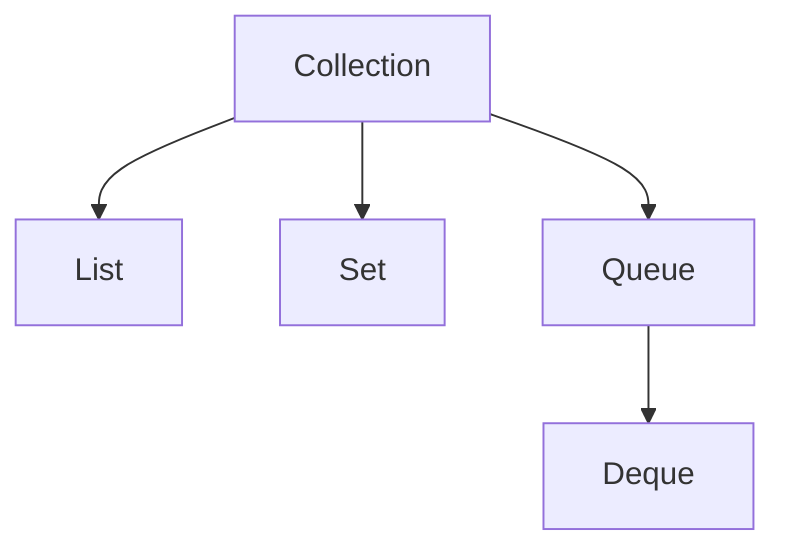

# 一. Collection

## 1. 概述与定义

在 Java 语言中，集合（Collection）是存储一组对象的容器，是 Java 集合框架的根接口，位于 `java.util.Collection` 包中。它定义了集合中所有通用操作的基本契约，例如添加、删除、查找、遍历等。所有的集合类（例如 List、Set、Queue 等）均直接或间接地继承 Collection 接口，从而保证了集合操作的一致性和扩展性。

Collection 接口主要用于解决数据组织、操作和管理问题，它将对象的存储与算法操作相分离，极大地提高了代码的可重用性和可扩展性。通过使用 Collection 接口，我们可以用统一的方式处理不同类型的集合，这在大型系统开发中尤为重要。📚

此外，Java 5 引入了泛型，使得 Collection 接口在类型安全和编译时检查方面得到了进一步提升，从而避免了运行时出现类型转换异常。正因如此，Collection 成为了开发人员在处理数据集合时不可或缺的基础接口。

## 2. 主要特点

Java Collection 接口具有以下几个主要特点，这些特点使其成为构建高效、灵活的数据存储与操作机制的重要基础：

1. **统一接口标准** &#x20;

   Collection 定义了一系列标准操作，如 `add()`、`remove()`、`contains()`、`size()`、`iterator()` 等，使得不同类型的集合（如 List、Set、Queue）在操作上保持一致性。这种设计使得程序可以轻松切换不同集合实现而无需修改大量代码。🎯
2. **泛型支持** &#x20;

   利用泛型，Collection 接口可以在编译时检查类型安全，避免运行时类型转换异常，增强了代码的健壮性和可维护性。比如，声明 `Collection<String>` 可以确保集合中只存储字符串。🔒
3. **灵活的存储结构** &#x20;

   Collection 接口没有规定具体的存储结构，其子接口和实现类（如 ArrayList、LinkedList、HashSet、TreeSet 等）各有特点，适用于不同的应用场景。开发者可以根据具体需求选择最优的数据结构。⚙️
4. **迭代器模式支持** &#x20;

   Collection 提供了 `iterator()` 方法，通过迭代器模式，可以统一遍历集合中的元素，避免直接操作底层数据结构。借助 Java 8 的增强型 for-each 语法和 Stream API，更加简化了集合操作。🔄
5. **线程安全的扩展** &#x20;

   虽然 Collection 本身并非线程安全，但通过工具类（如 `Collections.synchronizedList()`）或并发集合类（如 CopyOnWriteArrayList），可以方便地实现多线程场景下的数据安全操作。🚦

下表对 Collection 接口的主要方法及其功能进行了归纳说明：

| 方法名称                                 | 功能说明               | 备注                |
| ------------------------------------ | ------------------ | ----------------- |
| add(E e)                             | 向集合中添加一个元素         | 如果添加成功返回 true     |
| remove(Object o)                     | 从集合中删除指定元素         | 若元素存在并删除成功返回 true |
| contains(Object o)                   | 判断集合中是否包含指定元素      | 返回 true 或 false   |
| size()                               | 返回集合中元素的个数         | 用于判断集合是否为空        |
| iterator()                           | 返回集合中元素的迭代器        | 支持使用迭代器模式遍历集合     |
| addAll(Collection\\\<? extends E> c) | 将指定集合中的所有元素添加到当前集合 | 用于批量添加元素          |
| clear()                              | 清空集合中的所有元素         | 重置集合为空            |

## 3. 应用目标

Java 中的 Collection 接口设计目标主要体现在以下几个方面，这些目标正是构建高内聚、低耦合程序的重要基础：

1. **数据统一存储** &#x20;

   Collection 提供了一个统一的数据存储接口，使得程序员能够使用同一套 API 来存储和管理不同类型的对象，无论数据来源如何，都可以方便地组织在集合中。
2. **解耦数据与算法** &#x20;

   Collection 将数据存储和数据操作分离，程序只需关注数据结构提供的基本操作，而将具体算法（如排序、搜索）交由工具类或算法实现，从而实现模块解耦和复用。🤝
3. **提高代码可维护性** &#x20;

   由于所有集合操作都遵循相同的接口规范，当需要更换集合实现时（例如由 ArrayList 切换到 LinkedList），只需对数据存储部分做最小修改，大大降低了维护成本。
4. **支持泛型与类型安全** &#x20;

   利用泛型，Collection 接口在编译时就可以检查数据类型，确保数据在整个处理过程中的一致性和安全性，避免了运行时出现类型转换错误。
5. **便捷的数据操作与遍历** &#x20;

   通过提供统一的迭代器接口和增强的 for-each 语法，Collection 接口使得遍历和操作集合变得简单直观，同时结合 Stream API，可以实现复杂的数据转换与并行处理。🚀
6. **扩展性和灵活性** &#x20;

   Collection 接口没有限制具体的实现方式，不同的子接口和实现类可以根据应用场景提供不同的存储策略，如顺序存储、链表存储、散列存储等，这为程序优化和扩展提供了充分的灵活性。

通过这些应用目标，Java 集合框架为开发人员提供了一个强大、灵活且高效的数据处理平台，是构建大型、高性能 Java 应用程序的基石。

## 4. 主要内容及其组成部分

Collection 接口作为 Java 集合框架的核心，包含了大量基础方法和功能。下面对 Collection 所包含的主要组成部分进行详细解释。

### 4.1 基本操作方法

Collection 接口定义了许多基础操作方法，包括添加、删除、查询、遍历等，这些方法是所有集合类的基本功能。 &#x20;

- **添加与删除**：`add(E e)` 用于向集合中添加单个元素；`addAll(Collection<? extends E> c)` 可批量添加；`remove(Object o)` 和 `removeAll(Collection<?> c)` 用于删除单个或多个元素。 &#x20;
- **查询**：`contains(Object o)` 检查集合中是否存在指定元素；`containsAll(Collection<?> c)` 检查集合中是否包含另一个集合的所有元素。 &#x20;
- **集合大小与清空**：`size()` 返回集合中元素的个数；`isEmpty()` 判断集合是否为空；`clear()` 清空集合所有元素。 &#x20;

这些方法为基本数据操作提供了标准接口，确保了不同集合实现之间的一致性。

### 4.2 迭代与遍历

Collection 接口提供了 `iterator()` 方法，使得集合可以使用迭代器模式进行遍历。通过迭代器，程序员可以以统一方式访问集合中的所有元素，而无需关心底层数据结构的实现细节。此外，Java 5 引入的增强 for-each 语法以及 Java 8 的 Stream API 进一步简化了集合遍历和数据处理。

示例代码（使用迭代器遍历）：

```java 
Iterator<String> iterator = collection.iterator();
while (iterator.hasNext()) {
    String element = iterator.next();
    System.out.println(element);
}
```


### 4.3 泛型与类型安全

Java 集合框架广泛应用泛型技术，使得 Collection 接口在使用时可以指定元素的类型，确保编译时类型检查，从而避免了不必要的强制类型转换。通过泛型，代码不仅更安全，也更易于阅读和维护。例如：

```java 
Collection<Integer> numbers = new ArrayList<>();
numbers.add(1);
numbers.add(2);
// 编译时可以检查类型，避免将非 Integer 类型加入集合
```


### 4.4 子接口及其扩展

虽然 Collection 接口本身只定义了基本操作，但它的子接口为不同应用场景提供了丰富的扩展：

- **List**：有序集合，允许重复元素，常用实现包括 ArrayList、LinkedList 等。 &#x20;
- **Set**：无序集合，不允许重复元素，常用实现有 HashSet、TreeSet 等。 &#x20;
- **Queue**：队列集合，通常用于实现先进先出（FIFO）数据结构，常见实现有 LinkedList、PriorityQueue。 &#x20;
- **Deque**：双端队列，支持从两端插入或删除元素。 &#x20;

虽然这些子接口属于集合体系的上层内容，但在理解 Collection 接口时，必须认识到它们都是基于 Collection 定义的操作标准。 &#x20;

### 4.5 工具类与辅助操作

Java 提供了大量工具类（例如 `Collections` 和 `Arrays` 类）用于对 Collection 的操作，如排序、查找、反转、同步包装等。这些工具类充分利用了 Collection 接口的通用性，实现了对不同集合的统一操作。例如：

```java 
List<String> list = new ArrayList<>();
list.add("apple");
list.add("orange");
Collections.sort(list);
```


这些工具方法大大简化了开发人员对集合的常见操作，同时也促进了代码的复用和可维护性。

下面的表格总结了 Collection 接口常见方法及其用途：

| 方法名称                 | 用途描述          | 示例用途       |
| -------------------- | ------------- | ---------- |
| add(E e)             | 添加单个元素        | 添加新元素到集合   |
| remove(Object o)     | 删除指定元素        | 从集合中删除特定对象 |
| iterator()           | 获取集合迭代器       | 遍历集合中的所有元素 |
| size()               | 获取集合中元素个数     | 判断集合是否为空   |
| contains(Object o)   | 检查集合中是否包含指定元素 | 数据校验、条件判断  |
| addAll(Collection c) | 批量添加集合中的元素    | 合并两个集合     |
| clear()              | 清空集合所有元素      | 重置集合状态     |

## 5. 原理剖析

深入理解 Collection 接口的底层原理，有助于我们在面试中更好地回答相关问题。下面对 Collection 接口的设计思想和工作原理进行详细解析。

### 5.1 接口与抽象数据类型

Collection 接口本身是一种抽象数据类型（ADT），它定义了集合操作的规范，而不提供具体实现。不同的集合实现类（如 ArrayList、HashSet 等）在实现这些接口方法时，根据具体的数据结构和算法做出优化。正因为 Collection 只是定义了方法的契约，所以它具备高度的灵活性和扩展性，同时也体现了面向接口编程的设计理念。

### 5.2 迭代器模式

Collection 接口中的 `iterator()` 方法体现了迭代器设计模式。迭代器模式提供了一种统一的遍历集合的方法，而不暴露集合的内部实现。这样既保护了数据结构的封装性，又使得遍历操作具有良好的可扩展性和一致性。Java 8 进一步扩展了这一点，通过 Stream API 和 Lambda 表达式，使得集合操作更加声明式和并行化。

### 5.3 泛型机制

Java 泛型机制在 Collection 接口中的应用，确保了在编译阶段即可对数据类型进行检查，从而大大降低了运行时出现类型转换异常的风险。泛型不仅提供了类型安全保障，还提高了代码的可读性和复用性。底层实现上，泛型是通过擦除机制实现的，即在运行时集合中实际存储的都是 Object 类型，但编译器会对类型进行检查。

### 5.4 多态与接口实现

集合框架利用多态机制实现了对各种集合操作的统一调用。由于所有集合类都实现了 Collection 接口，在调用集合方法时，可以使用父接口的引用指向任意具体实现对象。这使得程序设计更为灵活，能够轻松切换集合实现而无需修改代码调用部分。这种设计充分体现了面向对象编程中“面向接口编程”的原则。

### 5.5 性能与扩展性

不同的 Collection 实现具有不同的性能特点。例如，ArrayList 基于数组实现，支持随机访问但在插入和删除时性能较低；而 LinkedList 基于链表实现，适合频繁插入和删除操作。通过统一的 Collection 接口，程序员可以根据实际性能需求选择最合适的集合实现。同时，Java 集合框架中还提供了并发集合类，如 CopyOnWriteArrayList，来满足多线程环境下的高性能要求。

下面使用 Mermaid 图展示 Collection 接口与其常见子接口之间的层次结构：




图中展示了 Collection 接口作为根接口，其子接口 List、Set、Queue 以及 Queue 的子接口 Deque 之间的继承关系，体现了集合体系的层次结构。

## 6. 应用与拓展

在实际开发中，Collection 接口的应用十分广泛，不仅仅用于存储数据，还常常作为业务数据处理、数据传输和算法运算的基础。下面列举几种典型应用场景及扩展方向：

### 6.1 数据存储与处理

在日常开发中，我们经常需要将数据存储在集合中进行快速操作。例如，通过 ArrayList 存储订单列表，通过 HashSet 进行唯一性校验，或利用 Queue 实现任务调度。使用 Collection 接口统一处理数据，可以极大地简化代码逻辑，并方便后续扩展。

### 6.2 Stream API 与函数式编程

Java 8 引入的 Stream API 与 Lambda 表达式与 Collection 接口完美结合，使得数据处理更加声明式和并行化。通过链式调用，可以轻松实现过滤、映射、排序等复杂操作。例如：

```java 
List<String> names = Arrays.asList("Alice", "Bob", "Charlie", "David");
List<String> filtered = names.stream()
    .filter(name -> name.startsWith("A") || name.startsWith("D"))
    .sorted()
    .collect(Collectors.toList());
```


这种方式不仅提高了代码的可读性，还使得大数据量处理具有更高的性能和扩展性。

### 6.3 并发与线程安全

虽然 Collection 接口本身不是线程安全的，但在多线程场景中，我们可以利用同步包装（如 `Collections.synchronizedList()`）或并发集合（如 CopyOnWriteArrayList、ConcurrentLinkedQueue）来保证线程安全。通过这种方式，Collection 在高并发场景下依然能够高效稳定地工作。

### 6.4 与第三方框架集成

在实际项目中，Spring、Hibernate、MyBatis 等主流框架大量使用 Collection 接口来传递和处理数据。例如，Spring MVC 中的数据绑定和 REST 接口常利用 Collection 传递 JSON 数组；Hibernate 查询返回的结果也多为 List 或 Set。这使得掌握 Collection 接口不仅对 Java 编程有帮助，也为学习和使用主流框架打下了坚实基础。

### 6.5 拓展思路

- **自定义集合实现** &#x20;

  在某些特定场景下，可以通过继承 Collection 接口或其子接口来自定义集合实现，从而满足特殊业务需求。 &#x20;
- **算法优化** &#x20;

  通过结合集合框架与设计模式（如装饰者、策略模式），可以对常见算法（排序、查找、过滤）进行优化，实现高效的数据处理。 &#x20;
- **数据持久化与缓存** &#x20;

  Collection 接口与数据持久化技术（如数据库、缓存）结合，可构建高效的数据传输层，实现离线处理和大数据量分析。

## 7. 面试问答

以下是从面试者角度出发的五个常见面试问题及详细回答，帮助考生在面试中从容解答关于 Collection 接口的相关问题。

### 问题1：请介绍 Java 中的 Collection 接口及其主要作用？

答： &#x20;

Collection 接口是 Java 集合框架的根接口，定义了存储、操作和遍历一组对象的基本方法。它为所有具体集合类（如 List、Set、Queue 等）提供了统一的操作标准，主要作用在于实现数据的统一存储、解耦数据与算法、提高代码复用性与可维护性。通过泛型和迭代器机制，Collection 接口还保证了类型安全和数据访问的一致性。

### 问题2：请说明 Collection 接口中常用的基本方法及其用途？

答： &#x20;

Collection 接口中常用的方法包括：

- `add(E e)`：用于添加单个元素到集合中；
- `remove(Object o)`：用于从集合中删除指定元素；
- `contains(Object o)`：判断集合中是否包含某个元素；
- `size()`：返回集合中元素的个数；
- `iterator()`：返回集合的迭代器，用于遍历集合；
- `addAll(Collection<? extends E> c)`：批量添加元素；
- `clear()`：清空集合中所有元素。 &#x20;

这些方法为集合数据的基本操作提供了标准化接口，能够满足大部分常见的集合操作需求。

### 问题3：Collection 接口是如何利用泛型实现类型安全的？请举例说明。

答： &#x20;

Java 泛型机制使得 Collection 接口在声明时可以指定元素类型，从而在编译时进行类型检查。例如，声明 `Collection<String>` 表示该集合只能存储字符串，这样在编译阶段就能捕获错误，避免运行时出现 ClassCastException。示例代码如下：

```java 
Collection<String> names = new ArrayList<>();
names.add("Alice");
names.add("Bob");
// 编译器会阻止非 String 类型的元素被加入
// names.add(123); // 此行代码会编译错误
```


这种机制提高了代码的健壮性和安全性，同时也增强了代码的可读性和维护性。

### 问题4：请解释 Collection 接口与迭代器模式之间的关系。

答： &#x20;

Collection 接口定义了 `iterator()` 方法，该方法返回一个 Iterator 对象。迭代器模式为遍历集合提供了一种统一的方式，屏蔽了集合底层数据结构的实现细节。通过 Iterator，可以依次访问集合中的每个元素，而无需关心集合的具体实现（如数组或链表）。这种设计既提高了集合的封装性，又使得遍历操作具有一致性和灵活性。

### 问题5：在实际项目中，你如何选择具体的集合实现类？请说明你的决策依据。

答： &#x20;

选择集合实现类主要依据以下几点： &#x20;

1. **数据存储要求**：如果需要有序访问且支持随机访问，可选择 ArrayList；如果频繁进行插入和删除操作，则 LinkedList 更为适合。 &#x20;
2. **是否需要去重**：如果集合中不允许重复元素，通常选择 Set 接口的实现，如 HashSet 或 TreeSet。 &#x20;
3. **线程安全性要求**：在多线程场景中，可以使用同步集合或并发集合，如 Collections.synchronizedList() 或 CopyOnWriteArrayList。 &#x20;
4. **性能考虑**：不同集合实现的时间复杂度不同，例如 HashSet 的查找效率较高，而 TreeSet 支持有序排序。 &#x20;

基于这些因素，我会根据业务场景和性能要求综合考虑，选择最适合的集合实现，以达到最佳效果。

## 总结

本文从概述与定义、主要特点、应用目标、主要内容及其组成部分、原理剖析、应用与拓展以及面试问答七个方面，全面解析了 Java 中 Collection 接口的各项知识点。通过介绍 Collection 接口的基本操作、迭代遍历、泛型支持以及在实际开发中的各种应用场景，帮助开发人员深入理解集合框架的设计思想和工作原理。 &#x20;

此外，文章还通过详细的示例代码、归纳表格和层次结构图表（Mermaid）展示了 Collection 与其子接口之间的关系，进一步阐明了面向接口编程和泛型机制在集合中的应用。 &#x20;

希望这篇文章能够为各位 Java 工程师在面试复习、项目开发及技术分享中提供有力支持，帮助大家构建高内聚、低耦合且高效的数据处理系统。加油！🚀

[1. List](<1. List/1. List.md> "1. List")

[2. Set](<2. Set/2. Set.md> "2. Set")

[3. Queue](<3. Queue/3. Queue.md> "3. Queue")
