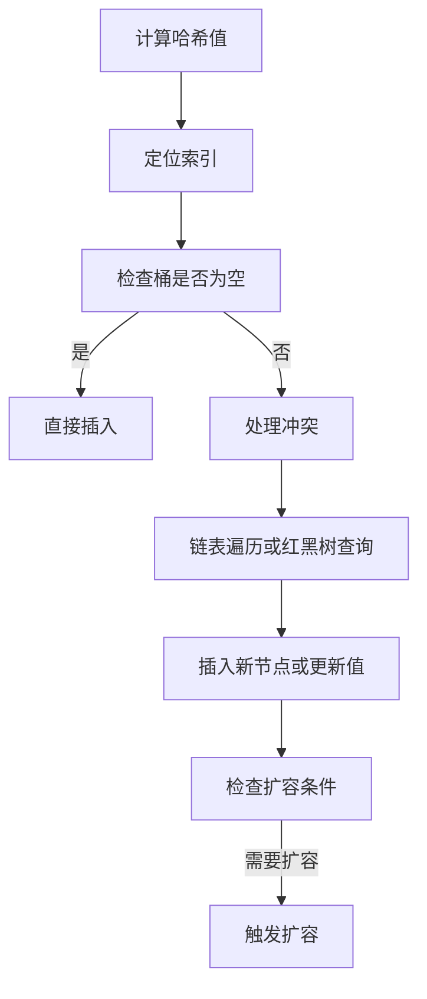

# 2. 添加数据

# Java面试八股文：HashMap添加数据深度解析（结构清晰，含示例与图表）

***

## 1. 概述与定义 &#x20;

**HashMap的添加数据（** \*\*​`put`\*\***操作）** 是其核心功能之一，通过键值对（Key-Value）的存储实现高效插入。其本质是通过 **哈希函数** 将键映射到数组的索引位置，并结合 **链表** 或 **红黑树** 解决哈希冲突。 &#x20;

**核心流程**： &#x20;

1. 计算键的哈希值。 &#x20;
2. 定位数组索引位置。 &#x20;
3. 处理哈希冲突（链表或红黑树）。 &#x20;
4. 插入新节点或更新现有值。 &#x20;
5. 检查扩容条件并触发扩容。 &#x20;

***

## 2. 主要特点 &#x20;

### 2.1 数据结构特性 &#x20;

- **数组（Node\[] table）**：存储键值对的桶（Bucket），初始容量为 `16`，扩容时按 **2 倍增长**。 &#x20;
- **链表/红黑树**： &#x20;
  - **链表**：解决哈希冲突，JDK 8 之后改为 **尾插法**（减少并发扩容时的死循环风险）。 &#x20;
  - **红黑树**：当链表长度 ≥8 且数组容量 ≥64 时触发，时间复杂度从 `O(n)` 降至 `O(log n)`。 &#x20;

### 2.2 性能特性 &#x20;

- **时间复杂度**： &#x20;
  - **平均**：`O(1)`（理想情况）。 &#x20;
  - **最坏**：`O(n)`（极端哈希冲突且未触发红黑树转换时）。 &#x20;
- **空间复杂度**：与键值对数量和数组容量相关。 &#x20;

***

## 3. 应用目标 &#x20;

- **高效插入**：通过哈希表快速定位存储位置。 &#x20;
- **动态扩容**：根据负载因子（默认 `0.75`）自动扩展容量。 &#x20;
- **冲突处理**：通过链表或红黑树平衡性能。 &#x20;

***

## 4. 主要内容及其组成部分 &#x20;

### 4.1 核心属性（与添加数据相关） &#x20;

| 属性名            | 类型                | 作用描述                                     |
| -------------- | ----------------- | ---------------------------------------- |
| \`table\`      | \`Node\<K,V>\[]\` | 存储所有键值对的数组，初始容量为 \`16\`。                 |
| \`size\`       | \`int\`           | 当前存储的键值对总数，每次插入成功后递增。                    |
| \`threshold\`  | \`int\`           | 扩容阈值（\`capacity × loadFactor\`），超过时触发扩容。 |
| \`loadFactor\` | \`float\`         | 负载因子，默认 \`0.75\`，控制扩容时机。                 |

### 4.2 核心方法：`put(K key, V value)` &#x20;

```java 
public V put(K key, V value) {
    return putVal(hash(key), key, value, false, true);
}

final V putVal(int hash, K key, V value, boolean onlyIfAbsent, boolean evict) {
    Node<K,V>[] tab; Node<K,V> p; int n, i;
    // 1. 检查数组是否已初始化
    if ((tab = table) == null || (n = tab.length) == 0)
        n = (tab = resize()).length; // 懒加载初始化
    // 2. 计算索引位置
    if ((p = tab[i = (n - 1) & hash]) == null)
        tab[i] = newNode(hash, key, value, null); // 直接插入
    else {
        Node<K,V> e; K k;
        // 3. 判断是否与当前节点的键相同
        if (p.hash == hash &&
            ((k = p.key) == key || (key != null && key.equals(k))))
            e = p;
        else if (p instanceof TreeNode)
            e = ((TreeNode<K,V>)p).putTreeVal(this, tab, hash, key, value);
        else {
            // 4. 链表处理
            for (int binCount = 0; ; ++binCount) {
                if ((e = p.next) == null) {
                    p.next = newNode(hash, key, value, null);
                    if (binCount >= TREEIFY_THRESHOLD - 1) // 链表长度 ≥8 触发树化
                        treeifyBin(tab, hash);
                    break;
                }
                if (e.hash == hash &&
                    ((k = e.key) == key || (key != null && key.equals(k))))
                    break;
                p = e;
            }
        }
        // 5. 覆盖值或返回旧值
        if (e != null) {
            V oldValue = e.value;
            if (!onlyIfAbsent || oldValue == null)
                e.value = value;
            afterNodeAccess(e);
            return oldValue;
        }
    }
    // 6. 记录修改次数并检查扩容
    ++modCount;
    if (++size > threshold)
        resize();
    return null;
}
```


### 4.3 关键步骤分解 &#x20;

#### 4.3.1 哈希计算 &#x20;

```java 
static final int hash(Object key) {
    int h;
    return (key == null) ? 0 : (h = key.hashCode()) ^ (h >>> 16);
}
```


- **作用**：通过高位异或优化哈希分布，减少高位依赖。 &#x20;
- **示例**：若 `hashCode()` 返回 `0x12345678`，则 `hash = 0x12345678 ^ 0x00005678 = 0x12340000`。 &#x20;

#### 4.3.2 索引定位 &#x20;

```java 
int index = (n - 1) & hash; // n为数组容量
```


- **原理**：利用二进制 `&` 运算替代 `%` 取模，效率更高。 &#x20;
- **示例**：若 `n=16`，则 `(15) & hash` 取哈希值的低4位（0\~15）。 &#x20;

#### 4.3.3 冲突处理 &#x20;

- **链表尾插法**： &#x20;
  ```java 
  p.next = newNode(hash, key, value, null); // 将新节点插入链表尾部
  ```

- **红黑树转换**： &#x20;
  ```java 
  if (binCount >= 8) treeifyBin(tab, hash); // 链表长度 ≥8 且数组容量 ≥64 时触发
  ```


***

## 5. 原理剖析 &#x20;

### 5.1 添加数据流程图 &#x20;




### 5.2 扩容机制（Rehash） &#x20;

**触发条件**：`size > threshold`（默认 `threshold = capacity × 0.75`）。 &#x20;

**流程**： &#x20;

1. **扩容为原容量的2倍**。 &#x20;
2. **重新计算所有元素的索引**： &#x20;
   - 旧索引 `i` → 新索引 `i` 或 `i + oldCap`。 &#x20;
3. **迁移元素到新数组**： &#x20;
   ```java 
   Node<K,V> loHead = null, loTail = null;
   Node<K,V> hiHead = null, hiTail = null;
   Node<K,V> next;
   do {
       next = e.next;
       if ((e.hash & oldCap) == 0) {
           if ((e.next = loHead) == null)
               loTail = e;
           loHead = e;
       }
       else {
           if ((e.next = hiHead) == null)
               hiTail = e;
           hiHead = e;
       }
       e = next;
   } while (e != null);
   ```

   - **优化**：通过 `next` 指针同时构建高低半区链表，减少遍历次数。 &#x20;

### 5.3 红黑树转换条件 &#x20;

- **转换条件**： &#x20;
  - 链表长度 ≥8。 &#x20;
  - 数组容量 ≥64（避免小容量时频繁树化）。 &#x20;
- **降级条件**：红黑树节点数 ≤6 时转回链表。 &#x20;

### 5.4 懒加载初始化 &#x20;

```java 
if ((tab = table) == null || (n = tab.length) == 0)
    n = (tab = resize()).length;
```


- **原理**：首次调用 `put` 时触发 `resize()` 初始化数组（默认容量 `16`）。 &#x20;

***

## 6. 应用与拓展 &#x20;

### 6.1 典型应用场景 &#x20;

- **缓存系统**：如 LRU 缓存，通过键快速访问值。 &#x20;
- **配置管理**：存储配置信息（如 `key=config_name, value=config_value`）。 &#x20;

### 6.2 替代方案对比 &#x20;

| 类型                    | 线程安全 | 允许 \`null\` | 插入效率    | 查询效率    |
| --------------------- | ---- | ----------- | ------- | ------- |
| \`HashMap\`           | 否    | 是           | 高（尾插）   | 高（数组+树） |
| \`ConcurrentHashMap\` | 是    | 是           | 较低（锁粒度） | 较高（分段）  |
| \`TreeMap\`           | 否    | 否           | 低（平衡树）  | 中（有序）   |

### 6.3 常见问题处理 &#x20;

- **`null`**\*\* 键的处理\*\*：`null` 键存储在 `table[0]` 位置。 &#x20;
- **哈希冲突优化**： &#x20;
  - 自定义 `hashCode()` 和 `equals()` 方法。 &#x20;
  - 避免频繁扩容（合理预估初始容量）。 &#x20;

***

## 7. 面试问答 &#x20;

### 问题 1：HashMap 的 put 方法如何处理哈希冲突？ &#x20;

**回答**： &#x20;

当哈希冲突发生时，HashMap 通过以下方式处理： &#x20;

1. **链表尾插法**：将新节点插入链表尾部（JDK 8 优化，避免头插法的并发死循环风险）。 &#x20;
2. **红黑树转换**：当链表长度 ≥8 且数组容量 ≥64 时，链表转为红黑树，查询效率从 `O(n)` 降至 `O(log n)`。 &#x20;
3. **扩容**：当负载超过阈值时，扩容为原容量的 2 倍，重新分布元素。 &#x20;

### 问题 2：为什么 HashMap 的初始容量是 16？扩容机制如何触发？ &#x20;

**回答**： &#x20;

- **初始容量 16 的原因**： &#x20;
  - 二进制 `16` 为 `10000`，`n-1=15（1111）`，与哈希值 `&` 运算可快速定位索引（0\~15）。 &#x20;
  - 2 的幂次确保均匀分布，避免哈希冲突。 &#x20;
- **扩容触发条件**： &#x20;

  当键值对数量超过 **阈值（threshold = capacity × loadFactor）** 时触发。例如，默认容量 16，负载因子 0.75，阈值为 12。当 `size > 12` 时，扩容为 32。 &#x20;

### 问题 3：为什么 JDK 8 将链表插入方式从头插改为尾插？ &#x20;

**回答**： &#x20;

头插法在并发扩容时可能导致链表环，例如： &#x20;

1. 线程 A 插入节点时，链表为 `A → B → C`。 &#x20;
2. 线程 B 正在扩容，将 `A` 分配到新数组，但 `A` 的 `next` 指向旧链表的 `B`，导致环。 &#x20;

尾插法则避免此问题，同时遍历链表时能直接找到尾部节点。 &#x20;

### 问题 4：HashMap 如何保证线程安全？ &#x20;

**回答**： &#x20;

- **非线程安全**：多线程写入可能导致死循环或数据不一致。 &#x20;
- **解决方案**： &#x20;
  1. 使用 `ConcurrentHashMap`（分段锁/ CAS 优化）。 &#x20;
  2. 外部加锁（如 `synchronized` 或 `ReentrantLock`）。 &#x20;

### 问题 5：红黑树转换的条件是什么？ &#x20;

**回答**： &#x20;

- **转换条件**： &#x20;
  - 链表长度 ≥8。 &#x20;
  - 数组容量 ≥64（避免小容量时频繁树化）。 &#x20;
- **降级条件**：红黑树节点数 ≤6 时转回链表。 &#x20;

***

## 总结 &#x20;

HashMap 的添加数据操作是其高效性的核心，涉及哈希计算、冲突处理、扩容机制和红黑树优化。掌握其底层逻辑（如 `hash()` 函数、`&` 运算、链表尾插法）和线程安全问题，是应对面试和实际开发的关键。通过结合示例与图表，可以更直观地理解其设计思想与实现原理。
