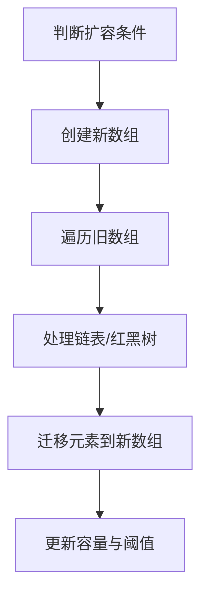

# 3. 扩容机制

# Java面试八股文：HashMap扩容机制深度解析（结构清晰，含示例与图表）

***

## 1. 概述与定义 &#x20;

**HashMap的扩容机制** 是其动态调整容量的核心功能，用于在键值对数量超过阈值时自动扩展哈希表的大小，以维持高效的数据检索能力。其核心目标是通过 **2倍扩容** 和 **元素重分布**，平衡空间利用率与哈希冲突的代价。 &#x20;

***

## 2. 主要特点 &#x20;

### 2.1 核心特性 &#x20;

| 特性         | 描述                                                        |
| ---------- | --------------------------------------------------------- |
| **触发条件**​  | 当 \`size > capacity × loadFactor\`（默认负载因子 \`0.75\`）时触发扩容。 |
| **扩容倍数**​  | 容量按 \*\*2倍增长\*\*（如 \`16 → 32\`）。                          |
| **红黑树优化**​ | JDK 8 中，链表长度 ≥8 时转为红黑树，加速迁移。                              |
| **迁移策略**​  | JDK 8 采用 \*\*尾插法\*\*，避免并发扩容时的死循环（JDK 7 为头插法）。             |
| **扩容上限**​  | 容量最大为 \`2^30\`（约 10亿），超过后不再扩容。                            |

### 2.2 性能影响 &#x20;

- **时间复杂度**： &#x20;
  - **O(n)**：所有元素需重新计算哈希并迁移。 &#x20;
  - **JDK 8 优化**：通过高位 `bit` 判断新索引，减少哈希计算次数。 &#x20;
- **空间成本**：扩容时需额外 `O(n)` 空间存储新数组。 &#x20;

***

## 3. 应用目标 &#x20;

- **动态调整容量**：避免因哈希表过小导致的频繁冲突。 &#x20;
- **平衡性能与空间**：通过负载因子控制扩容时机。 &#x20;
- **支持高并发场景**：JDK 8 的尾插法与红黑树优化减少扩容时的线程冲突。 &#x20;

***

## 4. 主要内容及其组成部分 &#x20;

### 4.1 核心属性（与扩容相关） &#x20;

| 属性名            | 类型        | 作用描述                                        |
| -------------- | --------- | ------------------------------------------- |
| \`capacity\`   | \`int\`   | 当前哈希表的容量（数组长度）。初始为 \`16\`。                  |
| \`threshold\`  | \`int\`   | 扩容阈值，\`threshold = capacity × loadFactor\`。 |
| \`loadFactor\` | \`float\` | 负载因子，默认 \`0.75\`，控制扩容触发时机。                  |
| \`modCount\`   | \`int\`   | 记录结构修改次数，用于迭代时的并发修改检测。                      |

### 4.2 扩容触发条件 &#x20;

```java 
// 扩容触发条件判断
if (size > threshold) {
    resize();
}
```


- **阈值计算**：`threshold = capacity × loadFactor`。 &#x20;
- **示例**： &#x20;
  - 初始容量 `16`，负载因子 `0.75` → 阈值 `12`。 &#x20;
  - 当 `size > 12` 时触发扩容到 `32`。 &#x20;

### 4.3 扩容流程 &#x20;

#### 4.3.1 新数组创建 &#x20;

```java 
// 创建新数组（容量翻倍）
final Node<K,V>[] newTable = new Node<K,V>[newCap];
```


- **容量计算**： &#x20;
  - `newCap = oldCap << 1`（即 `oldCap × 2`）。 &#x20;
  - 若 `newCap` 超过上限 `2^30`，则不再扩容。 &#x20;

#### 4.3.2 元素迁移策略 &#x20;

**JDK 8 优化**： &#x20;

- **高位 ****`bit`**** 判断**： &#x20;

  新索引通过 `e.hash & oldCap` 判断： &#x20;
  - 若 `0` → 新索引与旧索引相同。 &#x20;
  - 若 `1` → 新索引为 `oldIndex + oldCap`。 &#x20;
- **链表迁移**： &#x20;
  ```java 
  // 链表迁移示例（简化版）
  Node<K,V> loHead = null, loTail = null;
  Node<K,V> hiHead = null, hiTail = null;
  Node<K,V> next;
  do {
      next = e.next;
      if ((e.hash & oldCap) == 0) {
          if (loTail == null)
              loHead = e;
          else
              loTail.next = e;
          loTail = e;
      } else {
          if (hiTail == null)
              hiHead = e;
          else
              hiTail.next = e;
          hiTail = e;
      }
      e = next;
  } while (e != null);
  ```

  - **尾插法**：通过 `loTail` 和 `hiTail` 记录链表尾部，避免头插法的死循环风险。 &#x20;

#### 4.3.3 红黑树处理 &#x20;

- **红黑树迁移**： &#x20;
  ```java 
  if (e instanceof TreeNode)
      ((TreeNode<K,V>)e).split(this, newTable, idx, bit);
  ```

  - 红黑树节点直接拆分到新数组的两个桶中。 &#x20;

***

## 5. 原理剖析 &#x20;

### 5.1 扩容流程图 &#x20;




### 5.2 关键步骤详解 &#x20;

#### 5.2.1 索引计算优化 &#x20;

- **旧索引到新索引的映射**： &#x20;

  新容量为 `oldCap × 2`，新索引 `newIndex = oldIndex | (oldIndex + oldCap)`。 &#x20;
  - 通过 `e.hash & oldCap` 判断高位 `bit`，无需重新计算哈希值。 &#x20;

#### 5.2.2 线程安全优化（JDK 8） &#x20;

- **尾插法避免死循环**： &#x20;
  - JDK 7 的头插法可能导致 **循环链表**： &#x20;
    ```java 
    // JDK 7 头插法示例
    e.next = table[i];
    table[i] = e;
    ```

    - 线程 A 和 B 同时扩容时，可能导致 `next` 指针相互指向。 &#x20;
  - JDK 8 的尾插法通过 `loTail` 和 `hiTail` 记录链表尾部，避免此问题。 &#x20;

#### 5.2.3 红黑树的自动转换 &#x20;

- **迁移后链表长度检查**： &#x20;
  ```java 
  if (e != null) {
      int size = 0;
      for (Node<K,V> node = e; node != null; node = node.next)
          ++size;
      if (size > TREEIFY_THRESHOLD)
          treeifyBin(tab, hash);
  }
  ```

  - 迁移后若链表长度超过 `8`，触发红黑树转换。 &#x20;

***

## 6. 应用与拓展 &#x20;

### 6.1 JDK 7 vs JDK 8 扩容差异 &#x20;

| 特性         | JDK 7        | JDK 8                |
| ---------- | ------------ | -------------------- |
| **数据结构**​  | 数组 + 链表      | 数组 + 链表/红黑树          |
| **插入方式**​  | 头插法（可能导致死循环） | 尾插法（避免死循环）           |
| **迁移策略**​  | 遍历链表重新计算哈希   | 利用高位 \`bit\` 快速定位新索引 |
| **红黑树支持**​ | 无            | 链表长度 ≥8 时自动转红黑树      |

### 6.2 性能优化建议 &#x20;

- **预估容量**：初始化时指定合理容量，减少扩容次数。 &#x20;
  ```java 
  // 预估容量为 1000，初始容量设为 1024（2^10）
  HashMap<Integer, String> map = new HashMap<>(1024); 
  ```

- **负载因子调优**： &#x20;
  - 负载因子 `0.5` → 空间利用率低，但减少冲突。 &#x20;
  - 负载因子 `0.9` → 空间利用率高，但可能频繁扩容。 &#x20;

### 6.3 典型场景 &#x20;

- **高频插入场景**：如缓存系统，需平衡扩容频率与性能。 &#x20;
- **大数据量场景**：需预估容量，避免 `O(n)` 扩容影响吞吐量。 &#x20;

***

## 7. 面试问答 &#x20;

### 问题 1：HashMap 的扩容触发条件是什么？ &#x20;

**回答**： &#x20;

当键值对数量超过 **扩容阈值（threshold = capacity × loadFactor）** 时触发扩容。例如，默认容量 `16`，负载因子 `0.75` → 阈值 `12`。当 `size > 12` 时，扩容为 `32`。 &#x20;

***

### 问题 2：为什么扩容是 2 倍而不是其他倍数？ &#x20;

**回答**： &#x20;

- **二进制对齐**：容量为 `2` 的幂次，通过 `index = hash & (capacity - 1)` 快速定位索引。 &#x20;
- **均匀分布**：扩容后，元素的哈希值高位 `bit` 决定新索引，确保均匀分布。 &#x20;

***

### 问题 3：JDK 8 的扩容如何避免死循环？ &#x20;

**回答**： &#x20;

JDK 8 采用 **尾插法** 迁移链表： &#x20;

- **旧链表拆分为两部分**： &#x20;
  - `loHead` 存储低位 `bit` 为 `0` 的节点。 &#x20;
  - `hiHead` 存储高位 `bit` 为 `1` 的节点。 &#x20;
- **避免头插法的指针冲突**：通过记录链表尾部，直接追加节点，减少线程竞争。 &#x20;

***

### 问题 4：扩容时红黑树如何处理？ &#x20;

**回答**： &#x20;

- **红黑树迁移**：直接拆分树的节点到新数组的两个桶中。 &#x20;
- **自动转换**：迁移后若链表长度 ≥8 且容量 ≥64，重新转为红黑树。 &#x20;

***

### 问题 5：扩容时如何保证线程安全？ &#x20;

**回答**： &#x20;

- **同步机制**：`ConcurrentHashMap` 使用分段锁或 CAS 保证线程安全。 &#x20;
- **HashMap** 非线程安全，多线程写入可能导致死循环或数据不一致。 &#x20;

***

## 总结 &#x20;

HashMap 的扩容机制是其高效性的核心，涉及 **触发条件**、**2倍扩容**、**尾插法优化** 和 **红黑树自动转换**。掌握其底层原理（如高位 `bit` 判断、链表迁移策略）和线程安全问题，是应对面试和实际开发的关键。通过结合示例与图表，可以更直观地理解其设计思想与实现细节。
