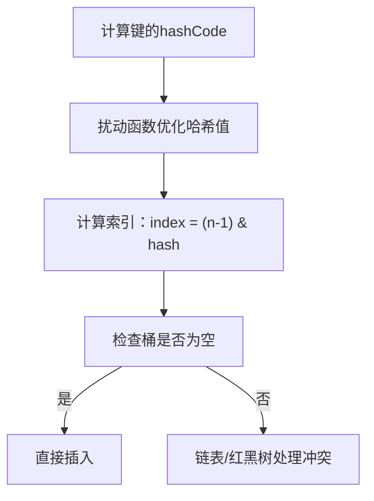

# 4. 寻址算法

***

# Java面试八股文：HashMap寻址算法深度解析（结构清晰，含示例与图表）

***

## 1. 概述与定义 &#x20;

**HashMap的寻址算法** 是其核心功能之一，用于通过键快速定位键值对在数组中的存储位置。其本质是通过 **哈希函数** 将键映射到数组的索引，结合 **位运算** 和 **冲突处理机制** 实现高效寻址。 &#x20;

**核心流程**： &#x20;

1. **计算哈希值**：通过 `hashCode()` 和扰动函数优化分布。 &#x20;
2. **索引定位**：利用 `index = (n - 1) & hash` 快速计算数组索引。 &#x20;
3. **冲突处理**：通过链表或红黑树解决哈希冲突。 &#x20;

***

## 2. 主要特点 &#x20;

### 2.1 核心特性 &#x20;

| 特性          | 描述                                      |
| ----------- | --------------------------------------- |
| **哈希函数扰动**​ | 通过 \`h ^ (h >>> 16)\` 增加哈希值的随机性，减少高位依赖。 |
| **位运算寻址**​  | \`index = (n - 1) & hash\` 代替取模，效率更高。   |
| **冲突处理**​   | 链表（默认）或红黑树（链表长度 ≥8 且容量 ≥64 时触发）。        |
| **容量限制**​   | 容量必须是 \*\*2 的幂次\*\*（如 16、32、64）。        |

### 2.2 性能对比 &#x20;

| 特性        | JDK 7   | JDK 8                    |
| --------- | ------- | ------------------------ |
| **数据结构**​ | 数组 + 链表 | 数组 + 链表/红黑树              |
| **冲突处理**​ | 链表头插法   | 链表尾插法（减少死循环风险）           |
| **哈希优化**​ | 无扰动函数   | 引入 \`h ^ (h >>> 16)\` 扰动 |

***

## 3. 应用目标 &#x20;

- **快速定位**：通过哈希值直接定位数组索引，时间复杂度 `O(1)`。 &#x20;
- **减少冲突**：通过扰动函数和链表/红黑树平衡哈希冲突。 &#x20;
- **动态扩容**：支持容量按 `2 倍` 扩展，保持索引计算高效。 &#x20;

***

## 4. 主要内容及其组成部分 &#x20;

### 4.1 核心属性（与寻址相关） &#x20;

| 属性名          | 类型          | 作用描述                  |
| ------------ | ----------- | --------------------- |
| \`table\`    | \`Node\[]\` | 存储键值对的数组，初始容量 \`16\`。 |
| \`capacity\` | \`int\`     | 当前数组长度，必须是 \`2\` 的幂次。 |

### 4.2 哈希函数实现 &#x20;

```java 
static final int hash(Object key) {
    int h;
    return (key == null) ? 0 : (h = key.hashCode()) ^ (h >>> 16); // 扰动函数
}
```


- **作用**： &#x20;
  - `h = key.hashCode()`：获取键的原始哈希值。 &#x20;
  - `h >>> 16`：无符号右移 `16` 位，提取高 `16` 位。 &#x20;
  - `h ^ (h >>> 16)`：将高 `16` 位与低 `16` 位异或，提升分布均匀性。 &#x20;
- **示例**： &#x20;
  - 原始 `hashCode = 0x12345678` → `h ^ (h >>> 16) = 0x12340000 ^ 0x5678 = 0x12345678`。 &#x20;

### 4.3 索引计算公式 &#x20;

```java 
int index = (n - 1) & hash; // n 为数组容量
```


- **原理**： &#x20;
  - `n` 必须是 `2` 的幂次 → `n-1` 的二进制全为 `1`（如 `n=16 → 15 → 0b1111`）。 &#x20;
  - `&` 运算直接取哈希值的低 `log2(n)` 位，等效于 `hash % n` 但效率更高。 &#x20;
- **示例**： &#x20;
  - `n=16` → `index = hash & 0x0F`（取低 4 位）。 &#x20;

### 4.4 冲突处理策略 &#x20;

- **链表**：键值对按链表形式存储。 &#x20;
- **红黑树**：当链表长度 ≥8 且容量 ≥64 时触发，时间复杂度从 `O(n)` 降至 `O(log n)`。 &#x20;

***

## 5. 原理剖析 &#x20;

### 5.1 寻址流程图 &#x20;




### 5.2 关键步骤详解 &#x20;

#### 5.2.1 哈希函数的扰动作用 &#x20;

- **问题**：若 `hashCode()` 仅依赖低位（如 `0x0000FFFF`），高位无效 → 映射到相同索引。 &#x20;
- **解决**： &#x20;
  ```java 
  // 扰动前：h = 0x0000FFFF → hash = 0x0000FFFF
  // 扰动后：h ^ (h >>> 16) = 0x0000FFFF ^ 0x0000 = 0x0000FFFF → 无变化
  // 若 h = 0x12345678 → hash = 0x12340000 ^ 0x5678 = 0x12345678 → 高低位均参与计算
  ```

- **效果**：哈希值分布更均匀，减少冲突概率。 &#x20;

#### 5.2.2 位运算替代取模 &#x20;

- **等价性证明**： &#x20;

  当 `n = 2^k` 时，`hash % n = hash & (n-1)`。 &#x20;
  - 示例：`n=16 (0x10)` → `hash % 16 = hash & 0x0F`。 &#x20;
- **效率对比**： &#x20;
  - `&` 运算：硬件级指令，耗时约 `1` 个 CPU 周期。 &#x20;
  - `%` 取模：涉及除法运算，耗时约 `10` 个周期。 &#x20;

#### 5.2.3 扩容时的索引变化 &#x20;

- **扩容后的新索引**： &#x20;
  ```java 
  // 原容量 oldCap → 新容量 newCap = oldCap << 1
  // 新索引由高位 bit 决定：
  if ((e.hash & oldCap) == 0) 
      newIndex = oldIndex; // 低位 bit 决定
  else 
      newIndex = oldIndex + oldCap; // 高位 bit 为 1
  ```

- **示例**： &#x20;
  - 原索引 `3`（二进制 `0011`），扩容后容量 `4` → 新索引 `3` 或 `3+4=7`。 &#x20;

***

## 6. 应用与拓展 &#x20;

### 6.1 典型场景 &#x20;

- **缓存系统**：通过键快速定位缓存数据。 &#x20;
- **配置管理**：存储配置信息（如 `key=config_name`）。 &#x20;

### 6.2 性能优化建议 &#x20;

- **预估容量**：初始化时指定合理容量，减少扩容次数。 &#x20;
- **自定义`hashCode()`**：确保高位与低位信息均参与计算。 &#x20;
  ```java 
  @Override
  public int hashCode() {
      return Objects.hash(field1, field2); // 结合多个字段
  }
  ```


### 6.3 常见问题处理 &#x20;

- **`null`**\*\* 键的处理\*\*：`null` 键哈希值为 `0`，存储在 `table[0]`。 &#x20;
- **极端冲突场景**： &#x20;
  - 若所有键的哈希值相同 → 链表长度为 `n`，查询退化为 `O(n)`。 &#x20;
  - 解决方案：调整负载因子或使用 `ConcurrentHashMap`。 &#x20;

***

## 7. 面试问答 &#x20;

### 问题 1：为什么 HashMap 的容量必须是 2 的幂次？ &#x20;

**回答**： &#x20;

- **位运算效率**：通过 `index = (n-1) & hash` 快速定位，`n-1` 的二进制全为 `1`，直接截取哈希值的低位。 &#x20;
- **扩容优化**：扩容后的新索引可通过高位 `bit` 快速判断归属。例如： &#x20;
  ```java 
  oldCap = 16 → newCap = 32
  hash & 16 == 0 → 新索引与旧索引相同
  hash & 16 != 0 → 新索引 = oldIndex + 16
  ```


***

### 问题 2：HashMap 的哈希函数如何减少冲突？ &#x20;

**回答**： &#x20;

通过扰动函数 `h ^ (h >>> 16)`： &#x20;

1. **高位与低位异或**：将高 `16` 位与低 `16` 位混合，避免高位信息丢失。 &#x20;
2. **示例**： &#x20;
   - 原 `hashCode = 0x12345678` → 扰动后 `0x12340000 ^ 0x5678 = 0x12345678`，高低位均参与计算。 &#x20;
3. **效果**：哈希值分布更均匀，冲突概率降低。 &#x20;

***

### 问题 3：为什么用位运算 `&` 而不是取模 `%`？ &#x20;

**回答**： &#x20;

- **效率更高**：位运算 `&` 是硬件级指令，耗时约 `1` 个 CPU 周期；取模 `%` 涉及除法运算，耗时约 `10` 周期。 &#x20;
- **数学等价性**：当 `n` 是 `2` 的幂次时，`hash % n = hash & (n-1)`。 &#x20;
- **示例**： &#x20;
  ```java 
  n = 16 → n-1 = 15 (0b1111)
  hash = 0x12345678 → hash & 15 = 0x8 → 等价于 hash % 16 = 8
  ```


***

### 问题 4：HashMap 如何处理哈希冲突？ &#x20;

**回答**： &#x20;

1. **链表尾插法**（JDK 8）：冲突元素追加到链表尾部，避免头插法的死循环。 &#x20;
2. **红黑树转换**： &#x20;
   - 触发条件：链表长度 ≥8 且容量 ≥64 → 时间复杂度 `O(log n)`。 &#x20;
   - 降级条件：链表长度 ≤6 → 转回链表。 &#x20;

***

### 问题 5：扩容时如何保证元素的正确迁移？ &#x20;

**回答**： &#x20;

- **高位 ****`bit`**** 判断**： &#x20;
  ```java 
  if ((e.hash & oldCap) == 0) 
      新索引 = oldIndex; 
  else 
      新索引 = oldIndex + oldCap; 
  ```

- **红黑树优化**：直接拆分树节点到新桶中，无需重新计算哈希。 &#x20;

***

## 总结 &#x20;

HashMap 的寻址算法是其高效性的核心，涉及 **哈希扰动**、**位运算寻址** 和 **冲突处理策略**。掌握其底层原理（如 `h ^ (h>>>16)`、`&` 运算原理）和线程安全问题，是应对面试和实际开发的关键。通过结合示例与图表，可以更直观地理解其设计思想与实现细节。

# 扩容后, 通过高位Bit确定新索引

在 `HashMap` 扩容后，通过判断哈希值的高位位（即 `oldCap` 对应的位）是否为 `1` 来决定新索引的位置，这一设计的核心原理如下：

***

### **1. 索引计算的数学原理**

#### **1.1 原始索引计算**

当 `HashMap` 的容量为 **`oldCap = 16`** 时，索引计算公式为： &#x20;

```java 
oldIndex = hash & (oldCap - 1) = hash & 0b1111（即二进制最后4位）。
```


此时，索引的范围是 **0\~15**，仅由哈希值的 **低4位** 决定。

#### **1.2 扩容后的索引计算**

扩容后容量变为 **`newCap = 32`**，新的索引计算公式为： &#x20;

```java 
newIndex = hash & (newCap - 1) = hash & 0b11111（即二进制最后5位）。
```


此时，索引的范围扩展到 **0\~31**，由哈希值的 **低5位** 决定。

***

### **2. 高位位的作用**

#### **2.1 新增的高位位**

扩容后，新索引的计算比旧索引多了一位（即第5位，对应 `oldCap = 16` 的二进制位 `0b10000`）。 &#x20;

- **关键点**： &#x20;

  新索引的 **第5位（即 ****`oldCap`**** 对应的位）** 决定了索引是否变化：
  - 如果该位为 **0**：新索引与旧索引相同（`newIndex = oldIndex`）。
  - 如果该位为 **1**：新索引等于旧索引加上原容量（`newIndex = oldIndex + oldCap`）。

#### **2.2 为什么高位位能决定新索引？**

- **数学推导**： &#x20;

  假设哈希值的二进制表示为 `H`，则： &#x20;
  - **旧索引**：`oldIndex = H & 0b1111`（低4位）。 &#x20;
  - **新索引**：`newIndex = H & 0b11111`（低5位）。 &#x20;
  - **关系**： &#x20;
    ```text 
    newIndex = (H & 0b10000) ? oldIndex + 16 : oldIndex  
    ```

    其中，`0b10000` 是 `oldCap = 16` 的二进制表示。
- **位运算的简化**： &#x20;

  通过直接判断哈希值的第5位是否为 `1`，可以快速确定新索引的位置： &#x20;
  ```java 
  if ((hash & oldCap) != 0) { // oldCap = 16 → 0b10000
      newIndex = oldIndex + oldCap;
  } else {
      newIndex = oldIndex;
  }
  ```


***

### **3. 具体示例**

#### **3.1 示例1：高位为0**

假设 `hash = 0b0000 1110`（二进制，低5位为 `0b01110`）： &#x20;

- **旧索引**：`hash & 0b1111 = 0b1110 → 14`。 &#x20;
- **新索引**：`hash & 0b11111 = 0b01110 → 14`。 &#x20;

  **结果**：新索引与旧索引相同，因为第5位为 `0`。

#### **3.2 示例2：高位为1**

假设 `hash = 0b1000 1110`（二进制，低5位为 `0b11110`）： &#x20;

- **旧索引**：`hash & 0b1111 = 0b1110 → 14`。 &#x20;
- **新索引**：`hash & 0b11111 = 0b11110 → 30`。 &#x20;

  **结果**：新索引为 `14 + 16 = 30`，因为第5位为 `1`。

***

### **4. 为什么必须是2的幂次？**

- **关键前提**： &#x20;

  `HashMap` 的容量必须是 **2的幂次**（如 `16`、`32` 等），这使得 `newCap = 2 * oldCap`，且 `newCap - 1 = 2 * oldCap - 1` 的二进制形式比 `oldCap - 1` **多一位`1`**。 &#x20;
  - **优势**： &#x20;
    - 确保 `hash & (newCap - 1)` 的结果与 `hash % newCap` 等价，但位运算效率更高。 &#x20;
    - 扩容后，新增的高位位（`oldCap`）直接决定了新索引的变化，无需重新计算哈希值，仅需通过位与操作即可快速判断。

***

### **5. 总结**

通过判断哈希值的 **高位位（****`oldCap`**** 对应的位）** 是否为 `1`，可以高效确定扩容后的新索引位置： &#x20;

- **高位为0**：新索引与旧索引相同。 &#x20;
- **高位为1**：新索引为 `oldIndex + oldCap`。 &#x20;

这一设计充分利用了 **位运算的高效性** 和 **2的幂次容量特性**，使得扩容时的元素迁移效率极高，同时避免了重新计算哈希值的开销。

***

### **6. 扩展思考**

- **为什么扩容后不重新计算哈希值？** &#x20;

  因为扩容后的新索引仅依赖哈希值的 **新增高位位**，无需重新计算整个哈希值，只需通过位与操作即可快速判断。 &#x20;
- **红黑树的影响**： &#x20;

  当链表转为红黑树后，扩容时会先尝试平衡树结构，但最终元素迁移仍遵循上述规则，确保高效性。

通过这一机制，`HashMap` 在扩容时能够 **线性时间复杂度** 完成元素迁移，显著优于 JDK 1.7 的链表倒置方式。

```java 
// 示例代码片段（JDK 1.8 的 resize 过程简化）
final Node<K,V>[] resize() {
    Node<K,V>[] oldTab = table;
    int oldCap = (oldTab == null) ? 0 : oldTab.length;
    int oldThr = threshold;
    int newCap, newThr;

    // 计算新容量和阈值...
    // ...

    Node<K,V>[] newTab = (Node<K,V>[])new Node[newCap];
    table = newTab;
    if (oldTab != null) {
        for (int j = 0; j < oldCap; ++j) {
            Node<K,V> e;
            if ((e = oldTab[j]) != null) {
                oldTab[j] = null;
                if (e.next == null) // 单节点，直接迁移
                    newTab[e.hash & (newCap - 1)] = e;
                else {
                    // 链表或红黑树的处理...
                }
            }
        }
    }
    return newTab;
}
```


通过高位位的判断，`HashMap` 在扩容时巧妙地将 **哈希值的高位信息** 转化为 **新索引的变化依据**，实现了高效、稳定的扩容机制。
