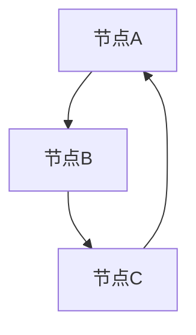
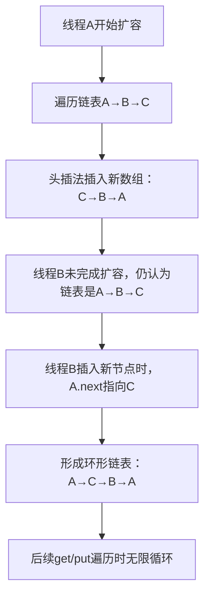

# 5. JDK7多线程死循环

***

# Java面试八股文：JDK7 HashMap多线程死循环问题深度解析（结构清晰，含示例与图表）

***

## 1. 概述与定义 &#x20;

**JDK7 HashMap的多线程死循环问题** 是其在并发扩容时因 **头插法** 导致链表结构破坏而引发的典型线程安全缺陷。其核心问题在于： &#x20;

- **扩容触发**：当键值对数量超过阈值时，HashMap会扩容为 **2倍容量**。 &#x20;
- **头插法迁移**：扩容时链表元素按头插法插入新数组，导致链表顺序反转。 &#x20;
- **多线程竞争**：多个线程同时扩容时，可能形成 **环形链表**，导致 `get()` 或 `put()` 操作无限循环。 &#x20;

***

## 2. 主要特点 &#x20;

### 2.1 核心特性 &#x20;

| 特性          | 描述                            |
| ----------- | ----------------------------- |
| **头插法迁移**​  | 扩容时链表节点按头插法插入新桶，导致链表顺序反转。     |
| **扩容阈值**​   | 默认负载因子 \`0.75\`，扩容后容量 \`×2\`。 |
| **线程不安全**​  | 无锁机制，多线程扩容时可能发生数据覆盖或环形链表。     |
| **JDK8改进**​ | JDK8 改用尾插法，并引入红黑树优化，避免死循环。    |

### 2.2 JDK7 vs JDK8 对比 &#x20;

| 特性           | JDK7                                 | JDK8           |
| ------------ | ------------------------------------ | -------------- |
| **冲突处理**​    | 链表头插法 → 可能形成环形链表                     | 链表尾插法 → 避免环形链表 |
| **扩容后链表顺序**​ | 逆序（头插法）                              | 保持原顺序（尾插法）     |
| **红黑树支持**​   | 无                                    | 链表长度 ≥8 转红黑树   |
| **线程安全**​    | 非线程安全，需手动加锁或使用 \`ConcurrentHashMap\` | 非线程安全，但减少死循环风险 |

***

## 3. 应用目标 &#x20;

- **理解线程安全缺陷**：掌握多线程下HashMap的并发问题根源。 &#x20;
- **规避风险**：在多线程场景选择线程安全容器（如 `ConcurrentHashMap`）。 &#x20;
- **面试高频考点**：死循环成因、JDK版本差异、解决方案。 &#x20;

***

## 4. 主要内容及其组成部分 &#x20;

### 4.1 扩容触发条件 &#x20;

```java 
// JDK7扩容触发条件
if (size > threshold) {
    resize();
}
// threshold = capacity * loadFactor（默认0.75）
```


- **示例**：初始容量 `16`，负载因子 `0.75` → 阈值 `12`。当 `size > 12` 时扩容为 `32`。

### 4.2 头插法迁移逻辑（关键代码） &#x20;

```java 
// JDK7扩容核心代码片段（伪代码）
void transfer(Entry[] newTable, boolean rehash) {
    Entry[] oldTable = table;
    int newCapacity = newTable.length;
    for (int i = 0; i < oldTable.length; i++) {
        Entry e = oldTable[i];
        if (e != null) {
            oldTable[i] = null; // 断开旧引用
            do {
                Entry next = e.next; // 保存下一个节点
                if (rehash) {
                    e.hash = null == e.key ? 0 : hash(e.key); // 重新计算哈希
                }
                int newIndex = indexFor(e.hash, newCapacity); // 计算新索引
                e.next = newTable[newIndex]; // 头插法：e.next 指向当前桶头
                newTable[newIndex] = e; // 将e设置为新头节点
                e = next; // 移动到下一个节点
            } while (e != null);
        }
    }
}
```


- **头插法问题**：链表顺序反转，导致多线程操作时指针混乱。

### 4.3 死循环形成过程 &#x20;

#### 4.3.1 环形链表示意图 &#x20;




- **形成原因**： &#x20;
  - 线程A和线程B同时处理同一链表。 &#x20;
  - 线程A扩容后，链表顺序变为 `C → B → A`。 &#x20;
  - 线程B未感知扩容，继续操作旧链表，导致 `A.next = C`，形成环。

***

## 5. 原理剖析 &#x20;

### 5.1 死循环成因流程图 &#x20;




### 5.2 关键步骤详解 &#x20;

#### 5.2.1 多线程扩容场景 &#x20;

- **线程A与线程B同时触发扩容**： &#x20;
  1. 线程A处理链表 `A → B → C`，头插法生成新链表 `C → B → A`。 &#x20;
  2. 线程B尚未完成扩容，仍认为链表是 `A → B → C`。 &#x20;
  3. 线程B尝试插入新节点时，误将 `A.next` 指向 `C`，导致 `C.next = B`，`B.next = A`，形成环。 &#x20;

#### 5.2.2 环形链表的遍历 &#x20;

```java 
// 环形链表遍历示例
Node current = table[index];
while (current != null) { // 死循环
    if (current.key.equals(target)) {
        return current.value;
    }
    current = current.next; // 指针绕环无限循环
}
```


***

## 6. 应用与拓展 &#x20;

### 6.1 典型场景示例代码 &#x20;

```java 
// JDK7死循环复现代码（简化版）
public class HashMapDeadLockDemo {
    private static final HashMap<Integer, String> map = new HashMap<>(2); // 初始容量2

    public static void main(String[] args) {
        Thread t1 = new Thread(() -> {
            for (int i = 0; i < 1000; i++) {
                map.put(i, "Value" + i);
            }
        });

        Thread t2 = new Thread(() -> {
            for (int i = 1000; i < 2000; i++) {
                map.put(i, "Value" + i);
            }
        });

        t1.start();
        t2.start();
        try {
            t1.join();
            t2.join();
        } catch (InterruptedException e) {
            e.printStackTrace();
        }
        System.out.println("Execution completed"); // 可能永远不会打印
    }
}
```


### 6.2 解决方案 &#x20;

| 方案                     | 适用场景     | 优缺点分析           |
| ---------------------- | -------- | --------------- |
| **ConcurrentHashMap**​ | 高并发场景    | 线程安全，性能高，但实现复杂。 |
| **Hashtable**​         | 低并发场景    | 同步块锁，性能低，但简单。   |
| **手动加锁**​              | 可控制访问的场景 | 串行化操作，吞吐量低。     |
| **JDK8 HashMap**​      | 非强一致性场景  | 无锁优化，但非线程安全。    |

### 6.3 JDK8的改进 &#x20;

- **尾插法迁移**： &#x20;
  ```java 
  // JDK8尾插法伪代码
  Node loHead = null, loTail = null; // 低位桶
  Node hiHead = null, hiTail = null; // 高位桶
  do {
      next = e.next;
      if ((e.hash & oldCap) == 0) {
          if (loTail == null) loHead = e;
          else loTail.next = e;
          loTail = e;
      } else {
          if (hiTail == null) hiHead = e;
          else hiTail.next = e;
          hiTail = e;
      }
      e = next;
  } while (e != null);
  ```

- **效果**：链表顺序保持原样，避免头插法的指针混乱。 &#x20;

***

## 7. 面试问答 &#x20;

### 问题 1：为什么 JDK7 的 HashMap 会出现死循环？ &#x20;

**回答**： &#x20;

在 JDK7 中，扩容时链表元素通过 **头插法** 迁移到新数组。多线程扩容时可能发生以下情况： &#x20;

1. 线程A处理链表 `A→B→C`，头插法生成新链表 `C→B→A`。 &#x20;
2. 线程B未完成扩容，仍认为链表是 `A→B→C`，继续操作导致 `A.next = C`，形成环形链表。 &#x20;
3. `get()` 或 `put()` 遍历时指针无限循环，导致程序卡死。 &#x20;

***

### 问题 2：如何避免 JDK7 的死循环？ &#x20;

**回答**： &#x20;

- **方案一**：使用 `ConcurrentHashMap`，其通过分段锁和 CAS 操作保证线程安全。 &#x20;
- **方案二**：手动加锁，如 `synchronized(map) { ... }`，但会降低并发性能。 &#x20;
- **方案三**：升级到 JDK8，其尾插法和红黑树优化避免了环形链表的形成。 &#x20;

***

### 问题 3：JDK7 和 JDK8 的扩容迁移策略有何不同？ &#x20;

**回答**： &#x20;

| 特性         | JDK7（头插法）      | JDK8（尾插法）        |
| ---------- | -------------- | ---------------- |
| **链表顺序**​  | 逆序（C→B→A）      | 保持原顺序（A→B→C）     |
| **死循环风险**​ | 高（多线程扩容时）      | 低（尾插法避免指针混乱）     |
| **冲突处理**​  | 链表头插法 → 可能覆盖节点 | 链表/红黑树 → 时间复杂度更低 |

***

### 问题 4：如何通过代码复现 JDK7 的死循环？ &#x20;

**回答**： &#x20;

```java 
// 简化版复现代码（需JDK7环境）
HashMap<Integer, String> map = new HashMap<>(2); // 初始容量小
Thread t1 = new Thread(() -> {
    for (int i = 0; i < 1000; i++) {
        map.put(i, "Value" + i); // 触发扩容
    }
});
t1.start();
// 主线程等待后，尝试访问map可能导致死循环
```


***

### 问题 5：JDK8 的尾插法如何避免死循环？ &#x20;

**回答**： &#x20;

- **尾插法记录链表尾部**：通过 `loTail` 和 `hiTail` 记录链表尾部，直接追加节点，避免头插法的指针冲突。 &#x20;
- **链表顺序保持**：新链表顺序与原链表一致，多线程扩容时不会因顺序反转形成环。 &#x20;
- **红黑树优化**：链表长度 ≥8 时转为红黑树，遍历时间复杂度从 `O(n)` 降至 `O(log n)`。 &#x20;

***

## 总结 &#x20;

JDK7 HashMap的多线程死循环问题是其头插法扩容机制与线程不安全设计的典型表现。掌握其成因（环形链表形成）、解决方案（JDK8改进、`ConcurrentHashMap`）和代码示例，是应对面试和实际开发中并发问题的关键。通过结合流程图、对比表格和代码片段，可以更直观地理解这一复杂问题的核心原理。
